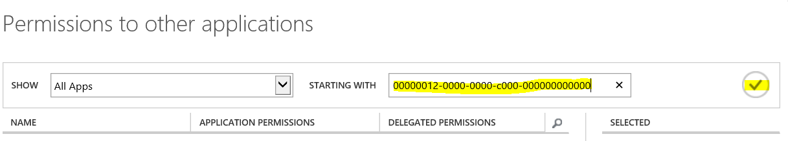
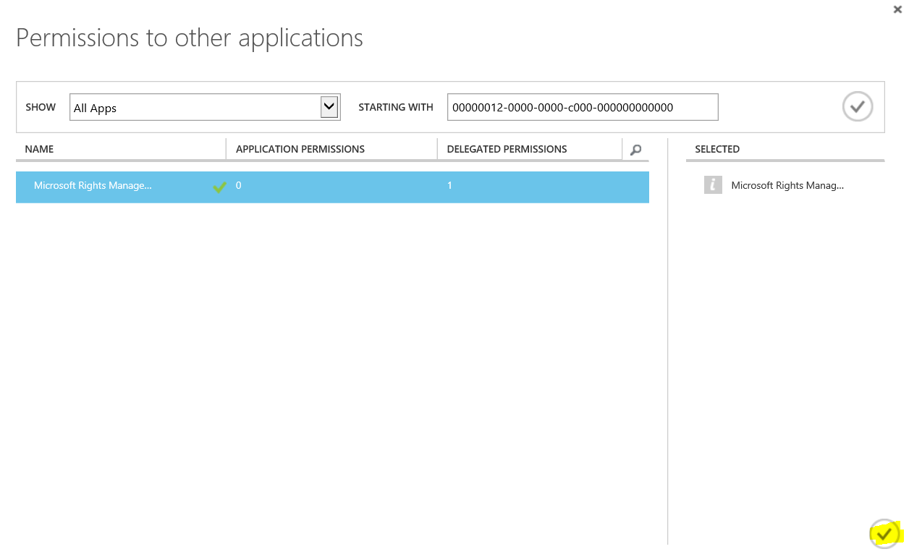

---
# required metadata

title: [ADAL authentication for your RMS enabled application | Azure RMS]
description: Outlines the process for authentication with ADAL
keywords: authentication, RMS, ADAL
author: bruceperlerms
manager: mbaldwin
ms.date: 04/28/2016
ms.topic: article
ms.prod: azure
ms.service: rights-management
ms.technology: techgroup-identity
ms.assetid: [GET ONE FROM guidgenerator.com]

# optional metadata

#ROBOTS:
audience: developer
#ms.devlang:
ms.reviewer: shubhamp
ms.suite: ems
#ms.tgt_pltfrm:
#ms.custom:

---

# ADAL authentication for your RMS enabled application

Authentication with Azure RMS for your app using Azure ADAL is now part of the RMS client 2.1.

By updating your application to use ADAL authentication rather than the Microsoft Online Sign-in Assistant, you and your customers will be able to:

- Utilize multi-factor authentication
- Install the RMS 2.1 client without requiring administrative privileges to the machine
- Certify your application for Windows 10

## Two approaches to authentication

This topic contains two approaches to authentication with corresponding code examples.

- **Internal authentication** - OAuth authentication managed by the RMS SDK. Use this approach if you want the RMS client to display an ADAL authentication prompt when authentication is necessary. For details on how to configure your application, see the section, "Internal authentication".

> [!NOTE] If your application currently uses AD RMS SDK 2.1 with the sign-in assistant, we recommend that you use the internal authentication method as your application migration path.

- **External authentication** - OAuth authentication managed by your application. Use this approach if you want your application to manage its own OAuth authentication. With this approach, the RMS client will exercise an application defined callback when authentication is necessary. For a detailed example, see "External authentication" at the end of this topic.

> [!NOTE] External authentication does not imply the ability to change users; the RMS client always uses the default user for a given RMS tenant.

### Internal authentication

You will need the following:

- A [subscription for Microsoft Azure](https://azure.microsoft.com/en-us/) (a free trial is sufficient):
- A subscription for Microsoft Azure Rights Management (a free [RMS for Individuals](https://technet.microsoft.com/en-us/library/dn592127.aspx) account is sufficient).

> [!NOTE] Ask your IT Admin whether or not you have a subscription for Microsoft Azure Rights Management and, have your IT Admin perform the steps below. If your organization does not have a subscription, you should have your IT admin create one. Also, your IT Admin should subscribe with a Work or school account, rather than a Microsoft account (i.e. Hotmail).

After signing up for Microsoft Azure:

- Login to the [Azure Management Portal](https://manage.windowsazure.com) for your organization using an account with administrative privileges.

- Browse down to the **Active Directory** application on the left side of the portal.

- If you haven’t created a directory already, choose the **New** button located in the bottom left corner of the portal.

- Select the **Rights Management** tab and ensure that the **Rights Management Status** is either **Active**, **Unknown** or **Unauthorized**. If the status is **Inactive**, choose the **Activate** button at the bottom, center portion of the portal and confirm your selection.

- Now, create a new *Native Application* in your directory by selecting your directory, choosing Applications.

- Then choose the **ADD** button located in the bottom, center portion of the portal.

- At the prompt choose **Add an application my organization is developing**.

- Name your application by selecting **NATIVE CLIENT APPLICATION** and choosing the **Next** button.

- Add a redirection URI and choose next. The redirection URI needs to be a valid URI and unique to your directory. For example, you could use something like `com.mycompany.myapplication://authorize`.

- Select your application in the directory and choose **CONFIGURE**.

>[!NOTE] Copy the **CLIENT ID** and **REDIRECT URI** and store them for future use when configuring the RMS client.

- Browse to the bottom of your application settings and choose the **Add application** button under **permissions to other applications**.

- Now, add this GUID `00000012-0000-0000-c000-000000000000` to the **STARTING WITH** edit box and choose the check button.

- Choose the plus (+) button next to **Microsoft Rights Management**.

- Now, choose the check mark located on the bottom left corner of the dialog.

- You’re now ready to add a dependency to your application for Azure RMS. To add the dependency, select the new **Microsoft Rights Management Services** entry under **permissions to other applications** and choose the **Create and access protected content for users** checkbox under the **Delegated Permissions:** drop box.

- Save your application to persist the changes by choosing the **SAVE** icon located on the bottom, center of the portal.

- You are now ready to configure your application to use the internal ADAL authentication provided by the RMS SDK 2.1. To configure you RMS client, add a call to [IpcSetGlobalProperty](/rights-management/sdk/2.1/api/win/IpcSetGlobalProperty) right after calling [IpcInitialize](/rights-management/sdk/2.1/api/win/IpcInitialize) to configure the RMS client. Use the following code snippet as an example.

    IpcInitialize();

    IPC_AAD_APPLICATION_ID applicationId = { 0 };
    applicationId.cbSize = sizeof(IPC_AAD_APPLICATION_ID);
    applicationId.wszClientId = L"GUID-provided-by-AAD-for-your-app-(no-brackets)";
    applicationId.wszRedirectUri = L"RedirectionUriWeProvidedAADForOurApp://authorize";

    HRESULT hr = IpcSetGlobalProperty(IPC_EI_APPLICATION_ID, &amp;applicationId);

    if (FAILED(hr)) {
     //Handle the error
    }

### External authentication

- Use  this code as an example of how to manage your own authentication tokens.

    extern HRESULT GetADALToken(LPVOID pContext, const IPC_NAME_VALUE_LIST&amp; Parameters, __out wstring wstrToken) throw();

    HRESULT GetLicenseKey(PCIPC_BUFFER pvLicense, __in LPVOID pContextForAdal, __out IPC_KEY_HANDLE &amp;hKey)
    {
      IPC_OAUTH2_CALLBACK pfGetADALToken =
           -&gt; HRESULT
      {
          wstring wstrToken;
          HRESULT hr = GetADALToken(pvContext, *pParameters, wstrToken);
          return SUCCEEDED(hr) ? IpcCreateOAuth2Token(wstrToken.c_str(), OUT phAuthToken) : hr;
      };

      IPC_OAUTH2_CALLBACK_INFO callbackCredentialContext =
      {
          sizeof(IPC_OAUTH2_CALLBACK_INFO),
          pfGetADALToken,
          pContextForAdal
      };

      IPC_CREDENTIAL credentialContext =
      {
          IPC_CREDENTIAL_TYPE_OAUTH2,
          NULL
      };
      credentialContext.pcOAuth2 = &amp;callbackCredentialContext;

      IPC_PROMPT_CTX promptContext =
      {
        sizeof(IPC_PROMPT_CTX),
        NULL,
        IPC_PROMPT_FLAG_SILENT | IPC_PROMPT_FLAG_HAS_USER_CONSENT,
        NULL,
        &amp;credentialContext
      };

      hKey = 0L;
      return IpcGetKey(pvLicense, 0, &amp;promptContext, NULL, &amp;hKey);
  }

### Related topics
- [Data types](/rights-management/sdk/2.1/api/win/Data%20types)
- [Environment properties](/rights-management/sdk/2.1/api/win/Environment%20properties)
- [IpcCreateOAuth2Token](/rights-management/sdk/2.1/api/win/IpcCreateOAuth2Token)
- [IpcGetKey](/rights-management/sdk/2.1/api/win/IpcGetKey)
- [IpcInitialize](/rights-management/sdk/2.1/api/win/IpcInitialize)
- [IPC_CREDENTIAL](/rights-management/sdk/2.1/api/win/IPC\_CREDENTIAL)
- [IPC_NAME_VALUE_LIST](/rights-management/sdk/2.1/api/win/IPC\_NAME\_VALUE\_LIST)
- [IPC_OAUTH2_CALLBACK_INFO](/rights-management/sdk/2.1/api/win/IPC\_OAUTH2\_CALLBACK\_INFO)
- [IPC_PROMPT_CTX](/rights-management/sdk/2.1/api/win/IPC\_PROMPT\_CTX)
- [IPC_AAD_APPLICATION_ID](/rights-management/sdk/2.1/api/win/IPC\_AAD\_APPLICATION\_ID)
