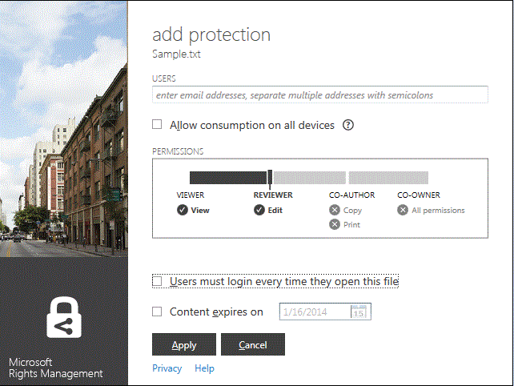

# Microsoft Rights Management sharing application user guide - original publication
This user guide for Microsoft Rights Management sharing application for Windows includes the following sections:

-   [Evaluating and Installing Microsoft Rights Management sharing application](../Topic/Microsoft_Rights_Management_sharing_application_user_guide_-_original_publication.md#BKMK_Eval)

-   [Using Microsoft Rights Management sharing application](../Topic/Microsoft_Rights_Management_sharing_application_user_guide_-_original_publication.md#BKMK_UsingMSRMSApp)

-   [Using User-Authored Permissions and Sharing Protected Content](../Topic/Microsoft_Rights_Management_sharing_application_user_guide_-_original_publication.md#BKMK_Custom)

-   [Using the Office Toolbar Add-in](../Topic/Microsoft_Rights_Management_sharing_application_user_guide_-_original_publication.md#BKMK_OfficeToolbar)

-   [Administrator’s guidance for Microsoft Rights Management sharing application](../Topic/Microsoft_Rights_Management_sharing_application_user_guide_-_original_publication.md#BKMK_AdminGuide)

For frequently asked questions and troubleshooting information, see [FAQ for Microsoft Rights Management Sharing Application for Windows](http://go.microsoft.com/fwlink/?LinkId=303971).

## <a name="BKMK_Eval"></a>Evaluating and Installing Microsoft Rights Management sharing application
This section explains what Microsoft Rights Management sharing application is and how to install it:

-   [What is the Microsoft Rights Management sharing application?](../Topic/Microsoft_Rights_Management_sharing_application_user_guide_-_original_publication.md#BKMK_WhatIs)

-   [Requirements for Microsoft Rights Management sharing application](../Topic/Microsoft_Rights_Management_sharing_application_user_guide_-_original_publication.md#BKMK_Reqs)

-   [Installing the Microsoft Rights Management sharing application](../Topic/Microsoft_Rights_Management_sharing_application_user_guide_-_original_publication.md#BKMK_Install)

### <a name="BKMK_WhatIs"></a>What is the Microsoft Rights Management sharing application?
Microsoft Rights Management sharing application is an optional downloadable application for Microsoft Windows that provides the following:

-   Enhances File Explorer (also known as Windows Explorer in Windows 7 and earlier versions) to allow you to protect a single file, or bulk protect multiple files as well as all files within a selected folder.

-   Adds support for protection of any type of file and a built-in viewer for commonly used text and image file types.

-   Adds new buttons to the Microsoft Office toolbar for Word, PowerPoint, and Excel.

### <a name="BKMK_Reqs"></a>Requirements for Microsoft Rights Management sharing application
To use the Microsoft Rights Management sharing application, your computer must be running Windows 8.1, Windows 8, or Windows 7.

The Microsoft Rights Management sharing application requires the AD RMS Client 2.1, which is installed as part of the installation package. The Microsoft Rights Management sharing application will only work with this version of the AD RMS client.

### <a name="BKMK_Install"></a>Installing the Microsoft Rights Management sharing application
To install the Microsoft Rights Management sharing application, do the following:

1.  Go to the [Microsoft Rights Management](http://go.microsoft.com/fwlink/?LinkId=303970) page on the Microsoft website.

2.  In the **Computers** section, click the icon for the **RMS app for Windows** and save the Microsoft Rights Management sharing application installation package to your computer.

3.  Double click the compressed file that was downloaded, and then double-click **setup.exe**. If you are prompted to continue, click **Yes**.

4.  On the **Setup Microsoft RMS** page, click **Next**, and wait for the installation to finish.

5.  When the installation finishes, click **Restart** to restart your computer and complete the installation. Or, click **Close** and restart your computer later to complete the installation.

## <a name="BKMK_UsingMSRMSApp"></a>Using Microsoft Rights Management sharing application
This section covers different ways to use Microsoft Rights Management sharing application:

-   [Creating a protected text (.ptxt) file](../Topic/Microsoft_Rights_Management_sharing_application_user_guide_-_original_publication.md#BKMK_CreatePTXT)

-   [Viewing a protected text (.ptxt) or a protected image file](../Topic/Microsoft_Rights_Management_sharing_application_user_guide_-_original_publication.md#BKMK_ViewPTXT)

-   [Creating a generic protected (.pfile) file](../Topic/Microsoft_Rights_Management_sharing_application_user_guide_-_original_publication.md#BKMK_CreatePFILE)

-   [Viewing a generic protected (.pfile) file](../Topic/Microsoft_Rights_Management_sharing_application_user_guide_-_original_publication.md#BKMK_ViewPFILE)

-   [Removing protection from a file](../Topic/Microsoft_Rights_Management_sharing_application_user_guide_-_original_publication.md#BKMK_Unprotect)

### <a name="BKMK_CreatePTXT"></a>Creating a protected text (.ptxt) file
Microsoft Rights Management sharing application can be used to convert a regular text (.txt) file into a protected (.ptxt) file.

##### To create a protected text (.ptxt) file

1.  In File Explorer, right-click in a folder, point to **New**, and then click **Text Document**.

2.  Rename the file (for example, Sample.txt).

3.  Double-click the file to open it in Notepad.

4.  In Notepad, add a few lines of text to the file, such as the following, and then save it:

    ```
    This is a sample text file.
    This is a sample text file.
    This is a sample text file.
    This is a sample text file. 
    This is a sample text file.
    This is a sample text file.
    ```

5.  Right-click the file, point to **Protect in-place**, and select a template from the list. (Note that if this is the first time you have used the tool, you will need to select **Company- Protection** to initiate download of the templates for your organization.)

6.  On the **Microsoft Rights Management sharing application** screen, confirm the policy you want to apply, click **Apply**, and after the file is protected, click **Close**.

### <a name="BKMK_ViewPTXT"></a>Viewing a protected text (.ptxt) or a protected image file
To view a protected text (.ptxt) file, in File Explorer, double-click the file (for example, Sample.ptxt). You may be prompted to authorize the application to obtain rights. The protection policy appears at the top of the file.

Protected images can be similarly opened and viewed.

### <a name="BKMK_CreatePFILE"></a>Creating a generic protected (.pfile) file
The generic protection (.pfile) file format can be used to offer a generic level of protection for file types that are not directly supported by Microsoft Rights Management sharing application or other applications that provide built-in RMS-type protection.

For example, the generic protection file format can protect .vsd files made using Microsoft Visio (which does not currently support built-in protection).

> [!NOTE]
> Files that use general protection are secured only for authentication. A user who is authorized to use the protected file (.pfile) will be authenticated and the user’s rights and permissions are displayed but cannot be enforced once the file is opened in its original format (for example, once the .vsd file is opened in Visio). A user who is not authorized or cannot be authenticated will not be able to open the protected file.

##### To create a generic protected file (.pfile) from a Visio drawing (.vsd) file

1.  In File Explorer, right-click in a folder, point to **New**, and then click **New Visio Document**.

2.  Rename the file (for example, Sample.vsd).

3.  Double-click the file to open it in Visio.

4.  In Visio, add elements to the drawing, and then save and close the file.

5.  Right-click the file, point to **Protect in-place**, and select a policy template from the list. (Note that if this is the first time you have used the tool, you will need to select **Company- Protection** to initiate download of the templates for your organization.)

6.  On the **Microsoft Rights Management sharing application** screen, select the policy you want to apply, and then click **Apply**.

7.  A message states your protected file was saved as Sample.vsd.pfile (the original file is deleted).

### <a name="BKMK_ViewPFILE"></a>Viewing a generic protected (.pfile) file
To view a generic protected (.pfile) file, in File Explorer, double-click the generic protected (.pfile) file (for example, Sample.vsd.pfile), and click **Open**.

### <a name="BKMK_Unprotect"></a>Removing protection from a file
Microsoft Rights Management sharing application gives you the option to remove protection from files that you have previously protected.

To remove protection (that is, unprotect) a file previously protected, you apply the **Remove Protection** option, as follows:

1.  Right-click **Sample.ptxt**, point to **Protect in-place**, and click **Remove Protection**. You may be prompted to authorize the application to obtain rights.

2.  Sample.ptxt will be deleted, and replaced with Sample.txt.

## <a name="BKMK_Custom"></a>Using User-Authored Permissions and Sharing Protected Content
This section covers how to protect and consume a file using user-authored permissions, how to share protected content, and how to protect multiple files:

-   [Protecting a file with user-authored permissions](../Topic/Microsoft_Rights_Management_sharing_application_user_guide_-_original_publication.md#BKMK_ProtectCustom)

-   [Consuming files that have user-authored protection](../Topic/Microsoft_Rights_Management_sharing_application_user_guide_-_original_publication.md#BKMK_UserDefined)

-   [Sharing protected content](../Topic/Microsoft_Rights_Management_sharing_application_user_guide_-_original_publication.md#BKMK_ShareProtected)

-   [Using keyboard shortcuts](../Topic/Microsoft_Rights_Management_sharing_application_user_guide_-_original_publication.md#BKMK_AccessKeys)

-   [Applying protection to multiple files and folders](../Topic/Microsoft_Rights_Management_sharing_application_user_guide_-_original_publication.md#BKMK_Multiple)

### <a name="BKMK_ProtectCustom"></a>Protecting a file with user-authored permissions
User-authored protection can be used to achieve the following:

-   To limit file access to only a specific list of individual users identified by their email addresses.

-   To limit the use of the file to only specific rights, such as read-only rights to a document.

To protect a file with user-authored permissions, right-click the file, click **Protect in-place** and click **Custom Permissions**. The following screen will launch:



Type the email addresses of the list of users, use the slider to select permissions for the file, and click **Apply**.

### <a name="BKMK_UserDefined"></a>Consuming files that have user-authored protection
Most protected files that are handled by Microsoft Rights Management sharing application will have been protected by applying template-based levels of protection. It is possible, however, for Microsoft Rights Management sharing application to also support files that have been given a user-authored level of protection.

User-authored protection can be used to achieve the following types of protection for a file:

-   To limit file access to only a very specific list of individual users identified by their email addresses.

-   To limit the use of the file to only a single specific right such as print-only rights to the document.

For text and image file formats, this level of protection requires that any applications that are used to edit, save or restrict text or image files have been designed to support RMS protection and implement the protection APIs provided in the AD RMS SDK.

When viewing a protected text file that has had user- protection applied to it, you will notice a slight difference in the permissions as they are displayed for the file as shown in the following sample.

For files that are protected using the generic protection (.pfile) file format, the specific rights or permissions that were  by the user appear in the confirmation screen instead of the name of the template that was used to protect the file, as shown in the following figure.


### <a name="BKMK_ShareProtected"></a>Sharing protected content
To protect and share content, right-click the file, and click **Share Protected**. The following screen will launch:


Type the email addresses of the list of users, use the slider to select permissions for the file, and click **Send**. The application will launch Outlook with a pre- email, with the protected file attached. The original file will not be protected.

To enable users to view protected files on non-Windows devices, click **Allow consumption on all devices**. Users will need to [download the Microsoft Rights Management sharing application](http://go.microsoft.com/fwlink/?LinkId=303970) for their device.

### <a name="BKMK_AccessKeys"></a>Using keyboard shortcuts
Press the **Alt** key to see the available access keys. Press **Alt** + the access key to select an option. For example, on the **Share Protected** dialog, press **Alt** to see the access keys and press **Alt + u** to select **Users must login every time they open this file**.


### <a name="BKMK_Multiple"></a>Applying protection to multiple files and folders
Microsoft Rights Management sharing application can also be used to apply protection to more than a single file, such as by selecting multiple files or a folder that contains unprotected files in File Explorer.

##### To protect multiple files or all files within a selected folder

1.  In File Explorer, either select multiple files or select a folder containing multiple files to be protected.

2.  Right-click the selected folder or files, point to **Protect in-place**, and select a template from the list. (Note that if this is the first time you have used the tool, you will need to select **Company- Protection** to initiate download of the templates for your organization.)

3.  On the **Microsoft Rights Management sharing application** screen, confirm the files have been protected.

If you have errors, refer to [FAQ for Microsoft Rights Management Sharing Application for Windows](http://go.microsoft.com/fwlink/?LinkId=303971).

## <a name="BKMK_OfficeToolbar"></a>Using the Office Toolbar Add-in
You can protect and share Word, PowerPoint, Excel files right from within Microsoft Office by using the Office ribbon add-in for Microsoft Rights Management sharing application. Click **Share Protected** on the ribbon to start the Microsoft Rights Management sharing application.


## <a name="BKMK_AdminGuide"></a>Administrator’s guidance for Microsoft Rights Management sharing application
The Administrator's Guide for Microsoft Rights Management sharing application includes the following sections:

-   [Microsoft Rights Management sharing application Technical Overview](../Topic/Microsoft_Rights_Management_sharing_application_user_guide_-_original_publication.md#BKMK_AdminOverview)

-   [Supported File Types](../Topic/Microsoft_Rights_Management_sharing_application_user_guide_-_original_publication.md#BKMK_SupportFileTypes)

-   [Automatic deployment for the Microsoft Rights Management sharing application](../Topic/Microsoft_Rights_Management_sharing_application_user_guide_-_original_publication.md#BKMK_ScriptedInstall)

### <a name="BKMK_AdminOverview"></a>Microsoft Rights Management sharing application Technical Overview
The Microsoft Rights Management sharing application is an optional downloadable application for Microsoft Windows and other platforms that provides the following:

-   Protection of a single file or bulk protection of multiple files as well as all files within a selected folder.

-   Full support for protection of any type of file and a built-in viewer for commonly used text and image file types.

-   Generic protection for files that do not support RMS protection.

-   Full interoperability with files protected using Office Information Rights Management (IRM)

-   Full interoperability with PDF files protected using SharePoint, FCI, and supported PDF authoring tools

The Microsoft Rights Management sharing application uses the new [AD RMS Client 2.1 runtime](http://www.microsoft.com/download/details.aspx?id=38396). It provides users the ability to protect content using pre-defined or user-defined templates that you can customize and deploy for your organization. By using the functionality of AD RMS 2.1, the Microsoft Rights Management sharing application provides end users a simple protection and consumption experience.

With the October 2013 release of Windows Azure AD RMS, you can natively protect documents by using Office 2010 and send them to people in another company, who can then consume them by using Windows Azure AD RMS. In addition, with this release, if you use AD RMS in Cryptographic Mode 2, you can use RMS for individuals and consume content from people in another company that uses Windows Azure AD RMS. For more information about Cryptographic Mode 2, see [AD RMS Cryptographic Modes](http://technet.microsoft.com/library/hh867439%28v=ws.10%29.aspx).

To download Microsoft Rights Management sharing application, do the following:

1.  Sign in to [Microsoft Connect](http://connect.microsoft.com/) with your Microsoft Account (formerly known as Live ID).

2.  On the **Home** page, search for **Rights Management Services** and join the group.

3.  Click **Downloads**, and then click **Microsoft Rights Management sharing application**.

4.  On the **Download Details** page, select **Microsoft Rights Management sharing application.zip** and click **Download**.

5.  If necessary, install Microsoft File Transfer Manager and complete the steps to download Microsoft Rights Management sharing application.

#### Levels of Protection Supported by Microsoft Rights Management sharing application
Microsoft Rights Management sharing application supports protection at two different levels, as described in the following table.

||||
|-|-|-|
|Type of protection|Native|Generic|
|Description|For text, image, Microsoft Office (Word, Excel, PowerPoint) files, .pdf files, and other application file types that support AD RMS, native protection provides a strong level of protection that includes both encryption and enforcement of rights (permissions).|For all other applications and file types, generic protection provides a level of protection that includes both file encapsulation using the .pfile file type and authentication to verify if a user is authorized to open the file.|
|Protection|Files are fully encrypted and protection is enforced in the following ways:<br /><br />-   Before protected content is rendered, successful authentication must occur for those who receive the file through email or are given access to it through file or share permissions.<br />-   Additionally, usage rights and policy set by the content owner when files are protected are fully enforced when the content is rendered in either IP Viewer (for protected text and image files) or the associated application (for all other supported file types).|File protection is enforced in the following ways:<br /><br />-   Before protected content is rendered, successful authentication must occur for those who are authorized to open the file and given access to it. If authorization fails, the file does not open.<br />-   Usage rights and policy set by the content owner are displayed to inform authorized users of the intended usage policy.<br />-   Audit logging of authorized users opening and accessing files occurs, however, no usage rights are enforced by non-supporting applications.|
|Default for file types|This is the default level of protection for the following file types:<br /><br />-   Text and image files<br />-   Microsoft Office (Word, Excel, PowerPoint) files<br />-   Portable document format (.pdf)<br /><br />For more information, see Supported File Types.|This is the default protection for all other file types (such as .vsdx, .rtf, and so on) not supported through full protection.|

### <a name="BKMK_SupportFileTypes"></a>Supported File Types
The following table lists file types that are supported by Microsoft Rights Management sharing application.

|File extension|Description|Original file extension|
|------------------|---------------|---------------------------|
|.ptxt|Protected Text file|.txt|
|.pxml|Protected XML file|.xml|
|.pjpg|Protected JPG image file|.jpg|
|.pjpeg|Protected JPEG image file|.jpeg|
|.ppng|Protected PNG image file|.png|
|.ptiff|Protected TIFF image file|.tiff|
|.pbmp|Protected Windows Bitmap file|.bmp|
|.pgif|Protected GIF image file|.gif|
|.pgiff|Protected GIFF image file|.giff|
|.pjpe|Protected JPE image file|.jpe|
|.pjfif|Protected JFIF image file|.jfif|
|.pjif|Protected JIF image file|.jif|
The following table lists the file types that are supported by Microsoft Office 2013, Office 2010, and Office 2007. There are two protector types: MsoIrmProtector and the OpcIrmProtector. For more information about these protector types, see [Microsoft Office File Format Protectors](http://archive.msdn.microsoft.com/OfficeProtectors).

|||
|-|-|
|MsoIrmProtector supports the following file types:<br /><br />-   doc<br />-   dot<br />-   xla<br />-   xls<br />-   xlt<br />-   pps<br />-   ppt|OpcIrmProtector supports the following file types:<br /><br />-   docm<br />-   docx<br />-   dotm<br />-   dotx<br />-   xlam<br />-   xlsb<br />-   xlsm<br />-   xlsx<br />-   xltm<br />-   xltx<br />-   xps<br />-   potm<br />-   potx<br />-   ppsx<br />-   ppsm<br />-   pptm<br />-   pptx<br />-   thmx|

### <a name="BKMK_ScriptedInstall"></a>Automatic deployment for the Microsoft Rights Management sharing application
The Windows version of the RMS sharing application supports a scripted installation, which makes it suitable for enterprise deployments.

##### To download the RMS sharing application for automatic deployment

1.  Go to the [Microsoft Rights Management sharing application for Windows](http://www.microsoft.com/download/details.aspx?id=40857) page in the Microsoft Download Center, and click **Download**.

2.  Select and download the files that you need. There are two client installation packages: one for Windows 64-bit (Microsoft Rights Management sharing application x64.zip), and another for Windows 32-bit (Microsoft Rights Management sharing application x86.zip).

3.  Extract the files from the compressed installation packages, for example, by double-clicking them. Then copy the extracted files to a network location that client computers can access.

The setup packages for the RMS sharing application supports different deployment scenarios and includes the following:

|Description|Deployment scenario|
|---------------|-----------------------|
|Microsoft Online Sign-In Assistant|Required for the following:<br /><br />-   Office 2010 and Windows Azure RMS|
|Hotfix for Office (KB 2596501)|Required for the following:<br /><br />-   Office 2010 and Windows Azure RMS|
|Hotfix for Cryptographic Mode 2 (KB 2627273)|Required for the following:<br /><br />-   Office 2010 and Windows Azure RMS|
|AD RMS Client and the RMS sharing application|Required for the following:<br /><br />-   Office 2013 and Windows Azure RMS<br />-   Office 2010 and Windows Azure RMS<br />-   Office 2013 and Active Directory RMS<br />-   Office 2010 and Active Directory RMS<br />-   Upgrade of the RMS sharing application|
|Office add-in for the ribbon|Required for the following:<br /><br />-   Office 2013 and Windows Azure RMS<br />-   Office 2013 and Active Directory RMS<br />-   Office 2010 and Active Directory RMS<br />-   Upgrade of the RMS sharing application|
|Windows Azure Active Directory Rights Management preparation tool|Required for the following:<br /><br />-   Office 2010 and Windows Azure RMS|
> [!NOTE]
> For the **Office 2010 and Windows Azure RMS** scenario, you might be using Windows Azure RMS, or you might be using Active Directory RMS but want to securely send documents to people in another company who use Windows Azure RMS.
> 
> When you install and run the Windows Azure Active Directory Rights Management preparation tool to support Office 2010, it does two things:
> 
> -   It edits the registry to support the RMS sharing application.
> -   It “bootstraps” the user, which means the computer contacts the AD RMS server or Windows Azure RMS and obtains the certificates that the computer and user need to use RMS.

Use the following procedures to identify the commands required to deploy the RMS sharing application for these deployment scenarios:

-   Office 2013 and Windows Azure RMS

-   Office 2010 and Windows Azure RMS

-   Office 2013 or Office 2010 and Active Directory RMS

-   Upgrade the RMS sharing application

The examples in the commands assume that you have copied the downloaded and extracted files to a network share that client computers access by using **\\server5\apps\rms** and that the client computers already have a folder named **C:\Log files** where you store application installation log files. For each installation, you choose the name of the installation log file, but it must have a .log file extension.

> [!IMPORTANT]
> Before you deploy the RMS sharing application, you must package the required commands in these procedures so that they can install in the machine context for all users, and install with local administrator privileges. You can then deploy the package to computers by using your standard application deployment mechanism, such as Group Policy, or System Center Configuration Manager.
> 
> The exception is the Windows Azure Active Directory Rights Management preparation tool: This must run once for each user on the computer, and the tool must run with elevated privileges to successfully edit the registry. There are different ways to achieve this, including asking users to run the command (for example, a link in an email message or a link on the help desk portal) or you can add it to their logon script. If you cannot use the runas command because users do not have a local administrator account, there are deployment tools that can automatically elevate a command, according to rules that you specify.

##### To deploy the RMS sharing application for Office 2013 and Windows Azure RMS

1.  Install the AD RMS Client and the RMS sharing application by using the following commands:

    -   For 64-bit Windows: x64\setup_ipviewer.exe /norestart /quiet /msicl "MSIRESTARTMANAGERCONTROL=Disable" /log "&lt;log file path and name&gt;"

        ```
        x64\setup_ipviewer.exe /norestart /quiet /msicl "MSIRESTARTMANAGERCONTROL=Disable" /log "<log file path and name>"
        ```

    -   For 32-bit Windows:

        ```
        X86\setup_ipviewer.exe /norestart /quiet /msicl "MSIRESTARTMANAGERCONTROL=Disable" /log "<log file path and name>"
        ```

    For example: `\\server5\apps\rms\x64\setup_ipviewer.exe /norestart /quiet /msicl "MSIRESTARTMANAGERCONTROL=Disable" /log "C:\Log files\ipviewerinstall.log"`

2.  Install the Office add-in by using the following commands:

    -   For 64-bit version of Office:

        ```
        msiexec.exe /norestart /quiet MSIRESTARTMANAGERCONTROL=Disable /i "x64\Setup64.msi" /L*v "<log file path and name>"
        ```

    -   For 32-bit version of Office:

        ```
        msiexec.exe /norestart /quiet MSIRESTARTMANAGERCONTROL=Disable /i "x86\Setup.msi" /L*v "<log file path and name>"
        ```

    > [!NOTE]
    > To complete the installation, the computer must restart. You can initiate an automatic restart by using a command such as shutdown /i.

    For example: `\\server5\apps\rms\msiexec.exe /norestart /quiet MSIRESTARTMANAGERCONTROL=Disable /i "x64\Setup64.msi" /L*v "C:\Log files\rmsoffice.log"`

##### To deploy the RMS sharing application for Office 2010 and Windows Azure RMS

1.  Install the Microsoft Online Sign-In Assistant by using the following commands:

    -   For 64-bit Windows:

        ```
        msiexec.exe /norestart /quiet MSIRESTARTMANAGERCONTROL=Disable /i "x64\msoidcli_64bit.msi" /L*v "<log file path and name >"
        ```

    -   For 32-bit Windows:

        ```
        msiexec.exe /norestart /quiet MSIRESTARTMANAGERCONTROL=Disable /i "x64\msoidcli_64bit.msi" /L*v "<log file path and name>"
        ```

    For example: `\\server5\apps\rms\msiexec.exe /norestart /quiet MSIRESTARTMANAGERCONTROL=Disable /i "x64\msoidcli_64bit.msi" /L*v "C:\Log files\assistant.log"`

2.  Install the Office hotfix by using the following commands:

    -   For 64-bit version of Office:

        ```
        x64\office2010-kb2596501-fullfile-x64-glb.exe /norestart /quiet /log:"<log file path and name >"
        ```

    -   For 32-bit version of Office:

        ```
        x86\office2010-kb2596501-fullfile-x86-glb.exe /norestart /quiet /log:"<log file path and name>"
        ```

    For example: `\\server5\apps\rms\x64\office2010-kb2596501-fullfile-x64-glb.exe /norestart /quiet /log:"C:\Log files\kb2596501install.log"`

3.  Install the Cryptographic Mode 2 hotfix by using the following commands:

    -   For 64-bit Windows:

        ```
        wusa.exe /norestart /quiet "x64\Windows6.1-KB2627273-v4-x64.msu" /log:"<log file path and name >"
        ```

    -   For 32-bit Windows:

        ```
        wusa.exe /norestart /quiet "x86\Windows6.1-KB2627273-v4-x86.msu" /log:"<log file path and name>"
        ```

    For example: `\\server5\apps\rms\wusa.exe /norestart /quiet "x64\Windows6.1-KB2627273-v4-x64.msu" /log:"C:\Log files\kb267273.log"`

4.  Install the AD RMS Client and the RMS sharing application by using the following command:

    -   For 64-bit Windows:

        ```
        x64\setup_ipviewer.exe /norestart /quiet /msicl "MSIRESTARTMANAGERCONTROL=Disable" /log "<log file path and name >"
        ```

    -   For 32-bit Windows:

        ```
        X86\setup_ipviewer.exe /norestart /quiet /msicl "MSIRESTARTMANAGERCONTROL=Disable" /log "<log file path and name>"
        ```

    For example: `\\server5\apps\rms\x64\setup_ipviewer.exe /norestart /quiet /msicl "MSIRESTARTMANAGERCONTROL=Disable" /log "C:\Log files\ipviewerinstall.log"`

5.  Install the Office add-in by using the following commands:

    -   For 64-bit version of Office:

        ```
        msiexec.exe /norestart /quiet MSIRESTARTMANAGERCONTROL=Disable /i "x64\Setup64.msi" /L*v "<log file path and name>"
        ```

    -   For 32-bit version of Office:

        ```
        msiexec.exe /norestart /quiet MSIRESTARTMANAGERCONTROL=Disable /i "x86\Setup.msi" /L*v "<log file path and name>"
        ```

    > [!NOTE]
    > To complete the installation, the computer must restart. You can initiate an automatic restart by using a command such as shutdown /i.

    For example: `\\server5\apps\rms\msiexec.exe /norestart /quiet MSIRESTARTMANAGERCONTROL=Disable /i "x64\Setup64.msi" /L*v "C:\Log files\rmsoffice.log"`

6.  Install the Windows Azure Active Directory Rights Management preparation tool by adding the following command to logon scripts:

    > [!IMPORTANT]
    > To run this command successfully, users must have local administrator privileges.

    -   For Windows 8, 64-bit:

        ```
        x64\aadrmprep.exe /initiateMe /logfile "<log file path and name>"
        ```

    -   For Windows 8, 32-bit:

        ```
        X86\aadrmprep.exe /initiateMe /logfile "<log file path and name>"
        ```

    -   For Windows 7, 64-bit:

        ```
        x64\win7\aadrmprep.exe /initiateMe /logfile "<log file path and name>"
        ```

    -   For Windows 7, 32-bit:

        ```
        X86\win7\aadrmprep.exe /initiateMe /logfile "<log file path and name>"
        ```

    > [!NOTE]
    > This command might prompt the user to enter their Windows Azure credentials. If the computer is not joined to a domain, the user will be prompted. If the computer is joined to a domain, the tool might be able to use cached credentials.

    For example: `\\server5\apps\rms\x64\aadrmprep.exe /initiateMe /logfile "C:\Log files\aadrmprepinstall.log"`

##### To deploy the RMS sharing application for Office 2013 or Office 2010 and Active Directory RMS

1.  Install the AD RMS Client and the RMS sharing application by using the following commands:

    -   For 64-bit Windows:

        ```
        x64\setup_ipviewer.exe /norestart /quiet /msicl "MSIRESTARTMANAGERCONTROL=Disable" /log "<log file path and name>"
        ```

    -   For 32-bit Windows:

        ```
        X86\setup_ipviewer.exe /norestart /quiet /msicl "MSIRESTARTMANAGERCONTROL=Disable" /log "<log file path and name>"
        ```

    For example: `\\server5\apps\rms\x64\setup_ipviewer.exe /norestart /quiet /msicl "MSIRESTARTMANAGERCONTROL=Disable" /log "C:\Log files\ipviewerinstall.log"`

2.  Install the Office add-in by using the following commands:

    -   For 64-bit version of Office:

        ```
        msiexec.exe /norestart /quiet MSIRESTARTMANAGERCONTROL=Disable /i "x64\Setup64.msi" /L*v "<log file path and name>"
        ```

    -   For 32-bit version of Office:

        ```
        msiexec.exe /norestart /quiet MSIRESTARTMANAGERCONTROL=Disable /i "x86\Setup.msi" /L*v "<log file path and name>"
        ```

    > [!NOTE]
    > To complete the installation, the computer must restart. You can initiate an automatic restart by using a command such as shutdown /i.

    For example: `\\server5\apps\rms\msiexec.exe /norestart /quiet MSIRESTARTMANAGERCONTROL=Disable /i "x64\Setup64.msi" /L*v "C:\Log files\rmsofficeinstall.log"`

##### To upgrade the RMS sharing application

1.  Install the AD RMS Client and the RMS sharing application by using the following command:

    -   For 64-bit Windows:

        ```
        x64\setup_ipviewer.exe /norestart /quiet /msicl "MSIRESTARTMANAGERCONTROL=Disable" /log "<log file path and name>"
        ```

    -   For 32-bit Windows:

        ```
        X86\setup_ipviewer.exe /norestart /quiet /msicl "MSIRESTARTMANAGERCONTROL=Disable" /log "<log file path and name>"
        ```

    For example: `\\server5\apps\rms\x64\setup_ipviewer.exe /norestart /quiet /msicl "MSIRESTARTMANAGERCONTROL=Disable" /log "C:\Log files\ipviewerinstall.log"`

2.  Install the Office add-in by using the following commands:

    -   For 64-bit version of Office:

        ```
        msiexec.exe /norestart /quiet MSIRESTARTMANAGERCONTROL=Disable /i "x64\Setup64.msi" /L*v "<log file path and name>"
        ```

    -   For 32-bit version of Office:

        ```
        msiexec.exe /norestart /quiet MSIRESTARTMANAGERCONTROL=Disable /i "x86\Setup.msi" /L*v "<log file path and name>"
        ```

    > [!NOTE]
    > To complete the installation, the computer must restart. You can initiate an automatic restart by using a command such as shutdown /i.

    For example: `\\server5\apps\rms\msiexec.exe /norestart /quiet MSIRESTARTMANAGERCONTROL=Disable /i "x64\Setup64.msi" /L*v "C:\Log files\rmsofficeinstall.log"`

#### <a name="BKMK_verifyscripted"></a>Verifying installation success
You can use the installation log files to verify a successful installation.

###### To verify installation success for the Microsoft Online Sign-In Assistant

-   To verify success, search for the following text in the installation log file: **Installation success or error status: 0**

    Example lines from a successful installation:

    **MSI (s) (9C:88) [18:49:04:007]: Product: Microsoft RMS Office Addins -- Installation completed successfully.**

    **MSI (s) (9C:88) [18:49:04:007]: Windows Installer installed the product. Product Name: Microsoft RMS Office Addins. Product Version: 1.0.7. Product Language: 1033. Manufacturer: Microsoft. Installation success or error status: 0.**

###### To verify installation success for the hotfix for Office

-   To verify success, search for either of the following text strings in the installation log file:

    -   For 64-bit version of Office:

        -   **office2010-kb2596501-fullfile-x64-glb.exe exited with status SUCCESS**

        -   **office2010-kb2596501-fullfile-x64-glb.exe exited with status NOTAPPLICABLE**

    -   For 32-bit version of Office:

        -   **office2010-kb2596501-fullfile-x86-glb.exe exited with status SUCCESS**

        -   **office2010-kb2596501-fullfile-x86-glb.exe exited with status NOTAPPLICABLE**

###### To verify installation success for the hotfix for Cryptographic Mode 2

-   To verify success, search for either of the following text strings in the installation log file:

    -   For 64-bit Windows:

        -   **Windows6.1-KB2627273-v4-x64.msu exited with status SUCCESS**

        -   **Windows6.1-KB2627273-v4-x64.msu exited with status NOTAPPLICABLE**

    -   For 32-bit Windows:

        -   **Windows6.1-KB2627273-v4-x86.msu exited with status SUCCESS**

        -   **Windows6.1-KB2627273-v4-x86.msu exited with status NOTAPPLICABLE**

###### To verify installation success for the AD RMS Client and the RMS sharing application

-   To verify success, search for the following text in the installation log file: **Installation success or error status: 0**

    Example lines from a successful installation:

    **MSI (s) (F0:B8) [14:19:57:854]: Product: Active Directory Rights Management Services Client 2.1 -- Installation completed successfully.**

    **MSI (s) (F0:B8) [14:19:57:854]: Windows Installer installed the product. Product Name: Active Directory Rights Management Services Client 2.1. Product Version: 1.0.1179.1. Product Language: 1033. Manufacturer: Microsoft Corporation. Installation success or error status: 0.**

###### To verify installation success for the Office add-in

-   To verify success, search for the following text in the installation log file: **Installation success or error status: 0**

    Example lines from a successful installation:

    **MSI (s) (9C:88) [18:49:04:007]: Product: Microsoft RMS Office Addins -- Installation completed successfully.**

    **MSI (s) (9C:88) [18:49:04:007]: Windows Installer installed the product. Product Name: Microsoft RMS Office Addins. Product Version: 1.0.7. Product Language: 1033. Manufacturer: Microsoft. Installation success or error status: 0.**

###### To verify installation success for the Windows Azure Active Directory Rights Management preparation tool

-   To verify success, search for the following text in the installation log file: **aadrmprep.exe exited with status SUCCESS**

    > [!NOTE]
    > Sometimes, this installation can run twice; the first occurrence fails and the second is successful.

If you want to manually check the registry changes that this tool makes, they are as follows:

-   [HKEY_LOCAL_MACHINE\SOFTWARE\Microsoft\MSDRM\Federation]

    "FederationHomeRealm"="urn:HostedRmsOnlineService:Certification"

-   [HKEY_LOCAL_MACHINE\SOFTWARE\Wow6432Node\Microsoft\MSDRM\Federation]

    "FederationHomeRealm"="urn:HostedRmsOnlineService:Certification"

-   [HKEY_LOCAL_MACHINE\SOFTWARE\Wow6432Node\Microsoft\MSDRM\ServiceLocation\Activation]

    @="&lt;certification url&gt;"

-   [HKEY_CURRENT_USER\SOFTWARE\Microsoft\Office\14.0\Common\DRM]

    DefaultUser="&lt;default_user&gt;"

#### <a name="BKMK_uninstallscripted"></a>Uninstall commands
Not all of the installation commands that are required for these deployments support an uninstallation command. You can uninstall the AD RMS client and the sharing application, and you can uninstall the Office add-in. Use the following commands to uninstall these elements.

###### To uninstall the AD RMS Client and the RMS sharing application

-   Use the following commands:

    -   For 64-bit Windows:

        ```
        x64\setup_ipviewer.exe /uninstall /quiet
        ```

    -   For 32-bit Windows:

        ```
        x86\setup_ipviewer.exe /uninstall /quiet
        ```

###### To uninstall the Office add-in

-   Use the following commands:

    -   For 64-bit version of Office:

        ```
        msiexec /x \x64\Setup[64].msi /quiet
        ```

    -   For 32-bit version of Office:

        ```
        msiexec /x \x86\Setup.msi /quiet
        ```

## See Also
[Microsoft Rights Management sharing application download (http://go.microsoft.com/fwlink/?LinkId=303970)](http://go.microsoft.com/fwlink/?LinkId=303970)
 [FAQ for Microsoft Rights Management Sharing Application for Windows](http://go.microsoft.com/fwlink/?LinkId=303971)

