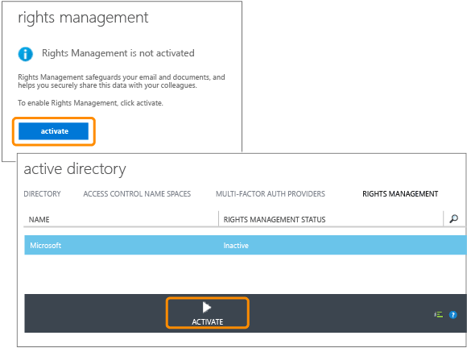
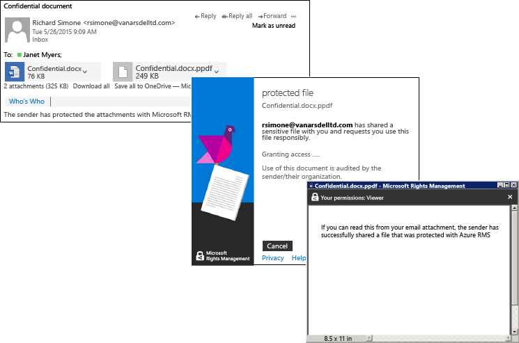

# Quick Start Tutorial for Azure Rights Management
Use this tutorial to quickly try out Microsoft Azure Rights Management (also known as Azure RMS) for your organization with just 5 steps that should take you less than 15 minutes. You’ll activate the service, securely send a confidential document by email to somebody in another organization, and then be able to track when that document is opened. When the confidential document is emailed, it is encrypted while in transit and can be read only by the person it is sent to, using the permissions that are set by the sender.

This tutorial is aimed at IT administrators and consultants, to help them evaluate Azure Rights Management as an information protection solution for an organization. In a production environment, the instructions to activate the service would be done by an administrator and the instructions to send the document would be done by end users. Both sets of instructions are included in this tutorial, to demonstrate the end-to-end scenario of securely sending a confidential document to somebody in another organization. If you have any problems completing this tutorial, send an email message to [AskIPTeam](mailto:askipteam@microsoft.com?subject=Having%20problems%20with%20the%20Quick%20Start%20tutorial) and we will help you out.

To complete this tutorial, you will need the following:

-   A subscription that supports Azure Rights Management . This can be a paid subscription or a trial subscription. If you want to use document tracking, which is required for step 5 in this tutorial, your subscription must support document tracking. For more information about the subscription options and links to free trials, see the [Cloud subscriptions that support Azure RMS](../Topic/Requirements_for_Azure_Rights_Management.md#BKMK_SupportedSubscriptions) section in the [Requirements for Azure Rights Management](../Topic/Requirements_for_Azure_Rights_Management.md) topic.

    Tip: If you need to get a subscription, do this in advance because this process can sometimes take a while to complete.

-   An administrator account to sign in to the Office 365 admin center or the Azure classic portal, so that you can activate the Rights Management service. This account must also have an email address and a working email service (for example, Exchange Online or Exchange Server).

-   A computer running Windows (minimum of Windows 7 SP1), and which has installed either Office 2016, Office 2013, or Office 2010.

Let’s get started.

## Step 1: Activate the Rights Management service

Even though you might have a subscription that supports Azure Rights Management, the service is disabled by default. To activate it, you can use either the Office 365 admin center, or the Azure classic portal:

-   If you have an Office 365 subscription that includes Azure Rights Management, or an Office 365 subscription that excludes Azure Rights Management but you have a subscription for Azure RMS Premium: **Use the Office 365 admin center**.

-   If you do not have an Office 365 subscription: **Use the Azure classic portal**.

#### To activate Rights Management from the Office 365 admin center

1.  Go to the [Office 365 portal](https://portal.office.com/) and sign in with your work or school account.

2.  If the Office 365 admin center does not automatically display, select the app launcher icon in the upper-left and choose **Admin**. The **Admin** tile appears only to Office 365 administrators.

    > [!TIP]
    > For admin center help, see [About the Office 365 admin center - Admin Help](https://support.office.com/article/About-the-Office-365-admin-center-Admin-Help-58537702-d421-4d02-8141-e128e3703547).

3.  In the left pane, expand **SERVICE SETTINGS**.

4.  Click **Rights Management**.

5.  On the **RIGHTS MANAGEMENT** page, click **Manage**.

6.  On the **rights management** page, click **activate**.

7.  When prompted **Do you want to activate Rights Management?**, click **activate**.

You should now see **Rights management is activated** and the option to deactivate (you might need to manually refresh the page)

At this time, do not click **advanced features**. This takes you to the Azure classic portal where you can configure templates, which are not needed for this tutorial. Instead, you can close the Office 365 admin center.

#### To activate Rights Management from the Azure portal

1.  Go to the [Azure classic portal](http://go.microsoft.com/fwlink/p/?LinkID=275081) and sign in.

2.  In the left pane, click **ACTIVE DIRECTORY**.

3.  From the **active directory** page, click **RIGHTS MANAGEMENT**.

4.  Select the directory to manage for [!INCLUDE[aad_rightsmanagement_2](../Token/aad_rightsmanagement_2_md.md)], click **ACTIVATE**, and then confirm your action.

The **RIGHTS MANAGEMENT STATUS** should now display **Active** and the **ACTIVATE** option is replaced with **DEACTIVATE**.

Although you can configure other options for Rights Management in the portal, these are not needed for this tutorial, so you can close the Azure classic portal.

That’s all you need to do for this first step. The service is activated so all users in your organization can now start to protect important and sensitive documents. In a production environment, you might want to restrict who can do this initially, for a phased rollout. But it’s not necessary for this tutorial.

Although not included here, for a production deployment, you probably will also probably want to configure custom templates. Templates make it easier for users to quickly apply the right settings when they need to protect files. When you activate Rights Management, you automatically get 2 default templates and it’s likely you will want to supplement these with your own custom templates in a production environment. But templates are not needed for this tutorial, so you’re ready to go to the next step.

|If you want more information|Additional information|
|--------------------------------|--------------------------|
|About activating Rights Management and controlling who can protect files and email when the service is activated   →|[Activating Azure Rights Management](../Topic/Activating_Azure_Rights_Management.md)|
|About the default templates and how to create new, custom templates   →|[Configuring Custom Templates for Azure Rights Management](../Topic/Configuring_Custom_Templates_for_Azure_Rights_Management.md)|

## Step 2: Install the Rights Management sharing application

The Rights Management sharing application (also known as the “RMS sharing app”) isn’t a requirement for Azure Rights Management, but we recommend it for all computers and mobile devices that support Azure Rights Management. The RMS sharing application integrates with Office applications by installing an Office add-in so that users can easily protect files directly from the ribbon. It also makes it possible to protect all files types by applying generic protection for files that are not natively supported by Azure Rights Management, and a document tracking site for users to track and revoke files that they have protected. We’ll be using the document tracking site later in this tutorial.

This application is free to download and offers a scripted install for production environments. But for this tutorial, we’ll install it locally.

#### To download and install the Rights Management sharing application

1.  Go to the [Microsoft Rights Management](http://go.microsoft.com/fwlink/?LinkId=303970) page on the Microsoft website.

2.  In the **Computers** section, click the icon for the **RMS app for Windows** and save the **Setup.exe** file to install the Microsoft Rights Management sharing application.

3.  For a local install, you must use an administrator account to run the Setup.exe file that was downloaded. If you are prompted to continue, click **Yes**.

4.  On the **Setup Microsoft RMS** page, click **Next**, and wait for the installation to finish.

5.  When the installation finishes, click **Restart** if prompted to restart your computer, or click  **Close** to complete the installation.

You’re now ready to start protecting files that contain information that you want to share but only with the people that you specify.

|If you want more information|Additional information|
|--------------------------------|--------------------------|
|About a local installation of the Rights Management sharing application for Windows and user instructions   →|[Rights Management sharing application user guide](http://technet.microsoft.com/library/dn339006.aspx)|
|About the scripted installation of the Rights Management sharing application for Windows and more technical information   →|[Rights Management sharing application administrator guide](http://technet.microsoft.com/library/dn339003.aspx)|
|To understand the difference between native protection and generic protection   →|[What’s the difference between generic protection and built-in (native) protection?](https://technet.microsoft.com/library/dn574738.aspx)|

## Step 3: Email your document that you want to protect

For this step, first create and save a document using Word that will represent your document that you want to protect, and name it **Confidential.docx**. For this tutorial, it doesn’t matter what text it actually contains, but you will want it to contain some text so you can more easily confirm that the authorized recipient could read it. For example, you might type: **If you can read this from your email attachment, the sender has successfully shared a file that was protected with Azure RMS.**

You’re then ready to safely share this document by email.

#### To safely share your document by email

1.  Using Outlook, create a new message and attach the file that you just created.

2.  In the **To** box, type one or more business email addresses. Make sure you specify a business email address, such as **janetm@contoso.com** or **p.dover@fabrikam.com** because currently, Azure Rights Management doesn’t support personal email addresses that you might use at home from your Internet provider. Don’t worry about whether the person you’re sending it to also has Azure Rights Management or not.

3.  Type a subject, such as  **Confidential document** and then type a short message for the email, such as **Please read this confidential document and do not share it with others.**

4.  Then, on the **Message** tab, in the **RMS** group, click **Share Protected** and then click **Share Protected** again:

5.  In the **share protected** dialog box:

    1.  Select **Viewer – View Only**.

        This means our recipients will be able to view the document but not edit or print it.

    2.  Select **Email me when somebody tries to open these documents**.

        You’ll get an email notification each time the recipients try to open the attachment, and also if somebody else tries to open it—for example, your recipient forwards the email to co-worker. In this last scenario, you’ll see that access was denied and from the user details, you can decide whether to send that person a copy of the document that they can open.

    3.  Select **Allow me to instantly revoke access to these documents**.

        This option requires the recipients to have an Internet connection each time they open the attachment but with the benefit that if you later revoke the document, the next time they try to open it, they will not be able to. If you do not select this option, the recipients might be able to open it even without an Internet connection but with the disadvantage that if you later revoke the document, there might be a delay for when that takes effect.

    4.  Click **Send Now**.

        The email with attachment is sent to the email addresses that you specified. In addition to your email message, they will see instructions how to read the attached document that is protected by Azure Rights Management.

Now you’ve sent your protected document, you’re ready to ask your recipients to wait for it to arrive and then open it. But don’t close Outlook, because we’ll use it again in our final step to track the attachment.

|If you want more information|Additional information|
|--------------------------------|--------------------------|
|Full instructions and alternative methods for protecting files that you share by email   →|[Protect a file that you share by email by using the Rights Management sharing application](https://technet.microsoft.com/library/dn574735.aspx)|
|About the options in the **share protected** dialog box   →|[Dialog box options for the Rights Management sharing application](https://technet.microsoft.com/library/dn574738.aspx)|

## Step 4: Ask your recipients to open the emailed document

Your recipients can use many devices to read the protected document that you sent as an email attachment. The devices include iPads, iPhones, Android tablets and phones, Mac computers, as well as Windows computers.

Ask them to read the email message that you sent. They will see your email message and before that, the following text:

**The sender has protected the attachments with Microsoft RMS. You must** [sign in](http://aka.ms/rms)
      **to open them.**

When they click the link, it takes them to instructions to install the RMS sharing app and if necessary, sign up for a free account. The free account grants them a subscription for RMS for individuals, which ensures that authorized users can always read a protected document, even if their organization does not have Azure RMS. They are then ready to read the protected attachment by using the following instructions.

#### To view the protected document attachment

1.  Because Azure Rights Management protected a Word document, there are two attachments for the email message. These are actually two versions of the same file but with different file name extensions. Open the version that has the **.ppdf** file name extension (**Confidential.ppdf**).

    If you have a version of [Office on your device that supports Rights Management](https://technet.microsoft.com/library/dn655136.aspx), you can open the other version of the file (**Confidential.docx**), so that it opens in Word.

2.  If you are prompted for your user name and password, enter your user name in the same format as the email address that was used to send you the email and attachment. For example, **janetm@contoso.com** or **p.dover@fabrikam.com**. For your password, type the password that you supplied when you signed up for RMS for individuals. Or, if your organization has Azure RMS, enter your usual work password.

The document opens and you can now read the contents. For example, it might say **If you can read this from your email attachment, the sender has successfully shared a file that was protected with Azure RMS.** Because it’s read-only, you cannot change the contents.

As an optional step, you could ask your recipient to forward the email to other people that you didn’t include in your original email. Even if those other people work for an organization that has Azure Rights Management or they apply for their own RMS for individuals subscription, they won’t be able to open the attachment. When they are promoted for their user name, access to the document will be denied.

Now that the recipient has opened the attachment and optionally, forwarded it to somebody else, expect to get an email notification that reports this activity. But email messages are easy to lose over time, so a better way to track who accessed your document is to use the document tracking site, which is covered in the final step.

|If you want more information|Additional information|
|--------------------------------|--------------------------|
|Full instructions for viewing files that are protected by Azure Rights Management   →|[View and use files that have been protected by Rights Management](https://technet.microsoft.com/library/dn574741.aspx)|
|About the free subscription, RMS for individuals   →|[RMS for Individuals and Azure Rights Management](../Topic/RMS_for_Individuals_and_Azure_Rights_Management.md)|
|About the two versions of the file that you see attached to the email message   →|[What’s the .ppdf file that’s automatically created?](https://technet.microsoft.com/library/dn574738.aspx)|

## Step 5: Track your protected document

> [!NOTE]
> For this step, you must have a subscription that supports document tracking. To check whether your subscription includes document tracking, see [Comparison of Rights Management Services (RMS) Offerings](https://technet.microsoft.com/dn858608.aspx).

This step is optional, but most people like to know if the attachment they sent to people has been opened, when, and even from where. For example:

-   You’re expecting a response from somebody by a specified time and you can see from the document tracking site that she hasn’t opened the document even though the deadline is approaching. You send her a follow-up email or telephone her as a timely reminder.

-   After seeing that somebody has opened the document, you follow up to ask her if she has any questions or requires additional information.

#### To track your protected document

1.  Using Outlook, on the **Home** tab, in the **RMS** group, click **Track Usage**.

2.  If you see the **Protect and share on your terms** page, click **Sign in** and supply your user name and password again.

3.  On the **Your shared documents** page, you’ll see the document that you attached to the email, **Confidential.docx**. At this point, it’s the only file displayed but as you share additional protected documents, the list will grow.

    From this page, you’ll see when you shared the document (when you sent the email with the protected attachment), the date of the last activity, and the name of the recipient you sent the email to. Click the document name for additional details.

4.  On the new page, which has the name of the file that you clicked, you’ll see summary details for that document only, and a list of other options that are available for the document (**List**, **Timeline**, **Map**, **Settings**).

    Click each option to explore different ways to track your protected document. Or, still on the **Summary** page, click **Open in Excel** to export the information to a spreadsheet, or click **Revoke access** to stop sharing the document.

You can return to this site to track further activity for your protected document, or revoke access if necessary. You can even access the site from your mobile device or tablet, by using a browser with this link: [document tracking](http://go.microsoft.com/fwlink/?LinkId=529562)

|If you want more information|Additional information|
|--------------------------------|--------------------------|
|Full instructions for tracking your documents   →|[Track and revoke your documents when you use the RMS sharing application](https://technet.microsoft.com/library/dn986611.aspx)|
|Two minute video that explains and shows document tracking   →|[Azure RMS Document Tracking and Revocation](http://channel9.msdn.com/Series/Information-Protection/Azure-RMS-Document-Tracking-and-Revocation)|
|For troubleshooting and customer questions   →|[FAQ for Document Tracking](https://technet.microsoft.com/dn947488)|

## Next Steps
This tutorial stepped you through just one scenario for how Azure RMS can help protect your data. To see other common uses, see the [Azure RMS in action](https://technet.microsoft.com/library/jj585026.aspx) section from the [What is Azure Rights Management?](../Topic/What_is_Azure_Rights_Management_.md) article. There are other sections in this article that you might also find useful, such as how Azure RMS works and what business problems it can solve.

If you’re ready to start deploying Azure RMS, use the [Azure Rights Management Deployment Roadmap](../Topic/Azure_Rights_Management_Deployment_Roadmap.md) for your deployment steps and links for how-to instructions.

## See Also
[Getting Started with Azure Rights Management](../Topic/Getting_Started_with_Azure_Rights_Management.md)

