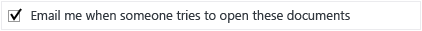

# Scenario - Share an Office File with Users in Another Organization
This scenario and supporting user documentation uses Azure Rights Management so that users can safely email an Office file with people in another organization. For example, the Office file might be a Word document, Excel spreadsheet, or PowerPoint presentation that contains price list information for a partner, a list of products for a reseller, or a list of delivery time lines with potential customers. When users follow the instructions, the file attached to the email message will be protected by Azure Rights Management.

This scenario is suitable for the following set of circumstances:

-   The employee has to send information outside the organization, via email, in the form of an Office document attachment.

-   The document contains information that is not public, but is not exclusively for internal use.

-   The recipient users do not have a requirement to further share this information with others, print it, or use it as part of their own documentation. If this is not the case, you can change the user instructions from selecting view-only permissions to another option that permits the recipient to change the attachment.

-   The employee is potentially interested in knowing when this document is opened by the external user.

## Deployment Instructions

Make sure that the following requirements are in place before going on to the user documentation.

## Requirements for this Scenario
For the user instructions for this scenario to work, the following must be in place:

|Check|Requirement|If you need more information|
|---------|---------------|--------------------------------|
||You have prepared accounts and groups for Office 365 or Azure Active Directory|[Preparing for Azure Rights Management](https://technet.microsoft.com/library/jj585029.aspx)|
||Azure Rights Management is activated|[Activating Azure Rights Management](https://technet.microsoft.com/library/jj658941.aspx)|
||The Rights Management sharing application is deployed to users’ computers that run Windows|[Automatic deployment for the Microsoft Rights Management sharing application](https://technet.microsoft.com/library/dn339003%28v=ws.10%29.aspx)|
||Users have Outlook from Office 2013|If users have Office 2010, replace the screen shot with an equivalent version so that the picture matches what users see.|
||Your Azure RMS subscription includes document tracking|If your subscription for Azure RMS does not include document tracking and revocation, users will not be able to complete all steps in the user instructions. In this case, either purchase a subscription that does support these features, or modify the user instructions to remove the steps that use these features.  To check your subscription support: [Comparison of Rights Management Services (RMS) Offerings](https://technet.microsoft.com/dn858608)|

## User Documentation Instructions
Using the following template, copy and paste the user instructions into a communication for your end users, and make these modifications to reflect your environment:

1.  Replace *&lt;name of Office document type&gt;* with the type of document that your users will be sending. Use wording that is specific and familiar to their work flows, such as "price list", "delivery times", and "bid proposal" rather than "Word document" and "Excel spreadsheet". This more specific wording helps to increases the likelihood that they will follow the instructions when working with those documents.

2.  Replace *&lt;contact details&gt;* with instructions for how your users can contact the help desk, such as a website link, email address, or telephone number.

3.  **Additional modifications you might want to make:**

    -   In step 2, we suggest **Viewer - View Only** for the permissions, which makes the attached document (but not the original) read-only for the recipients. If this restriction is not suitable for your business requirement, change this option for another set of permissions, such as **Reviewer - View and Edit**.

    -   In step 3, we suggest **Allow me to instantly revoke access to these documents** so that there is no delay if your users revoke the document later, but setting this option requires the recipient to always have an Internet connection to open the attachment. This step also requires you to have a subscription that supports document tracking and revocation. Delete this step if it is not suitable for your users.

    -   In step 4, we suggest the option **Email me when somebody tries to open this document**. If users track their documents by using the document tracking portal, you might decide that email notification is not necessary and delete this step.

    -   The steps do not include setting an expiration date. If the information should not be used after a specific date, add another step to set an appropriate expiration time, such as 90 days from sending the email message.

    > [!NOTE]
    > For more information about each of the options that users can select, see [Dialog box options for the Rights Management sharing application](https://technet.microsoft.com/library/dn574738.aspx)

4.  Make any other modifications that you want to this set of instructions, and then send it to these users.

The example documentation shows how these instructions might look for users, after your customizations.

#### How to share a &lt;name of Office document type&gt;

1.  Create your email message by specifying the email address or addresses, type your message, and attach the *&lt;name of Office document type&gt;* to the email message. Then, on the **MESSAGE** tab, in the **RMS** group, click **Share Protected** and then click **Share Protected** again:

    

2.  In the **share protected** dialog box, Select **Viewer – View Only**:

    

3.  Select **Allow me to instantly revoke access to these documents**:

    

4.  Select **Email me when somebody tries to open these documents**:

    

5.  Click **Send Now**.

When somebody on the **To**, **Cc**, or **Bcc** line receives this email, they see a message that gives them instructions how to read the attached *&lt;name of Office document type&gt;*. They can read the document on many devices, including iPads, iPhones, Android tablets and phones, Mac computers, and Windows computers.

Use the [document tracking portal](https://track.azurerms.com/) to track if and when they open the attached &lt;name of Office document type&gt;. Consider contacting them with a follow-up telephone call soon after you see they have opened the &lt;name of Office document type&gt;.

**Need help?**

-   For additional information:

    -   [Protect a file that you share by email](https://technet.microsoft.com/library/dn574735%28v=ws.10%29.aspx)

    -   [Track and revoke your documents](https://technet.microsoft.com/library/dn986611.aspx)

-   Contact the help desk:

    -   *&lt;contact details&gt;*

### Example Customized User Documentation

##### How to share a price list with your customer

1.  Create your email message by specifying the email address or addresses of your customer, type your message, and attach the latest price list to the email message. Then, on the **MESSAGE** tab, in the **RMS** group, click **Share Protected** and then click **Share Protected** again:

    

2.  In the **share protected** dialog box, Select **Viewer – View Only**:

    

3.  Select **Allow me to instantly revoke access to these documents**:

    

4.  Select **Email me when somebody tries to open these documents**:

    

5.  Click **Send Now**.

When somebody on the **To**, **Cc**, or **Bcc** line receives this email, they see a message that gives them instructions how to read the attached price list. They can read the document on many devices, including iPads, iPhones, Android tablets and phones, Mac computers, and Windows computers.

Use the [document tracking portal](https://track.azurerms.com/) to track if and when they open the attached price list. Consider contacting them with a follow-up telephone call soon after you see they have opened the price list.

**Need help?**

-   For additional information:

    -   [Protect a file that you share by email](https://technet.microsoft.com/library/dn574735%28v=ws.10%29.aspx)

    -   [Track and revoke your documents](https://technet.microsoft.com/library/dn986611.aspx)

-   Contact the help desk:

    -   Email: helpdesk@vanarsdelltd.com

