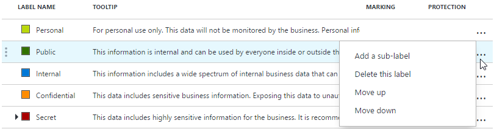

---
# required metadata

title: Delete or reorder an Azure Information Protection label - AIP
description: You can delete or reorder the Azure Information Protection labels that users see.
author: cabailey
ms.author: cabailey
manager: mbaldwin
ms.date: 10/04/2018
ms.topic: conceptual
ms.service: information-protection
ms.assetid: ae0f603f-a632-4ac5-a3f7-6358d4255eff

# optional metadata

#ROBOTS:
#audience:
#ms.devlang:
#ms.reviewer: eymanor
#ms.suite: ems
#ms.tgt_pltfrm:
#ms.custom:

---

# How to delete or reorder a label for Azure Information Protection

>*Applies to: [Azure Information Protection](https://azure.microsoft.com/pricing/details/information-protection)*

You can delete or reorder the Azure Information Protection labels that users see in their Office applications by selecting these actions for the labels.

When you delete a label that has been applied to documents and emails, users see **Not set** for the label status when these documents and emails are next opened by the Azure Information Protection client. However, the label information remains in the metadata and it can still be read by services that look for this label information.

In addition, if the deleted label applied protection, that protection is not removed. The protection settings from the label remain and display in the **Protection templates** section. This template can now be converted to a new label. While this template remains, you cannot create a new label with the same name as the label that you deleted. If you want to do that, you have the following options:

- Convert the template to a label. 
    
    This action is recommended because if required, you can then change the name of the template and modify the protection settings.

- Use PowerShell to rename the template or delete it.
    
    Before you do these actions, consider whether other admins or services are using the template and identify it by its current name. Delete a template only if you don't need to open documents or emails that were protected by the template.

For more information about managing protection templates, see [Configuring and managing templates for Azure Information Protection](configure-policy-templates.md).

Before you delete a label, instead, consider disabling it or removing it from the policy:
    
- When you disable a label that has been applied to documents and emails, the applied label is not removed from these documents and emails. The label remains in the policy but no longer displays as a label that users can select on the Information Protection bar. Disabling a label lets you keep the original configuration for when you might want users in the same policy to select the label at a later time, when you simply re-enable the label.

- When you remove a label from a policy, the applied label is also not removed from these documents and emails. But when you remove the label from the policy, it becomes available for you to add this label to another policy. For more information, see [Add or remove a label to or from an Azure Information Protection policy](configure-policy-add-remove-label.md).

Order the labels so that users see them in a logical progression in the Information Protection bar. For example, order the labels in increasing sensitivity so that users see the least sensitive label first and the most sensitive label last. The [default policy](configure-policy-default.md) uses this configuration and reflects the increasing sensitivity in the label names.

> [!IMPORTANT]
>If you configure [conditions](configure-policy-classification.md) for your labels that might apply to more than one label, you must order the labels from least sensitive to most sensitive. This ordering ensures that the most sensitive label is applied when the conditions are evaluated.

Use the following instructions to make these changes.

1. If you haven't already done so, open a new browser window and [sign in to the Azure portal](configure-policy.md#signing-in-to-the-azure-portal). Then navigate to the **Azure Information Protection** blade. 
    
    For example, on the hub menu, click **All services** and start typing **Information** in the Filter box. Select **Azure Information Protection**.

2. From the **Classifications** > **Labels** menu option: On the **Azure Information Protection - Labels** blade, do one or more of the following actions: 

    - To delete a label: Right-click or select the context menu (**...**) for the label that you want to delete, click **Delete this label**, and click **OK** to confirm. 

    - To disable a label: Select the label that you want to disable. On the **Label** blade, for **Enabled**, select **Off**, and then click **Save**.

    - To reorder a label: Right-click or select the context menu (**...**) for the label that you want to reorder, click **Move up** or **Move down** until the label is in the order that you want.  

## Next steps

For more information about configuring your Azure Information Protection policy, use the links in the [Configuring your organization's policy](configure-policy.md#configuring-your-organizations-policy) section.  

