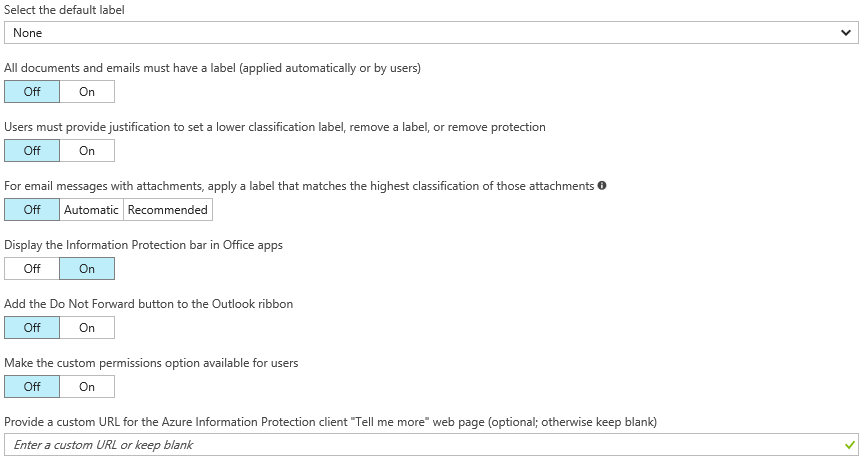
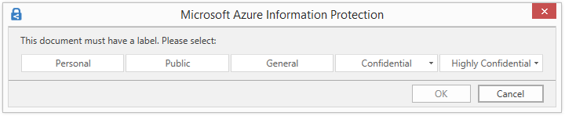

---
# required metadata

title: Configure Azure Information Protection policy settings - AIP
description: Configure settings in the Azure Information Protection policy that apply to all users, all devices.
author: cabailey
ms.author: cabailey
manager: mbaldwin
ms.date: 12/04/2018
ms.topic: conceptual
ms.service: information-protection
ms.assetid: 629815c0-457d-4697-a4cc-df0e6cc0c1a6

# optional metadata

#ROBOTS:
#audience:
#ms.devlang:
#ms.reviewer: eymanor
#ms.suite: ems
#ms.tgt_pltfrm:
#ms.custom:

---

# How to configure the policy settings for Azure Information Protection

>*Applies to: [Azure Information Protection](https://azure.microsoft.com/pricing/details/information-protection)*

In addition to the Information Protection bar title and tooltip, there are some settings in the Azure Information Protection policy that you can configure independently from the labels:

Note that your policy settings might have different default values, depending on when you purchased your subscription for Azure Information Protection. Some settings might also be set by a [custom client setting](./rms-client/client-admin-guide-customizations.md).

To configure these settings:

1. If you haven't already done so, open a new browser window and [sign in to the Azure portal](configure-policy.md#signing-in-to-the-azure-portal). Then navigate to the **Azure Information Protection** blade.
    
    For example, on the hub menu, click **All services** and start typing **Information** in the Filter box. Select **Azure Information Protection**.

2. From the **Classifications** > **Policies** menu option: On the **Azure Information Protection - Policies** blade, select **Global** if the settings that you want to configure will apply to all users.
    
    If the settings that you want to configure are in a [scoped policy](configure-policy-scope.md) so that they apply to selected users only, select your scoped policy instead.

3. On the **Policy** blade, configure the settings:
    
    - **Select the default label**: When you set this option, select the label to assign to documents and emails that do not have a label. You cannot set a label as the default if it has sublabels. 
    
    - **All documents and emails must have a label**: When you set this option to **On**, all saved documents and sent emails must have a label applied. The labeling might be manually assigned by a user, automatically as a result of a [condition](configure-policy-classification.md), or be assigned by default (by setting the **Select the default label** option).
        
        If a label is not assigned when users save a document or send an email, they are prompted to select a label. For example:
        
        
        
        This option does not apply when you remove a label by using the [Set-AIPFileLabel](/powershell/module/azureinformationprotection/set-aipfilelabel) PowerShell cmdlet with the *RemoveLabel* parameter.
        
    - **Users must provide justification to set a lower classification label, remove a label, or remove protection**: When you set this option to **On** and a user does any of these actions (for example, change the **Public** label to **Personal**), the user is prompted to provide an explanation for this action. For example, the user might explain that the document no longer contains sensitive information. The action and its justification reason are logged in their local Windows event log: **Applications and Services Logs** > **Azure Information Protection**.  
        
        
        
        This option is not applicable for lowering the classification of sublabels under the same parent label.
        
    - **For email messages with attachments, apply a label that matches the highest classification of those attachments**: When you set this option to **Recommended**, users are prompted to apply a label to their email message. The label is dynamically chosen, based on the classification labels that are applied to the attachments, and the highest classification label is selected. The attachment must be a physical file, and cannot be a link to a file (for example, a link to a file on SharePoint or OneDrive for Business). Users can accept the recommendation or dismiss it. When you set this option to **Automatic**, the label is automatically applied but users can remove the label or select a different label before sending the email.
    
    When the attachment with the highest classification label is configured for protection with the preview setting of user-defined permissions, the email message is labeled with the same classification, but protection is not applied.
    
    - **Display the Information Protection bar in Office apps**: When this setting is off, users cannot select labels from a bar in Word, Excel, PowerPoint, and Outlook. Instead, users must select labels from the **Protect** button on the ribbon. When this setting is on, users can select labels from either the bar or the button.
        
        When this setting is on, it can be used in conjunction with an advanced client setting so that users can [permanently hide the Azure Information Protection bar](./rms-client/client-admin-guide-customizations.md#permanently-hide-the-azure-information-protection-bar) if they choose not to show the bar. They can do this by clearing the **Show Bar** option from the **Protect** button.
    
    - **Add the Do Not Forward button to the Outlook ribbon**: When this setting is on, users can select this button from the **Protection** group on the Outlook ribbon in addition to selecting the **Do Not Forward** option from Outlook menus. To help ensure that users classify their emails as well as protect them, you might prefer to not add this button but instead, [configure a label for protection](configure-policy-protection.md) and a user defined permission for Outlook. This protection setting is functionally the same as selecting the **Do Not Forward** button, but when this functionality is included with a label, emails are classified as well as protected.
    
        This policy setting can also be configured with an advanced client setting as a [client customization](./rms-client/client-admin-guide-customizations.md#hide-or-show-the-do-not-forward-button-in-outlook).
    
    - **Make the custom permissions option available to users**: When this setting is on, users see options to set their own protection settings that can override any protection settings that you might have included with a label configuration. Users can also see an option to remove protection. When this setting is off, users do not see these options.
        
        Note that this policy setting has no effect on custom permissions that users can configure from Office menu options. However, it can also be configured with an advanced client setting as a [client customization](./rms-client/client-admin-guide-customizations.md#make-the-custom-permissions-options-available-or-unavailable-to-users).
        
        The custom permissions options are located in the following places:
        
        - In Office applications: From the ribbon, **Home** tab > **Protection** group > **Protect** > **Custom Permissions**
        
        - From File Explorer: Right-click > **Classify and protect** > **Custom permissions**
    
    - **Provide a custom URL for the Azure Information Protection client "Tell me more" web page**: Users see this link in the **Microsoft Azure Information Protection** dialog box, **Help and Feedback** section, when they select **Protect** > **Help and feedback** from the **Home** tab in their Office applications. By default, this link goes to the [Azure Information Protection](https://www.microsoft.com/cloud-platform/azure-information-protection) website. You can enter an HTTP or HTTPS (recommended) URL if you want this link to go to an alternative web page. No check is made to verify that the custom URL entered is accessible or displays correctly on all devices.
        
        As an example, for your help desk, you might enter the Microsoft documentation page that includes information about installing and using the client (**https://docs.microsoft.com/information-protection/rms-client/info-protect-client**) or release version information (**https://docs.microsoft.com/information-protection/rms-client/client-version-release-history**). Alternatively, you might publish your own webpage that includes information for users to contact your help desk, or a video that steps users through how to use the labels that you have configured.

3. To save your changes and make them available to users, click **Save**.

When you click **Save**, your changes are automatically available to users and services. There's no longer a separate publish option.

## Next steps

To see how some of these policy settings can work together, try the [Configure Azure Information Protection policy settings that work together](infoprotect-settings-tutorial.md) tutorial.

For more information about configuring your Azure Information Protection policy, use the links in the [Configuring your organization's policy](configure-policy.md#configuring-your-organizations-policy) section.

