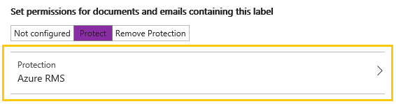

---
# required metadata

title: Configure and manage templates for Azure Information Protection - AIP
description: Configure and manage protection templates, also known as rights management templates, from the Azure portal.
author: cabailey
ms.author: cabailey
manager: barbkess
ms.date: 04/17/2019
ms.topic: conceptual
ms.collection: M365-security-compliance
ms.service: information-protection
ms.assetid: 8301aabb-047d-4892-935c-7574f6af8813

# optional metadata

#ROBOTS:
#audience:
#ms.devlang:
ms.reviewer: eymanor
ms.suite: ems
#ms.tgt_pltfrm:
#ms.custom:

---

# Configuring and managing templates for Azure Information Protection

>*Applies to: [Azure Information Protection](https://azure.microsoft.com/pricing/details/information-protection), [Office 365](https://download.microsoft.com/download/E/C/F/ECF42E71-4EC0-48FF-AA00-577AC14D5B5C/Azure_Information_Protection_licensing_datasheet_EN-US.pdf)*
>
> *Instructions for: [Azure Information Protection client for Windows](faqs.md#whats-the-difference-between-the-azure-information-protection-client-and-the-azure-information-protection-unified-labeling-client)*

Protection templates, also known as Rights Management templates, are a grouping of administrator-defined protection settings for Azure Information Protection. These settings include your chosen [usage rights](configure-usage-rights.md) for authorized users, and access controls for expiry and offline access. These templates are integrated with the Azure Information Protection policy: 

**When you have a subscription that includes classification, labeling, and protection (Azure Information Protection P1 or P2):**

- Templates that are not integrated with your labels for your tenant are displayed in the **Protection templates** section after your labels on the **Azure Information Protection - Labels** blade. To navigate to this blade, select the **Classifications** > **Labels** menu option. You can convert these templates to labels, or you can link to them when you configure protection for your labels. 

**When you have a subscription that includes protection only (an Office 365 subscription that includes the Azure Rights Management service):**

- Templates for your tenant are displayed in the **Protection templates** section on the **Azure Information Protection - Labels** blade. To navigate to this blade, select the **Classifications** > **Labels** menu option. No labels are displayed. You also see configuration settings that are specific to classification and labeling, but these settings either have no effect on your templates or cannot be configured. 

>[!NOTE]
>In some applications and services, you might see [Do Not Forward](configure-usage-rights.md#do-not-forward-option-for-emails) and [Encrypt-Only](configure-usage-rights.md#encrypt-only-option-for-emails) (or **Encrypt**) displayed as a template. These are not templates that you can edit or delete, but options that come by default with the Exchange service.

## Default templates

When you obtain your subscription for Azure Information Protection or for an Office 365 subscription that includes the Azure Rights Management service, two default templates are automatically created for your tenant. These templates restrict access to authorized users in your organization. When these templates are created, they have the permissions that are listed in the [Configuring usage rights for Azure Information Protection](configure-usage-rights.md#rights-included-in-the-default-templates) documentation.

In addition, the templates are configured to allow offline access for seven days and do not have an expiration date.

>[!NOTE]
> You can change these settings, and the names and descriptions of the default templates. This ability was not possible with the Azure classic portal and remains unsupported for PowerShell.

These default templates make it easy for you and others to immediately start protecting your organization's sensitive data. These templates can be used with Azure Information Protection labels, or by themselves with [applications and services](applications-support.md) that can use Rights Management templates.

You can also create your own custom templates. Although you probably require only a few templates, you can have a maximum of 500 custom templates saved in Azure.

### Default template names

If you recently obtained your subscription, your default templates are created with the following names:

- **Confidential \ All Employees** that grants read and modify permissions for the protected content.

- **Highly Confidential \ All Employees** that grants read-only permission for the protected content.

If you obtained your subscription some time ago, your default templates are created with the following names:

- **\<organization name> - Confidential** that grants read and modify permissions for the protected content.

- **\<organization name> - Confidential View Only** that grants read-only permission for the protected content. 

You can rename (and reconfigure) these default templates when you use the Azure portal.

>[!NOTE]
>If you don't see your default templates in the **Azure Information Protection - Labels** blade, they are converted to labels, or linked to a label. They still exist as templates, but in the Azure portal, you see them as part of a label configuration that includes protection settings for a cloud key. You can always confirm what templates your tenant has, by running the [Get-AipServiceTemplate](/powershell/module/aipservice/get-aipservicetemplate) from the [AIPService PowerShell module](administer-powershell.md).
>
>You can manually convert templates, as explained in the later section, [To convert templates to labels](#to-convert-templates-to-labels), and then rename them if you want. Or they are converted automatically for you if your default Azure Information Protection policy was recently created and the Azure Rights Management service for your tenant was activated at that time.

Templates that are archived display as unavailable in the **Azure Information Protection - Labels** blade. These templates cannot be selected for labels but they can be converted to labels.

## Considerations for templates in the Azure portal

Before you edit these templates or convert them to labels, make sure that you are aware of the following changes and considerations. Because of implementation changes, the following list is especially important if you previously managed templates in the Azure classic portal.

- After you edit or convert a template and save the Azure Information Protection policy, the following changes are made to the original [usage rights](configure-usage-rights.md). If required, you can add or remove individual usage rights by using the Azure portal. Or, use PowerShell with the [New-​Aadrm​Rights​Definition](/powershell/module/aadrm/new-aadrmrightsdefinition) and [Set-​Aadrm​Template​Property](/powershell/module/aadrm/set-aadrmtemplateproperty) cmdlets.
    
    - **Allow Macros** (common name) is automatically added. This usage right is required for the Azure Information Protection bar in Office apps.

- **Published** and **Archived** settings display as **Enabled**: **On** and **Enabled**: **Off** respectively on the **Label** blade. For templates that you want to retain but not be visible to users or services, set these templates to **Enabled**: **Off**.

- You cannot copy or delete a template in the Azure portal. When the template is converted to a label, you can configure the label to stop using the template by selecting  **Not configured** for the **Set permissions for documents and emails containing this label** option. Or, you can delete the label. In both scenarios however, the template is not deleted and remains in an archived state.
    
    You could now delete the template by using the PowerShell [Remove-AipServiceTemplate](/powershell/module/aipservice/remove-aipservicetemplate) cmdlet. You can also use this PowerShell cmdlet for templates that are not converted to labels. However, to ensure that previously protected content can be opened and used as intended, we usually advise against deleting templates. As a best practice, delete templates only if you are sure they were not used to protect documents or emails in production. As a precaution, you might want to consider first exporting the template as a backup, by using the [Export-AipServiceTemplate](/powershell/module/aipservice/export-aipservicetemplate) cmdlet. 

- Currently, if you edit and save a departmental template, it removes the scope configuration. The equivalent of a scoped template in the Azure Information Protection policy is a [scoped policy](configure-policy-scope.md). If you convert the template to a label, you can select an existing scope.
    
    In addition, you cannot set the application compatibility setting for a departmental template by using the Azure portal. If necessary, you can set this application compatibility setting by using the [Set-AipServiceTemplate​Property](/powershell/module/aipservice/set-aipservicetemplateproperty) cmdlet and the *EnableInLegacyApps* parameter.

- When you convert or link a template to a label, it can no longer be used by other labels. In addition, this template no longer displays in the **Protection templates** section. 

- You do not create a new template from the **Protection templates** section. Instead, create a label that has the **Protect** setting, and configure the usage rights and settings from the **Protection** blade. For full instructions, see [To create a new template](#to-create-a-new-template).

## To configure the templates in the Azure Information Protection policy

1. If you haven't already done so, open a new browser window and [sign in to the Azure portal](configure-policy.md#signing-in-to-the-azure-portal). Then navigate to the **Azure Information Protection - Labels** blade.
    
    For example, on the hub menu, click **All services** and start typing **Information** in the Filter box. Select **Azure Information Protection**.

2. From the **Classifications** > **Labels** menu option: On the **Azure Information Protection - Labels** blade, expand **Protection templates**, and then locate the template that you want to configure.
    
3. Select the template, and on the **Label** blade, you can change the template name and description if required, by editing the **Label display name** and **Description**. Then, select **Protection** that has a value of **Azure (cloud key)**, to open the **Protection** blade.

4. On the **Protection** blade, you can change the permissions, content expiration, and offline access settings. For more information about configuring the protection settings, see [How to configure a label for Rights Management protection](configure-policy-protection.md)
    
    Click **OK** to keep your changes, and on the **Label** blade, click **Save**.
    
> [!NOTE]
> You can also edit a template by using the **Edit Template** button on the **Protection** blade if you have configured a label to use a predefined template. Providing no other label also uses the selected template, this button converts the template into a label, and takes you to step 5. For more information about what happens when templates are converted to labels, see the next section.

## To convert templates to labels

When you have a subscription that includes classification, labeling, and protection, you can convert a template to a label. When you convert a template, the original template is retained but in the Azure portal, it now displays as included in a new label.

For example, if you convert a label named **Marketing** that grants usage rights to the marketing group, in the Azure portal it now displays as a label named **Marketing** that has the same protection settings. If you change the protection settings in this newly created label, you're changing them in the template and any user or service that uses this template will get the new protection settings with the next template refresh. 

There is no requirement to convert all your templates to labels, but when you do, the protection settings are fully integrated with the full functionality of labels so that you do not have to maintain the settings separately.

To convert a template into a label, right-click the template, and select **Convert to label**. Alternatively, use the context-menu to select this option. 

You can also convert a template to a label when you configure a label for protection and a predefined template, by using the **Edit Template** button. 

When you convert a template to a label:

- The name of the template is converted to a new label name, and the template description is converted to the label tooltip. 

- If the status of the template was published, this setting maps to **Enabled**: **On** for the label, which now displays as this label to users when you next publish the Azure Information Protection policy. If the status of the template was archived, this setting maps to **Enabled**: **Off** for the label and does not display as an available label to users.

- The protection settings are retained, and you can edit these if required, and also add other label settings such as visual markers and conditions.

- The original template is no longer displayed in **Protection templates** and cannot be selected as a predefined template when you configure protection for a label. To edit this template in the Azure portal, you now edit the label that was created when you converted the template. The template remains available for the Azure Rights Management service, and can still be managed by using [PowerShell commands](administer-powershell.md).  

## To create a new template

When you create a new label with the protection setting of **Azure (cloud key)**, under the covers, this action creates a new custom template that can then be accessed by services and applications that integrate with Rights Management templates.

1. From the **Classifications** > **Labels** menu option: On the **Azure Information Protection - Labels** blade, select **Add a new label**.

2. On the **Label** blade, keep the default of **Enabled**: **On**, then enter a label name and description for the template name and description.

3. For **Set permissions for documents and emails containing this label**, select **Protect**, and then select **Protection**:
    
     

4. On the **Protection** blade, you can change the permissions, content expiration, and offline access settings. For more information about configuring these protection settings, see [How to configure a label for Rights Management protection](configure-policy-protection.md)
    
    Click **OK** to keep your changes, and on the **Label** blade, click **Save**.
    
    On the **Azure Information Protection - Labels** blade, you now see your new label displayed with the **PROTECTION** column to indicate that it contains protection settings. These protection settings display as templates to applications and services that support the Azure Rights Management service.
    
    Although the label is enabled, by default, the template is archived. So that applications and services can use the template to protect documents and emails, complete the final step to publish the template.

5. From the **Classifications** > **Policies** menu option, select the policy to contain the new protection settings. Then select **Add or remove labels**. From the **Policy: Add or remove labels** blade, select the newly created label that contains your protection settings, select **OK**, and then select **Save**.

## Next steps

It can take up to 15 minutes for a computer running the Azure Information Protection client to get these changed settings. For information about how computers and services download and refresh templates, see [Refreshing templates for users and services](refresh-templates.md).

Everything that you can configure in the Azure portal to create and manage your templates, you can do by using PowerShell. In addition, PowerShell provides more options that are not available in the portal. For more information, see [PowerShell reference for protection templates](configure-templates-with-powershell.md). 

For more information about configuring your Azure Information Protection policy, use the links in the [Configuring your organization's policy](configure-policy.md#configuring-your-organizations-policy) section.  

