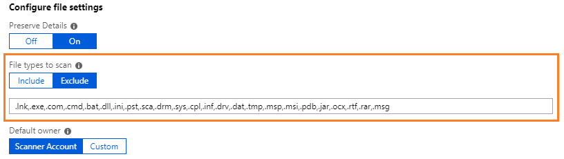

---
# required metadata

title: Understanding the Azure Information Protection classic scanner - AIP
description: Instructions to install, configure, and run the Azure Information Protection classic scanner to discover, classify, and protect files on data stores.
author: batamig
ms.author: bagol
manager: rkarlin
ms.date: 06/29/2020
ms.topic: conceptual
ms.collection: M365-security-compliance
ms.service: information-protection
ROBOTS: NOINDEX

# optional metadata

#audience:
#ms.devlang:
ms.subservice: scanner
ms.reviewer: demizets
ms.suite: ems
#ms.tgt_pltfrm:
ms.custom: admin

---

# What is the Azure Information Protection classic scanner?

>***Applies to**: Azure Information Protection, Windows Server 2019, Windows Server 2016, Windows Server 2012 R2*
>
>***Relevant for**: [Azure Information Protection classic client for Windows](faqs.md#whats-the-difference-between-the-azure-information-protection-classic-and-unified-labeling-clients).*

[!INCLUDE [AIP classic client is deprecated](includes/classic-client-sunset.md)]

Use the information in this section to learn about the Azure Information Protection classic client scanner, and then how to successfully install, configure, run and if necessary, troubleshoot it.

The AIP scanner runs as a service on Windows Server and lets you discover, classify, and protect files on the following data stores:

- **UNC paths** for network shares that use the Server Message Block (SMB) protocol.

- **SharePoint document libraries and folder** for SharePoint Server 2019 through SharePoint Server 2013. 

## Azure Information Protection classic scanner overview

The AIP scanner can inspect any files that Windows can index. If you've configured labels that apply automatic classification, the scanner can label discovered files to apply that classification, and optionally apply or remove protection.

The following image shows the AIP scanner architecture, where the scanner discovers files across your on-premises and SharePoint servers.

:::image type="content" source="media/classic-scanner-arch.png" alt-text="Azure Information Protection classic scanner architecture":::

To inspect your files, the scanner uses IFilters installed on the computer. To determine whether the files need labeling, the scanner uses the Microsoft 365 built-in data loss prevention (DLP) sensitivity information types and pattern detection, or Microsoft 365 regex patterns.

The scanner uses the Azure Information Protection client, and can classify and protect the same types of files as the client. For more information, see [File types supported by the Azure Information Protection client](./rms-client/client-admin-guide-file-types.md).

Do any of the following to configure your scans as needed:

- **Run the scanner in discovery mode only** to create reports that check to see what happens when your files are labeled.
- **Run the scanner to discover files with sensitive information**, without configuring labels that apply automatic classification.
- **Run the scanner automatically** to apply labels as configured.
- **Define a file types list** to specify specific files to scan or to exclude.

> [!NOTE]
> The scanner does not discover and label in real time. It systematically crawls through files on data stores that you specify. Configure this cycle to run once, or repeatedly.

## AIP scanning process

When scanning files, the AIP scanner runs through the following steps:

[1. Determine whether files are included or excluded for scanning](#1-determine-whether-files-are-included-or-excluded-for-scanning)

[2. Inspect and label files](#2-inspect-and-label-files)

[3. Label files that can't be inspected](#3-label-files-that-cant-be-inspected)

> [!NOTE]
> For more information, see [Files not labeled by the scanner](#files-not-labeled-by-the-scanner).

### 1. Determine whether files are included or excluded for scanning

The scanner automatically skips files that are excluded from classification and protection, such as executable files and system files. For more information, see [File types that are excluded from classification and protection](./rms-client/client-admin-guide-file-types.md#file-types-that-are-excluded-from-classification-and-protection).

The scanner also considers any file lists explicitly defined to scan, or exclude from scanning. File lists apply for all data repositories by default, and can also be defined for specific repositories only.

To define file lists for scanning or exclusion, use the **File types to scan** setting in the content scan job. For example:

For more information, see [Deploying the Azure Information Protection scanner to automatically classify and protect files](deploy-aip-scanner-configure-install.md).

### 2. Inspect and label files

After identifying excluded files, the scanner filters again to identify files supported for inspection.

These additional filters are the same ones used by the operating system for Windows Search and indexing, and require no additional configuration. Windows IFilter is also used to scan file types that are used by Word, Excel, and PowerPoint, and for PDF documents and text files.

For a full list of file types supported for inspection, and additional instructions for configuring filters to include .zip and .tiff files, see [File types supported for inspection](./rms-client/client-admin-guide-file-types.md#file-types-supported-for-inspection).

After inspection, supported file types are labeled using the conditions specified for your labels. If you're using discovery mode, these files can either be reported to contain the conditions specified for your labels, or reported to contain any known sensitive information types.

### 3. Label files that can't be inspected

For any file types that can't be inspected, the AIP scanner applies the default label in the Azure Information Protection policy, or the default label configured for the scanner.

### Files not labeled by the scanner

The AIP scanner cannot label files under the following circumstances:

- When the label applies classification, but not protection, and the file type does not support classification-only by the client. For more information, see [Classic client file types](./rms-client/client-admin-guide-file-types.md#file-types-supported-for-classification-only).

- When the label applies classification and protection, but the scanner does not support the file type.
  
    By default, the scanner protects only Office file types, and PDF files when they are protected by using the ISO standard for PDF encryption.

    Other types of files can be added for protection when you [change the types of files to protect](deploy-aip-scanner-configure-install.md#change-which-file-types-to-protect).

**Example**: After inspecting .txt files, the scanner can't apply a label that's configured for classification only, because the .txt file type doesn't support classification only.

However, if the label is configured for both classification and protection, and the .txt file type is included for the scanner to protect, the scanner can label the file.

## Next steps

For more information about deploying the scanner, see the following articles:

- [AIP scanner deployment prerequisites](deploy-aip-scanner-prereqs.md)
- [Configuring and installing the AIP scanner](deploy-aip-scanner-configure-install.md)
- [Running scans using the AIP scanner](deploy-aip-scanner-manage.md)

**More information**:

- Interested in how the Core Services Engineering and Operations team in Microsoft implemented this scanner?  Read the technical case study: [Automating data protection with Azure Information Protection scanner](https://www.microsoft.com/itshowcase/Article/Content/1070/Automating-data-protection-with-Azure-Information-Protection-scanner).

- You might be wondering: [What's the difference between Windows Server FCI and the Azure Information Protection scanner?](faqs-classic.md#whats-the-difference-between-windows-server-fci-and-the-azure-information-protection-scanner)

- You can also use PowerShell to interactively classify and protect files from your desktop computer. For more information about this and other scenarios that use PowerShell, see [Using PowerShell with the Azure Information Protection client](./rms-client/client-admin-guide-powershell.md).
