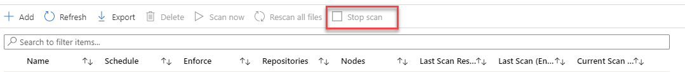

---
# required metadata

title: Running the Azure Information Protection unified labeling scanner (AIP)
description: Instructions for running the Azure Information Protection unified labeling scanner to discover, classify, and protect files on data stores.
author: batamig
ms.author: bagol
manager: rkarlin
ms.date: 04/26/2021
ms.topic: conceptual
ms.collection: M365-security-compliance
ms.service: information-protection

# optional metadata

#ROBOTS:
#audience:
#ms.devlang:
ms.subservice: scanner
ms.reviewer: demizets
ms.suite: ems
#ms.tgt_pltfrm:
ms.custom: admin

---

# Running the Azure Information Protection scanner

>***Applies to**: [Azure Information Protection](/office365/servicedescriptions/microsoft-365-service-descriptions/microsoft-365-tenantlevel-services-licensing-guidance/microsoft-365-security-compliance-licensing-guidance#information-protection), Windows Server 2019, Windows Server 2016, Windows Server 2012 R2*
>

Once you've confirmed your [system requirements](deploy-aip-scanner-prereqs.md) and [configured and installed your scanner](deploy-aip-scanner-configure-install.md), [run a discovery scan](#run-a-discovery-cycle-and-view-reports-for-the-scanner) to get started.

Use other steps detailed below to manage your scans moving forward.

- [Stop a scan](#stopping-a-scan)
- [Rescanning files](#rescanning-files)

For more information, see [Deploying the Azure Information Protection scanner to automatically classify and protect files](deploy-aip-scanner.md).

> [!TIP]
> While most customers will perform these procedures in the **Azure Information Protection** area of the Azure portal, you may need to work in PowerShell only.
>
> For example, if you are working in an environment without access to the Azure portal, such as [Azure China 21Vianet scanner servers](/microsoft-365/admin/services-in-china/parity-between-azure-information-protection#manage-azure-information-protection-content-scan-jobs), authenticate to the [AzureInformationProtection](/powershell/module/azureinformationprotection) PowerShell module, and then continue with instructions in this article for PowerShell only.
>
## Run a discovery cycle and view reports for the scanner

Use the following procedure after you've [configured and installed your scanner](deploy-aip-scanner-configure-install.md) to get an initial understanding of your content.

Perform these steps again as needed when your content changes.

1. In the Azure portal, on the **Azure Information Protection - Content scan jobs** pane, select your content scan jobs, and then select the **Scan now** option:

    

    Alternatively, in your PowerShell session, run the following command:

    ```PowerShell
    Start-AIPScan
    ```

1. Wait for the scanner to complete its cycle. The scan completes when the scanner has crawled through all the files in the specified data stores.

    Do any of the following to monitor scanner progress:

    - **Refresh the scan jobs.**  On the **Azure Information Protection - Content scan jobs** pane, select **Refresh**.

        Wait until you see values for the **LAST SCAN RESULTS** column and the **LAST SCAN (END TIME)** column.

    - **Use a PowerShell command.** Run `Get-AIPScannerStatus` to monitor the status change.

1. When the scan is complete, review the reports stored in the **%*localappdata*%\Microsoft\MSIP\Scanner\Reports** directory.

    - The .txt summary files include the time taken to scan, the number of scanned files, and how many files had a match for the information types.

    - The .csv files have more details for each file. This folder stores up to 60 reports for each scanning cycle and all but the latest report is compressed to help minimize the required disk space. 

        When a scan is completed, a `Summary_<x>.txt` file is created with the scan summary.

> [!NOTE]
> Scanners send collected data information to Azure Information Protection every five minutes, so that you can view the results in near real time from the Azure portal. For more information, see [Reporting for Azure Information Protection](reports-aip.md).
>
> The Azure portal displays information about the last scan only. If you need to see the results of previous scans, return to the reports that are stored on the scanner computer, in the %*localappdata*%\Microsoft\MSIP\Scanner\Reports folder.
>

[Initial configurations](deploy-aip-scanner-configure-install.md#configure-the-scanner-settings) instruct you to set the **Info types to be discovered** to **Policy only**. This configuration means that only files that meet the conditions you've configured for automatic classification are included in the detailed reports.

If you don't see any labels applied, check that your label configuration includes automatic rather than recommended classification, or enable **Treat recommended labeling as automatic** (available in scanner version 2.7.x.x and above).

If the results are still not as you expect, you might need to reconfigure the conditions that you specified for your labels. If that's the case, reconfigure the conditions as needed, and repeat this procedure until you are satisfied with the results. Then, update your configuration automatically, and optionally protection.

### Changing log levels or locations

Change the level of logging by using the *ReportLevel* parameter with [Set-AIPScannerConfiguration](/powershell/module/azureinformationprotection/set-aipscannerconfiguration).

The report folder location or name cannot be changed. If you want to store reports in a different location, consider using a directory junction for the folder.

For example, use the [Mklink](/windows-server/administration/windows-commands/mklink) command: `mklink /j D:\Scanner_reports C:\Users\aipscannersvc\AppData\Local\Microsoft\MSIP\Scanner\Reports`

If you've performed these steps after an initial configuration and installation, continue with [Configure the scanner to apply classification and protection](deploy-aip-scanner-configure-install.md#configure-the-scanner-to-apply-classification-and-protection).

## Stopping a scan

To stop a currently running scan before it's complete, use one of the following methods:

- **Azure portal.** Select **Stop scan**:

    

- **Run a PowerShell command.** Run the following command:

    ```PowerShell
    Stop-AIPScan
    ```

## Rescanning files

For the [first scan cycle](#run-a-discovery-cycle-and-view-reports-for-the-scanner), the scanner inspects all files in the configured data stores. For subsequent scans, only new or modified files are inspected.

Inspecting all files again is typically useful when you want the reports to include all files, when you have changes that you want to apply across all files, and when the scanner runs in discovery mode.

**To manually run a full rescan**:

1. Navigate to the **Azure Information Protection - Content scan jobs** pane in the Azure portal.

1. Select your content scan job from the list, and then select the **Rescan all files** option:

    

When a full scan is complete, the scan type automatically changes to incremental so that for subsequent scans, only new or modified files are scanned again.

> [!TIP]
> If you've made changes to your AIP [content scan job](deploy-aip-scanner-configure-install.md#create-a-content-scan-job), the Azure portal will prompt you to skip a full rescan. To ensure that your rescan occurs, make sure to select **No** in the prompt that appears.
>

### Trigger a full rescan by modifying your settings

Earlier versions of the scanner scanned all files whenever the scanner detected new or changed settings for automatic and recommended labeling. The scanner automatically refreshed the policy every four hours.

In scanner versions 2.8.85.0 or later, AIP skips the full rescan for updated settings to ensure consistent performance. Make sure that you [run a full rescan manually](#rescanning-files) as needed.

For example, if you’ve changed **Sensitivity policy** settings from **Enforce = Off** to **Enforce = On**, make sure to run a full rescan to apply your labels across your content.

> [!NOTE]
> In scanner version [2.7.101.0](rms-client/unifiedlabelingclient-version-release-history.md#general-availability-versions-that-are-no-longer-supported) and lower, you may want to refresh the policy sooner than every four hours, such as while testing. In such cases, manually delete the contents of the **%LocalAppData%\Microsoft\MSIP\mip\<processname>\mip** directory and restart the Azure Information Protection service.
>
> If you've also changed protection settings for your labels, wait an extra 15 minutes from when you saved the updated protection settings before restarting the Azure Information Protection service.
>

## Next steps

- Interested in how the Core Services Engineering and Operations team in Microsoft implemented this scanner?  Read the technical case study: [Automating data protection with Azure Information Protection scanner](https://www.microsoft.com/itshowcase/Article/Content/1070/Automating-data-protection-with-Azure-Information-Protection-scanner).

- You can also use PowerShell to interactively classify and protect files from your desktop computer. For more information about this and other scenarios that use PowerShell, see [Using PowerShell with the Azure Information Protection unified labeling client](./rms-client/clientv2-admin-guide-powershell.md).
