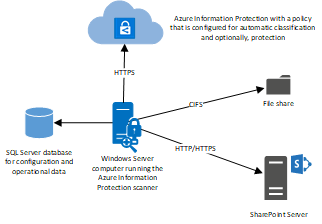
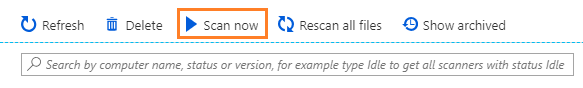
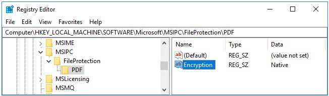
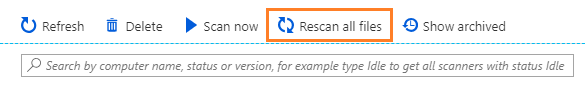

---
# required metadata

title: Deploy the Azure Information Protection scanner
description: Instructions to install, configure, and run the Azure Information Protection scanner to discover, classify, and protect files on data stores.
author: cabailey
ms.author: cabailey
manager: barbkess
ms.date: 02/28/2019
ms.topic: conceptual
ms.collection: M365-security-compliance
ms.service: information-protection
ms.assetid: 20d29079-2fc2-4376-b5dc-380597f65e8a

# optional metadata

#ROBOTS:
#audience:
#ms.devlang:
ms.reviewer: demizets
ms.suite: ems
#ms.tgt_pltfrm:
#ms.custom:

---

# Deploying the Azure Information Protection scanner to automatically classify and protect files

>*Applies to: [Azure Information Protection](https://azure.microsoft.com/pricing/details/information-protection), Windows Server 2016, Windows Server 2012 R2*

> [!NOTE]
> This article is for the current general availability version of the Azure Information Protection scanner.
> 
> If you are looking for deployment instructions for the current preview of the scanner, which includes configuration from the Azure portal, see [Deploying the preview version of the Azure Information Protection scanner to automatically classify and protect files](deploy-aip-scanner-preview.md).

Use this information to learn about the Azure Information Protection scanner, and then how to successfully install, configure, and run it.

This scanner runs as a service on Windows Server and lets you discover, classify, and protect files on the following data stores:

- Local folders on the Windows Server computer that runs the scanner.

- UNC paths for network shares that use the Server Message Block (SMB) protocol.

- Sites and libraries for SharePoint Server 2016 and SharePoint Server 2013. SharePoint 2010 is also supported for customers who have [extended support for this version of SharePoint](https://support.microsoft.com/lifecycle/search?alpha=SharePoint%20Server%202010).

To scan and label files on cloud repositories, use [Cloud App Security](https://docs.microsoft.com/cloud-app-security/) instead of the scanner.

## Overview of the Azure Information Protection scanner

When you have configured your [Azure Information Protection policy](configure-policy.md) for labels that apply automatic classification, files that this scanner discovers can then be labeled. Labels apply classification, and optionally, apply protection or remove protection:



The scanner can inspect any files that Windows can index, by using IFilters that are installed on the computer. Then, to determine if the files need labeling, the scanner uses the Office 365 built-in data loss prevention (DLP) sensitivity information types and pattern detection, or Office 365 regex patterns. Because the scanner uses the Azure Information Protection client, it can classify and protect the same [file types](./rms-client/client-admin-guide-file-types.md).

You can run the scanner in discovery mode only, where you use the reports to check what would happen if the files were labeled. Or, you can run the scanner to automatically apply the labels. You can also run the scanner to discover files that contain sensitive information types, without configuring labels for conditions that apply automatic classification.

Note that the scanner does not discover and label in real time. It systematically crawls through files on data stores that you specify, and you can configure this cycle to run once, or repeatedly.

You can specify which file types to scan, or exclude from scanning. To restrict which files the scanner inspects, define a file types list by using [Set-AIPScannerScannedFileTypes](/powershell/module/azureinformationprotection/Set-AIPScannerScannedFileTypes).


## Prerequisites for the Azure Information Protection scanner
Before you install the Azure Information Protection scanner, make sure that the following requirements are in place.

|Requirement|More information|
|---------------|--------------------|
|Windows Server computer to run the scanner service:<br /><br />- 4 core processors<br /><br />- 8 GB of RAM<br /><br />- 10 GB free space (average) for temporary files|Windows Server 2016 or Windows Server 2012 R2. <br /><br />Note: For testing or evaluation purposes in a non-production environment, you can use a Windows client operating system that is [supported by the Azure Information Protection client](requirements.md#client-devices).<br /><br />This computer can be a physical or virtual computer that has a fast and reliable network connection to the data stores to be scanned.<br /><br /> The scanner requires sufficient disk space to create temporary files for each file that it scans, four files per core. The recommended disk space of 10 GB allows for 4 core processors scanning 16 files that each have a file size of 625 MB. <br /><br />If Internet connectivity is not possible because of your organization policies, see the [Deploying the scanner with alternative configurations](#deploying-the-scanner-with-alternative-configurations) section. Otherwise, make sure that this computer has Internet connectivity that allows the following URLs over HTTPS (port 443):<br /> \*.aadrm.com <br /> \*.azurerms.com<br /> \*.informationprotection.azure.com <br /> informationprotection.hosting.portal.azure.net <br /> \*.aria.microsoft.com|
|Service account to run the scanner service |In addition to running the scanner service on the Windows Server computer, this Windows account authenticates to Azure AD and downloads the Azure Information Protection policy. This account must be an Active Directory account and synchronized to Azure AD. If you cannot synchronize this account because of your organization policies, see the [Deploying the scanner with alternative configurations](#deploying-the-scanner-with-alternative-configurations) section.<br /><br />This service account has the following requirements:<br /><br />- **Log on locally** user right assignment. This right is required for the installation and configuration of the scanner, but not for operation. You must grant this right to the service account but you can remove this right after you have confirmed that the scanner can discover, classify, and protect files. If granting this right even for a short period of time is not possible because of your organization policies, see the [Deploying the scanner with alternative configurations](#deploying-the-scanner-with-alternative-configurations) section.<br /><br />- **Log on as a service** user right assignment. This right is automatically granted to the service account during the scanner installation and this right is required for the installation, configuration, and operation of the scanner. <br /><br />- Permissions to the data repositories: You must grant **Read** and **Write** permissions for scanning the files and then applying classification and protection to the files that meet the conditions in the Azure Information Protection policy. To run the scanner in discovery mode only, **Read** permission is sufficient.<br /><br />- For labels that reprotect or remove protection: To ensure that the scanner always has access to protected files, make this account a [super user](configure-super-users.md) for the Azure Rights Management service, and ensure that the super user feature is enabled. For more information about the account requirements for applying protection, see [Preparing users and groups for Azure Information Protection](prepare.md). In addition, if you have implemented [onboarding controls](activate-service.md#configuring-onboarding-controls-for-a-phased-deployment) for a phased deployment, make sure that this account is included in your onboarding controls you've configured.|
|SQL Server to store the scanner configuration:<br /><br />- Local or remote instance<br /><br />- Sysadmin role to install the scanner|SQL Server 2012 is the minimum version for the following editions:<br /><br />- SQL Server Enterprise<br /><br />- SQL Server Standard<br /><br />- SQL Server Express<br /><br />If you install more than one instance of the scanner, each scanner instance requires its own SQL Server instance.<br /><br />When you install the scanner and your account has the Sysadmin role, the installation process automatically creates the AzInfoProtectionScanner database and grants the required db_owner role to the service account that runs the scanner. If you cannot be granted the Sysadmin role or your organization policies require databases to be created and configured manually, see the [Deploying the scanner with alternative configurations](#deploying-the-scanner-with-alternative-configurations) section.<br /><br />The size of the configuration database will vary for each deployment but we recommend you allocate 500 MB for every 1,000,000 files that you want to scan. |
|The Azure Information Protection client is installed on the Windows Server computer|You must install the full client for the scanner. Do not install the client with just the PowerShell module.<br /><br />For client installation instructions, see the [admin guide](./rms-client/client-admin-guide.md). If you have previously installed the scanner and now need to upgrade it to a later version, see [Upgrading the Azure Information Protection scanner](./rms-client/client-admin-guide.md#upgrading-the-azure-information-protection-scanner).|
|Configured labels that apply automatic classification, and optionally, protection|For more information about how to configure a label for conditions and to apply protection:<br /> - [How to configure conditions for automatic and recommended classification](configure-policy-classification.md)<br /> - [How to configure a label for Rights Management protection](configure-policy-protection.md) <br /><br />Tip: You can use the instructions from the [tutorial](infoprotect-quick-start-tutorial.md) to test the scanner with a label that looks for credit card numbers in a prepared Word document. However, you will need to change the label configuration so that **Select how this label is applied** is set to **Automatic** rather than **Recommended**. Then remove the label from the document (if it is applied) and copy the file to a data repository for the scanner. For quick testing, this could be a local folder on the scanner computer.<br /><br /> Although you can run the scanner even if you haven't configured labels that apply automatic classification, this scenario is not covered with these instructions. [More information](#using-the-scanner-with-alternative-configurations)|
|For SharePoint sites and libraries to be scanned:<br /><br />- SharePoint 2016<br /><br />- SharePoint 2013<br /><br />- SharePoint 2010|Other versions of SharePoint are not supported for the scanner.<br /><br />For large SharePoint farms, check whether you need to increase the list view threshold (by default, 5,000) for the scanner to access all files. For more information, see the following SharePoint documentation: [Manage large lists and libraries in SharePoint](https://support.office.com/article/manage-large-lists-and-libraries-in-sharepoint-b8588dae-9387-48c2-9248-c24122f07c59#__bkmkchangelimit&ID0EAABAAA=Server)|
|For Office documents to be scanned:<br /><br />- 97-2003 file formats and Office Open XML formats for Word, Excel, and PowerPoint|For more information about the file types that the scanner supports for these file formats, see [File types supported by the Azure Information Protection client](./rms-client/client-admin-guide-file-types.md)|
|For long paths:<br /><br />- Maximum of 260 characters, unless the scanner is installed on Windows 2016 and the computer is configured to support long paths|Windows 10 and Windows Server 2016 support path lengths greater than 260 characters with the following [group policy setting](https://blogs.msdn.microsoft.com/jeremykuhne/2016/07/30/net-4-6-2-and-long-paths-on-windows-10/): **Local Computer Policy** > **Computer Configuration** > **Administrative Templates** > **All Settings** > **NTFS** > **Enable Win32 long paths**<br /><br /> For more information about supporting long file paths, see the [Maximum Path Length Limitation](https://docs.microsoft.com/windows/desktop/FileIO/naming-a-file#maximum-path-length-limitation) section from the Windows 10 developer documentation.

If you can't meet all the requirements in the table because they are prohibited by your organization policies, see the next section for alternatives.

If all the requirements are met, go straight to the [installation section](#install-the-scanner).

### Deploying the scanner with alternative configurations

The prerequisites listed in the table are the default requirements for the scanner and recommended because they are the simplest configuration for the scanner deployment. They should be suitable for initial testing, so that you can check the capabilities of the scanner. However, in a product environment, your organization policies might prohibit these default requirements because of one or more of the following restrictions:

- Servers are not allowed Internet connectivity

- You cannot be granted Sysadmin or databases must be created and configured manually

- Service accounts cannot be granted the **Log on locally** right

- Service accounts cannot be synchronized to Azure Active Directory but servers have Internet connectivity

The scanner can accommodate these restrictions but they require additional configuration.


#### Restriction: The scanner server cannot have Internet connectivity

Follow the instructions for a [disconnected computer](./rms-client/client-admin-guide-customizations.md#support-for-disconnected-computers). 

Note that in this configuration, the scanner cannot apply protection (or remove protection) by using your organization's cloud-based key. Instead, the scanner is limited to using labels that apply classification only, or protection that uses [HYOK](configure-adrms-restrictions.md). 

#### Restriction: You cannot be granted Sysadmin or databases must be created and configured manually

If you can be granted the Sysadmin role temporarily to install the scanner, you can remove this role when the scanner installation is complete. When you use this configuration, the database is automatically created for you and the service account for the scanner is automatically granted the required permissions. However, the user account that configures the scanner requires the db_owner role for the AzInfoProtectionScanner database, and you must manually grant this role to the user account.

If you cannot be granted the Sysadmin role even temporarily, you must manually create a database named AzInfoProtectionScanner before you install the scanner. When you use this configuration, assign the following roles:
    
|Account|Database-level role|
|--------------------------------|---------------------|
|Service account for the scanner|db_owner|
|User account for scanner installation|db_owner|
|User account for scanner configuration |db_owner|

Typically, you will use the same user account to install and configure the scanner. But if you use different accounts, they both require the db_owner role for the AzInfoProtectionScanner database.

#### Restriction: The service account for the scanner cannot be granted the **Log on locally** right

If your organization policies prohibit the **Log on locally** right for service accounts but allow the **Log on as a batch job** right, follow the instructions for  [Specify and use the Token parameter for Set-AIPAuthentication](./rms-client/client-admin-guide-powershell.md#specify-and-use-the-token-parameter-for-set-aipauthentication) from the admin guide.

#### Restriction: The scanner service account cannot be synchronized to Azure Active Directory but the server has Internet connectivity

You can have one account to run the scanner service and use another account to authenticate to Azure Active Directory:

- For the scanner service account, you can use a local Windows account or an Active Directory account.

- For the Azure Active Directory account, follow the instructions for [Specify and use the Token parameter for Set-AIPAuthentication](./rms-client/client-admin-guide-powershell.md#specify-and-use-the-token-parameter-for-set-aipauthentication) from the admin guide.


## Install the scanner

1. Sign in to the Windows Server computer that will run the scanner. Use an account that has local administrator rights and that has permissions to write to the SQL Server master database.

2. Open a Windows PowerShell session with the **Run as an administrator** option.

3. Run the [Install-AIPScanner](/powershell/module/azureinformationprotection/Install-AIPScanner) cmdlet, specifying your SQL Server instance on which to create a database for the Azure Information Protection scanner: 
    
    ```
    Install-AIPScanner -SqlServerInstance <name>
    ```
    
    Examples:
    
    For a default instance: `Install-AIPScanner -SqlServerInstance SQLSERVER1`
    
    For a named instance: `Install-AIPScanner -SqlServerInstance SQLSERVER1\AIPSCANNER`
    
    For SQL Server Express: `Install-AIPScanner -SqlServerInstance SQLSERVER1\SQLEXPRESS`
    
    Use the online help for this cmdlet if you need more [detailed examples](/powershell/module/azureinformationprotection/install-aipscanner#examples).
    
    When you are prompted, provide the credentials for the scanner service account (\<domain\user name>) and password.

4. Verify that the service is now installed by using **Administrative Tools** > **Services**. 
    
    The installed service is named **Azure Information Protection Scanner** and is configured to run by using the scanner service account that you created.

Now that you have installed the scanner, you need to get an Azure AD token for the scanner service account to authenticate so that it can run unattended. 

## Get an Azure AD token for the scanner

The Azure AD token lets the scanner service account authenticate to the Azure Information Protection service.

1. From the same Windows Server computer, or from your desktop, sign in to the Azure portal to create two Azure AD applications that are needed to specify an access token for authentication. After an initial interactive sign-in, this token lets the scanner run non-interactively.
    
    To create these applications, follow the instructions in [How to label files non-interactively for Azure Information Protection](./rms-client/client-admin-guide-powershell.md#how-to-label-files-non-interactively-for-azure-information-protection) from the admin guide.

2. From the Windows Server computer, if your scanner service account has been granted the **Log on locally** right for the installation: Sign in with this account and start a PowerShell session. Run [Set-AIPAuthentication](/powershell/module/azureinformationprotection/set-aipauthentication), specifying the values that you copied from the previous step:
    
    ```
    Set-AIPAuthentication -webAppId <ID of the "Web app / API" application> -webAppKey <key value generated in the "Web app / API" application> -nativeAppId <ID of the "Native" application>
    ```
    
    When prompted, specify the password for your service account credentials for Azure AD, and then click **Accept**.
    
    If your scanner service account cannot be granted the **Log on locally** right for the installation: Follow the instructions in the [Specify and use the Token parameter for Set-AIPAuthentication](./rms-client/client-admin-guide-powershell.md#specify-and-use-the-token-parameter-for-set-aipauthentication) section from the admin guide. 

The scanner now has a token to authenticate to Azure AD, which is valid for one year, two years, or never expires, according to your configuration of the **Web app /API** in Azure AD. When the token expires, you must repeat steps 1 and 2.

You're now ready to specify the data stores to scan. 

## Specify data stores for the scanner

Use the [Add-AIPScannerRepository](/powershell/module/azureinformationprotection/Add-AIPScannerRepository) cmdlet to specify the data stores to be scanned by the Azure Information Protection scanner. You can specify local folders, UNC paths, and SharePoint Server URLs for SharePoint sites and libraries. 

Supported versions for SharePoint: SharePoint Server 2016 and SharePoint Server 2013. SharePoint Server 2010 is also supported for customers who have [extended support for this version of SharePoint](https://support.microsoft.com/lifecycle/search?alpha=SharePoint%20Server%202010).

1. From the same Windows Server computer, in your PowerShell session, add your first data store by running the following command:
    
    	Add-AIPScannerRepository -Path <path>
    
    For example: `Add-AIPScannerRepository -Path \\NAS\Documents`
    
    For other examples, see the [online help](/powershell/module/azureinformationprotection/Add-AIPScannerRepository#examples) for this cmdlet.

2. Repeat this command for all the data stores that you want to scan. If you need to remove a data store that you added, use the [Remove-AIPScannerRepository](/powershell/module/azureinformationprotection/Remove-AIPScannerRepository) cmdlet.

3. Confirm that you have specified all the data stores correctly, by running the [Get-AIPScannerRepository](/powershell/module/azureinformationprotection/Get-AIPScannerRepository) cmdlet:
    
    	Get-AIPScannerRepository

With the scanner's default configuration, you're now ready to run your first scan in discovery mode.

## Run a discovery cycle and view reports for the scanner

1. In your PowerShell session, start the scanner by running the following command:
    
        Start-AIPScan
    
    Alternatively, you can start the scanner from the Azure portal. From the **Azure Information Protection - Nodes** blade, select your scanner node, and then the **Scan now** option:
    
    

2. Wait for the scanner to complete its cycle by running the following command:
    
    	Get-AIPScannerStatus
    
    Alternatively, you can view the status from the **Azure Information Protection - Nodes** blade in the Azure portal, by checking the **STATUS** column.
    
    Look for the status to show **Idle** rather than **Scanning**.
    
    When the scanner has crawled through all the files in the data stores that you specified, the scanner stops although the scanner service remains running.
    
    Check the local Windows **Applications and Services** event log, **Azure Information Protection**. This log also reports when the scanner has finished scanning, with a summary of results. Look for the informational event ID **911**.

3. Review the reports that are stored in %*localappdata*%\Microsoft\MSIP\Scanner\Reports. The .txt summary files include the time taken to scan, the number of scanned files, and how many files had a match for the information types. The .csv files have more details for each file. This folder stores up to 60 reports for each scanning cycle and all but the latest report is compressed to help minimize the required disk space.
    
    > [!NOTE]
    > You can change the level of logging by using the *ReportLevel* parameter with [Set-AIPScannerConfiguration](/powershell/module/azureinformationprotection/set-aipscannerconfiguration), but you can't change the report folder location or name. Consider using a directory junction for the folder if you want to store the reports on a different volume or partition.
    >
    > For example, using the [Mklink](/windows-server/administration/windows-commands/mklink) command: `mklink /j D:\Scanner_reports C:\Users\aipscannersvc\AppData\Local\Microsoft\MSIP\Scanner\Reports`
    
    With the default setting, only files that meet the conditions you've configured for automatic classification are included in the detailed reports. If you don't see any labels applied in these reports, check your label configuration includes automatic rather than recommended classification.
    
    > [!TIP]
    > Scanners send this information to Azure Information Protection every five minutes, so that you can view the results in near real-time from the Azure portal. For more information, see [Reporting for Azure Information Protection](reports-aip.md). 
        
    If the results are not as you expect, you might need to fine-tune the conditions that you specified in your Azure Information Protection policy. If that's the case, repeat steps 1 through 3 until you are ready to change the configuration to apply the classification and optionally, protection. 

The Azure portal displays information about the last scan only. If you need to see the results of previous scans, return to the reports that are stored on the scanner computer, in the %*localappdata*%\Microsoft\MSIP\Scanner\Reports folder.

When you're ready to automatically label the files that the scanner discovers, continue to the next procedure. 

## Configure the scanner to apply classification and protection

In its default setting, the scanner runs one time and in the reporting-only mode. To change these settings, run the [Set-AIPScannerConfiguration](/powershell/module/azureinformationprotection/Set-AIPScannerConfiguration) cmdlet.

1. On the Windows Server computer, in the PowerShell session, run the following command:
    
    	Set-AIPScannerConfiguration -Enforce On -Schedule Always
    
    There are other configuration settings that you might want to change. For example, whether file attributes are changed and what is logged in the reports. In addition, if your Azure Information Protection policy includes the setting that requires a justification message to lower the classification level or remove protection, specify that message by using this cmdlet. Use the [online help](/powershell/module/azureinformationprotection/Set-AIPScannerConfiguration#optional-parameters) for more information about each configuration setting. 

2. Make a note of the current time and start the scanner again by running the following command:
    
        Start-AIPScan
    
    Alternatively, you can start the scanner from the Azure portal. From the **Azure Information Protection - Nodes** blade, select your scanner node, and then the **Scan now** option:
    
    

3. Monitor the event log for the informational type **911** again, with a time stamp later than when you started the scan in the previous step. 
    
    Then check the reports to see details of which files were labeled, what classification was applied to each file, and whether protection was applied to them. Or, use the Azure portal to more easily see this information.

Because we configured the schedule to run continuously, when the scanner has worked its way through all the files, it starts a new cycle so that any new and changed files are discovered.


## How files are scanned

The scanner runs through the following processes when it scans files.

### 1. Determine whether files are included or excluded for scanning 
The scanner automatically skips files that are [excluded from classification and protection](./rms-client/client-admin-guide-file-types.md#file-types-that-are-excluded-from-classification-and-protection), such as executable files and system files.

You can change this behavior by defining a list of file types to scan, or exclude from scanning. When you specify this list and do not specify a data repository, the list applies to all data repositories that do not have their own list specified. To specify this list, use [Set-AIPScannerScannedFileTypes](/powershell/module/azureinformationprotection/Set-AIPScannerScannedFileTypes). 

After you have specified your file types list, you can add a new file type to the list by using [Add-AIPScannerScannedFileTypes](/powershell/module/azureinformationprotection/Add-AIPScannerScannedFileTypes), and remove a file type from the list by using [Remove-AIPScannerScannedFileTypes](/powershell/module/azureinformationprotection/Remove-AIPScannerScannedFileTypes).

### 2. Inspect and label files

The scanner then uses filters to scan supported file types. These same filters are used by the operating system for Windows Search and indexing. Without any additional configuration, Windows IFilter is used to scan file types that are used by Word, Excel, PowerPoint, and for PDF documents and text files.

For a full list of file types that are supported by default, and additional information how to configure existing filters that include .zip files and .tiff files, see [File types supported for inspection](./rms-client/client-admin-guide-file-types.md#file-types-supported-for-inspection).

After inspection, these file types can be labeled by using the conditions that you specified for your labels. Or, if you're using discovery mode, these files can be reported to contain the conditions that you specified for your labels, or all known sensitive information types. 

However, the scanner cannot label the files under the following circumstances:

- If the label applies classification and not protection, and the file type does not [support classification only](./rms-client/client-admin-guide-file-types.md#file-types-supported-for-classification-only).

- If the label applies classification and protection, but the scanner does not protect the file type.
    
    By default, the scanner protects only Office file types, and PDF files when they are protected by using the ISO standard for PDF encryption. Other file types can be protected when you [edit the registry](#editing-the-registry-for-the-scanner) as described in a following section.

For example, after inspecting files that have a file name extension of .txt, the scanner can't apply a label that's configured for classification but not protection, because the .txt file type doesn't support classification-only. If the label is configured for classification and protection, and the registry is edited for the .txt file type, the scanner can label the file. 

> [!TIP]
> During this process, if the scanner stops and doesn't complete scanning a large number of the files in a repository:
> 
> - You might need to increase the number of dynamic ports for the operating system hosting the files. Server hardening for SharePoint can be one reason why the scanner exceeds the number of allowed network connections, and therefore stops.
>     
>     To check whether this is the cause of the scanner stopping, look to see if the following error message is logged for the scanner in %*localappdata*%\Microsoft\MSIP\Logs\MSIPScanner.iplog (zipped if there are multiple logs): **Unable to connect to the remote server ---> System.Net.Sockets.SocketException: Only one usage of each socket address (protocol/network address/port) is normally permitted IP:port**
>    
>     For more information about how to view the current port range and increase the range, see [Settings that can be Modified to Improve Network Performance](https://docs.microsoft.com/biztalk/technical-guides/settings-that-can-be-modified-to-improve-network-performance).
> 
> - For large SharePoint farms, you might need to increase the list view threshold (by default, 5,000). For more information, see the following SharePoint documentation: [Manage large lists and libraries in SharePoint](https://support.office.com/article/manage-large-lists-and-libraries-in-sharepoint-b8588dae-9387-48c2-9248-c24122f07c59#__bkmkchangelimit&ID0EAABAAA=Server).

### 3. Label files that can't be inspected
For the file types that can't be inspected, the scanner applies the default label in the Azure Information Protection policy, or the default label that you configure for the scanner.

As in the preceding step, the scanner cannot label the files under the following circumstances:

- If the label applies classification and not protection, and the file type does not [support classification only](./rms-client/client-admin-guide-file-types.md#file-types-supported-for-classification-only).

- If the label applies classification and protection, but the scanner does not protect the file type.
    
    By default, the scanner protects only Office file types, and PDF files when they are protected by using the ISO standard for PDF encryption. Other file types can be protected when you [edit the registry](#editing-the-registry-for-the-scanner) as described next.


### Editing the registry for the scanner

To change the default scanner behavior for protecting file types other than Office files and PDFs, you must manually edit the registry and specify the additional file types that you want to be protected, and the type of protection (native or generic). For instructions, see [File API configuration](develop/file-api-configuration.md) from the developer guidance. In this documentation for developers, generic protection is referred to as "PFile". In addition, specific for the scanner:

- The scanner has its own default behavior: Only Office file formats and PDF documents are protected by default. If the registry is not modified, any other file types will not be labeled or protected by the scanner.

- If you want the same default protection behavior of the Azure Information Protection client, where all files are automatically protected with native or generic protection: Specify the `*` wildcard as a registry key, and `Default` as the value data.

When you edit the registry, manually create the **MSIPC** key and **FileProtection** key if they do not exist, as well as a key for each file name extension.

For example, for the scanner to protect TIFF images in addition to Office files and PDFs, the registry after you have edited it, will look like the following picture. As an image file, TIFF files support native protection and the resulting file name extension is .ptiff.



For a list of text and images file types that similarly support native protection but must be specified in the registry, see [Supported file types for classification and protection](./rms-client/client-admin-guide-file-types.md#file-types-supported-for-protection) from the admin guide.

For files that don't support native protection, specify the file name extension as a new key, and **PFile** for generic protection. The resulting file name extension for the protected file is .pfile.


## When files are rescanned

For the first scan cycle, the scanner inspects all files in the configured data stores and then for subsequent scans, only new or modified files are inspected. 

You can force the scanner to inspect all files again by running [Start-AIPScan](/powershell/module/azureinformationprotection/Start-AIPScan) with the `-Reset` parameter. The scanner must be configured for a manual schedule, which requires the `-Schedule` parameter to be set to **Manual** with [Set-AIPScannerConfiguration](/powershell/module/azureinformationprotection/Set-AIPScannerConfiguration).

Alternatively, you can force the scanner to inspect all files again from the **Azure Information Protection - Nodes** blade in the Azure portal. Select your scanner from the list, and then select the **Rescan all files** option:



Inspecting all files again is useful when you want the reports to include all files and this configuration choice is typically used when the scanner runs in discovery mode. When a full scan is complete, the scan type automatically changes to incremental so that for subsequent scans, only new or modified files are scanned.

In addition, all files are inspected when the scanner downloads an Azure Information Protection policy that has new or changed conditions. The scanner refreshes the policy every hour, and when the service starts and the policy is older than one hour.  

> [!TIP]
> If you need to refresh the policy sooner than this one hour interval, for example, during a testing period: Manually delete the policy file, **Policy.msip** from both **%LocalAppData%\Microsoft\MSIP\Policy.msip** and **%LocalAppData%\Microsoft\MSIP\Scanner**. Then restart the Azure Information Scanner service.
> 
> If you changed protection settings in the policy, also wait 15 minutes from when you saved the protection settings before you restart the service.

If the scanner downloaded a policy that had no automatic conditions configured, the copy of the policy file in the scanner folder does not update. In this scenario, you must delete the policy file, **Policy.msip** from both **%LocalAppData%\Microsoft\MSIP\Policy.msip** and **%LocalAppData%\Microsoft\MSIP\Scanner** before the scanner can use a newly downloaded policy file that has labels correctly figured for automatic conditions.

## Using the scanner with alternative configurations

There are two alternative scenarios that the Azure Information Protection scanner supports where labels do not need to be configured for any conditions: 
- Apply a default label to all files in a data repository.
    
    For this configuration, use the [Set-AIPScannerRepository](/powershell/module/azureinformationprotection/Set-AIPScannerRepository) cmdlet, and set the *MatchPolicy* parameter to **Off**. 
    
    The contents of the files are not inspected and all files in the data repository are labeled according to the default label that you specify for the data repository (with the *SetDefaultLabel* parameter) or if this is not specify, the default label that is specified as a policy setting for the scanner account.
    

- Identify all custom conditions and known sensitive information types.
    
    For this configuration, use the [Set-AIPScannerConfiguration](/powershell/module/azureinformationprotection/Set-AIPScannerConfiguration) cmdlet, and set the *DiscoverInformationTypes* parameter to **All**.
    
    The scanner uses any custom conditions that you have specified for labels in the Azure Information Protection policy, and the list of information types that are available to specify for labels in the Azure Information Protection policy.
    
    The following quickstart uses this configuration: [Quickstart: Find what sensitive information you have](quickstart-findsensitiveinfo.md).

## Optimizing the performance of the scanner

Use the following guidance to help you optimize the performance of the scanner. However, if your priority is the responsiveness of the scanner computer rather than the scanner performance, you can use an advanced client setting to [limit the number of threads used by the scanner](#limit-the-number-of-threads-used-by-the-scanner).

To maximize the scanner performance:

- **Have a high speed and reliable network connection between the scanner computer and the scanned data store**
    
    For example, place the scanner computer in the same LAN, or (preferred) in the same network segment as the scanned data store.
    
    The quality of the network connection affects the scanner performance because to inspect the files, the scanner transfers the contents of the files to the computer running the scanner service. When you reduce (or eliminate) the number of network hops this data has to travel, you also reduce the load on your network. 

- **Make sure the scanner computer has available processor resources**
    
    Inspecting the file contents for a match against your configured conditions, and encrypting and decrypting files are processor-intensive actions. Monitor typical scanning cycles for your specified data stores to identify whether a lack of processor resources is negatively affecting the scanner performance.
    
- **Do not scan local folders on the computer running the scanner service**
    
    If you have folders to scan on a Windows server, install the scanner on a different computer and configure those folders as network shares to scan. Separating the two functions of hosting files and scanning files means that the computing resources for these services are not competing with one another.

If necessary, install multiple instances of the scanner. Each scanner instance requires its own configuration database in a different SQL Server instance.

Other factors that affect the scanner performance:

- The current load and response times of the data stores that contain the files to scan

- Whether the scanner runs in discovery mode or enforce mode
    
    Discovery mode typically has a higher scanning rate than enforce mode because discovery requires a single file read action, whereas enforce mode requires read and write actions.

- You change the conditions in the Azure Information Protection
    
    Your first scan cycle when the scanner must inspect every file will obviously take longer than subsequent scan cycles that by default, inspect only new and changed files. However, if you change the conditions in the Azure Information Protection policy, all files are scanned again, as described in the [preceding section](#when-files-are-rescanned).

- Your chosen logging level
    
    You can choose between **Debug**, **Info**, **Error** and **Off** for the scanner reports. **Off** results in the best performance; **Debug** considerably slows down the scanner and should be used only for troubleshooting. For more information, see the *ReportLevel* parameter for the [Set-AIPScannerConfiguration](/powershell/module/azureinformationprotection/Set-AIPScannerConfiguration) cmdlet.

- The files themselves:
    
    - Office files are more quickly scanned than PDF files.
    
    - Unprotected files are quicker to scan than protected files.
    
    - Large files obviously take longer to scan than small files.

- Additionally:
    
    - Confirm that the service account that runs the scanner has only the rights documented in the [scanner prerequisites](#prerequisites-for-the-azure-information-protection-scanner) section, and then configure the [advanced client property](./rms-client/client-admin-guide-customizations.md#disable-the-low-integrity-level-for-the-scanner) to disable the low integrity level for the scanner.
    
    - The scanner runs more quickly when you use the [alternative configuration](#using-the-scanner-with-alternative-configurations) to apply a default label to all files because the scanner does not inspect the file contents.
    
    - The scanner runs more slowly when you use the [alternative configuration](#using-the-scanner-with-alternative-configurations) to identify all custom conditions and known sensitive information types.
    

## List of cmdlets for the scanner 

Other cmdlets for the scanner let you change the service account and database for the scanner, get the current settings for the scanner, and uninstall the scanner service. The scanner uses the following cmdlets:

- [Add-AIPScannerScannedFileTypes](/powershell/module/azureinformationprotection/Add-AIPScannerScannedFileTypes)

- [Add-AIPScannerRepository](/powershell/module/azureinformationprotection/Add-AIPScannerRepository)

- [Get-AIPScannerConfiguration](/powershell/module/azureinformationprotection/Get-AIPScannerConfiguration)

- [Get-AIPScannerRepository](/powershell/module/azureinformationprotection/Get-AIPScannerRepository)

- [Get-AIPScannerStatus](/powershell/module/azureinformationprotection/Get-AIPScannerStatus)

- [Install-AIPScanner](/powershell/module/azureinformationprotection/Install-AIPScanner)

- [Remove-AIPScannerRepository](/powershell/module/azureinformationprotection/Remove-AIPScannerRepository)

- [Remove-AIPScannerScannedFileTypes](/powershell/module/azureinformationprotection/Remove-AIPScannerScannedFileTypes)

- [Set-AIPScanner](/powershell/module/azureinformationprotection/Set-AIPScanner)

- [Set-AIPScannerConfiguration](/powershell/module/azureinformationprotection/Set-AIPScannerConfiguration)

- [Set-AIPScannerScannedFileTypes](/powershell/module/azureinformationprotection/Set-AIPScannerScannedFileTypes)

- [Set-AIPScannerRepository](/powershell/module/azureinformationprotection/Set-AIPScannerRepository)

- [Start-AIPScan](/powershell/module/azureinformationprotection/Start-AIPScan)

- [Uninstall-AIPScanner](/powershell/module/azureinformationprotection/Uninstall-AIPScanner)

- [Update-AIPScanner](/powershell/module/azureinformationprotection/Update-AIPScanner)


## Event log IDs and descriptions for the scanner

Use the following sections to identify the possible event IDs and descriptions for the scanner. These events are logged on the server that runs the scanner service, in the Windows **Applications and Services** event log, **Azure Information Protection**.

-----

Information **910**

**Scanner cycle started.**

This event is logged when the scanner service is started and begins to scan for files in the data repositories that you specified.

----

Information **911**

**Scanner cycle finished.**

This event is logged when the scanner has finished a manual scan, or the scanner has finished a cycle for a continuous schedule.

If the scanner was configured to run manually rather than continuously, to run a new scan, use the [Start-AIPScan](/powershell/module/azureinformationprotection/Start-AIPScan) cmdlet. To change the schedule, use the [Set-AIPScannerConfiguration](/powershell/module/azureinformationprotection/Set-AIPScannerConfiguration) cmdlet and the **Schedule** parameter.

----

## Next steps

Interested in how the Core Services Engineering and Operations team in Microsoft implemented this scanner?  Read the technical case study: [Automating data protection with Azure Information Protection scanner](https://www.microsoft.com/itshowcase/Article/Content/1070/Automating-data-protection-with-Azure-Information-Protection-scanner).

You might be wondering: [What’s the difference between Windows Server FCI and the Azure Information Protection scanner?](faqs.md#whats-the-difference-between-windows-server-fci-and-the-azure-information-protection-scanner)

You can also use PowerShell to interactively classify and protect files from your desktop computer. For more information about this and other scenarios that use PowerShell, see [Using PowerShell with the Azure Information Protection client](./rms-client/client-admin-guide-powershell.md).


