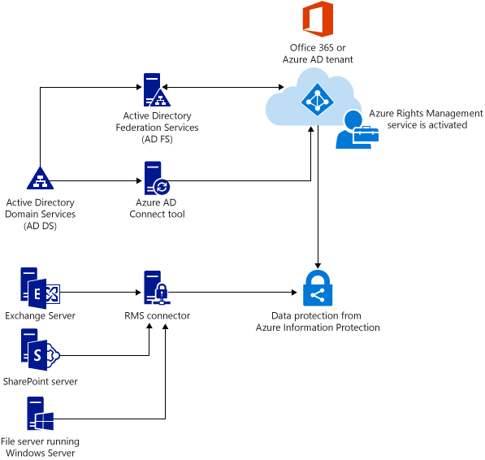

---
# required metadata

title: Deploy the Rights Management connector - AIP
description: Instructions to deploy the RMS connector, which provides the data protection service for existing on-premises deployments that use Exchange Server, SharePoint Server, or Windows Server and File Classification Infrastructure (FCI).
author: cabailey
ms.author: cabailey
manager: barbkess
ms.date: 06/18/2019
ms.topic: conceptual
ms.collection: M365-security-compliance
ms.service: information-protection
ms.assetid: 90e7e33f-9ecc-497b-89c5-09205ffc5066

# optional metadata

#ROBOTS:
#audience:
#ms.devlang:
ms.reviewer: esaggese
ms.suite: ems
#ms.tgt_pltfrm:
#ms.custom:

---

# Deploying the Azure Rights Management connector

>*Applies to: [Azure Information Protection](https://azure.microsoft.com/pricing/details/information-protection), Windows Server 2016, Windows Server 2012 R2, Windows Server 2012, Windows Server 2008 R2*

Use this information to learn about the Azure Rights Management connector, and then how to successfully deploy it for your organization. This connector provides data protection for existing on-premises deployments that use Microsoft **Exchange Server**, **SharePoint Server**, or file servers that run Windows Server and **File Classification Infrastructure** (FCI).

## Overview of the Microsoft Rights Management connector
The Microsoft Rights Management (RMS) connector lets you quickly enable existing on-premises servers to use their Information Rights Management (IRM) functionality with the cloud-based Microsoft Rights Management service (Azure RMS). With this functionality, IT and users can easily protect documents and pictures both inside your organization and outside, without having to install additional infrastructure or establish trust relationships with other organizations. 

The RMS connector is a small-footprint service that you install on-premises, on servers that run Windows Server 2016, Windows Server 2012 R2, Windows Server 2012, or Windows Server 2008 R2. In addition to running the connector on physical computers, you can also run it on virtual machines, including Azure IaaS VMs. After you deploy the connector, it acts as a communications interface (a relay) between the on-premises servers and the cloud service, as shown in the following picture. The arrows indicate the direction in which network connections are initiated.

### On-premises servers supported

The RMS connector supports the following on-premises servers: Exchange Server, SharePoint Server, and file servers that run Windows Server and use File Classification Infrastructure to classify and apply policies to Office documents in a folder. 

> [!NOTE]
> If you want to protect multiple file types (not just Office documents) by using File Classification Infrastructure, do not use the RMS connector, but instead, use the [AzureInformationProtection cmdlets](/powershell/azureinformationprotection/vlatest/aip).

For the versions of these on-premises servers that are supported by the RMS connector, see [On-premises servers that support Azure RMS](requirements-servers.md).

### Support for hybrid scenarios

You can use the RMS connector even if some of your users are connecting to online services, in a hybrid scenario. For example, some users' mailboxes use Exchange Online and some users' mailboxes use Exchange Server. After you install the RMS connector, all users can protect and consume emails and attachments by using Azure RMS, and information protection works seamlessly between the two deployment configurations.

### Support for customer-managed keys (BYOK)

If you manage your own tenant key for Azure RMS (the bring your own key, or BYOK scenario), the RMS connector and the on-premises servers that use it do not access the hardware security module (HSM) that contains your tenant key. This is because all cryptographic operations that use the tenant key are performed in Azure RMS, and not on-premises.

If you want to learn more about this scenario where you manage your tenant key, see [Planning and implementing your Azure Information Protection tenant key](plan-implement-tenant-key.md).

## Prerequisites for the RMS connector
Before you install the RMS connector, make sure that the following requirements are in place.

|Requirement|More information|
|---------------|--------------------|
|The protection service is activated|[Activating the protection service from Azure Information Protection](activate-service.md)|
|Directory synchronization between your on-premises Active Directory forests and Azure Active Directory|After RMS is activated, Azure Active Directory must be configured to work with the users and groups in your Active Directory database.  **Important**: You must do this directory synchronization step for the RMS connector to work, even for a test network. Although you can use Office 365 and Azure Active Directory by using accounts that you manually create in Azure Active Directory, this connector requires that the accounts in Azure Active Directory are synchronized with Active Directory Domain Services; manual password synchronization is not sufficient.  For more information, see the following resources:  - [Integrate on-premises Active Directory domains with Azure Active Directory](/azure/architecture/reference-architectures/identity/azure-ad)  - [Hybrid Identity directory integration tools comparison](/azure/active-directory/hybrid/plan-hybrid-identity-design-considerations-tools-comparison)|
>>>>>>> 21fb8f96d0840bf739c4c1f5e27914471d7a0916
|A minimum of two member computers on which to install the RMS connector:  - A 64-bit physical or virtual computer running one of the following operating systems:  Windows Server 2016, Windows Server 2012 R2,  Windows Server 2012, or Windows Server 2008 R2.  - At least 1 GB of RAM.  - A minimum of 64 GB of disk space.  - At least one network interface.  - Access to the Internet via a firewall (or web proxy) that does not require authentication.  - Must be in a forest or domain that trusts other forests in the organization that contain installations of Exchange or SharePoint servers that you want to use with the RMS connector.|For fault tolerance and high availability, you must install the RMS connector on a minimum of two computers.  **Tip**: If you are using Outlook Web Access or mobile devices that use Exchange ActiveSync IRM and it is critical that you maintain access to emails and attachments that are protected by Azure RMS, we recommend that you deploy a load-balanced group of connector servers to ensure high availability.  You do not need dedicated servers to run the connector but you must install it on a separate computer from the servers that will use the connector.  **Important**: Do not install the connector on a computer that runs Exchange Server, SharePoint Server, or a file server that is configured for file classification infrastructure if you want to use the functionality from these services with Azure RMS. Also, do not install this connector on a domain controller.  If you have server workloads that you want to use with the RMS connector but their servers are in domains that are not trusted by the domain from which you want to run the connector, you can install additional RMS connector servers in these untrusted domains or other domains in their forest.   There is no limit to the number of connector servers that you can run for your organization and all connector servers installed in an organization share the same configuration. However, to configure the connector to authorize servers, you must be able to browse for the server or service accounts you want to authorize, which means that you must run the RMS administration tool in a forest from which you can browse those accounts.|

## Steps to deploy the RMS connector

The connector does not automatically check all the [prerequisites](deploy-rms-connector.md#prerequisites-for-the-rms-connector) that it needs for a successful deployment, so make sure that these are in place before you start. The deployment requires you to install the connector, configure the connector, and then configure the servers that you want to use the connector. 

-   **Step 1:**  [Installing the RMS connector](install-configure-rms-connector.md#installing-the-rms-connector)

-   **Step 2:**  [Entering credentials](install-configure-rms-connector.md#entering-credentials)

-   **Step 3:**  [Authorizing servers to use the RMS connector](install-configure-rms-connector.md#authorizing-servers-to-use-the-rms-connector)

-   **Step 4:**  [Configuring load balancing and high availability](install-configure-rms-connector.md#configuring-load-balancing-and-high-availability)

-   Optional: [Configuring the RMS connector to use HTTPS](install-configure-rms-connector.md#configuring-the-rms-connector-to-use-https)

-   Optional: [Configuring the RMS connector for a web proxy server](install-configure-rms-connector.md#configuring-the-rms-connector-for-a-web-proxy-server)

-   Optional: [Installing the RMS connector administration tool on administrative computers](install-configure-rms-connector.md#installing-the-rms-connector-administration-tool-on-administrative-computers)

-   **Step 5:**  [Configuring servers to use the RMS connector](configure-servers-rms-connector.md)

    -   [Configuring an Exchange server to use the connector](configure-servers-rms-connector.md#configuring-an-exchange-server-to-use-the-connector)

    -   [Configuring a SharePoint server to use the connector](configure-servers-rms-connector.md#configuring-a-sharepoint-server-to-use-the-connector)

    -   [Configuring a file server for File Classification Infrastructure to use the connector](configure-servers-rms-connector.md#configuring-a-file-server-for-file-classification-infrastructure-to-use-the-connector)

## Next steps

Go to Step 1: [Installing and configuring the Azure Rights Management connector](install-configure-rms-connector.md).
