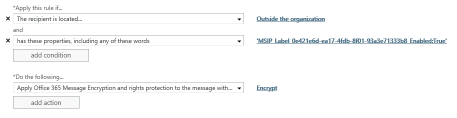

---
# required metadata

title: Configure Exchange Online mail flow rules for Azure Information Protection labels
description: Instructions and examples to configure Exchange Online mail flow rules for Azure Information Protection labels.
author: cabailey
ms.author: cabailey
manager: mbaldwin
ms.date: 06/25/2018
ms.topic: article
ms.prod:
ms.service: information-protection
ms.technology: techgroup-identity
ms.assetid: ba4e4a4d-5280-4e97-8f5c-303907db1bf5

# optional metadata

#ROBOTS:
#audience:
#ms.devlang:
ms.reviewer: shakella
ms.suite: ems
#ms.tgt_pltfrm:
#ms.custom:

---

# Configuring Exchange Online mail flow rules for Azure Information Protection labels

>*Applies to: [Azure Information Protection](https://azure.microsoft.com/pricing/details/information-protection), [Office 365](http://download.microsoft.com/download/E/C/F/ECF42E71-4EC0-48FF-AA00-577AC14D5B5C/Azure_Information_Protection_licensing_datasheet_EN-US.pdf)*

Use the following information to help you configure mail flow rules in Exchange Online to use Azure Information Protection labels, and to apply additional protection for specific scenarios. For example:

- Your default label is **General**, which does not apply protection. For emails with this label that are sent externally, apply the additional Do Not Forward protection action.

- If an attachment with the **Confidential \ All Employees** label is emailed to people outside the organization, apply the additional Encrypt protection action.
 

For more information about configuring mail flow rules to encrypt email messages, see [Define mail flow rules to encrypt email messages in Office 365](https://support.office.com/article/define-mail-flow-rules-to-encrypt-email-messages-in-office-365-9b7daf19-d5f2-415b-bc43-a0f5f4a585e8) from the Office documentation. 

## Where labels are stored in emails and documents

Because an Azure Information Protection label is stored in metadata, mail flow rules in Exchange Online can read this information for messages and document attachments:

- In emails, this information is stored in the x-header: **msip_labels: MSIP_Label_\<GUID>_Enabled=True;** 

- For Word documents (.doc and .docx), Excel spreadsheets (.xls and .xlsx), PowerPoint presentations (.ppt and .pptx), and PDF documents (.pdf), this metadata is stored in the following custom property: **MSIP_Label_\<GUID>_Enabled=True**  

To identify the GUID for a label, locate the Label ID value on the **Label** blade, when you view or configure the Azure Information Protection policy in the Azure portal. For files that have labels applied, you can also run the [Get-AIPFileStatus](/powershell/module/azureinformationprotection/get-aipfilestatus) PowerShell cmdlet to identify the GUID (MainLabelId or SubLabelId). When a label has sublabels, always specify the GUID of just a sublabel and not the parent label.

Before you configure your mail flow rules, make sure that you know the GUID of the Azure Information Protection label that you want to use.

## Example configurations

In the following examples, create a new mail flow rule by using the following steps:

1. In a web browser, using a work or school account that has been granted global administrator permissions, sign in to Office 365. 

2. Choose the **Admin** tile.

3. In the Office 365 admin center, choose **Admin centers** > **Exchange**.

4. In the Exchange admin center: **mail flow** > **rules** > **+** > **Create a new rule**. 

### Example 1: Rule that applies the Do Not Forward option to emails that are labeled **General** when they are sent outside the organization

In this example, the **General** label that the rule identities has a GUID of 0e421e6d-ea17-4fdb-8f01-93a3e71333b8. 

1. In **Name**, type a name for the rule, such as **Apply Do Do Forward for General emails sent externally**.
 
2. For **Apply this rule if**: Select **The recipient is located**, select **Outside the organization**, and then select **OK**.

3. Select **More options**, and then select **add condition**.
 
4. For **and**: Select **A message header**, and then select **includes any of these words**:
     
    a. Select **Enter text**, and enter **msip_labels**.
     
    b. Select **Enter words**, and enter **MSIP_Label_0e421e6d-ea17-4fdb-8f01-93a3e71333b8_Enabled=True;**
    
    c. Select **+**, and then select **OK**.

5. For **Do the following**: Select **Modify the message security** > **Apply Office 365 Message Encryption and rights protection** > **Do Not Forward**, and then select **OK**.
    
    Your rule configuration should now look similar to the following:
    

7. Select **Save** 

For more information about the Do Not Forward option, see [Do Not Forward option for emails](configure-usage-rights.md#do-not-forward-option-for-emails).

### Example 2: Rule that applies the Encrypt-Only option to emails with attachments that are labeled **Confidential \ All Employees** when they are sent outside the organization

In this example, the **Confidential \ All Employees** sublabel that the rule identities has a GUID of 5ab1c8a1-8241-72bc-3f22-304a0558362a. 

1. In **Name**, type a name for the rule, such as **Apply Encrypt to emails sent externally if protected attachments**.
 
2. For **Apply this rule if**: Select **The recipient is located**, select **Outside the organization**, and then select **OK**.

3. Select **More options**, and then select **add condition**.
 
4. For **and**: Select **Any attachment**, and then select **has these properties, including any of these words**:
     
    a. Select **+** > **Specify a custom attachment property**. 
    
    b. For **Property**, enter **MSIP_Label_0e421e6d-ea17-4fdb-8f01-93a3e71333b8_Enabled**.
    
    c. For **Value**, enter **True**
    
    d. Select **Save**, and then select **OK**.

5. For **Do the following**: Select **Modify the message security** > **Apply Office 365 Message Encryption and rights protection** > **Encrypt**, and then select **OK**.
    
    Your rule configuration should now look similar to the following:
    

6. Select **Save** 

For more information about the Encrypt option, see [Encrypt-Only option for emails](configure-usage-rights.md#encrypt-only-option-for-emails).

[!INCLUDE[Commenting house rules](../includes/houserules.md)]
