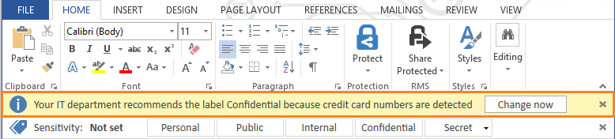

---
# required metadata

title: Configure conditions for an Azure Information Protection label
description: When you configure conditions for a label, you can automatically assign a label to a document or email. Or, you can prompt users to select the label that you recommend. 
author: cabailey
ms.author: cabailey
manager: mbaldwin
ms.date: 05/23/2017
ms.topic: article
ms.prod:
ms.service: information-protection
ms.technology: techgroup-identity
ms.assetid: e915f959-eafb-4375-8d2c-2f312edf2d29

# optional metadata

#ROBOTS:
#audience:
#ms.devlang:
#ms.reviewer: eymanor
#ms.suite: ems
#ms.tgt_pltfrm:
#ms.custom:

---

# How to configure conditions for automatic and recommended classification for Azure Information Protection

>*Applies to: Azure Information Protection*

When you configure conditions for a label, you can automatically assign a label to a document or email. Or, you can prompt users to select the label that you recommend: 

- Automatic classification applies to Word, Excel, and PowerPoint when files are saved, and apply to Outlook when emails are sent. You cannot use automatic classification for files that were previously manually labeled.
 
- Recommended classification applies to Word, Excel, and PowerPoint when files are saved.

When you configure conditions, you can use predefined patterns, such as "Credit Card Number" or "USA Social Security Number (SSN)". Or, you can define a custom string or pattern as a condition for automatic classification. These conditions apply to the body text in documents and emails, and to headers and footers. 

How multiple conditions are evaluated when they apply to more than one label:

1. The labels are ordered for evaluation, according to their position that you specify in the policy: The label positioned first has the lowest position (least sensitive) and the label positioned last has the highest position (most sensitive).

2. The most sensitive label is applied.
 
3. The last sub-label is applied.

> [!TIP]
>For the best user experience and to ensure business continuity, we recommend that you start with user recommended classification, rather than automatic classification. This configuration gives your users the ability to accept the labeling or protection action, or override these suggestions if they are not suitable for their document or email message.

An example prompt for when you configure a condition to apply a label as a recommended action, with a custom policy tip:

In this example, the user can click **Change now** to apply the recommended label, or override the recommendation by closing the bar.

## To configure recommended or automatic classification for a label

1. If you haven't already done so, in a new browser window, sign in to the [Azure portal](https://portal.azure.com) as a security admin or global admin, and then navigate to the **Azure Information Protection** blade. 
    
    For example, on the hub menu, click **More services** and start typing **Information** in the Filter box. Select **Azure Information Protection**.

2. If the label that you want to configure for automatic or recommended classification will apply to all users, select the label to change from the **Policy: Global** blade, and then make your changes on the **Label** blade, and any subsequent blades as required. 

     If the label that you want to configure is in a [scoped policy](configure-policy-scope.md) so that it applies to selected users only, first select that scoped policy from the initial **Azure Information Protection** blade.  

3. On the **Label** blade, in the **Configure conditions for automatically applying this label** section, click **Add a new condition**.

4. On the **Condition** blade, select **Built-in** if you want to use a predefined condition, or **Custom** if you want to specify your own, and then click **Save**:

    - For **Built-in**: Select from the list of available conditions, and then select the minimum number of occurrences and whether the occurrence should have a unique value to be included in the occurrence count.
        
        The built-in conditions are currently in preview and require the preview version of the Azure Information Protection client. These conditions use the Office 365 data loss prevention (DLP) sensitivity information types and pattern detection. You can choose from many common sensitive information types, some of which are specific for different regions. For more information, see [What the sensitive information types look for](https://support.office.com/article/What-the-sensitive-information-types-look-for-fd505979-76be-4d9f-b459-abef3fc9e86b) from the Office documentation.

    - For **Custom**: Specify a name and phrase to match, which must exclude quotation marks and special characters. Then specify whether to match as a regular expression, use case sensitivity, and the minimum number of occurrences and whether the occurrence should have a unique value to be included in the occurrence count.
        
        The option to match as a regular expression is currently in preview and requires the preview version of the Azure Information Protection client. The regular expressions use the Office 365 regex patterns. For more information, see [Defining regular expression based matches](https://technet.microsoft.com/library/jj674702(v=exchg.150).aspx#Anchor_2) from the Office documentation. 
        
    **Example of the occurrences options**: You select the built-in social security number option and set the minimum number of occurrences as 2, and a document has the same social security number listed twice: If you set the **Count occurrences with unique values only** to **On**, the condition would not be met; if you set this option to **Off**, the condition would be met.

5. On the **Label** blade, configure the following, and then click **Save**:

    - Choose automatic or recommended classification: For **Select how this label is applied: automatically or recommended to user**, select **Automatic** or **Recommended**.

    - Specify the text for the user prompt or policy tip: Keep the default text or specify your own string.

6. To make your changes available to users, on the **Azure Information Protection** blade, click **Publish**.

## Next steps

For more information about configuring your Azure Information Protection policy, use the links in the [Configuring your organization's policy](configure-policy.md#configuring-your-organizations-policy) section.  

[!INCLUDE[Commenting house rules](../includes/houserules.md)]

