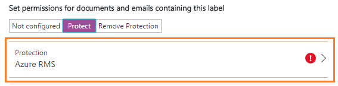

---
# required metadata

title: Configure an Azure Information Protection label for protection
description: You can protect your most sensitive documents and emails when you configure a label to use Rights Management protection. 
author: cabailey
ms.author: cabailey
manager: mbaldwin
ms.date: 06/05/2017
ms.topic: article
ms.prod:
ms.service: information-protection
ms.technology: techgroup-identity
ms.assetid: df26430b-315a-4012-93b5-8f5f42e049cc

# optional metadata

#ROBOTS:
#audience:
#ms.devlang:
#ms.reviewer: eymanor
#ms.suite: ems
#ms.tgt_pltfrm:
#ms.custom:

---

# How to configure a label for Rights Management protection

>*Applies to: Azure Information Protection*

You can protect your most sensitive documents and emails by using a Rights Management service, which uses encryption, identity, and authorization policies to help prevent data loss. This protection is applied when you configure a label to use a Rights Management template for documents and emails, or the **Do not forward** option for Outlook email messages. 

The template can be one of the default templates that are automatically created when you activate Azure Rights Management, or a custom template. Azure Rights Management departmental templates are supported but apply the protection only when the document or email author is within the configured scope of the template. If the user is not within the scope, they see a message that Azure Information Protection cannot apply the label.

## How the protection works

When a document or email is protected by Rights Management, it is encrypted at rest and in transit and can only be decrypted by authorized users. This encryption stays with the document or email, even if it is renamed. In addition, you can configure usage rights and restrictions, such as the following examples:

- Only users within your organization can open the company-confidential document or email.

- Only users in the marketing department can edit and print the promotion announcement document or email while all other users in your organization can only read this document or email.

- Users cannot forward an email or copy information from it that contains news about an internal reorganization.

- The current price list that is sent to business partners cannot be opened after a specified date.

For more information about Azure Rights Management templates and how to configure them in the Azure classic portal, see [Configuring custom templates for the Azure Rights Management service](../deploy-use/configure-custom-templates.md).

For more information about Azure Rights Management and how it works, see [What is Azure Rights Management?](../understand-explore/what-is-azure-rms.md)

> [!IMPORTANT]
> To configure a label to apply Azure Rights Management protection, the Azure Rights Management service must be activated for your organization. If you have not yet done this, see [Activating Azure Rights Management](../deploy-use/activate-service.md).

Exchange does not have to be configured for information rights management (IRM) before users can apply labels in Outlook to protect their emails. However, until Exchange is configured for IRM, you will not get the full functionality of using Azure Rights Management protection with Exchange. For example, users will not be able to view protected emails on mobile phones or with Outlook on the web, protected emails cannot be indexed for search, and you will not be able to configure Exchange Online DLP for rights management protection. To configure Exchange to support these additional scenarios, see the following resources:

- For Exchange Online, see the instructions for [Exchange Online: IRM Configuration](../deploy-use/configure-office365.md#exchange-online-irm-configuration).

- For Exchange on-premises, you must deploy the [RMS connector and configure your Exchange servers](../deploy-use/deploy-rms-connector.md). 

## To configure a label for Rights Management protection

1. If you haven't already done so, open a new browser window and sign in to the [Azure portal](https://portal.azure.com) as a security admin or global admin, and then navigate to the **Azure Information Protection** blade. 

    For example, on the hub menu, click **More services** and start typing **Information** in the Filter box. Select **Azure Information Protection**.

2. If the label that you want to configure will apply to all users, select **Global** from the **Azure Information Protection** blade. However, if the label that you want to configure is in a [scoped policy](configure-policy-scope.md) so that it applies to selected users only, select that scoped policy instead.

3. On the **Policy** blade, select the label that you want to configure, which opens the **Label** blade. 

4. On the **Label** blade, locate **Set permissions for documents and emails containing this label** and select one of the following options.
    
    - **Not configured**: Select this option if the label is currently configured to apply protection and you no longer want the selected label to apply protection. Then go to step 11.
    
    - **Protect**: Select this option to apply protection, and then go to step 5.
    
    - **Remove Protection**: Select this option to remove protection if it is configured for a document or email. Then go to step 11.
        
        Note that users must have permissions to remove Rights Management protection to apply a label that has this option. This option requires users to have the **Export** or **Full Control** [usage right](../deploy-use/configure-usage-rights.md), or be the Rights Management owner (which automatically grants the Full Control usage right), or be a [super user for Azure Rights Management](../deploy-use/configure-super-users.md). The default Azure Rights Management templates do not include the usage rights that lets users remove protection. 
        
        If users do not have permissions to remove Rights Management protection and select a label that is configured with this **Remove Protection** option, they see the following message: **Azure Information Protection cannot apply this label. If this problem persists, contact your administrator.**

5. If you selected **Protect**, now select **Protection** to open the **Protection** blade:
    
    

6. On the **Protection** blade, select **Azure RMS** or **HYOK (AD RMS)**. 
    
    In most cases, you will select **Azure RMS** for your permission settings. Do not select **HYOK (AD RMS)** unless you have read and understood the prerequisites and restrictions that accompany this "*hold your own key*" (HYOK) configuration. For more information, see [Hold your own key (HYOK) requirements and restrictions for AD RMS protection](configure-adrms-restrictions.md). To continue the configuration for HYOK (AD RMS), go to step 10.
    
7. Select one of the following options:
    
    - **Do not forward**: To set this Outlook option for emails.
    
    - **Select a predefined template**: To use one of the default templates or a custom template that you've configured.
    
    - **Custom (Preview)** to define new protection settings in this portal.

8. If you selected **Select a predefined template** for **Azure RMS**, click the drop down box and select the [template](../deploy-use/configure-custom-templates.md) that you want to use to protect documents and emails with this label.
    
    If you select a **departmental template** or if you have configured [onboarding controls](../deploy-use/activate-service.md#configuring-onboarding-controls-for-a-phased-deployment):
    
    - Users who are outside the configured scope of the template or who are excluded from applying Azure Rights Management protection will still see the label but cannot apply it. If they select the label, they see the following message: **Azure Information Protection cannot apply this label. If this problem persists, contact your administrator.**
    
        Note that all templates are always shown, even if you are configuring a scoped policy. For example, you are configuring a scoped policy for the Marketing group. The Azure RMS templates that you can select will not be restricted to templates that are scoped to the Marketing group and it's possible to select a departmental template that your selected users cannot use. For ease of configuration and to minimize troubleshooting, consider naming the departmental template to match the label in your scoped policy. 
            
9. If you selected **Custom (Preview)** for **Azure RMS**, this option has most of the configuration options for [custom templates](configure-custom-templates.md) that you can configure in the Azure classic portal. In addition, you can easily add all users from your organization, and specify external email addresses for individual users or groups, or for all users in another organization when you specify a domain name. 
    
    For more information about this preview configuration, see the blog post [Azure Information Protection unified administration now in Preview](https://blogs.technet.microsoft.com/enterprisemobility/2017/04/26/azure-information-protection-unified-administration-now-in-preview/). 
    
    For more information about the permissions that you can select, see [Configuring usage rights for Azure Rights Management](configure-usage-rights.md).
    
    Included in the **Custom (Preview)** option, check whether you want to make any changes to the following settings. Note that these settings, as with the permissions, do no apply to the [Rights Management issuer or Rights Management owner](configure-usage-rights.md#rights-management-issuer-and-rights-management-owner), or any [super user](configure-super-users.md) that you have assigned while the super user feature is enabled.
    
    |Setting|More information|Recommended setting
    |-----------|--------------------|--------------------|
    |**content expiration**|Define a date or number of days for this template when documents or emails that are protected by the template should not open for the authorized users. You can specify a date or specify a number of days starting from the time that the protection is applied to the content.  When you specify a date, it is effective midnight, in your current time zone.|**Content never expires** unless the content has a specific time-bound requirement.|
    |**Allow offline access**|Use this setting to balance any security requirements (includes access after revocation) that you have with the ability for authorized users to open protected content when they don't have an Internet connection.  If you specify that content is not available without an Internet connection or that content is only available for a specified number of days, when that threshold is reached, users must be re-authenticated and their access is logged. When this happens, if their credentials are not cached, users are prompted to sign in before they can open the document or email.  In addition to re-authentication, the policy and the user group membership is re-evaluated. This means that users could experience different access results for the same document or email if there are changes in the policy or group membership from when they last accessed the content. That could include no access if the document has been [revoked](../rms-client/client-track-revoke.md).|Depending on how sensitive the content is:  - **Number of days the content is available without an Internet connection** = **7** for sensitive business data that could cause damage to the business if shared with unauthorized people. This recommendation offers a balanced compromise between flexibility and security. Examples include contracts, security reports, forecast summaries, and sales account data.  - **Never** for very sensitive business data that would cause damage to the business if it was shared with unauthorized people. This recommendation prioritizes security over flexibility, and ensures that if the document is revoked, all authorized users immediately cannot open the document. Examples include employee and customer information, passwords, source code, and pre-announced financial reports.|
    
    This grouping of settings creates a custom template for the Azure Rights Management service. These templates can be used with applications and services that integrate with Azure Rights Management. For information about how computers and services download and refresh these templates, see [Refreshing templates for users and services](refresh-templates.md).

10. If you selected **Select template** for **HYOK (AD RMS)**: Provide the template GUID and licensing URL of your AD RMS cluster. [More information](configure-adrms-restrictions.md#locating-the-information-to-specify-ad-rms-protection-with-an-azure-information-protection-label)

11. Click **OK** to close the **Protection** blade and see your choice of **Do not forward** or your chosen template display for the **Protection** option in the **Label** blade.

12. On the **Label** blade, click **Save**.

13. To make your changes available to users, on the **Azure Information Protection** blade, click **Publish**.

## Next steps

For more information about configuring your Azure Information Protection policy, use the links in the [Configuring your organization's policy](configure-policy.md#configuring-your-organizations-policy) section.  

[!INCLUDE[Commenting house rules](../includes/houserules.md)]