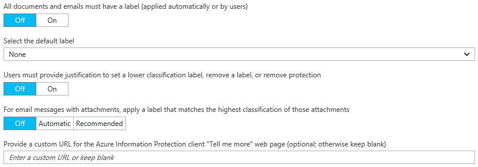

---
# required metadata

title: Configure Azure Information Protection policy settings
description: Configure settings in the Azure Information Protection policy that apply to all users, all devices.
author: cabailey
ms.author: cabailey
manager: mbaldwin
ms.date: 05/23/2017
ms.topic: article
ms.prod:
ms.service: information-protection
ms.technology: techgroup-identity
ms.assetid: 629815c0-457d-4697-a4cc-df0e6cc0c1a6

# optional metadata

#ROBOTS:
#audience:
#ms.devlang:
#ms.reviewer: eymanor
#ms.suite: ems
#ms.tgt_pltfrm:
#ms.custom:

---

# How to configure the policy settings for Azure Information Protection

>*Applies to: Azure Information Protection*

In addition to the Information Protection bar title and tooltip, there are some settings in the Azure Information Protection policy that apply to all users, all devices:

To configure these settings:

1. If you haven't already done so, in a new browser window, sign in to the [Azure portal](https://portal.azure.com) as a security admin or global admin, and then navigate to the **Azure Information Protection** blade. 
    
    For example, on the hub menu, click **More services** and start typing **Information** in the Filter box. Select **Azure Information Protection**.

2. If these settings that you want to configure will apply to all users, configure the following global settings from the **Policy: Global** blade:
    
    - **All documents and emails must have a label**: When you set this option to **On**, all saved documents and sent emails must have a label applied. The labeling might be manually assigned by a user, automatically as a result of a [condition](configure-policy-classification.md), or be assigned by default (by setting the **Select the default label** option). 
        
        If a label is not assigned when a user saves a document or sends an email, they are prompted to select a label. For example:
        
        
        
    - **Select the default label**: When you set this option, select the label to assign to documents and emails that do not have a label. You cannot set a label as the default if it has sub-labels. 
        
    - **Users must provide justification to set a lower classification label, remove a label, or remove protection**: When you set this option to **On** and a user does any of these actions (for example, change the **Public** label to **Personal**), the user is prompted to provide an explanation for this action. For example, the user might explain that the document no longer contains sensitive information. The action and their justification reason is logged in their local Windows event log: **Application** > **Microsoft Azure Information Protection**.  
        
        
        
        This option is not applicable for sub-labels.
        
    - **For email messages with attachments, apply a label that matches the highest classification of those attachments**: When you set this option to **Recommended**, users are prompted to apply a label to their email message. The label is dynamically chosen, based on the classification labels that are applied to the attachments, and the highest classification label is selected. The attachment must be a physical file, and cannot be a link to a file (for example, a link to a file on SharePoint or OneDrive for Business). Users can accept the recommendation or dismiss it. When you set this option to **On**, the label is automatically applied but users can remove the label or select a different label before sending the email.  

    - **Provide a custom URL for the Azure Information Protection client "Tell me more" web page**: Users see this link in the **Microsoft Azure Information Protection** dialog box, **Help and Feedback** section, when select **Protect** > **Help and feedback** from the **Home** tab in their Office applications. By default, this link goes to the [Azure Information Protection](https://www.microsoft.com/cloud-platform/azure-information-protection) website. You can enter an HTTP or HTTPS (recommended) URL if you want this link to go to an alternative web page. No check is made to verify that the custom URL entered is accessible or displays correctly on all devices.
        
        As an example, for your help desk, you might enter the Microsoft documentation page that includes information about installing and using the client (**https://docs.microsoft.com/information-protection/rms-client/info-protect-client**) or release version information (**https://docs.microsoft.com/information-protection/rms-client/client-version-release-history**). Alternatively, you might publish your own webpage that includes information for users to contact your help desk, or a video that steps users through how to use the labels that you have configured.
        
         These settings can be overwritten for specified users when you have created a [scoped policy](configure-policy-scope.md). To configure these settings in a scoped policy, first select that scoped policy from the initial **Azure Information Protection** blade.

3. To save your changes, click **Save**.

4. To make your changes available to users, on the initial **Azure Information Protection** blade, click **Publish**.

## Next steps

For more information about configuring your Azure Information Protection policy, use the links in the [Configuring your organization's policy](configure-policy.md#configuring-your-organizations-policy) section.  

[!INCLUDE[Commenting house rules](../includes/houserules.md)]
