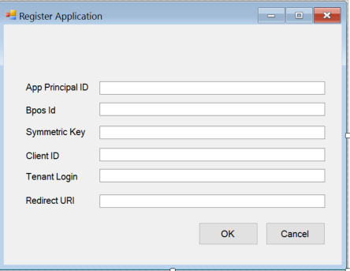

---
# required metadata

title: How to deploy an app - AIP
description: This article describes the process of deploying a service application into a different tenant than the one it was originally developed with.
keywords:
author: kkanakas
ms.author: kartikka
manager: barbkess
ms.date: 02/27/2017
ms.topic: conceptual
ms.service: information-protection
ms.assetid: 34dc6d6f-cfe4-4848-9b11-8d90c4b38ef7
# optional metadata

#ROBOTS:
audience: developer
#ms.devlang:
ms.reviewer: kartikka
ms.suite: ems
#ms.tgt_pltfrm:
#ms.custom:

---

# Deploying a service application into a different tenant

This article describes the process of deploying a service application. In this scenario we are transitioning the application from being registered with its initial development AD tenant to being registered with a different company's production AD tenant.

> [!Note]
> This scenario is only relevant if the service application uses symmetric key authentication.

## Scenario
Company *CoolApp* has developed a service application using Azure Information Protection (AIP) that encrypts, labels, and, protects documents when users are exporting from a business application such as Dynamics, SAP, or, Salesforce. For this scenario, large enterprise *ABC* buys *CoolApp's* new application so, the *CoolApp* team needs to deploy their solution into *ABC’s* environment. 

## Flow 1: *CoolApp* provides a UI dialog to *ABC* to implement the deployment

Once *ABC* purchases *CoolApp's* solution, the IT administrator at *ABC* must create the *CoolApp* service principal and register the application in *ABC's* Azure AD tenant. 

The steps for this are outlined in the **Create a service Principal** section of [Developing your application](developing-your-application.md).

> [!Note]
> To create Service Principal in a tenant you need tenant admin rights

*ABC's* IT administrator then launches *CoolApp's* application as a service in their environment and embeds the details for the *CoolApp* application to work such as; application ID, tenant ID, and, the symmetric key.

If the desired experience is to not provide the IT administrator of *ABC* with a UI dialog for the service principal information, then **Flow 2** is the method to follow.

## Flow 2: *ABC* IT Administrator provides the key to the *CoolApp* team

Once *ABC's* IT Administrator creates the service principal, as shown in **Figure 1**, *ABC* provides the information to the *CoolApp* team. The *CoolApp* team then proceeds to embed the information in the *CoolApp* application for use in *ABC's* tenant.
