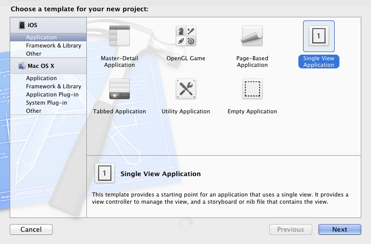
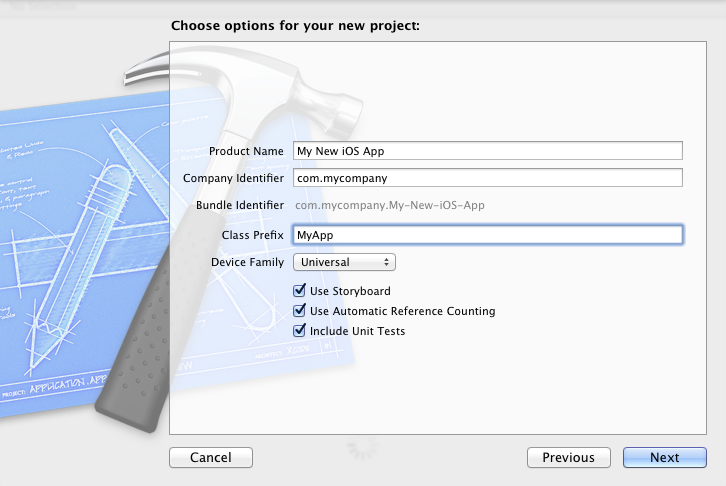
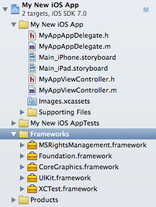
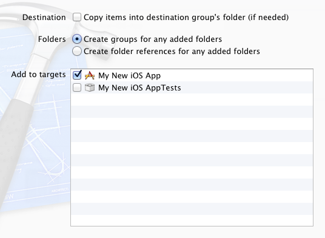
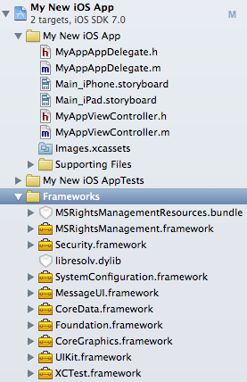
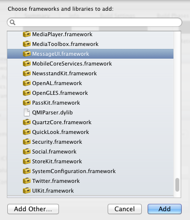
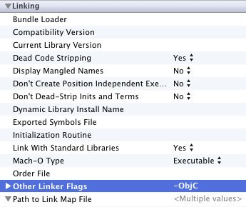
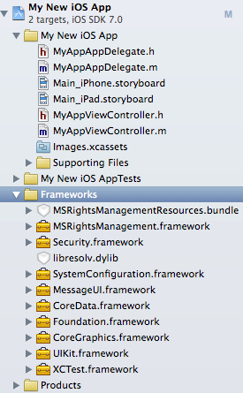

---
# required metadata

title: iOS and OS X setup | Azure RMS
description: iOS and OS X applications can use the RMS SDK 4.2 to enable integrated information protection in their application by using the AAD RM.
keywords:
author: msmbaldwin
ms.author: mbaldwin
manager: barbkess
ms.date: 02/23/2017
ms.topic: conceptual
ms.collection: M365-security-compliance
ms.service: information-protection
ms.assetid: b31e5b72-e65e-450a-b1b8-d46e81e9fb34
# optional metadata

#ROBOTS:
audience: developer
#ms.devlang:
ms.reviewer: shubhamp
ms.suite: ems
#ms.tgt_pltfrm:
ms.custom: dev

---

# iOS and OS X setup

iOS and OS X applications can use the Microsoft Rights Management SDK 4.2 to enable integrated information protection in their application by using the Azure Rights Management (Azure RMS).

This topic will guide you through setting up your environment for creating your own new apps.

**Note**  This SDK does not support iPod Touch.

-   [Prerequisites](#prerequisites)
-   [Optional](#optional)
-   [Configuring your development environment](#configuring-your-development-environment)
-   [See Also](#see-also)

## Prerequisites

We recommend the following software on your development system:

-   OS X is required for all iOS development.
-   Xcode version 6.0 and later

    Xcode is available through the [Mac App Store](https://developer.apple.com/technologies/mac/).

-   The MS RMS SDK 4.2 package for iOS and OS X. For more information see, [Get started](get-started.md).

    This SDK can be used to develop for iOS 7.0 and OS X 10.8 and later.

-   Authentication library: We recommend that you use the [Azure AD Authentication Library (ADAL)](https://msdn.microsoft.com/library/jj573266.aspx). However, other authentication libraries that support OAuth 2.0 can be used as well.

    For more information see, [ADAL for iOS](https://github.com/MSOpenTech/azure-activedirectory-library-for-ios) or [ADAL for OS X](https://github.com/MSOpenTech/azure-activedirectory-library-for-ios/tree/OSXUniversal)

Read the [What's new](release-notes.md) topic for information about API updates, release notes, and frequently asked questions (FAQ).

## Optional

Our UI library provides re-usable UI for consumption and protection operations for developers who don’t want to create their own custom UI - [UI Library and Sample app for iOS](https://github.com/AzureAD/rms-sdk-ui-for-ios).

## Configuring your development environment

-   To create a new project, on the **File** menu, click **New**, and then click **Project**.
-   Select **Single View Application**.

    

-   Enter a name and identifier for your new project.

    

-   Click **Next** and select the location for your project.
-   To add the **MSRightsManagement** framework for iOS Frameworks, drag the .framework folder from the SDK installation folder into the **Frameworks** section of your **Project Navigator**.

    

-   Select **Create groups for any added folders** option button and clear the **Copy items into destination group's folder (if needed)** check box.

    This action maintains the reference to the SDK installation folder instead of creating a copy.

    

-   To add the MS RMS SDK 4.2 for the resource bundle, drag the MSRightsManagementResources.bundle file from the MSRightsManagement.framework/Resources folder into the **Frameworks** section of your Project Navigator.

    

-   As you did when you copied the Framework, select **Create groups for any added folders** option button and clear the **Copy items into destination group's folder (if needed)** check box.
-   The SDK relies on other frameworks including: **CoreData**, **MessageUI**, **SystemConfiguration**, **Libresolv** and **Security**. To add these frameworks, navigate to the **Linked Frameworks and Libraries** section of the target's **Summary** pane, and expand that section to add them.

    The **UIKit** and **Foundation** frameworks are required and generally present by default.

    

-   Add the **-ObjC** flag to **Other Linker Flags** in your target **Build Settings**.

    

-   Now your **Project Navigator** should look something like this tree.

    

-   You are now ready to create your own new iOS/OS X apps.

### See Also

* [Get started](get-started.md)

* [What's new](release-notes.md)

* [Developer terms and concepts](core-concepts.md)

* [iOS / OS X API Reference](https://msdn.microsoft.com/library/dn758306.aspx)
