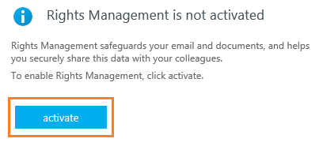

---
# required metadata

title: Quick start tutorial step 1 - AIP
description: Step 1 of an introduction tutorial to quickly try out Azure Information Protection - Activate the Azure Rights Management service.
author: cabailey
ms.author: cabailey
manager: mbaldwin
ms.date: 07/31/2017
ms.topic: article
ms.prod:
ms.service: information-protection
ms.technology: techgroup-identity
ms.assetid: f6dbb143-96f7-4a9c-8208-be9280d69de9

# optional metadata

#ROBOTS:
#audience:
#ms.devlang:
#ms.reviewer: eymanor
#ms.suite: ems
#ms.tgt_pltfrm:
#ms.custom:

---

# Step 1: Activate the Rights Management service
 
>*Applies to: Azure Information Protection*

> [!NOTE]
>If you know that the Azure Rights Management service for your tenant is already activated, you can go straight to the [next step](infoprotect-tutorial-step2.md). 
>
>If you're not sure whether this service is activated or not, use the instructions in this step to check.

When the Azure Rights Management service is activated, you can protect your organization's most sensitive documents and emails, and track how protected documents are used when you share them with others. There are different ways that you can activate this service, which include using Windows PowerShell, and using the admin portals.

For this tutorial, we'll go straight to the activation page in the admin portal for Office 365 administrators. However, if you prefer to navigate to this page from your Office 365 admin portal rather than go directly to the page, see the full instructions from [Activating Azure Rights Management](../deploy-use/activate-service.md). Also use these full instructions if you have access to the Azure portal but not the Office 365 admin portal.

## To activate the Rights Management service

1. Open a new browser window and go directly to the [Rights Management activation page](https://account.activedirectory.windowsazure.com/RmsOnline/Manage.aspx) for Office 365 administrators.
    
    If you are prompted to sign in, use an account that is a global administrator for Office 365.

2. On the **rights management** page, click **activate**. If this button displays **deactivate**, the service is already activated and you can go straight to the [next step](infoprotect-tutorial-step2.md). 

    

3. When prompted **Do you want to activate Rights Management?**, click **activate** to confirm.

    You should now see **Rights management is activated** and the option to deactivate (you might need to manually refresh the page)

    At this time, do not click **advanced features**. Instead, you can close this page.

That's all you need to do for this first step to complete this tutorial. You're ready to go to step 2.

|If you want more information|Additional information|
|--------------------------------|--------------------------|
|About activating Rights Management|[Activating Azure Rights Management](../deploy-use/activate-service.md)|

>[!div class="step-by-step"]
[&#171; Introduction](infoprotect-quick-start-tutorial.md)
[Step 2 &#187;](infoprotect-tutorial-step2.md)

[!INCLUDE[Commenting house rules](../includes/houserules.md)]
