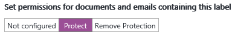
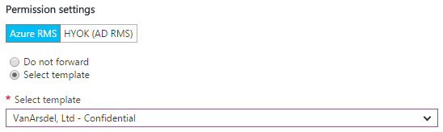
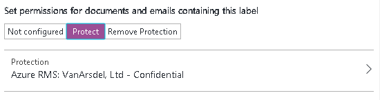
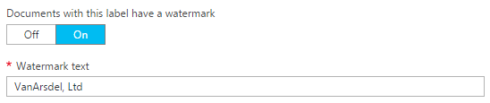
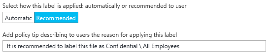
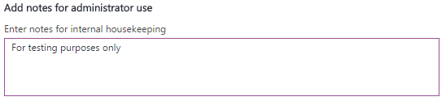

---
# required metadata

title: Quick start tutorial step 2  - AIP
description: Step 2 of an introduction tutorial to quickly try out Azure Information Protection - Configure the policy.
author: cabailey
ms.author: cabailey
manager: mbaldwin
ms.date: 07/13/2017
ms.topic: article
ms.prod:
ms.service: information-protection
ms.technology: techgroup-identity
ms.assetid: 3bc193c2-0be0-4c8e-8910-5d2cee5b14f7

# optional metadata

#ROBOTS:
#audience:
#ms.devlang:
#ms.reviewer: eymanor
#ms.suite: ems
#ms.tgt_pltfrm:
#ms.custom:

---

# Step 2: Configure and publish the Azure Information Protection policy

>*Applies to: Azure Information Protection*

Although Azure Information Protection comes with a default policy that you can use without configuration, we're going to have a look at that policy and make some changes.

1. In a new browser window, sign in to the [Azure portal](https://portal.azure.com) as a global admin or security admin for your tenant.

2. On the hub menu, click **New**, and then, from the **MARKETPLACE** list, select **Security + Identity**. In the **Security + Identify** blade, from the **FEATURED APPS** list, select **Azure Information Protection**. In the **Azure Information Protection** blade, click **Create**.

    This activates the service for your tenant and creates the **Azure Information Protection** blade so that the next time you sign in to the portal, you can select the service from the hub **More services** list. 

    > [!TIP] 
    > Select **Pin to dashboard** to create an **Azure Information Protection** tile on your dashboard, so that you can skip browsing to the service the next time you sign in to the portal.

3. Note the information on the **Quick start** page that automatically opens the first time you connect to the service. You can come back to this later. For this tutorial, click **Global policy** to open the **Policy: Global** blade. This blade automatically opens for subsequent connections to the service and it displays the default Information Protection policy that's automatically created for your tenant:
    
    - Labels for classification: **Personal**, **Public**, **General**, **Confidential**, and **Highly Confidential**. The last two labels expand to show sub-labels: **All Employees** and **Anyone (not protected)**, providing examples of how a classification can have subcategories.
    
       > [!NOTE]
       > Your default policy might look slightly different from one in this tutorial. For example, you have a label named **Internal** rather than **General**, and **Secret** rather than **Highly Confidential**. If that's the case, you're probably using an older version of the default policy. Or, you might have edited it yourself, before you started the tutorial.
       > 
       > If your default policy looks different, you can still use this tutorial, but be aware of these changes when you use the instructions and pictures that follow. If you want to modify your default policy so that it matches the current default policy, see [The default Azure Information Protection policy](../deploy-use/configure-policy-default.md).

    - With the default configuration, some labels do not have visual markings configured (such as footer, header, watermark) and none of the labels have protection set: 
    
    
    
    In addition, there are some policy settings that are not set. For example, all documents and emails are not required to have a label, there is no default label, and users do not have to provide justification when they change labels:
    
    

## Changing the settings for a default label and prompt for justification

For our tutorial, we'll change a couple of those policy settings so that you can see how they work:

1. For **Select the default label**, set this to **General**. 

    If you don't have this label because you have an older version of the policy, choose **Internal** as the equivalent label.

2. For **Users must provide justification to set a lower classification label, remove a label, or remove protection**, set this to **On**.

## Configuring a label for protection, a watermark, and a condition to prompt for classification

We'll now change the settings of one of the sub-labels, **All Employees** from the **Confidential** main label. 

If your **Confidential** label doesn't have sub-labels because you have an older version of the policy, you can use the **Confidential** label instead. The configuration steps are the same but the name of the label blade will be **Confidential** instead of **All Employees**.

1. Make sure that the **Confidential** label is expanded, and then from that label, select **All Employees**.
    
    In the new **Label: All Employees** blade, you now see the settings that are available for each label. 

2. Read the **Description** text for this label. It describes how the selected label is intended to be used and it is visible to users as a tooltip, to help them decide which label to select.

3. Locate the section **Set permissions for documents and emails containing this label**, and select **Protect**:
    
     
    
    This action opens the **Protection** blade.
    
3. In the **Protection** blade, make sure that **Azure RMS** is selected, that **Select a predefined template** is also selected. Then, click the drop-down box and choose the default template that lets all users in your organization view and edit protected content. 
    
    If you have recently activated the Azure Rights Management service, this template is named **Confidential \ All employees**. 
    
    If the Azure Rights Management service was already activated before you started this tutorial, your default template might be named **\<your organization name> - Confidential**. For example, if your organization name is VanArsdel, Ltd, you see and select **VanArsdel, Ltd - Confidential**: 
    
    
    
    If you have disabled this default Azure Rights Management template, select an alternative template. However, if you select a departmental template, make sure that your account is included in the scope.
    
4. Click **OK** to save your changes, which closes the **Protection** blade. You see your configuration reflected in the **Label: All Employees** blade:
    
    
    
5. Now on the **Label: All Employees** blade, locate the section **Set visual marking**:
    
    For the **Documents with this label have a watermark** setting, click **On**, and then for the **Text** box, type your organization name. For example, **VanArsdel, Ltd**: 
    
    
    
    Although you can change the size, color, and layout for watermarks, we'll leave these at the defaults for now.
    
6. Locate the section **Configure conditions for automatically applying this label**:
    
    Click **Add a new condition** and then, in the **Condition** blade, select the following:
    
    a. **Choose the type of condition**: Keep the default of **Built-in**.
    
    b. **Select built-in**: From the drop-down, select **Credit Card Number**.
    
    c. **Minimum number of occurrences**: Keep the default of **1**.
    
    d. **Count occurrences with unique values only**: Keep the default of **Off**.
    
    
    
    Click **Save** to return to the **Label: All Employees** blade.

7. In the **Label: All Employees** blade, you see that **Credit Card Number** is displayed as the **CONDITION NAME**, with **1** **OCCURRENCES**:
    
    

8. For **Select how this label is applied**: Keep the default of **Recommended**, and do not change the default policy tip:
    
    

9. In the **Enter notes for internal housekeeping** box, type **For testing purposes only**:
    
    

10. Click **Save** on this **Label: All Employees** blade. Then, on the **Policy: Global** blade, click **Save** again.
    
    At this point, your labels now show Azure RMS protection for the label you just configured:

    
    
    And the settings are configured with your changes for the default label and justification:
    
    
    
11. Now we've made our changes and saved them, we want to make them available to users, so on the initial **Azure Information Protection** blade, click **Publish**, and click **Yes** to confirm.

    

You can either close the Azure portal, or leave it open to try additional configuration options after you have finished this tutorial.

Now that you've had a look at the default policy and made some changes, the next step is to install the Azure Information Protection client.

|If you want more information|Additional information|
|--------------------------------|--------------------------|
|About the configuration options for the policy|[Configuring Azure Information Protection policy](../deploy-use/configure-policy.md)|

>[!div class="step-by-step"]
[&#171; Step 1](infoprotect-tutorial-step1.md)
[Step 3 &#187;](infoprotect-tutorial-step3.md)

[!INCLUDE[Commenting house rules](../includes/houserules.md)]