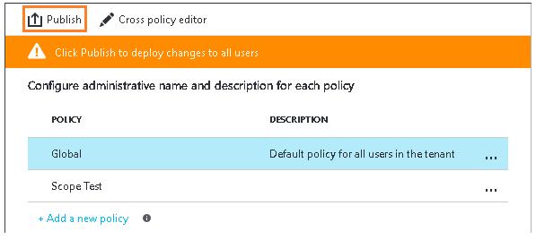

---
# required metadata

title: Quick start tutorial step 2  - AIP
description: Step 2 of an introduction tutorial to quickly try out Azure Information Protection - Configure the policy.
author: cabailey
ms.author: cabailey
manager: mbaldwin
ms.date: 07/31/2017
ms.topic: article
ms.prod:
ms.service: information-protection
ms.technology: techgroup-identity
ms.assetid: 3bc193c2-0be0-4c8e-8910-5d2cee5b14f7

# optional metadata

#ROBOTS:
#audience:
#ms.devlang:
#ms.reviewer: eymanor
#ms.suite: ems
#ms.tgt_pltfrm:
#ms.custom:

---

# Step 2: Configure and publish the Azure Information Protection policy

>*Applies to: Azure Information Protection*

Although Azure Information Protection comes with a default policy that you can use without configuration, we're going to have a look at that policy and make some changes.

1. Still in the Azure portal, on the initial Azure Information Protection blade, select **Global policy** to open the **Policy: Global** blade. This blade automatically opens for subsequent connections to the service and it displays the default Information Protection policy that's created for your tenant:
    
    - Labels for classification: **Personal**, **Public**, **General**, **Confidential**, and **Highly Confidential**. The last two labels expand to show sub-labels, which provide examples of how a classification can have subcategories.
    
       > [!NOTE]
       > Your default policy might look slightly different from one in this tutorial. For example, you have a label named **Internal** rather than **General**, and **Secret** rather than **Highly Confidential**. Maybe you do not have the sub-labels named **Recipients Only**. These changes are because there are different versions of the default policy, depending on when it was created for your tenant. Or, you might have edited it yourself, before you started the tutorial.
       > 
       > If your default policy looks different, you can still use this tutorial, but be aware of these changes when you use the instructions and pictures that follow. If you want to modify your default policy so that it matches the current default policy, see [The default Azure Information Protection policy](../deploy-use/configure-policy-default.md).

    - With the default configuration, some labels do not have visual markings configured. The visual markers are a footer, header, and watermark. Depending on your default policy, some labels might have protection set, or not. As an example:
    
    
    
    In addition, there are some policy settings that are not set. All documents and emails are not required to have a label, there is no default label, and users do not have to provide justification when they change labels:
    
    

## Changing the settings for a default label and prompt for justification

For our tutorial, we'll change a couple of those policy settings so that you can see how they work:

1. For **Select the default label**, set this to **General**. 

    If you don't have this label because you have an older version of the policy, choose **Internal** as the equivalent label.

2. For **Users must provide justification to set a lower classification label, remove a label, or remove protection**, set this to **On**.

## Creating a new label for protection, a watermark, and a condition to prompt for classification

We'll now create a new sub-label for **Confidential**.

1. Right-click the **Confidential** label, and select **Add a sub-label**.

2. On the **Sub-label** blade, specify the label name of **Finance** and add the following description: **Confidential data that contains financial information, which requires protection. All employees are granted full permissions**.
    
    This text describes how the selected label is intended to be used and it is visible to users as a tooltip, to help them decide which label to select.

3. For **Set permissions for documents and emails containing this label**, select **Protect**, and then select the **Protection** bar:
    
     
    
4. In the **Protection** blade, make sure that **Azure RMS** is selected, and that **Set Permissions** is selected. Then select **Add permissions**.

5. On the **Add permissions** blade, select **Add \<organization name> - All members**. For example, if your organization name is Vanarsdel, you see the following option to select:
    
    This option automatically selects all the users in your organization who can be granted permissions. However, you can see from the other options that you could browse and search for groups or users from your tenant. Or, when you select the **Enter details** option, you can specify individual email addresses or even all users from another organization.

6. You see by default, all permissions are granted. For this tutorial, keep this default. You can experiment with different permissions later and read how they restrict what the specified users can do with the protected document or email.
 
7. Click **OK** to close this **Add permissions** blade. Then click **OK** on the **Protection** blade, which keeps the default settings for content expiration and offline access.

8. Back on the **Sub-label** blade, location the **Set visual marking** section:
    
    For the **Documents with this label have a footer** setting, click **On**, and then for the **Text** box, type your organization name. For example, **VanArsdel, Ltd** 
    
    Similarly, for the **Documents with this label have a watermark** setting, click **On**, and then for the **Text** box, type your organization name. For example, **VanArsdel, Ltd** 
    
    Although you can change the appearance for these visual markers, we'll leave these settings at the defaults for now.
    
9. Locate the section **Configure conditions for automatically applying this label**:
    
    Click **Add a new condition** and then, in the **Condition** blade, select the following:
    
    a. **Choose the type of condition**: Keep the default of **Built-in**.
    
    b. In the **Select built-in** search box: Type **Credit Card Number**. Then select **Credit Card Number**.
    
    c. **Minimum number of occurrences**: Keep the default of **1**.
    
    d. **Count occurrences with unique values only**: Keep the default of **Off**.
    
    
    
    Click **Save** to return to the **Sub-label** blade.

10. In the **Sub-label** blade, you see that **Credit Card Number** is displayed as the **CONDITION NAME**, with **1** **OCCURRENCES**:
    
    

11. For **Select how this label is applied**: Keep the default of **Recommended**, and do not change the default policy tip. 

12. In the **Enter notes for internal housekeeping** box, type **For testing purposes only**.

13. Click **Save** on this **Sub-label** blade. Then, on the **Policy: Global** blade, click **Save** again.
    
    You now see your new sub-label, which is configured for Azure RMS protection:

    
    
    You also see that the settings are configured with your changes for the default label and justification:
    
    
    
14. Now that we've made our changes and saved them, we want to make them available to users, so on the initial **Azure Information Protection** blade, click **Publish**, and click **Yes** to confirm.

    

You can either close the Azure portal, or leave it open to try additional configuration options after you have finished this tutorial.

Now that you've had a look at the default policy and made some changes, the next step is to install the Azure Information Protection client.

|If you want more information|Additional information|
|--------------------------------|--------------------------|
|About the configuration options for the policy|[Configuring Azure Information Protection policy](../deploy-use/configure-policy.md)|
|Configuration settings in the default policy|[The default Azure Information Protection policy](../deploy-use/configure-policy-default.md)|
|Detailed instructions for configuring a label for protection|[How to configure a label for Rights Management protection](../deploy-use/configure-policy-protection)|
|Detailed information about the permissions|[Configuring usage rights for Azure Rights Management](../deploy-use/configure-usage-rights)|

>[!div class="step-by-step"]
[&#171; Step 1](infoprotect-tutorial-step1.md)
[Step 3 &#187;](infoprotect-tutorial-step3.md)

[!INCLUDE[Commenting house rules](../includes/houserules.md)]