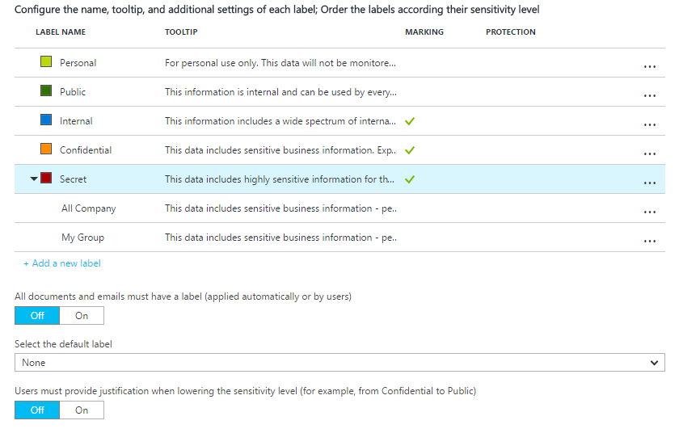
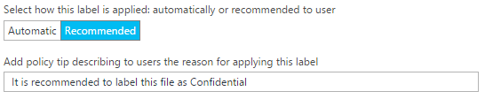
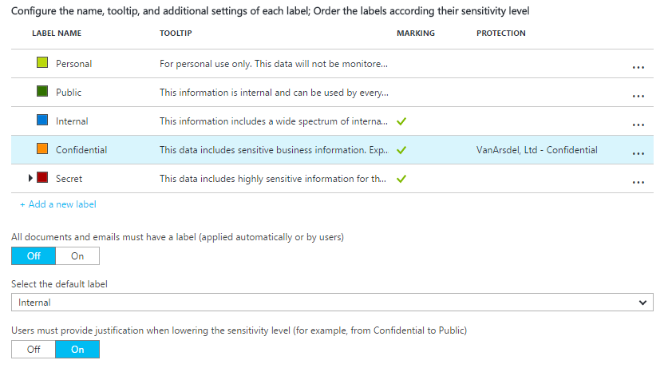

---
# required metadata

title: Quick start tutorial step 1 | Azure Information Protection
description: Step 2 of an introduction tutorial to quickly try out Microsoft Azure Information Protection for your organization that should take you about 30 minutes.
author: cabailey
manager: mbaldwin
ms.date: 09/14/2016
ms.topic: article
ms.prod:
ms.service: rights-management
ms.technology: techgroup-identity
ms.assetid: 3bc193c2-0be0-4c8e-8910-5d2cee5b14f7

# optional metadata

#ROBOTS:
#audience:
#ms.devlang:
#ms.reviewer: eymanor
#ms.suite: ems
#ms.tgt_pltfrm:
#ms.custom:

---

# Step 2: Configure and publish the Azure Information Protection policy

>*Applies to: Azure Information Protection*

Although Azure Information Protection comes with a default policy that you can use without configuration, we're going to have a look at that policy and make some changes.

1. In a new browser window, sign in to the [Azure portal](https://portal.azure.com) as a global admin for your tenant.

2. On the hub menu: Click **New** > **Security + Identity** > **Azure Information Protection** > **Create**.

    This creates the **Azure Information Protection** blade so that the next time you sign in to the portal, you can select the service from the hub **More services** list. 

    > [!TIP] 
    > Select **Pin to dashboard** to create an **Azure Information Protection** tile on your dashboard, so that you can skip browsing to the service the next time you sign in to the portal.

3.  Explore the main **Azure Information Protection** blade, which shows the default Information Protection policy that's automatically created:
    
    - Labels for classification: **Personal**, **Public**, **Internal**, **Confidential**, and **Secret**. Read the tooltip for each to understand how the labels are intended to be used. Note that **Secret** has two sub-labels: **All-Employees** and **My-Group**, which provides an example of how a classification can have subcategories.

    - With the default settings, the **Internal**, **Confidential**, and **Secret** labels have visual markings configured (such as footer, header, watermark) and none of the labels have protection set. In addition, the three global settings are not set so that all documents and emails are not required to have a label, there is no default label, and users do not have to provide justification when lowering the classification level.

    

## Changing the global settings for a default template and prompt for justification

For our tutorial, we'll change a couple of those global settings so that you can see how they work:

1. For **Select the default label**, set this to **Internal**.

2. For **Users must provide justification to set a lower classification label, remove a label, or remove protection**, set this to **On**.

## Configuring a label for protection, a watermark, and a condition to prompt for classification

We'll now change the settings of one of the labels, **Confidential**:

1. Click the **Confidential** label. 
    
    In the new **Label: Confidential** blade, you now see the settings that are available for each label. 

2. In the **Label: Confidential** blade, locate the section **Set RMS template for protecting documents and emails containing this label**:
    
    For the **Select RMS template from** option, keep the default of **Azure RMS**. Then, for **Select RMS template**, click the drop down box and select the default template **\<your organization name> - Confidential**. 
    
    For example, if your organization name is VanArsdel, Ltd, you will see and select **VanArsdel, Ltd - Confidential**: 
    
    
    
    If you have disabled this default Azure Rights Management template, select an alternative template. However, if you select a departmental template, make sure that your account is included in the scope.
    
3. Locate the section **Set visual marking**:
    
    For the **Documents with this label have a watermark** setting, click **On**, and then for the **Text** box, type your organization name. For example, **VanArsdel, Ltd**: 
    
    
    
    Although you can change the size, color, and layout for watermarks, we'll leave these at the defaults for now.
    
4. Locate the section **Configure conditions for automatically applying this label**:
    
    Click **Add a new condition** and then, in the **Condition** blade, select the following:
    
    a. **Choose the type of condition**: Keep the default of **Built-in**.
    
    b. **Select built-in**: From the drop down, select **Credit Card Number**.
    
    c. **Minimum number of occurrences**: Keep the default of **1**.
    
    d. **Count occurrences with unique values only**: Keep the default of **Off**.
    
    
    
    Click **Save** to return to the **Label: Confidential** blade.

5. In the **Label: Confidential** blade, you'll see that **Credit Card Number** is displayed as the **CONDITION NAME**, with **1** **OCCURRENCES**.

6. For **Select how this label is applied**: Keep the default of **Recommended**, and do not change the default policy tip:
    
    

7. In the **Enter notes for internal housekeeping** box, type **For testing purposes only**.

8. Click **Save** on this **Label: Confidential** blade, and on the main **Azure Information Protection** blade, click **Save** again.

9. Now we've made our changes and saved them, we want to make them available to users, so click **Publish**, and click **Yes** to confirm.

You can either close the Azure portal, or leave it open to try additional configuration options after you have finished this tutorial.

Now that you've had a look at the default policy and made some changes, the next step is to install the Azure Information Protection client and the Rights Management sharing application.

|If you want more information|Additional information|
|--------------------------------|--------------------------|
|About the configuration options for the policy|[Configuring Azure Information Protection policy](../deploy-use/configure-policy.md)|

>[!div class="step-by-step"]
[&#171; Step 2](infoprotect-tutorial-step2.md)
[Step 3 &#187;](infoprotect-tutorial-step3.md)