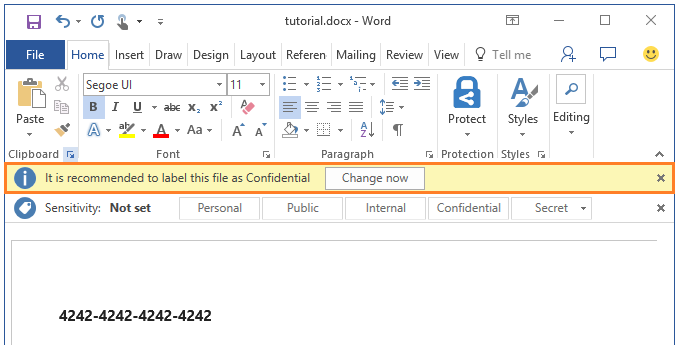

---
# required metadata

title: Quick start tutorial step 4 | Azure Rights Management
description: Step 3 of an introduction tutorial to quickly try out Microsoft Azure Information Protection for your organization that should take you about 15 minutes.
author: cabailey
manager: mbaldwin
ms.date: 09/07/2016
ms.topic: article
ms.prod:
ms.service: rights-management
ms.technology: techgroup-identity
ms.assetid: 468748c1-49d6-4c3e-a612-9c584acdc782

# optional metadata

#ROBOTS:
#audience:
#ms.devlang:
#ms.reviewer: eymanor
#ms.suite: ems
#ms.tgt_pltfrm:
#ms.custom:

---

# Step 4: See classification, labeling, and protection in action 

>*Applies to: Azure Information Protection*

Now that you've got a Word document open with the Azure Information Protection client installed, you're ready to see how easy it is to start labeling and protecting your document, using the policy that we configured.

Classification and protection happens when you save the document, but before we do that, we'll use our unsaved document to see how easy it is to apply and change labels.

## To manually change our default label

On the Information Protection bar, select the **Personal** label and you are prompted to justify why are lowering the classification level. Select **The previous label no longer applies**, and click **Confirm**.  

You'll see the **Sensitivity** value change to **Personal**.

## To remove the classification completely

On the Information Protection bar, click the **Edit label** icon next to **Personal**. This displays the available labels. But instead of choosing one of the labels, this time, click the **Remove label** icon. Click **OK** to confirm and then provide justification for this action.  

You'll see the **Sensitivity** value display **Not set**, which is what users see initially if you don't set a default label.

## To see a recommendation prompt for labeling and automatic protection

1. In the Word document, type a valid credit card number, for example: **4242-4242-4242-4242**. 

2. Save the document (use any file name, any location). 

3. You now see the prompt: **It is recommended to label this file as Confidential**. Click **Change now**.

    

    Immediately, you'll see the watermark of your organization name across the page, in addition to the footer of **Sensitivity: Confidential**. 

    The document is also protected with the Azure Rights Management template that you specified, which you can confirm when you click the **File** tab and view the information for **Protect Document**. If you used the default Confidential template, you'll see the information that the document is restricted to internal users (users outside your organization will not be able to open the document) and its contents cannot be copied or printed. As the owner of the document, you can copy from it and print it, but if you email it to another user in your organization, they won't be able to do these actions.

Now that you've seen classification, labeling, and protection in action, let's see how you can protect your documents even when they are shared with others in another organization. You can even track how they are being used and revoke access to them.

>[!div class="step-by-step"]
[&#171; Step 3](infoprotect-tutorial-step3.md)
[Step 5 &#187;](infoprotect-tutorial-step5.md)
