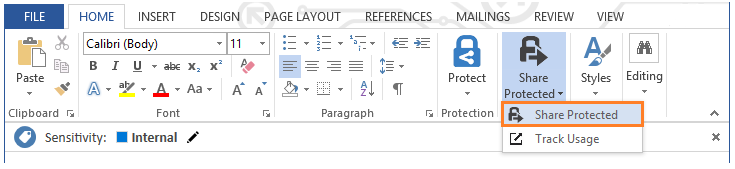
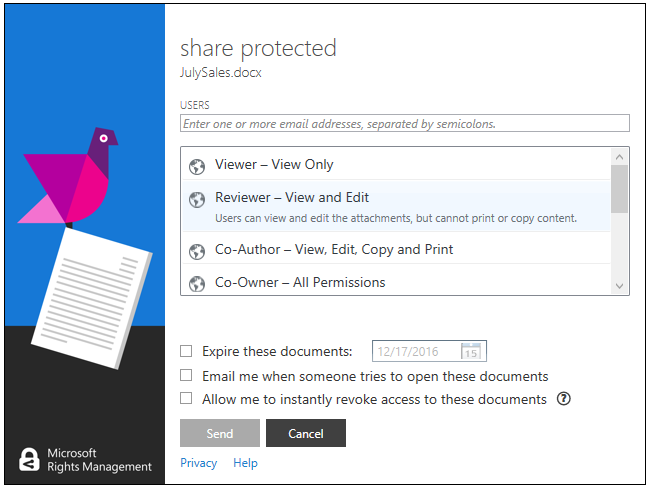

---
# required metadata

title: Quick start tutorial step 5 | Azure Information Protection
description: Step 5 of an introduction tutorial to quickly try out Microsoft Azure Information Protection for your organization that should take you about 30 minutes.
keywords:
author: cabailey
manager: mbaldwin
ms.date: 08/24/2016
ms.topic: get-started-article
ms.prod:
ms.service: rights-management
ms.technology: techgroup-identity
ms.assetid: 4e59a3b3-f0f4-4535-8b96-cac68303d855

# optional metadata

#ROBOTS:
#audience:
#ms.devlang:
ms.reviewer: esaggese
ms.suite: ems
#ms.tgt_pltfrm:
#ms.custom:

---

# Step 5: See sharing of protected files in action and track your document 

>*Applies to: Azure Information Protection*

For this final step in the tutorial, locate a Word document that you have already created and will send to a partner or co-worker. For this tutorial, it doesn’t matter what text it actually contains, but you will want it to contain some text so you can more easily confirm that the authorized recipient could read it.

You’re then ready to safely share this document by email. 

## To safely share your document by email

1.  In Word, open your document. You will see that the default label of **Internal** is again automatically applied. 

2.  On the **Home** tab, in the **RMS** group, click **Share Protected**, and then click **Share Protected** from the menu:

    

    You'll see the **share protected** dialog box, similar to this picture:

    

3. In the **USERS** box, type one or more business email addresses, as you would do when you send a document to someone that your organization does business with. Or, you can specify a co-worker's email address. Make sure that you specify a business email address, such as **janetm@contoso.com** or **p.dover@fabrikam.com** because currently, Azure Information Protection doesn’t support personal email addresses. 

    Don’t worry about whether the person you’re sending it to also has Azure Information Protectin or not.

4. Select **Viewer – View Only**.

    This means our recipients will be able to view the document but not edit or print it.

5. Select **Email me when somebody tries to open these documents**.

    You’ll get an email notification each time the recipients try to open the attachment, and also if somebody else tries to open it—for example, your recipient forwards the email to co-worker. If the document is forwarded, you’ll see that access was denied and from the user details, you can decide whether to send that person a copy of the document that they can open.

6. Select **Allow me to instantly revoke access to these documents**.

    This option requires the recipients to have an Internet connection each time they open the attachment but with the benefit that if you later revoke the document, the next time they try to open it, they will not be able to. 

4.  Click **Send** to see an email message that is ready to be sent to the recipients you specified and with default text for instructions. For example:

    
    
    **NOTE**: If Outlook was open when you installed the Azure Information Protection client, you won't see the Information Protection bar that you see in the preceding picture: It's not specifically used in this step that demonstrates sharing protected documents, so you don't need to close and reopen Outlook to complete the tutorial. If have opened Outlook after installing the Azure Information Protection client, you'll see that this email message, like our Word document when first opened, has the **Internal** label applied by default as a result of configuring this global setting in the Azure Information Protection policy.
    
    You might notice that you have two attachments; the original Word document, and a file that has the same name but with a **.ppdf** file name extension. The .ppdf version is a protected PDF file that is automatically created by the Rights Management sharing application, in case the recipient does not have a version of Office that supports protected documents. This additional file lets the recipient read the protected document by using the viewer that is installed with the Rights Management sharing application.

    Click **Send** in your email message.

Now you’ve sent your protected document, you’re ready to ask your recipients to wait for it to arrive and then open it. But don’t close Word, because we’ll use it again in our final procedure to track the shared document.

## Ask your recipients to open the emailed document

Your recipients can use many devices to read the protected document that you sent as an email attachment. The devices include iPads, iPhones, Android tablets and phones, Mac computers, as well as Windows computers.

Ask them to read the email message that you sent. Assuming that this is the first time that they have received attachments that are protected by Rights Management, ask them to click the instructions link. They will then see the [Welcome to Microsoft RMS!](https://portal.azurerms.com/#/rmshelp) page, with instructions to install the RMS sharing application and if necessary, sign up for a free account. They are then ready to read the protected attachment.

### Instructions for recipient: To view the protected document attachment

1. Open one of the attachments to read the document:
    
    - If you have a version of Office on your device that supports Rights Management:
    
        -  Open the document that has the **.docx** file name extension.
        
    - If you do not have a version of Office that supports Rights Management, or if you are not sure, or simply want to try the viewer from the Rights Management sharing application: 
    
        - Open the document that has a **.ppdf** file name extension.

2.  If you are prompted for your user name and password, enter your user name in the same format as the email address that was used to send you the email and attachment. For example, **janetm@contoso.com** or **p.dover@fabrikam.com**. For your password, type the password that you supplied when you signed up for RMS for individuals. Or, if your organization has a cloud service such as Office 365 or uses Azure, enter your usual work password.

3. Read the document contents when it opens. Because it’s read-only, you cannot change the contents.

As an optional step, your recipient could forward the email to other people that you didn’t specify in your original email. These people won’t be able to open the attachment. When they are promoted for their user name, access to the document will be denied.

Now that the recipient has opened the attachment and optionally, forwarded it to somebody else, expect to get an email notification that reports this activity. But email messages are easy to lose over time, so a better way to track who accessed your document is to use the document tracking site, which is covered in the final procedure.

## To track your protected document

1.  Back in Word, on the **Home** tab, in the **RMS** group, click **Share Protected**, and then click **Track Usage** from the menu:

    

    This takes you to the document tracking site.

2.  If you see the **Protect and share on your terms** page, click **Sign in** and supply your user name and password again.

3.  On the **Your shared documents** page, you’ll see the document name that you shared. At this point, it’s the only file displayed but as you share additional protected documents, the list will grow.

    From this page, you’ll see when you shared the document (when you sent the email with the protected attachment), the date of the last activity, and the name of the recipient you sent the email to. Click the document name for additional details.

4.  On the new page, which has the name of the file that you clicked, you’ll see summary details for that document only, and a list of other options that are available for the document (**List**, **Timeline**, **Map**, **Settings**).

    Click each option to explore different ways to track your protected document. Or, still on the **Summary** page, click **Open in Excel** to export the information to a spreadsheet, or click **Revoke access** to stop sharing the document.

You can return to this site to track further activity for your protected document, or revoke access if necessary. You can even access the site from your mobile device or tablet, by using a browser with this link: [document tracking](http://go.microsoft.com/fwlink/?LinkId=529562)

|If you want more information|Additional information|
|--------------------------------|--------------------------|
|Full instructions and alternative methods for protecting files that you share by email|[Protect a file that you share by email by using the Rights Management sharing application](../rms-client/sharing-app-protect-by-email.md)|
|About the options in the **share protected** dialog box|[Dialog box options for the Rights Management sharing application](../rms-client/sharing-app-dialog-box.md)|
|About the free account for others users to sign up|[RMS for individuals and Azure Rights Managmenet](../understand-explore/rms-for-individuals.md)|
|About using the document tracking site|[Track and revoke your documents](../rms-client/sharing-app-track-revoke.md)

## Next Steps

Now you've seen the default Azure Information Protection policy and how to customize it, and how labeling works for a Word document, try some of the other settings and see how they work in the other Office applications that support Azure Information Protection: Excel, PowerPoint, Outlook. If these applications were open when you installed the Azure Information Protection client, close and reopen them before you try using them with Azure Information Protection.

Try sharing more documents and track how they are being used, and confirm how document revocation works.

You might then find it useful to read some of the [frequently asked questions](faqs.md) for Azure Information Protection, and explore some of the other documentation articles. But if you're ready to start deploying Azure Information Protection for your organization, your next stop should be the [Azure Information Protection deployment roadmap](../plan-design/deployment-roadmap.md). 