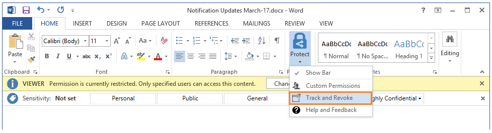

---
# required metadata

title: Quick start tutorial step 5  - AIP
description: Step 5 of an introduction tutorial to quickly try out Azure Information Protection - Share protected and track.
keywords:
author: cabailey
ms.author: cabailey
manager: mbaldwin
ms.date: 03/21/2017
ms.topic: get-started-article
ms.prod:
ms.service: information-protection
ms.technology: techgroup-identity
ms.assetid: 4e59a3b3-f0f4-4535-8b96-cac68303d855

# optional metadata

#ROBOTS:
#audience:
#ms.devlang:
ms.reviewer: esaggese
ms.suite: ems
#ms.tgt_pltfrm:
#ms.custom:

---

# Step 5: See sharing of protected files in action and track your document 

>*Applies to: Azure Information Protection*

For this final step in the tutorial, you will need a Word document or Excel spreadsheet that you have already created and will send to somebody inside your organization and to somebody outside your organization by using their personal email address. For this tutorial, it doesn’t matter what text this document actually contains, but you will want it to contain some text so you can more easily confirm that the authorized recipient could read it.

You’re then ready to safely share this document by email. 

## To safely share your document by email

1. Using Outlook, create a new email and in the **To:** box, add two entries for users who are willing to help with this test:
    
    - A co-worker who also has an account in Office 365 or Azure Active Directory, so the email address is from your organization.
    
    - A personal email address, such as a Gmail or Hotmail account.

2. Supply your choice of text for the **Subject** and email message. For example:
    
    - Subject: **I am sharing a protected document**
    
    - Message: **Please open the document.**

3. Attach your selected document.

4. On the **Message** tab, select **Do Not Forward**, and then send the email. 

Now you’ve sent your protected document, you’re ready to ask your recipients to wait for it to arrive and then open it. 

## Ask your recipients to open the emailed document

Your recipients can use many devices to read the protected document that you sent as an email attachment. The devices include iPads, iPhones, Android tablets and phones, Mac computers, as well as Windows computers. Because you sent an Office document, they must have Office installed to read it.

The email experience for the two users:

- For your coworker, she might be prompted to authenticate, but she can read the email message directly in her Outlook client or Outlook web app. When she opens the protected document, it opens in Protected View mode, as Word does for all emailed documents. Because it's now a protected document, it also has the protection banner that displays **DO NOT FORWARD**.

- For the user with the personal email address, she sees a message to sign in using one of the popular social identify providers (such as Google and Microsoft), or apply for a one-time passcode:
-    
    - If she signs in, the experience is exactly the same as the co-worker's.
    
    - If she applies for a one-time passcode and enters this, she can now read the email message in her web browser and when she opens the protected document, it also opens in the web browser.

For both users, because of the Do Not Forward option, they cannot forward the email to other users, and they cannot edit the document, even after selecting **Enable Editing** to close the Protected View message. Additionally, according to the displayed usage rights, the email and document cannot be saved or and text from it cannot be copied.

## To track your protected document

1.  In an Office app, on the **Home** tab, click **Protect** > **Track and Revoke**:

    

    This takes you to the document tracking site.

2.  If you see the **Protect and share on your terms** page, click **Sign in** and supply your user name and password again.

3.  On the **Your shared documents** page, you should see the document name that you shared. If it's not displayed yet, wait a few minutes and try again. As you share additional protected documents, the list will grow.

    From this page, you’ll see when you shared the document (when you sent the email with the protected attachment), the date of the last activity, and the name of the recipient you sent the email to. Click the document name for additional details.

4.  On the new page, which has the name of the file that you clicked, you’ll see summary details for that document only, and a list of other options that are available for the document (**List**, **Timeline**, **Map**, **Settings**).

    Click each option to explore different ways to track your protected document. Or, still on the **Summary** page, click **Open in Excel** to export the information to a spreadsheet, or click **Revoke access** to stop sharing the document.

You can return to this site to track further activity for your protected document, or revoke access if necessary. You can even access the site from your mobile device or tablet, by using a browser with this link: [document tracking](http://go.microsoft.com/fwlink/?LinkId=529562)

|If you want more information|Additional information|
|--------------------------------|--------------------------|
|Full instructions for protecting files that you can then safely share|[Classify and protect a file or email](../rms-client/client-classify-protect.md)|
|About the free account for others users to sign up|[RMS for individuals and Azure Rights Managmenet](../understand-explore/rms-for-individuals.md)|
|About using the document tracking site|[Track and revoke your documents](../rms-client/client-track-revoke.md)

## Next Steps

Now you've seen the default Azure Information Protection policy and how to customize it, and how labeling works for a Word document, try some of the other settings and see how they work in the other Office applications that support Azure Information Protection: Excel, PowerPoint, Outlook. If these applications were open when you installed the Azure Information Protection client, close and reopen them before you try using them with Azure Information Protection.

Try sharing more documents and track how they are being used, and confirm how document revocation works.

You might then find it useful to read some of the [frequently asked questions](faqs.md) for Azure Information Protection, and explore some of the other documentation articles. But if you're ready to start deploying Azure Information Protection for your organization, your next stop should be the [Azure Information Protection deployment roadmap](../plan-design/deployment-roadmap.md). 

[!INCLUDE[Commenting house rules](../includes/houserules.md)]