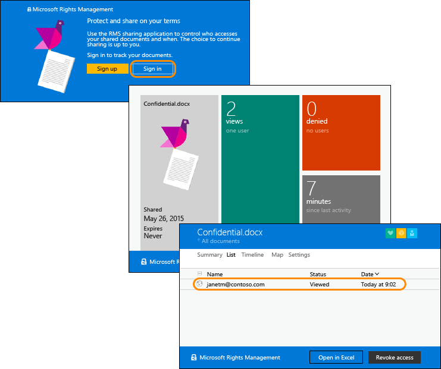

---
# required metadata

title: Rapid deployment guide for Azure RMS - AIP
description: A guide to help you more quickly deploy and use the Azure Rights Management service to protect your organization's data. Start by choosing from a list of specific scenarios to implement.
author: cabailey
ms.author: cabailey
manager: mbaldwin
ms.date: 02/08/2017
ms.topic: get-started-article
ms.prod:
ms.service: information-protection
ms.technology: techgroup-identity
ms.assetid: c994d616-cff6-4930-9228-a7f7d198a160

# optional metadata

#ROBOTS:
#audience:
#ms.devlang:
ms.reviewer: esaggese
ms.suite: ems
#ms.tgt_pltfrm:
#ms.custom:

---

# Rapid deployment guide for Azure Rights Management

>*Applies to: Azure Information Protection, Office 365*

Use this guide in addition to the configuration information in the **Deploy & Use** section, to help you more quickly deploy a protection-only solution that uses the Azure Rights Management service from Azure Information Protection. Choose from a list of specific scenarios to implement.

> [!NOTE]
> At this time, the guide contains scenarios for protection-only and does not contain scenarios for classification and protection or the Azure Information Protection client. 

These scenarios contain both administrator instructions and accompanying end user documentation. Before you give the documentation (instructions or announcements) to your end users, you will need to first customize this documentation for your business requirements and existing work flows. An example set of instructions or an announcement show how the final end user documentation might look.

Each scenario has a list of requirements with links to more information if needed, so that you can deploy these solutions independently and in any order.

The scenarios listed here are a sample of the most popular ones. Because Azure Information Protection can be used to protect information in a large number of scenarios both within an organization and across organizations, you can define your own scenarios and deploy them to your environment and to your users by using this same model. By focusing on specific scenarios, your Azure Information Protection deployment will more closely align to your business goals. In addition, our experience is that users tend to follow scenario-specific instructions much more closely and systematically than general guidance such as "protect sensitive documents".

Before you roll out these solutions, you might want to send a broad announcement to end users, letting them know that some changes are coming to help protect company data, and that it might require some changes from them. An example communication is included after the following table.

If you have questions and comments about this guide, use the feedback mechanisms on this page, or send an email message to [AskIPTeam@Microsoft.com](mailto:%20askipteam@microsoft.com?subject=Rapid%20Deployment%20Guide%20feedback).

## Scenarios for Azure Information Protection
To help you more quickly deploy Azure Information Protection to address specific business problems, choose the scenarios that most closely match your business goals, and adapt them where necessary.

**Safely email an Office file to users in another organization with the ability to track the resulting accesses (business-to-business collaboration)**

Examples:

- Send a price list, roadmap, or release plans to a customer

- Send a work order, or marketing specification to a vendor

- Send a tender or request for quotation (RFQ) to a partner

See: [Scenario - Share an Office file with users in another organization](scenario-share-office-file-externally.md)

**Ensure documents stored in a SharePoint library remain under your control**

Examples:

- Departmental spreadsheets and reports

- Cross-team collaboration for design documents or other deliverables

See: [Scenario - Retain control of documents stored in SharePoint](scenario-sharepoint.md)

**Executives can securely exchange privileged information over email**

Examples:

- Sharing acquisition plans

- Discussing or disseminating legal issues

- Information about potential layoffs or other sensitive subjects

See: [Scenario - Executives securely exchange privileged information](scenario-executives-email.md)

**Automatically protect all files on a file server**

Examples:

- CAD documents that must be kept in-house to prevent loss of intellectual property

- Marketing promotion plans and dates that must be kept secret from public disclosure to maintain a competitive advantage

See: [Scenario - Protect files on a file server share](scenario-fci.md)

**Tightly protect your most confidential, high-business impact documents**

Examples:

- Recipe or formula information that is unique to your company

- Highly classified takeover or merger plans

- Natural resources exploration data

See: [Scenario - Secure your most &#40;Few&#41; valuable files](scenario-secure-most-valuable-files.md)

**Securely send company-confidential emails and attachments**

Examples:

- Company vision statement

- Organization charts, reorganization news, or promotion announcements

- Company policy information

See: [Scenario - Send a company-confidential email](scenario-company-confidential-email.md)

**Apply persistent protection for Office files in Work Folders**

Examples:

- Locally edited Word documents for a company-confidential project

- Locally created spreadsheets that contain sensitive data or high business impact data

- Locally stored work-in-progress PowerPoint presentations that must not be leaked or accidentally shared with people outside the organization until the presentations are final

See: [Scenario - Configure work folders for persistent protection](scenario-work-folders.md)

## Announcement for users before rollout
You can use the following example communication message to let users know that deploying Azure Information Protection means that some changes are on the way. Copy and paste the following text, to be sent by email to all users from somebody in your organization's leadership team, preferably your Chef Executive Officer. Consider making any changes to this text that will make the message more relevant to users and your organization.

### Changes we're making to safeguard our data
Have you ever wanted to block access to that document you sent to your partners by mistake? Have you wondered if there’s a way to know which of your customers have read the latest product news you sent? Do you have a need to share confidential product information without concerns that it might be sent on to people who shouldn't see it?

You'll soon be able to do these things because the IT Department is rolling out some changes that implement Microsoft Azure Information Protection as an enterprise data protection solution. Many of these solutions will automatically apply the protection that we need, without you having to do anything different. But some changes might require you do some things differently and when this is the case, the IT Department will send you information and instructions, with support from the help desk if you have questions or problems.

For example, to track (and if necessary, revoke) the documents that you share, you'll be using the document tracking site:

For a sneak peak at how this works, have a look at this 2-minute video: [Azure RMS Document Tracking and Revocation](https://channel9.msdn.com/Series/Information-Protection/Azure-RMS-Document-Tracking-and-Revocation)

One of this organization's most valuable assets is its data—the data that we generate, store, and use on a daily basis. It gives us our competitive advantage and helps us be successful. That's why it's so important that we remain in control of our data and ensure that people who should not access it, cannot access it.

The solutions that we're implementing will help us safeguard our valuable data, and give you the tools to keep control of that data. Thank you for your cooperation while we implement these changes.

[!INCLUDE[Commenting house rules](../includes/houserules.md)]
