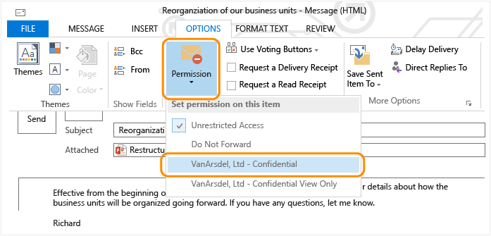
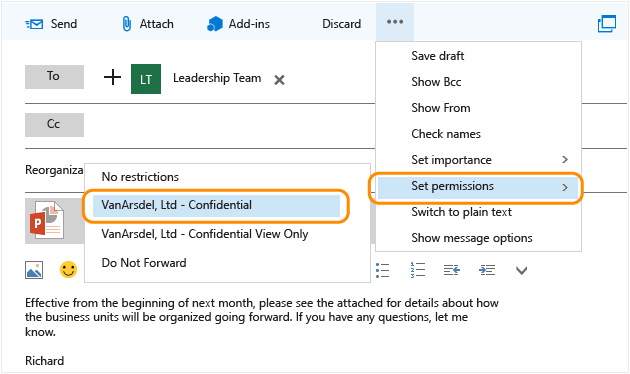

---
# required metadata

title: AIP Scenario - Send a company-confidential email
description: This scenario and supporting user documentation uses Azure Rights Management protection so that any user in the organization can safely send email communications that cannot be read outside the organization. 
author: cabailey
ms.author: cabailey
manager: mbaldwin
ms.date: 02/23/2017
ms.topic: get-started-article
ms.prod:
ms.service: information-protection
ms.technology: techgroup-identity
ms.assetid: 950799e9-2289-48c7-b95a-f54a8ead520a

# optional metadata

#ROBOTS:
#audience:
#ms.devlang:
ms.reviewer: esaggese
ms.suite: ems
#ms.tgt_pltfrm:
#ms.custom:

---

# Scenario - Send a company-confidential email

>*Applies to: Azure Information Protection, Office 365*

This scenario and supporting user documentation uses the Azure Rights Management technology from Azure Information Protection, so that any user in the organization can safely send email communications that cannot be read outside the organization. For example, if somebody forwards the email message to somebody in another organization or to a personal email account. The emails and any attachments will be protected by Azure Rights Management and a template that users select from the email client.

The simplest way to enable this scenario is to use one of the built-in, default templates that automatically restrict access to all users in your organization. But if required, you can make this more restrictive by creating a custom template that for example, restricts access to a subset of users, or has other restrictions such as read-only or an expiration date, or disables the Forward button in the email client.

> [!IMPORTANT]
> In this scenario, although you can remove the **Forward** right from a custom template that you configure, and this will disable the Forward button in the email client, this configuration doesn't prevent users from sharing the email with another authorized user. The recipient could save the email (and any attachments) and then share the information by using other sharing mechanisms.
> 
> For example, Bob sends an email to Alice using a custom template that applies the Save File and Edit Content custom rights to the Marketing group, and does not include the Forward right. Even though Alice cannot forward the email to others, she can save the email message and any attachments to a USB drive or file server share, which any member of the Marketing group can then read and edit if they can access these files. Users who are not in the Marketing group will not be able to open the content.

The instructions are suitable for the following set of circumstances:

-   Any user within the organization wants to share information with others inside the organization, but that information should not be shared outside the organization.

-   The information to be shared can be within the email message or attachment.

-   Users must manually select the template from within their email client.

## Deployment instructions

Make sure that the following requirements are in place before going on to the user documentation.

## Requirements for this scenario
For the instructions for this scenario to work, the following must be in place:

|Requirement|If you need more information|
|---------------|--------------------------------|
|You have prepared accounts and groups for Office 365 or Azure Active Directory|[Preparing for Azure Information Protection](../plan-design/prepare.md)|
|Your Azure Information Protection tenant key is managed by Microsoft; you are not using BYOK|[Planning and implementing your Azure Information Protection tenant key](../plan-design/plan-implement-tenant-key.md)|
|Azure Rights Management is activated|[Activating Azure Rights Management](../deploy-use/activate-service.md)|
|One of the following:  - Exchange Online is enabled for Azure Rights Management  - The RMS connector is installed and configured for Exchange on-premises|For Exchange Online: See the **Exchange Online: IRM Configuration** section from [Office 365: Configuration for clients and online services](../deploy-use/configure-office365.md).  For Exchange on-premises: [Deploying the Azure Rights Management connector](../deploy-use/deploy-rms-connector.md)|
|You have not archived the default Azure Rights Management template **&lt;organization&gt; - Confidential**. Or, you have configured a custom template for this purpose because you need more restrictive settings or only a subset of users in the organization should be able to read the protected emails.|[Configuring custom templates for the Azure Rights Management service](../deploy-use/configure-custom-templates.md)  Tip: If you need more restrictive usage policy settings but for all users in the organization, copy and then edit one of the default templates, rather than create a template from scratch.  Updated templates do not refresh immediately for the email clients in this scenario. Check the [Refreshing templates for users](../deploy-use/refresh-templates.md) article for information.|
|Users that send the protected email have Outlook 2013 or Outlook 2016, or Outlook Web Access.  Users that receive the email have an email client that supports Azure Rights Management.|You can use Outlook 2010, but you must [install the Rights Management sharing application for Windows](../rms-client/sharing-app-admin-guide.md#automatic-deployment-for-the-microsoft-rights-management-sharing-application) and adjust the user instructions accordingly.  For a list of email clients that support Azure Rights Management, see the **Email** column in the table from [Applications that support Azure Rights Management data protection](../get-started/requirements-applications.md).|

## User documentation instructions
Using the following template, copy and paste the user instructions into a communication for your end users, and make these modifications to reflect your environment:

1.  Replace all instances of *&lt;organization name&gt;* with the name of your organization.

2.  Replace all instances of *&lt;organization name - Confidential&gt;* with the name of your default or custom template.

3.  Replace the screenshots so that they show your organization template names.

4.  Replace *&lt;contact details&gt;* with instructions for how your users can contact the help desk, such as a website link, email address, or telephone number.

5.  **Additional modifications you might want to make:**

    -   If it is practical to limit instructions to one email client only, consider doing this for simplicity and delete the other set of instructions.

    -   If you use a custom template rather than the suggested default template, revise the wording in accordingly:

        -   Make the title more specific.

        -   Specify the users or groups to select in step 1.

        -   Specify the name of the custom template in step 2.

        -   Modify the final paragraph to explain the restrictions the recipients will have.

6.  Make any other modifications that you want to this set of instructions, and then send it to these users.

7.  Because some clients do not support Rights Management, you might need to provide guidance and recommendations for the recipients of these protected email messages. This information will be based on which devices and email applications are in use in your organization and any preferences that you have. For example, recommend that iOS users read protected emails with Outlook for iPad and iPhone rather than the native iOS mail client.

    For more information about the email clients, see the **Email** column in the [Client devices capability](https://technet.microsoft.com/library/dn655136.aspx) table, from [Requirements for Azure Rights Management](https://technet.microsoft.com/library/dn655136.aspx).

The example documentation shows how these instructions might look for users, after your customizations.

### How to send emails that contain company-confidential information using Outlook

1.  Within Outlook, create a new mail message, add any attachments that you want to include, and then select users or groups from *&lt;organization name&gt;*.

2.  From the **OPTIONS** tab, click **Permission**, and then select **&lt;organization name - Confidential&gt;**:

    

3.  Send the message.

### How to send emails that contain company-confidential information using Outlook Web App

1.  Within the Outlook Web App, create a new mail message, add any attachments that you want to include, and then select *&lt;organization name&gt;* users or groups from the address book.

2.  Click **…**, click **Set permissions**, and then select **&lt;organization name - Confidential&gt;**:

    

3.  Send the message.

When somebody on the **To**, **Cc**, or **Bcc** line receives this email, they might be asked to authenticate before they can read the message, to verify that they are a user from *&lt;organization name&gt;*. Other times, users are not prompted because they are already authenticated.

People that you send your email to will be able to forward it to other people, but only users from *&lt;organization name&gt;* will be able to read it. If you attach an Office document, it will have the same protection, even if that attachment is saved with a different name, to another location. However, successfully authenticated users can copy and paste from the email or attachment, or print from it. If you need more restrictive protection that prevents actions such as these, contact the help desk.

**Need help?**

-   Contact the help desk:

    -   *&lt;contact details&gt;*

### Example customized user documentation

#### How to send emails that contain company-confidential information using Outlook

1.  Within Outlook, create a new mail message, add any attachments that you want to include, and then select VanArsdel users or groups from the address book.

2.  From the **OPTIONS** tab, click **Permission**, and then select **VanArsdel, Ltd - Confidential**:

    

3.  Send the message.

#### How to send emails that contain company-confidential information using Outlook Web App

1.  Within the Outlook Web App, create a new mail message, add any attachments that you want to include, and then select VanArsdel users or groups from the address book.

2.  Click **…**, click **Set permissions**, and then select **VanArsdel, Ltd - Confidential**:

    

3.  Send the message.

When somebody on the **To**, **Cc**, or **Bcc** line receives this email, they might be asked to authenticate before they can read the message, to verify that they are a user from VanArsdel, Ltd. Other times, users are not prompted because they are already authenticated.

People that you send your email to will be able to forward it to other people, but only users from VanArsdel will be able to read it. If you attach an Office document, it will have the same protection, even if that attachment is saved with a different name, to another location. However, successfully authenticated users can copy and paste from the email or attachment, or print from it. If you need more restrictive protection that prevents actions such as these, contact the help desk.

**Need help?**

-   Contact the help desk:

    -   Email: helpdesk@vanarsdelltd.com

[!INCLUDE[Commenting house rules](../includes/houserules.md)]
