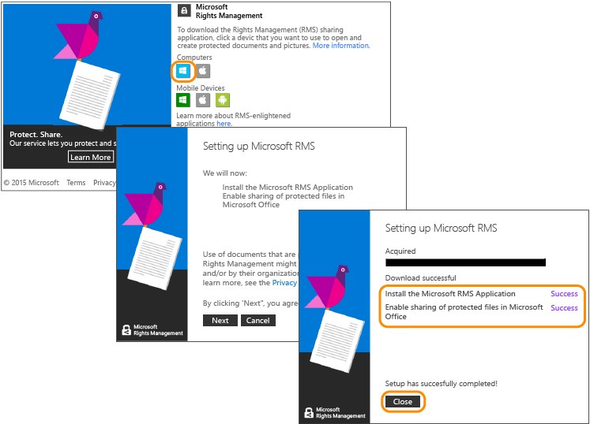

---
# required metadata

title: Azure RMS quick start tutorial - Step 2 | Azure RMS
description: The second step of a tutorial to quickly try out Microsoft Azure Rights Management for your organization with just 5 steps that should take you less than 15 minutes.
keywords:
author: cabailey
manager: mbaldwin
ms.date: 04/28/2016
ms.topic: article
ms.prod: azure
ms.service: rights-management
ms.technology: techgroup-identity
ms.assetid: f32cf2f3-29e2-429c-a0fd-b16cc482484a

# optional metadata

#ROBOTS:
#audience:
#ms.devlang:
ms.reviewer: esaggese
ms.suite: ems
#ms.tgt_pltfrm:
#ms.custom:

---

# Azure RMS quick start Step 2: Install the Rights Management sharing application

Jump to: 
> [!div class="op_single_selector"]
- [Introduction](quick-start-tutorial.md)
- [Step 1: Activate Azure RMS](tutorial-step1.md)
- [Step 2: Install RMS sharing app](tutorial-step2.md)
- [Step 3: Email the confidential doc](tutorial-step3.md)
- [Step 4: Recipient reads the doc](tutorial-step4.md)
- [Step 5: Track your doc](tutorial-step5.md)

The Rights Management sharing application (also known as the “RMS sharing app”) isn’t a requirement for Azure Rights Management, but we recommend it for all computers and mobile devices that support Azure Rights Management. The RMS sharing application integrates with Office applications by installing an Office add-in so that users can easily protect files directly from the ribbon. It also makes it possible to protect all files types by applying generic protection for files that are not natively supported by Azure Rights Management, and a document tracking site for users to track and revoke files that they have protected. We’ll be using the document tracking site later in this tutorial.

This application is free to download and offers a scripted install for production environments. But for this tutorial, we’ll install it locally.

### To download and install the Rights Management sharing application

1.  Go to the [Microsoft Rights Management](http://go.microsoft.com/fwlink/?LinkId=303970) page on the Microsoft website.

2.  In the **Computers** section, click the icon for the **RMS app for Windows** and save the **Setup.exe** file to install the Microsoft Rights Management sharing application.

3.  For a local install, you must use an administrator account to run the Setup.exe file that was downloaded. If you are prompted to continue, click **Yes**.

4.  On the **Setup Microsoft RMS** page, click **Next**, and wait for the installation to finish.

5.  When the installation finishes, click **Restart** if prompted to restart your computer, or click  **Close** to complete the installation.

You’re now ready to start protecting files that contain information that you want to share but only with the people that you specify.

|If you want more information|Additional information|
|--------------------------------|--------------------------|
|About a local installation of the Rights Management sharing application for Windows and user instructions|[Rights Management sharing application user guide](../rms-client/sharing-app-user-guide.md)|
|About the scripted installation of the Rights Management sharing application for Windows and more technical information|[Rights Management sharing application administrator guide](../rms-client/sharing-app-admin-guide.md)|
|To understand the difference between native protection and generic protection|[What’s the difference between generic protection and built-in (native) protection?](../rms-client/sharing-app-dialog-box.md#what-s-the-difference-between-generic-protection-and-built-in-native-protection-)|

>[!div class="step-by-step"]
[« Step 1](quick-start-tutorial.md)
[Step 3 »](tutorial-step3.md)