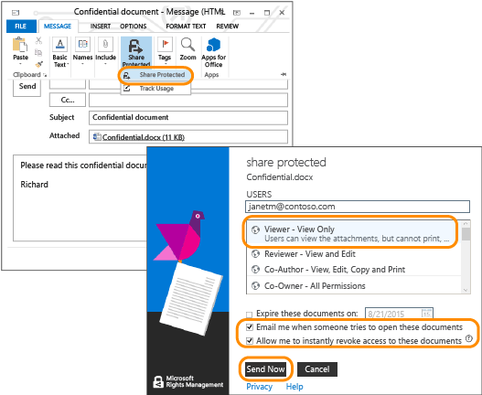

---
# required metadata

title: Azure RMS quick start tutorial - Step 3 | Azure RMS
description: The third step of a tutorial to quickly try out Microsoft Azure Rights Management for your organization with just 5 steps that should take you less than 15 minutes.
keywords:
author: cabailey
manager: mbaldwin
ms.date: 04/28/2016
ms.topic: get-started-article
ms.prod:
ms.service: rights-management
ms.technology: techgroup-identity
ms.assetid: c604e749-8918-40e8-8148-6bd000cb2be2

# optional metadata

#ROBOTS:
#audience:
#ms.devlang:
ms.reviewer: esaggese
ms.suite: ems
#ms.tgt_pltfrm:
#ms.custom:

---

# Azure RMS quick start Step 3: Email your document that you want to protect

>*Applies to: Azure Rights Management, Office 365*

Jump to: 
> [!div class="op_single_selector"]
- [Introduction](quick-start-tutorial.md)
- [Step 1: Activate Azure RMS](tutorial-step1.md)
- [Step 2: Install RMS sharing app](tutorial-step2.md)
- [Step 3: Email the confidential doc](tutorial-step3.md)
- [Step 4: Recipient reads the doc](tutorial-step4.md)
- [Step 5: Track your doc](tutorial-step5.md)

For this step, first create and save a document using Word that will represent your document that you want to protect, and name it **Confidential.docx**. For this tutorial, it doesn’t matter what text it actually contains, but you will want it to contain some text so you can more easily confirm that the authorized recipient could read it. For example, you might type: **If you can read this from your email attachment, the sender has successfully shared a file that was protected with Azure RMS.**

You’re then ready to safely share this document by email.

### To safely share your document by email

1.  Using Outlook, create a new message and attach the file that you just created.

2.  In the **To** box, type one or more business email addresses. Make sure you specify a business email address, such as **janetm@contoso.com** or **p.dover@fabrikam.com** because currently, Azure Rights Management doesn’t support personal email addresses that you might use at home from your Internet provider. Don’t worry about whether the person you’re sending it to also has Azure Rights Management or not.

3.  Type a subject, such as  **Confidential document** and then type a short message for the email, such as **Please read this confidential document and do not share it with others.**

4.  Then, on the **Message** tab, in the **RMS** group, click **Share Protected** and then click **Share Protected** again:

5.  In the **share protected** dialog box:

    1.  Select **Viewer – View Only**.

        This means our recipients will be able to view the document but not edit or print it.

    2.  Select **Email me when somebody tries to open these documents**.

        You’ll get an email notification each time the recipients try to open the attachment, and also if somebody else tries to open it—for example, your recipient forwards the email to co-worker. In this last scenario, you’ll see that access was denied and from the user details, you can decide whether to send that person a copy of the document that they can open.

    3.  Select **Allow me to instantly revoke access to these documents**.

        This option requires the recipients to have an Internet connection each time they open the attachment but with the benefit that if you later revoke the document, the next time they try to open it, they will not be able to. If you do not select this option, the recipients might be able to open it even without an Internet connection but with the disadvantage that if you later revoke the document, there might be a delay for when that takes effect.

    4.  Click **Send Now**.

        The email with attachment is sent to the email addresses that you specified. In addition to your email message, they will see instructions how to read the attached document that is protected by Azure Rights Management.

Now you’ve sent your protected document, you’re ready to ask your recipients to wait for it to arrive and then open it. But don’t close Outlook, because we’ll use it again in our final step to track the attachment.

|If you want more information|Additional information|
|--------------------------------|--------------------------|
|Full instructions and alternative methods for protecting files that you share by email|[Protect a file that you share by email by using the Rights Management sharing application](../rms-client/sharing-app-protect-by-email.md)|
|About the options in the **share protected** dialog box|[Dialog box options for the Rights Management sharing application](../rms-client/sharing-app-dialog-box.md)|

>[!div class="step-by-step"]
[« Step 2](tutorial-step2.md)
[Step 4 »](tutorial-step4.md)