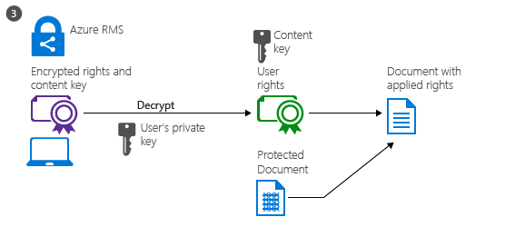

---
# required metadata

title: How Azure RMS works - Azure Information Protection
description: Breaking down how Azure RMS works, the cryptographic controls that it uses, and step-by-step diagrams of how this process works.
author: cabailey
ms.author: cabailey
manager: barbkess
ms.date: 03/08/2019
ms.topic: conceptual
ms.collection: M365-security-compliance
ms.service: information-protection
ms.assetid: ed6c964e-4701-4663-a816-7c48cbcaf619

# optional metadata

#ROBOTS:
#audience:
#ms.devlang:
ms.reviewer: esaggese
ms.suite: ems
#ms.tgt_pltfrm:
#ms.custom:

---

# How does Azure RMS work? Under the hood

>*Applies to: [Azure Information Protection](https://azure.microsoft.com/pricing/details/information-protection), [Office 365](https://download.microsoft.com/download/E/C/F/ECF42E71-4EC0-48FF-AA00-577AC14D5B5C/Azure_Information_Protection_licensing_datasheet_EN-US.pdf)*

An important thing to understand about how Azure RMS works, is that this data protection service from Azure Information Protection, does not see or store your data as part of the protection process. Information that you protect is never sent to or stored in Azure, unless you explicitly store it in Azure or use another cloud service that stores it in Azure. Azure RMS simply makes the data in a document unreadable to anyone other than authorized users and services:

- The data is encrypted at the application level and includes a policy that defines the authorized use for that document.

- When a protected document is used by a legitimate user or it is processed by an authorized service, the data in the document is decrypted and the rights that are defined in the policy are enforced.

At a high level, you can see how this process works in the following picture. A document containing the secret formula is protected, and then successfully opened by an authorized user or service. The document is protected by a content key (the green key in this picture). It is unique for each document and is placed in the file header where it is protected by your Azure Information Protection tenant root key (the red key in this picture). Your tenant key can be generated and managed by Microsoft, or you can generate and manage your own tenant key.

Throughout the protection process when Azure RMS is encrypting and decrypting, authorizing, and enforcing restrictions, the secret formula is never sent to Azure.

For a detailed description of what’s happening, see the [Walkthrough of how Azure RMS works: First use, content protection, content consumption](#walkthrough-of-how-azure-rms-works-first-use-content-protection-content-consumption) section in this article.

For technical details about the algorithms and key lengths that Azure RMS uses, see the next section.

## Cryptographic controls used by Azure RMS: Algorithms and key lengths
Even if you don't need to know in detail how this technology works, you might be asked about the cryptographic controls that it uses. For example, to confirm that the security protection is industry-standard.

|Cryptographic controls|Use in Azure RMS|
|-|-|
|Algorithm: AES  Key length: 128 bits and 256 bits [[1]](#footnote-1)|Content protection|
|Algorithm: RSA  Key length: 2048 bits [[2]](#footnote-2)|Key protection|
|SHA-256|Certificate signing|

###### Footnote 1 

256 bits is used by the Azure Information Protection client in the following scenarios:

- Generic protection (.pfile)

- Native protection for PDF documents when the document has been protected with the ISO standard for PDF encryption or the resulting protected document has a .ppdf file name extension.

- Native protection for text or image file (such as .ptxt or .pjpg).

###### Footnote 2

2048 bits is the key length when the Azure Rights Management service is activated. 1024 bits is supported for the following optional scenarios:

- During a migration from on-premises if the AD RMS cluster is running in Cryptographic Mode 1.

- After a migration from on-premises, if the AD RMS cluster was using Exchange Online.

- For archived keys that were created on-premises before the migration, so that content that was previously protected by AD RMS can continue to be opened by the Azure Rights Management service post migration.

- If customers choose to bring their own key (BYOK) by using Azure Key Vault. Azure Information Protection supports key lengths of 1024 bits and 2048 bits. For higher security, we recommend a key length of 2048 bits.

### How the Azure RMS cryptographic keys are stored and secured

For each document or email that is protected by Azure RMS, Azure RMS creates a single AES key (the "content key"), and that key is embedded to the document, and persists through editions of the document. 

The content key is protected with the organization’s RSA key (the "Azure Information Protection tenant key") as part of the policy in the document, and the policy is also signed by the author of the document. This tenant key is common to all documents and emails that are protected by the Azure Rights Management service for the organization and this key can only be changed by an Azure Information Protection administrator if the organization is using a tenant key that is customer-managed (known as "bring your own key", or BYOK). 

This tenant key is protected in Microsoft’s online services, in a highly controlled environment and under close monitoring. When you use a customer-managed tenant key (BYOK), this security is enhanced by the use of an array of high-end hardware security modules (HSMs) in each Azure region, without the ability for the keys to be extracted, exported, or shared under any circumstances. For more information about the tenant key and BYOK, see [Planning and implementing your Azure Information Protection tenant key](plan-implement-tenant-key.md).

Licenses and certificates that are sent to a Windows device are protected with the client’s device private key, which is created the first time a user on the device uses Azure RMS. This private key, in turn, is protected with DPAPI on the client, which protects these secrets by using a key derived from the user’s password. On mobile devices, the keys are used only one time, so because they are not stored on the clients, these keys don’t need to be protected on the device. 

## Walkthrough of how Azure RMS works: First use, content protection, content consumption
To understand in more detail how Azure RMS works, let's walk through a typical flow after the [Azure Rights Management service is activated](activate-service.md) and when a user first uses the Rights Management service on their Windows computer (a process sometimes known as **initializing the user environment** or bootstrapping), **protects content** (a document or email), and then **consumes**  (opens and uses) content that has been protected by somebody else.

After the user environment is initialized, that user can then protect documents or consume protected documents on that computer.

> [!NOTE]
> If this user moves to another Windows computer, or another user uses this same Windows computer, the initialization process is repeated.

### Initializing the user environment
Before a user can protect content or consume protected content on a Windows computer, the user environment must be prepared on the device. This is a one-time process and happens automatically without user intervention when a user tries to protect or consume protected content:

**What's happening in step 1**: The RMS client on the computer first connects to the Azure Rights Management service, and authenticates the user by using their Azure Active Directory account.

When the user’s account is federated with Azure Active Directory, this authentication is automatic and the user is not prompted for credentials.

**What's happening in step 2**: After the user is authenticated, the connection is automatically redirected to the organization’s Azure Information Protection tenant, which issues certificates that let the user authenticate to the Azure Rights Management service in order to consume protected content and to protect content offline.

One of these certificates is the rights account certificate, often abbreviated to RAC. This certificate authenticates the user to Azure Active Directory and is valid for 31 day. The certificate is automatically renewed by the RMS client, providing the user account is still in Azure Active Directory and the account is enabled. This certificate is not configurable by an administrator. 

A copy of this certificate is stored in Azure so that if the user moves to another device, the certificates are created by using the same keys.

### Content protection
When a user protects a document, the RMS client takes the following actions on an unprotected document:

**What's happening in step 1**: The RMS client creates a random key (the content key) and encrypts the document using this key with the AES symmetric encryption algorithm.

**What's happening in step 2**: The RMS client then creates a certificate that includes a policy for the document that includes the [usage rights](configure-usage-rights.md) for users or groups, and other restrictions, such as an expiration date. These settings can be defined in a template that an administrator previously configured, or specified at the time the content is protected (sometimes referred to as an "ad hoc policy").   

The main Azure AD attribute used to identify the selected users and groups is the Azure AD ProxyAddresses attribute, which stores all the email addresses for a user or group. However, if a user account doesn't have any values in the AD ProxyAddresses attribute, the user's UserPrincipalName value is used instead.

The RMS client then uses the organization’s key that was obtained when the user environment was initialized and uses this key to encrypt the policy and the symmetric content key. The RMS client also signs the policy with the user’s certificate that was obtained when the user environment was initialized.

**What's happening in step 3**: Finally, the RMs client embeds the policy into a file with the body of the document encrypted previously, which together comprise a protected document.

This document can be stored anywhere or shared by using any method, and the policy always stays with the encrypted document.

### Content consumption
When a user wants to consume a protected document, the RMS client starts by requesting access to the Azure Rights Management service:

**What's happening in step 1**: The authenticated user sends the document policy and the user’s certificates to the Azure Rights Management service. The service decrypts and evaluates the policy, and builds a list of rights (if any) the user has for the document. To identify the user, the Azure AD ProxyAddresses attribute is used for the user's account and groups to which the user is a member. For performance reasons, group membership is [cached](prepare.md#group-membership-caching-by-azure-information-protection). If the user account has no values for the Azure AD ProxyAddresses attribute, the value in the Azure AD UserPrincipalName is used instead.

**What's happening in step 2**: The service then extracts the AES content key from the decrypted policy. This key is then encrypted with the user’s public RSA key that was obtained with the request.

The re-encrypted content key is then embedded into an encrypted use license with the list of user rights, which is then returned to the RMS client.

**What's happening in step 3**: Finally, the RMS client takes the encrypted use license and decrypts it with its own user private key. This lets the RMS client decrypt the document’s body as it is needed and render it on the screen.

The client also decrypts the rights list and passes them to the application, which enforces those rights in the application’s user interface.

> [!NOTE]
> When users who are external to your organization consume content that you've protected, the consumption flow is the same. What changes for this scenario, is how the user is authenticated. For more information, see [When I share a protected document with somebody outside my company, how does that user get authenticated?](./faqs-rms.md#when-i-share-a-protected-document-with-somebody-outside-my-company-how-does-that-user-get-authenticated)

### Variations
The preceding walkthroughs cover the standard scenarios but there are some variations:

- **Email protection**: When Exchange Online and Office 365 Message Encryption with new capabilities is used to protect email messages, authentication for consumption can also use federation with a social identity provider or by using a one-time passcode. Then, the process flows are very similar, except that content consumption happens service-side in a web browser session over a temporarily cached copy of the outbound email.

- **Mobile devices**: When mobile devices protect or consume files with the Azure Rights Management service, the process flows are much simpler. Mobile devices don’t first go through the user initialization process because instead, each transaction (to protect or consume content) is independent. As with Windows computers, mobile devices connect to the Azure Rights Management service and authenticate. To protect content, mobile devices submit a policy and the Azure Rights Management service sends them a publishing license and symmetric key to protect the document. To consume content, when mobile devices connect to the Azure Rights Management service and authenticate, they send the document policy to the Azure Rights Management service and request a use license to consume the document. In response, the Azure Rights Management service sends the necessary keys and restrictions to the mobile devices. Both processes use TLS to protect the key exchange and other communications.

- **RMS connector**: When the Azure Rights Management service is used with the RMS connector, the process flows remain the same. The only difference is that the connector acts as a relay between the on-premises services (such as Exchange Server and SharePoint Server) and the Azure Rights Management service. The connector itself does not perform any operations, such as the initialization of the user environment, or encryption or decryption. It simply relays the communication that would usually go to an AD RMS server, handling the translation between the protocols that are used on each side. This scenario lets you use the Azure Rights Management service with on-premises services.

- **Generic protection (.pfile)**: When the Azure Rights Management service generically protects a file, the flow is basically the same for content protection except that the RMS client creates a policy that grants all rights. When the file is consumed, it is decrypted before it is passed to the target application. This scenario lets you protect all files, even if they don’t natively support RMS.

- **Microsoft accounts**: Azure Information Protection can authorize email addresses for consumption when they are authenticated with a Microsoft account. However, not all applications can open protected content when a Microsoft account is used for authentication. [More information](secure-collaboration-documents.md#supported-scenarios-for-opening-protected-documents).

## Next steps

To learn more about the Azure Rights Management service, use the other articles in the **Understand & Explore** section, such as [How applications support the Azure Rights Management service](applications-support.md) to learn how your existing applications can integrate with Azure Rights Management to provide an information protection solution. 

Review [Terminology for Azure Information Protection](./terminology.md) so that you’re familiar with the terms that you might come across as you’re configuring and using the Azure Rights Management service, and be sure to also check [Requirements for Azure Information Protection](requirements.md) before you start your deployment. If you want to dive right in and try it out for yourself, use the [Edit the policy and create a new label](infoprotect-quick-start-tutorial.md) tutorial.

If you’re ready to start deploying data protection for your organization, use the [Azure Information Protection deployment roadmap](deployment-roadmap.md) for your deployment steps and links for how-to instructions.

> [!TIP]
> For additional information and help, use the resources and links in [Information and support for Azure Information Protection](information-support.md).
