---
# required metadata

title: Tutorial - Use Azure Information Protection to control oversharing - AIP
description: An introduction tutorial to configure and see in action advanced client settings for the Azure Information Protection client to warn, prompt for justification, or block messages from being sent from Outlook.
author: cabailey
ms.author: cabailey
manager: barbkess
ms.date: 07/19/2019
ms.topic: tutorial
ms.collection: M365-security-compliance
ms.service: information-protection

# optional metadata

#ROBOTS:
#audience:
#ms.devlang:
#ms.suite: ems
#ms.tgt_pltfrm:
#ms.custom:

---

# Tutorial: Configure Azure Information Protection to control oversharing of information using Outlook

>*Applies to: [Azure Information Protection](https://azure.microsoft.com/pricing/details/information-protection)*
>
> *Instructions for: [Azure Information Protection client for Windows](faqs.md#whats-the-difference-between-the-azure-information-protection-client-and-the-azure-information-protection-unified-labeling-client)*

In this tutorial, you learn how to:
> [!div class="checklist"]
> * Configure settings that implement warn, justify, or block popup messages in Outlook
> * See your settings in action
> * Review the logged user messages and actions in the Event Log 

Email is one of the most common methods by which users inappropriately share information—whether it's in the email message itself or in attachments. You might use data loss prevention (DLP) solutions that can identify known sensitive information and help prevent it from leaving your organization boundaries. However, you can also use the Azure Information Protection client with some advanced client settings to help prevent oversharing and also educate your users with interactive messages that provide feedback in real time.

This tutorial steps you through a basic configuration that uses just one label to illustrate the warn, justify, and block messages that users can see and respond to.

You can finish this tutorial in about 15 minutes.

## Prerequisites 

To complete this tutorial, you need:

1. A subscription that includes Azure Information Protection Plan 2.
    
    If you don't have a subscription that includes this plan, you can create a [free](https://admin.microsoft.com/Signup/Signup.aspx?OfferId=87dd2714-d452-48a0-a809-d2f58c4f68b7) account for your organization.

2. You've added the Azure Information Protection blade to the Azure portal, and have at least one label.
    
    Although this tutorial uses the default label, **General**, you can substitute this label for another one if you prefer. If you need help adding the Azure Information Protection blade, or don't yet have any labels, see [Quickstart: Add Azure Information Protection to the Azure portal and view the policy](quickstart-viewpolicy.md).

3. A computer running Windows (minimum of Windows 7 with Service Pack 1), and on this computer, you can sign in to Outlook. Be prepared to restart Outlook multiple times during this tutorial.

4. The Azure Information Protection client is installed on your computer.
    
    To install the client, go to the [Microsoft download center](https://www.microsoft.com/en-us/download/details.aspx?id=53018) and download **AzInfoProtection.exe** from the Azure Information Protection page.

For a full list of prerequisites to use Azure Information Protection, see [Requirements for Azure Information Protection](requirements.md).

Let's get started.

## Identify a label ID for testing

For this tutorial, we'll use just one label to see the resulting behavior for users. You can use any label, but a good example for testing is the default label named **General**, which is typically suitable for business data that is not intended for public consumption, and does not apply protection.

To specify your chosen label, you must know its ID, which you identify from the Azure portal:

1. Open a new browser window and sign in to the [Azure portal](https://portal.azure.com) as a global admin. Then navigate to **Azure Information Protection**. 
    
    For example, on the hub menu, click **All services** and start typing **Information** in the Filter box. Select **Azure Information Protection**.
    
    If you are not the global admin, use the following link for alternative roles: [Signing in to the Azure portal](configure-policy.md#signing-in-to-the-azure-portal)

2. Select **Classifications** > **Labels** and then select the **General** label to open the **Label: General** blade. 

3. Locate the label ID at the bottom of the blade:
    
    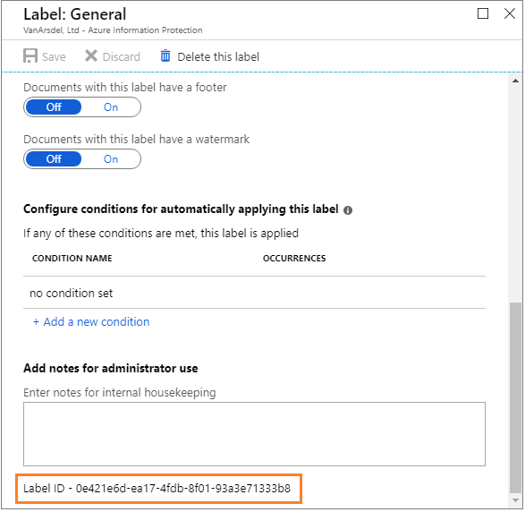

4. Copy and paste the label ID value into a temporary file so that this value can be easily copied for a later step. In our example, this label ID value is **0e421e6d-ea17-4fdb-8f01-93a3e71333b8**.

5. Close the **Label: General** blade, but do not close the Azure portal.

## Create a scoped policy to test the new advanced client settings

We'll create a new scoped policy so that the new advanced client settings will apply to just you, for testing.

1. On the **Azure Information Protection - Policies** blade, select **Add a new policy**. You then see the **Policy** blade that displays labels and settings from your existing global policy.

2. Specify the policy name of **Oversharing tutorial** and optionally, a description of **Advanced client settings to control oversharing using Outlook**.

3. Select **Specify which users/groups get this policy**, and using the subsequent blades, specify your own user account.

4. With your account name now displayed on the **Policy** blade, select **Save** without making additional changes to the labels or settings on this blade. You might be prompted to confirm your choice. 

This scoped policy is now ready to add advanced client settings. Close the **Policy: Oversharing tutorial** blade, but do not close the Azure portal.

## Configure and test advanced client settings to warn, prompt for justification, or block emails that have the General label

For this step of the tutorial, we'll specify the following advanced client settings, and test each in turn:

- **OutlookWarnUntrustedCollaborationLabel**
- **OutlookJustifyUntrustedCollaborationLabel**
- **OutlookBlockUntrustedCollaborationLabel**

### Create the advanced client setting to warn users if an email or attachment has the General label

Using the newly created scoped policy, we'll add a new advanced client setting named **OutlookWarnUntrustedCollaborationLabel** with the ID of your **General** label: 

1. Back on the **Azure Information Protection - Policies** blade, select the context menu (**...**) next to **Oversharing tutorial**. Then select **Advanced settings**.

2. On the **Advanced settings** blade, type the advanced setting name, **OutlookWarnUntrustedCollaborationLabel**, and paste your own label ID for the value. Using our example label ID:
    
    
    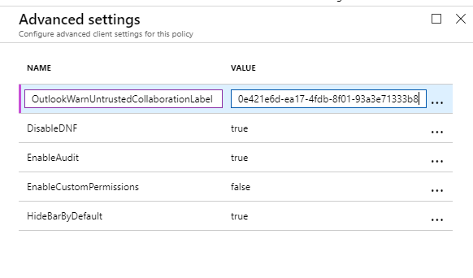

3. Select **Save and close**.

Do not close the **Policies** blade, or the Azure portal.

### Test the advanced client setting to warn users if an email or attachment has the General label

On your client computer, we'll now see the results of configuring this advanced client setting.

1. On your client computer, open Outlook. 
    
    If Outlook is already open, restart it. The restart is needed to download the change we just made.

2. Create a new email message, and apply the **General** label. For example, from the **File** tab, select the **Protect** button, and then select **General**.

3. Specify your own email address for the **To** field, and for the subject, type **Testing the General label for the Warn message**. Then send the email.

4. As a result of the advanced client setting, you see the following warning, asking you to confirm before sending the email. For example:
    
    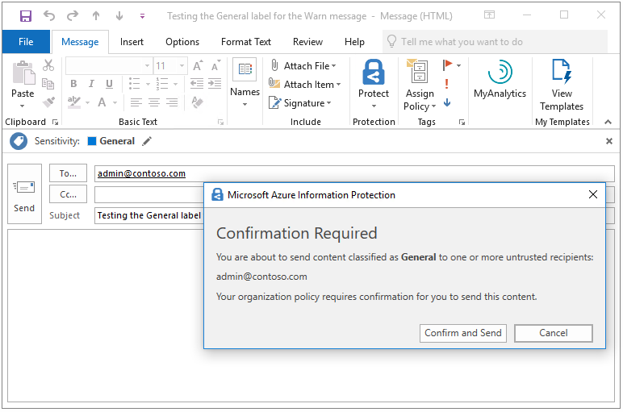
    
5. As if you are a user who has mistakenly tried to email something that was labeled **General**, select **Cancel**. You see that the email is not sent but the email message remains so you can make changes, such as change the content or the label.

6. Without making any changes, select **Send** again. This time, as if you are a user who acknowledges that the content is appropriate for sending, select **Confirm and Send**. The email is sent.

### Change the advanced client setting to prompt users to justify if an email has the General label

We'll edit the existing advanced client setting to keep your **General** label ID, but change the name to **OutlookJustifyUntrustedCollaborationLabel**: 

1. On the **Azure Information Protection - Policies** blade, select the context menu (**...**) next to **Oversharing tutorial**. Then select **Advanced settings**.

2. On the **Advanced settings** blade, replace the previous advanced setting name you created, **OutlookWarnUntrustedCollaborationLabel**, with the new name of **OutlookJustifyUntrustedCollaborationLabel**:
    
    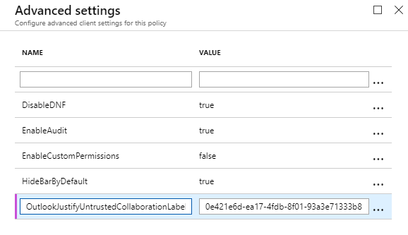

3. Select **Save and close**.

Do not close the **Policies** blade, or the Azure portal.

### Test the advanced client setting to prompt users to justify if an email has the General label

On your client computer, we'll now see the results of this new advanced client setting.

1. On your client computer, restart Outlook to download the change we just made.

2. Create a new email message, and as before, apply the **General** label. For example, from the **File** tab, select the **Protect** button, and then select **General**.

3. Specify your own email address for the **To** field, and for the subject, type **Testing the General label for the Justify message**. Then send the email.

4. This time, you see the following message, asking you to provide justification before sending the email. For example:
    
    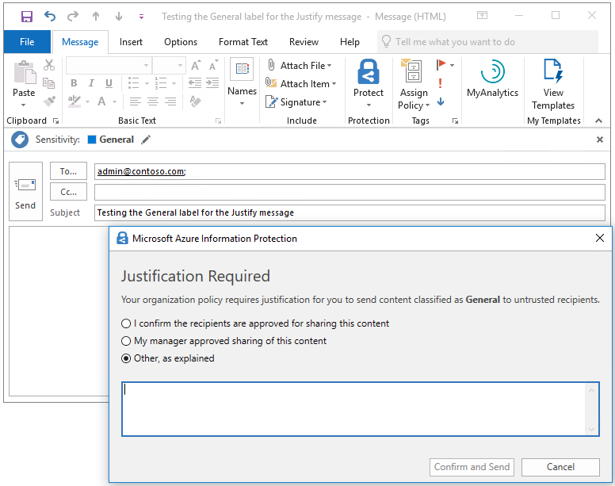
    
5. As if you are a user who has mistakenly tried to email something that was labeled as **General**, select **Cancel**. You see that the email is not sent but the email message itself remains so you can make changes, such as change the content or the label.

6. Without making any changes, select **Send** again. This time, select one of the justification options, such as **I confirm the recipients are approved for sharing this content**, and then select **Confirm and Send**. The email is sent.

### Change the advanced client setting to block users from sending an email that has the General label

We'll edit the existing advanced client setting one more time, to keep your **General** label ID, but change the name to **OutlookBlockUntrustedCollaborationLabel**: 

1. In the Azure portal, on the **Azure Information Protection - Policies** blade, select the context menu (**...**) next to **Oversharing tutorial**. Then select **Advanced settings**.

2. On the **Advanced settings** blade, replace the previous advanced setting name you created, **OutlookJustifyUntrustedCollaborationLabel**, with the new name of **OutlookBlockUntrustedCollaborationLabel**:
    
    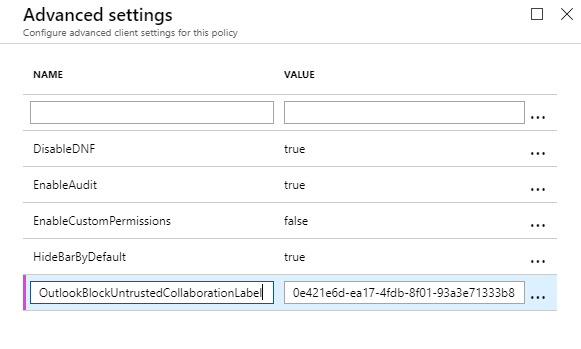

3. Select **Save and close**.

Do not close the **Policies** blade, or the Azure portal.

### Test the advanced client setting to block users from sending an email that has the General label

On your client computer, we'll now see the results of this new advanced client setting.

1. On your client computer, restart Outlook to download the change we just made.

2. Create a new email message, and as before, apply the **General** label. For example, from the **File** tab, select the **Protect** button, and then select **General**.

3. Specify your own email address for the **To** field, and for the subject, type **Testing the General label for the Block message**. Then send the email.

4. This time, you see the following message that prevents the email from being sent. For example:
    
    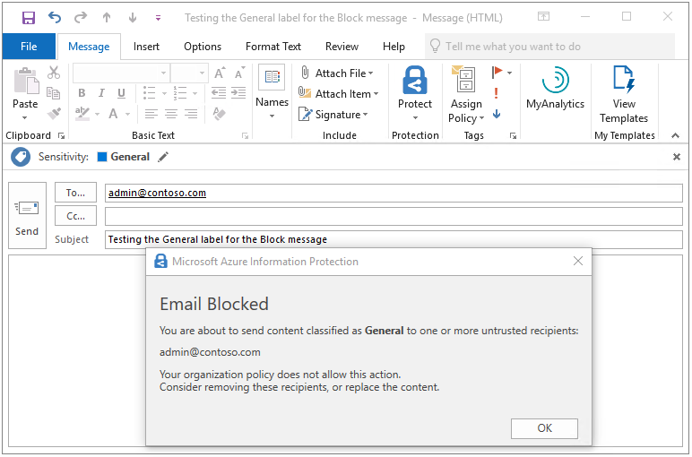

5. Acting as your user, you see the only option available is **OK**, which takes you back to the email message where you can make changes. Select **OK**, and cancel this email message.

### Use Event Log to identify the messages and user actions for the General label

Before we move on to the next scenario for when an email or attachment doesn't have a label, start Event Viewer and navigate to **Applications and Services Logs** > **Azure Information Protection**.

For each of the tests that you did, information events are created to record both the message and the user response:

- Warn messages: Information ID 301

- Justify messages: Information ID 302

- Block messages: Information ID 303

For example, the first test was to warn the user, and you selected **Cancel**, so the **User Response** displays **Dismissed** in the first Event 301. For example:

```
Client Version: 1.53.10.0
Client Policy ID: e5287fe6-f82c-447e-bf44-6fa8ff146ef4
Item Full Path: Testing the General label for the Warn message.msg
Item Name: Testing the General label for the Warn message
Process Name: OUTLOOK
Action: Warn
Label After Action: General
Label ID After Action: 0e421e6d-ea17-4fdb-8f01-93a3e71333b8
Action Source: 
User Response: Dismissed
```

However, you then selected **Confirm and Send**, which is reflected in the next Event 301, where the **User Response** displays **Confirmed**:

```
Client Version: 1.53.10.0
Client Policy ID: e5287fe6-f82c-447e-bf44-6fa8ff146ef4
Item Full Path: Testing the General label for the Warn message.msg
Item Name: Testing the General label for the Warn message
Process Name: OUTLOOK
Action: Warn
Label After Action: General
Label ID After Action: 0e421e6d-ea17-4fdb-8f01-93a3e71333b8
Action Source: 
User Response: Confirmed
```

The same pattern is repeated for the justify message, which has an Event 302. The first event has a **User Response** of **Dismissed**, and the second shows the justification that was selected. For example:

```
Client Version: 1.53.10.0
Client Policy ID: e5287fe6-f82c-447e-bf44-6fa8ff146ef4
Item Full Path: Testing the General label for the Justify message.msg
Item Name: Testing the General label for the Justify message
Process Name: OUTLOOK
Action: Justify
Label After Action: General
Label ID After Action: 0e421e6d-ea17-4fdb-8f01-93a3e71333b8
User Justification: I confirm the recipients are approved for sharing this content
Action Source: 
User Response: Confirmed

```

At the top of the event log, you see the block message logged, which has an Event 303. For example:

```
Client Version: 1.53.10.0
Client Policy ID: e5287fe6-f82c-447e-bf44-6fa8ff146ef4
Item Full Path: Testing the General label for the Block message.msg
Item Name: Testing the General label for the Block message
Process Name: OUTLOOK
Action: Block
Label After Action: General
Label ID After Action: 0e421e6d-ea17-4fdb-8f01-93a3e71333b8
Action Source: 
```

### Optional: Create an additional advanced client setting to exempt these messages for internal recipients

You tested your warn, justify, and block messages by using your own email address as the recipient. However, in a production environment, you might choose to display these messages for your specified labels only if recipients are external to your organization. You might extend that exemption to partners that your organization regularly works with.

To illustrate how this works, we'll create an additional advanced client setting named **OutlookBlockTrustedDomains** and specify your own domain name from your email address. This will prevent the block message you saw previously from displaying for recipients that share your domain name in their email address, but will still be shown for other recipients. You can similarly create additional advanced client settings for **OutlookWarnTrustedDomains** and **OutlookJustifyTrustedDomains**.

1. In the Azure portal, on the **Azure Information Protection - Policies** blade, select the context menu (**...**) next to **Oversharing tutorial**. Then select **Advanced settings**.

2. On the **Advanced settings** blade, type the advanced setting name, **OutlookBlockTrustedDomains**, and paste your domain name from your email address for the value. For example:
    
    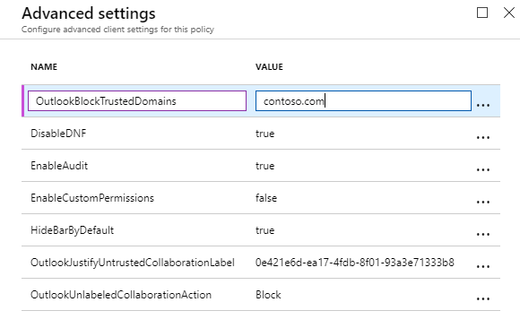

4. Select **Save and close**. Do not close the **Policies** blade, or the Azure portal.

5. Now repeat the [previous test to block users from sending an email that has the General label](#test-the-advanced-client-setting-to-block-users-from-sending-an-email-that-has-the-general-label), and you no longer see the block message when you use your own email address. However, if you add a new recipient from outside your organization, you see the block message again.

## Configure and test an advanced client setting to warn, prompt for justification, or block emails that don't have a label

For this step of the tutorial, we'll specify a new advanced client setting with different values, and test each in turn:

- **OutlookUnlabeledCollaborationAction**

### Create the advanced client setting to warn users if an email doesn't have a label

This new advanced client setting named **OutlookUnlabeledCollaborationAction** doesn't need a label ID but specifies the action to take for unlabeled content: 

1. In the Azure portal, back on the **Azure Information Protection - Policies** blade, select the context menu (**...**) next to **Oversharing tutorial**. Then select **Advanced settings**.

2. On the **Advanced settings** blade, type the advanced setting name, **OutlookUnlabeledCollaborationAction**, and for the value, specify **Warn**:
    
    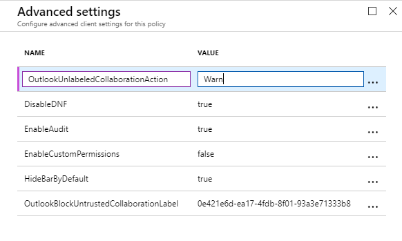

3. Select **Save and close**.

Do not close the **Policies** blade, or the Azure portal.

### Test the advanced client setting to warn users if an email doesn't have a label

On your client computer, we'll now see the results of configuring this new advanced client setting for when content doesn't have a label:

1. On your client computer, restart Outlook to download the change we just made.

2. Create a new email message, and this time, do not apply a label.

3. Specify your own email address for the **To** field, and for the subject, type **Testing send an email without a label for the Warn message**. Then send the email.

4. This time, you see a **Confirmation Required** message that you can **Confirm and Send** or **Cancel**:
    
    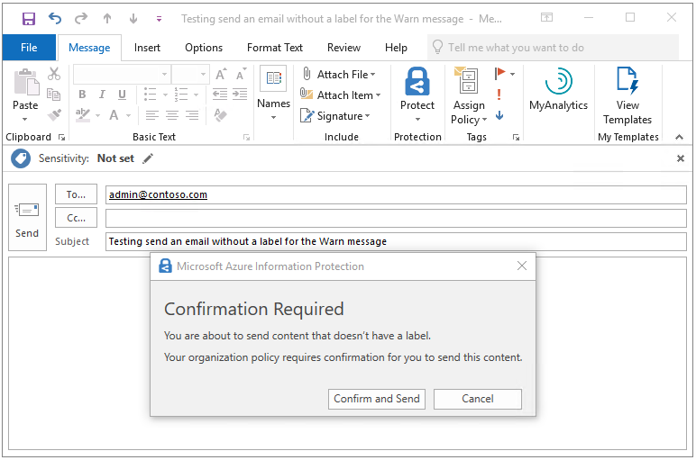

5. Select **Confirm and Send**.

### Change the advanced client setting to prompt users to justify if an email is unlabeled

We'll edit the existing advanced client setting to keep the name of **OutlookUnlabeledCollaborationAction**, but change the value to **Justify**: 

1. On the **Azure Information Protection - Policies** blade, select the context menu (**...**) next to **Oversharing tutorial**. Then select **Advanced settings**.

2. On the **Advanced settings** blade, locate the **OutlookUnlabeledCollaborationAction** setting and replace the previous value of **Warn** with new value **Justify**:
    
    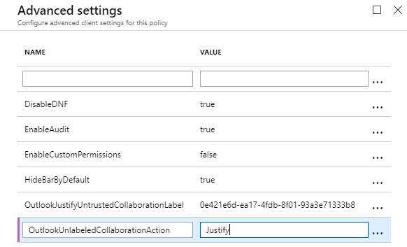

3. Select **Save and close**.

Do not close the **Policies** blade, or the Azure portal.

### Test the advanced client setting to prompt users to justify if an email isn't labeled

On your client computer, we'll now see the results of changing the value for this advanced client setting.

1. On your client computer, restart Outlook to download the change we just made.

2. Create a new email message, and as before, do not apply a label.

3. Specify your own email address for the **To** field, and for the subject, type **Testing send an email without a label for the Justify message**. Then send the email.

4. This time, you see a **Justification Required** message with different options:
    
    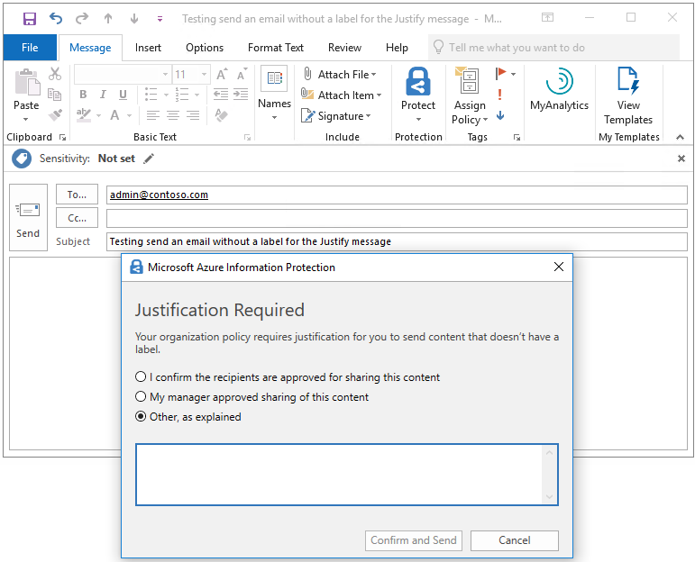

5. Select an option, such as **My manager approved sharing of this content**. Then select **Confirm and Send**.

### Change the advanced client setting to block users from sending an email that isn't labeled

As before, we'll edit the existing advanced client setting to keep the name of **OutlookUnlabeledCollaborationAction**, but change the value to **Block**: 

1. On the **Azure Information Protection - Policies** blade, select the context menu (**...**) next to **Oversharing tutorial**. Then select **Advanced settings**.

2. On the **Advanced settings** blade, locate the **OutlookUnlabeledCollaborationAction** setting and replace the previous value of **Justify** with the new value of **Block**:
    
    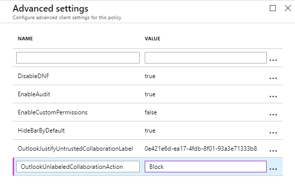

3. Select **Save and close**.

Do not close the **Policies** blade, or the Azure portal.

### Test the advanced client setting to block users from sending an email that isn't labeled

On your client computer, we'll now see the results of changing the value of this advanced client setting.

1. On your client computer, restart Outlook to download the change we just made.

2. Create a new email message, and as before, do not apply a label.

3. Specify your own email address for the **To** field, and for the subject, type **Testing send an email without a label for the Block message**. Then send the email.

4. This time, you see the following message that prevents the email from being sent, with an explanation for the user. For example:
    
    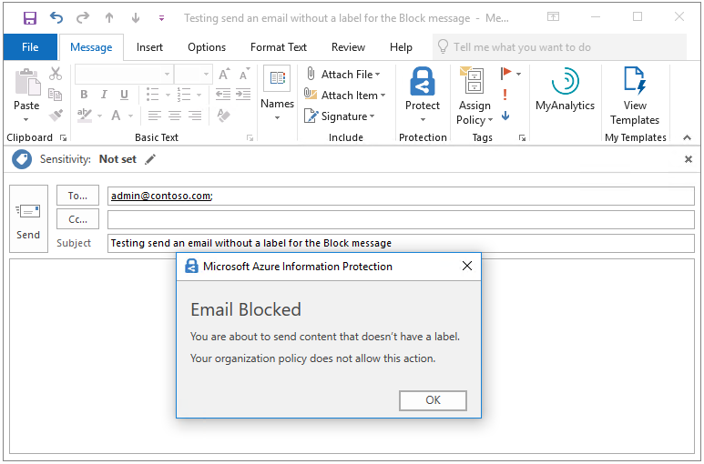

5. Acting as your user, you see the only option available is **OK**, which takes you back to the email message where you can select a label.
    
    Select **OK**, and cancel this email message.

### Use Event Log to identify the messages and user actions for the unlabeled email

As before, the messages and user responses are logged in Event Viewer, **Applications and Services Logs** > **Azure Information Protection**, with the same event IDs.

- Warn messages: Information ID 301

- Justify messages: Information ID 302

- Block messages: Information ID 303

For example, the results of our justification prompt when the email didn't have a label:

```
Client Version: 1.53.10.0
Client Policy ID: e5287fe6-f82c-447e-bf44-6fa8ff146ef4
Item Full Path: Testing send an email without a label for the Justify message.msg
Item Name: Testing send an email without a label for the Justify message
Process Name: OUTLOOK
Action: Justify
User Justification: My manager approved sharing of this content
Action Source: 
User Response: Confirmed
```

## Clean up resources

Do the following if you don't want to keep the changes that you made in this tutorial:

1. In the Azure portal, on the **Azure Information Protection - Policies** blade, select the context menu (**...**) next to **Oversharing tutorial**. Then select **Delete policy**.

2. If you are prompted to confirm, select **OK**.

Restart Outlook so it's no longer configured for the settings we configured for this tutorial.

## Next steps

For quicker testing, this tutorial used an email message to a single recipient, and without attachments. But you can apply the same method with multiple recipients, multiple labels, and also apply the same logic to email attachments whose labeling status is often less obvious to users. For example, the email message itself is labeled Public but the PowerPoint presentation attached is labeled General. For more information, see the following section from the admin guide: [Implement pop-up messages in Outlook that warn, justify, or block emails being sent](./rms-client/client-admin-guide-customizations.md#implement-pop-up-messages-in-outlook-that-warn-justify-or-block-emails-being-sent)

The admin guide also contains information about other advanced client settings that you can use to customize the behavior of the client. For a full list, see [Available advanced client settings](./rms-client/client-admin-guide-customizations.md#available-advanced-client-settings).
