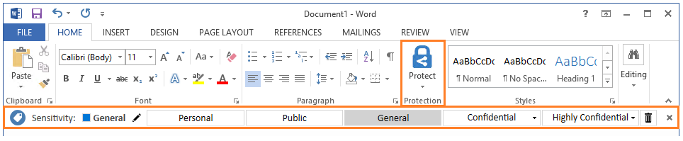
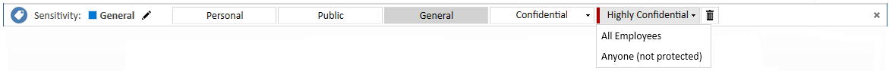
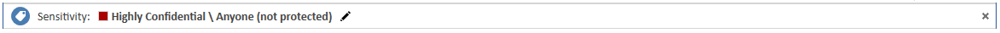
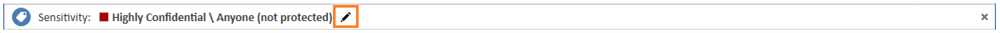
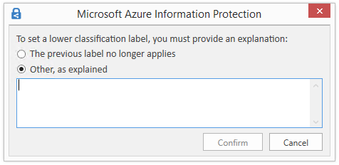
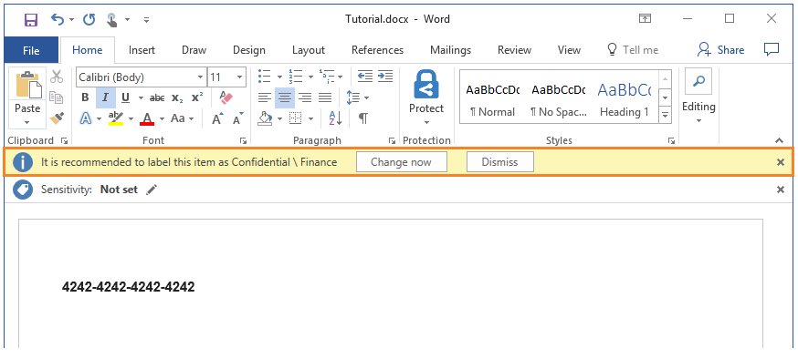

---
# required metadata

title: Tutorial - Edit the Azure Information Protection policy and create a new label
description: An introduction tutorial that edits the Azure Information Protection policy for your organization that should take you about 15 minutes to complete.
author: cabailey
ms.author: cabailey
manager: mbaldwin
ms.date: 11/07/2018
ms.topic: tutorial
ms.service: information-protection

# optional metadata

#ROBOTS:
#audience:
#ms.devlang:
#ms.reviewer: eymanor
#ms.suite: ems
#ms.tgt_pltfrm:
#ms.custom:
#Customer intent: As an administrator, I want to make it easy for users to classify data as it's created and protect it if it contains sensitive information
---

# Tutorial: Edit the Azure Information Protection policy and create a new label

>*Applies to: [Azure Information Protection](https://azure.microsoft.com/pricing/details/information-protection)*

In this tutorial, you learn how to:
> [!div class="checklist"]
> * Configure policy settings
> * Create a new label 
> * Configure the label for visual markings, recommended classification, and protection
> * See your settings and labels in action

As a result of this configuration, users see a default label applied when they create a new document or email. However, they are prompted to apply the new label when credit card information is detected. When the new label is applied, the content is reclassified and protected, with a corresponding footer and watermark. 

You can finish this tutorial in about 15 minutes.

## Prerequisites 

To complete this tutorial, you need:

1. A subscription that includes Azure Information Protection Plan 2.
    
    If you don't have a subscription that includes Azure Information Protection Plan 2, you can create a [free](https://portal.office.com/Signup/Signup.aspx?OfferId=87dd2714-d452-48a0-a809-d2f58c4f68b7) account for your organization.

2. You've added the Azure Information Protection blade to the Azure portal, and confirmed that the protection service is activated.

    If you need help with these actions, see [Quickstart: Add Azure Information Protection to the Azure portal and view the policy](quickstart-viewpolicy.md)

3. The Azure Information Protection client is installed on your computer. 
    
    To install the client, go to the [Microsoft download center](https://www.microsoft.com/en-us/download/details.aspx?id=53018) and download **AzInfoProtection.exe** from the Azure Information Protection page.

4. A computer running Windows (minimum of Windows 7 with Service Pack 1), and on this computer, you're signed in to Office apps from one of the following categories:
    
    - Office 365 with Office 2016 apps (minimum version 1805, build 9330.2078). To use this option, your account must be assigned a license for Azure Rights Management. This license is included with the Azure Information Protection subscription.
    
    - Office 365 ProPlus with 2016 apps or 2013 apps (Click-to-Run or Windows Installer-based installation).
    
    - Office Professional Plus 2016.
    
    - Office Professional Plus 2013 with Service Pack 1.
    
    - Office Professional Plus 2010 with Service Pack 2.

For a full list of prerequisites to use Azure Information Protection, see [Requirements for Azure Information Protection](requirements.md).

Let's get started.

## Edit the Azure Information Protection policy

Using the Azure portal, we'll first change a couple of policy settings, and then create a new label.

### Edit the policy settings

1. Open a new browser window and [sign in to the Azure portal](https://portal.azure.com). Then navigate to **Azure Information Protection**. 
    
    For example, on the hub menu, click **All services** and start typing **Information** in the Filter box. Select **Azure Information Protection**.

2. Select **Classifications** > **Policies** > **Global** to open the **Policy: Global** blade. 

3. Locate the policy settings after the labels, in the **Configure settings to display and apply on Information Protection end users** section. 
    
    Make a note of how the settings are currently configured. Specifically, the settings **Select the default label** and **Users must provide justification to set a lower classification label, remove a label, or remove protection**. For example:
    
    
    
    We'll use these policy settings later in the tutorial when you will see them in action.

4. For **Select the default label**, select **General**. 

    If you don't have this label because you have an older version of the policy, choose **Internal** as the equivalent label.

5. For **Users must provide justification to set a lower classification label, remove a label, or remove protection**, set this option to **On** if it is not already.

6. In addition, make sure that **Display the Information Protection bar in Office apps** is set to **On**.

7. Select **Save** on this **Policy: Global** blade, and if you're prompted to confirm your action, select **OK**. Close this blade.

### Create a new label for protection, visual markers, and a condition to prompt for classification

We'll now create a new sublabel for **Confidential**.

1. From the **Classifications** > **Labels** menu option: Right-click the **Confidential** label, and select **Add a sub-label**.
    
    If you don't have a label named **Confidential**, you can select another label or you can create a new label instead and still follow the tutorial with minor differences.

2. On the **Sub-label** blade, specify the label name of **Finance** and add the following description: **Confidential data that contains financial information that is restricted to employees only**.
    
    This text describes how the selected label is intended to be used and it's visible to users as a tooltip, to help them decide which label to select.

3. For **Set permissions for documents and emails containing this label**, select **Protect**, and then select **Protection**:
    
     
    
4. On the **Protection** blade, make sure that **Azure (cloud key)** is selected. This option uses the Azure Rights Management service to protect documents and emails. Also make sure that the **Set Permissions** option is selected. Then select **Add permissions**.

5. On the **Add permissions** blade, select **Add \<organization name> - All members**. For example, if your organization name is VanArsdel Ltd, you see the following option to select:
    
     
    
    This option automatically selects all the users in your organization who can be granted permissions. However, you can see from the other options that you could browse and search for groups or users from your tenant. Or, when you select the **Enter details** option, you can specify individual email addresses or even all users from another organization.

6. For the permissions, select **Reviewer** from the preset options. You see how this permission level automatically grants some permissions listed but not all permissions:
    
    
    
    You can select different permission levels or specify individual usage rights by using the **Custom** option. But for this tutorial, keep the **Reviewer** option. You can experiment with different permissions later and read how they restrict what the specified users can do with the protected document or email.

7. Click **OK** to close this **Add permissions** blade, and you see how the **Protection** blade is updated to reflect your configuration. For example:
    
     
    
    If you select **Add permissions**, this action opens the **Add permissions** blade again, so that you can add more users and grant them different permissions. For example, grant just view access for a specific group. But for this tutorial, we'll keep with one set of permissions for all users.

8. Review and keep the defaults for content expiration and offline access, and then click **OK** to save and close this **Protection** blade.

8. Back on the **Sub-label** blade, locate the **Set visual marking** section:
    
    For the **Documents with this label have a footer** setting, click **On**, and then for the **Text** box, type **Classified as Confidential**. 
    
    For the **Documents with this label have a watermark** setting, click **On**, and then for the **Text** box, type your organization name. For example, **VanArsdel, Ltd** 
    
    Although you can change the appearance for these visual markers, we'll leave these settings at the defaults for now.
    
9. Locate the section **Configure conditions for automatically applying this label**:
    
    Click **Add a new condition** and then, on the **Condition** blade, select the following:
    
    a. **Choose the type of condition**: Keep the default of **Information Types**.
    
    b. For **Choose an industry**, keep the default of **All**.
    
    c. In the **Select information types** search box: Type **credit card number**. Then, from the search results, select **Credit Card Number**.
    
    d. **Minimum number of occurrences**: Keep the default of **1**.
    
    e. **Count occurrences with unique values only**: Keep the default of **Off**.
    
    
    
    Click **Save** to return to the **Sub-label** blade.

10. On the **Sub-label** blade, you see that **Credit Card Number** is displayed as the **CONDITION NAME**, with **1** **OCCURRENCES**:
    
    

11. For **Select how this label is applied**: Keep the default of **Recommended**, and don't change the default policy tip. 

12. In the **Add notes for administrator use** box, type **For testing purposes only**.

13. Click **Save** on this **Sub-label** blade. If you're prompted to confirm, click **OK**. The new label is created and saved, but not yet added to a policy.

14. From the **Classifications** > **Policies** menu option: Select **Global** again, and then select the **Add or remove labels** link after the labels.

15. From the **Policy: Add or remove labels** blade, select the label that you've just created, the sublabel named **Finance**, and click **OK**.

16. On the **Policy: Global** blade, you now see your new sublabel in your global policy, which is configured for visual markings and protection. For example:

    
    
    You also see that the settings are configured with your changes for the default label and justification:
    
    
    

17. Click **Save** on this **Policy: Global** blade. If you're prompted to confirm this action, click **OK**.

You can either close the Azure portal, or leave it open to try additional configuration options after you've finished this tutorial.

You're ready to try out the results of your changes.

## See classification, labeling, and protection in action 

The policy changes you made and the new label you created applies to Word, Excel, PowerPoint, and Outlook. But for this tutorial, we'll use Word to see them in action. 

Open a new document in Word. Because the Azure Information Protection client is installed, you see the following:

- On the **Home** tab, a **Protection** group, with a button named **Protect**.
    
    Click **Protect** > **Help and Feedback**, and in the **Microsoft Azure Information Protection** dialog box, confirm your client status. It should display **Connected as** and your user name. In addition, you should also see a recent time and date for the last connection and when the Information Protection policy was downloaded. Verify that your displayed user name is correct for your tenant.

- A new bar under the ribbon; the Information Protection bar. It displays the title of **Sensitivity**, and the labels that we saw in the Azure portal.

### To manually change our default label

On the Information Protection bar, select the last label and you see how sublabels display:

Select one of these sublabels, and you see how the other labels no longer display on the bar now that you've selected a label for this document. The **Sensitivity** value changes to show the label and sublabel name, with a corresponding change in label color. For example:

On the Information Protection bar, click the **Edit Label** icon next to the currently selected label value:

This action displays the available labels again.

Now select the first label, **Personal**. Because you've selected a label that's a lower classification than the previously selected label for this document, you're prompted to justify why you're lowering the classification level:

Select **The previous label no longer applies**, and click **Confirm**. The **Sensitivity** value changes to **Personal** and the other labels are hidden again.

### To remove the classification completely

On the Information Protection bar, click the **Edit Label** icon again. But instead of choosing one of the labels, click the **Delete Label** icon:

This time when you're prompted, type "This document doesn't need classifying", and click **Confirm**.  

You see the **Sensitivity** value display **Not set**, which is what users see initially for new documents if you don't set a default label as a policy setting.

### To see a recommendation prompt for labeling and automatic protection

1. In the Word document, type a valid credit card number, for example: **4242-4242-4242-4242**. 

2. Save the document locally, with any file name. 

3. You now see a prompt to apply the label that you configured for protection when credit card numbers are detected. If we didn't agree with the recommendation, our policy setting lets us reject it, by selecting **Dismiss**. Giving a recommendation but letting a user override it helps to reduce false positives when you're using automatic classification. For this tutorial, click **Change now**.

    

    In addition to the document now showing that our configured label is applied (for example, **Confidential \ Finance**), you immediately see the watermark of your organization name across the page, and the footer of **Classified as Confidential** is also applied. 

    The document is also protected with the permissions that you specified for this label. You can confirm that the document is protected by clicking the **File** tab and view the information for **Protect Document**. You see that the document is protected by **Confidential \ Finance** and the label description. 
    
    Because of the protection configuration of the label, only employees can open the document and some actions are restricted for them. For example, because they don't have the Print and the Copy and extract content permissions, they can't print the document or copy from it. Such restrictions help to prevent data loss. As the owner of the document, you can print it and copy from it. However, if you email the document to another user in your organization, they cannot do these actions.

4. You can now close this document.

## Clean up resources

Do the following if you don't want to keep the changes that you made in this tutorial:

1. Select **Classifications** > **Policies** > **Global** to open the **Policy: Global** blade.

2. Return the policy settings to their original values that you took a note of, and then select **Save**. 

3. From the **Classifications** > **Label** menu option: On the **Azure Information Protection - Label** blade, select the context menu (**...**) for the **Finance** label you created.

4. Select **Delete this label** and if you're asked to confirm, select **OK**.

Restart Word to download these changes.

## Next steps

For more information about editing the Azure Information Protection policy, see [Configuring Azure Information Protection policy](configure-policy.md).

For more information about where the labeling activity is logged, see [Usage logging for the Azure Information Protection client](./rms-client/client-admin-guide-files-and-logging.md#usage-logging-for-the-azure-information-protection-client).

