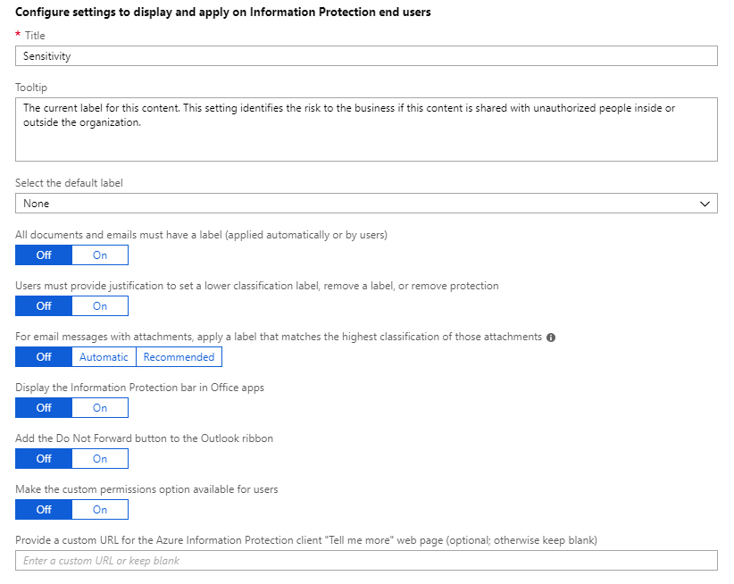
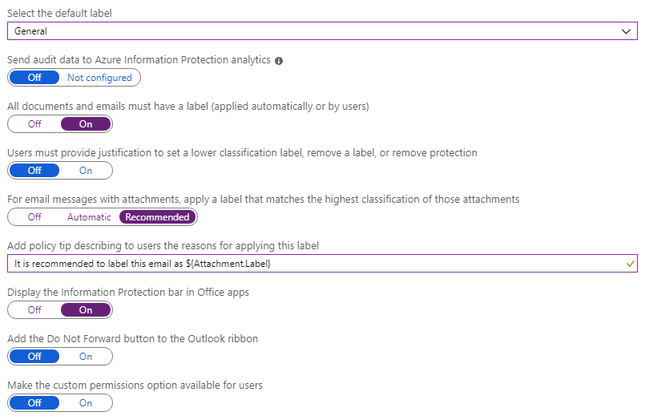
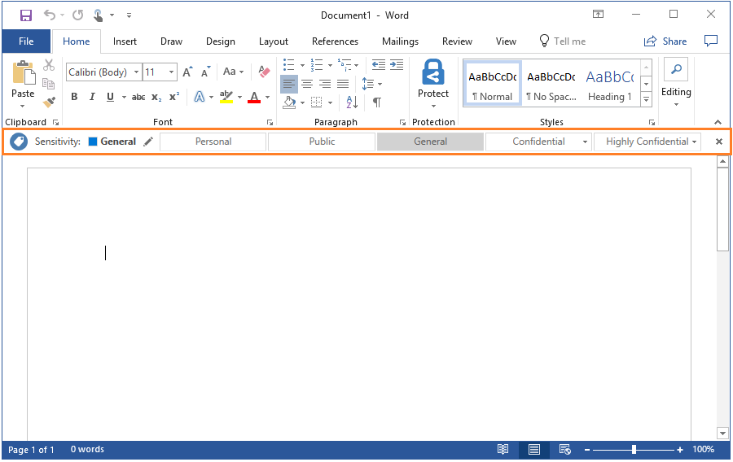
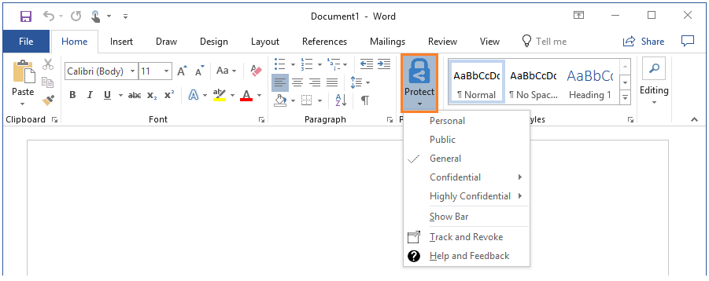
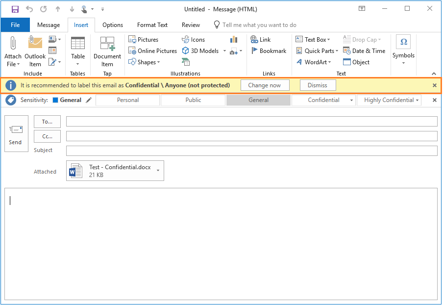
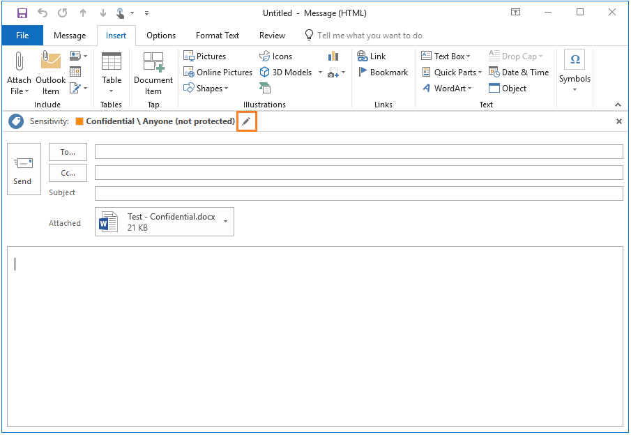

---
# required metadata

title: Tutorial - Configuring Azure Information Protection policy settings to help classify documents and emails
description: An introduction tutorial that steps you through configuring Azure Information Protection policy settings to help classify your organization's documents and emails.
author: cabailey
ms.author: cabailey
manager: mbaldwin
ms.date: 11/05/2018
ms.topic: tutorial
ms.service: information-protection

# optional metadata

#ROBOTS:
#audience:
#ms.devlang:
#ms.reviewer: eymanor
#ms.suite: ems
#ms.tgt_pltfrm:
#ms.custom:

---

# Tutorial: Configuring Azure Information Protection policy settings to help classify documents and emails

>*Applies to: [Azure Information Protection](https://azure.microsoft.com/pricing/details/information-protection)*

In this tutorial, you learn how to:
> [!div class="checklist"]
> * Configure policy settings that work together
> * See your settings in action

Rather than relying on users to manually label their documents and emails, you can use policy settings to:

- Ensure a base level of classification for new and edited content

- Educate users about labels and make it easy for them to apply the correct label

You can finish this tutorial in about 15 minutes.

## Prerequisites 

To complete this tutorial, you need:

1. A subscription that includes Azure Information Protection Plan 2.
    
    If you don't have a subscription that includes this plan, you can create a [free](https://portal.office.com/Signup/Signup.aspx?OfferId=87dd2714-d452-48a0-a809-d2f58c4f68b7) account for your organization.

2. You've added the Azure Information Protection blade to the Azure portal, and confirmed that the protection service is activated.

    If you need help with these actions, see [Quickstart: Add Azure Information Protection to the Azure portal and view the policy](quickstart-viewpolicy.md)

3. The Azure Information Protection client is installed on your computer. 
    
    To install the client, go to the [Microsoft download center](https://www.microsoft.com/en-us/download/details.aspx?id=53018) and download **AzInfoProtection.exe** from the Azure Information Protection page.

4. A computer running Windows (minimum of Windows 7 with Service Pack 1), and on this computer, you are signed in to Office apps from one of the following categories :
    
    - Office 365 with Office 2016 apps (minimum version 1805, build 9330.2078). To use this option, your account must be assigned a license for Azure Rights Management. This license is included with the Azure Information Protection subscription.
    
    - Office 365 ProPlus with 2016 apps or 2013 apps (Click-to-Run or Windows Installer-based installation).
    
    - Office Professional Plus 2016.
    
    - Office Professional Plus 2013 with Service Pack 1.
    
    - Office Professional Plus 2010 with Service Pack 2.

Let's get started.

## Edit the Azure Information Protection policy

Rather than relying on users to manually label their documents and emails, you can use some of the policy settings to ensure a base level of classification. 

Using the Azure portal, we'll edit the global policy to change policy settings for all users.

1. Open a new browser window and [sign in to the Azure portal](https://portal.azure.com). Then navigate to **Azure Information Protection**. 
    
    For example, on the hub menu, click **All services** and start typing **Information** in the Filter box. Select **Azure Information Protection**.

2. Select **Classifications** > **Policies** > **Global** to open the **Policy: Global** blade. 

3. Locate the policy settings after the labels, in the **Configure settings to display and apply on Information Protection end users** section. Your settings might have different values to ones shown:
    
    

4. Change your settings to match the value in the following table. Make a note of the settings that you change in case you want to change them back again when you have finished this tutorial. 

    |Setting|Value|Information|
    |-------|-----|-----|
    |**Select the default label**|**General**|If you don't have a label named **General**, select another label from the dropdown list. Unlabeled documents and emails will have this label applied automatically as a base classification. However, users can change your selected label to a different one.|
    |**All documents and emails must have a label**|**On**|This setting is often referred to as mandatory labeling because it prevents users from saving documents or sending emails that are unlabeled. Together with the default label, documents and emails will have either the default label that you set, or a label that they choose.
    |**For email messages with attachments, apply a label that matches the highest classification of those attachments**|**Recommended**|This setting prompts users to select a higher classification label for their emails when they attach documents that have a higher classification than your selected default label.
    |**Display the Information Protection bar in Office apps**|**On**|Displaying the Information Protection bar makes it easier for users to see and change the default label.
    
    The settings should now look like this:
    
    

5. Select **Save** on this **Policy: Global** blade, and if you're prompted to confirm your action, select **OK**. 

## See your policy settings in action 

For this tutorial, we'll use Word and Outlook to see your policy changes in action. If these apps were already loaded before you changed the policy settings, restart them to download the changes.

### Default label and the Information Protection bar

Open a new document in Word. You see the document is automatically labeled as **General** rather than relying on users to select a label. 

With the Information Protection bar displayed and showing the available labels, it's easy for users to see the currently selected label, and change it if the default label isn't appropriate:

Instead of changing the label, close the Information Protection bar to compare the experience if the bar is not shown:

The **General** label is still selected, but it's much less obvious. It's also less obvious how to select a different label. To do that, users must select the **Protect** button:

Now, from the pull-down menu, you see that the **General** label is selected because it has a check mark next to it. To change the currently selected label, users can select a different label from the list. When users are new to labeling, they probably won't remember to select the **Protect** button each time. They also might not realize that they can select another label.

To display the Information Protection bar again, select **Show Bar** from the pull-down menu.

> [!TIP]
> You can select a different default label for Outlook, by configuring an [advanced client setting](./rms-client/client-admin-guide-customizations.md#set-a-different-default-label-for-outlook).

### Mandatory labeling

You can change the currently selected **General** label to a different label, but you cannot remove it. Because we changed the **All documents and emails must have a label** setting to **On**, the **Delete Label** icon is not available on the Information Protection bar. 

If we hadn't changed that setting, the Information Protection bar shows this icon:

Together with a default label, mandatory labeling ensures that new and edited documents (and emails) have a base classification of your choosing. 

If we hadn't set a default label with the mandatory labeling setting, users are always prompted to select a label when they save an unlabeled document or send an unlabeled email. For many users, these continual prompts can be frustrating and also result in less accurate labeling. For them to be prompted to select a label when they've finished working on a document or email interrupts their workflows, and there's then a temptation for them to select any label at random so they can move onto the next thing they need to do.

### Recommendations for emails with attachments

For the open Word document, choose a label that has a higher classification than **General**. For example, one of the sublabels under **Confidential**, such as **Confidential - Anyone (not protected)**. Save the document locally and give it any name. 

Start Outlook and create a new email message. Just as we saw with Word, the new email message is automatically labeled as **General** and the Information Protection bar is displayed.

Add the Word document you just labeled as an attachment to the email message. You see a prompt to change the email label to the **Confidential** label that matches the Word attachment. You can accept the recommendation or dismiss it:

If you click **Dismiss**, the new label is not applied but you see how the email is still labeled with the default label that we configured, **General**. The available labels are still visible to select as an alternative.

If you select **Change now**, the email is relabeled to the  **Confidential** sublabel. However, users can still change the label before sending the email, by selecting the Edit Label:

The Information Protection bar then displays again, for users to select an alternative label.

Because the label is selected before sending the email, there's no need to actually send the email to see how this policy setting works. You can close the email without sending or saving it.

However, you might want to try repeating this exercise but also attach another document that has a higher classification (a sublabel from the **Highly Confidential** label). Then, you'll see how the prompt changes to apply the higher classification label.

## Next steps

For more information about editing the Azure Information Protection policy settings see [How to configure the policy settings for Azure Information Protection](configure-policy-settings.md).

The policy settings that we changed helped to ensure a base level of classification, as well as encourage users to select an appropriate label. The next step is to augment this strategy by inspecting the contents of documents and emails, and then recommending or automatically applying an appropriate label. You do this by configuring labels for conditions. To learn more, see [How to configure conditions for automatic and recommended classification for Azure Information Protection](configure-policy-classification.md).
