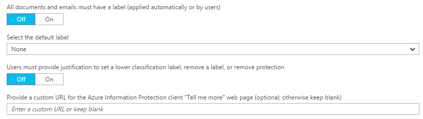
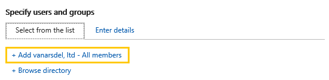
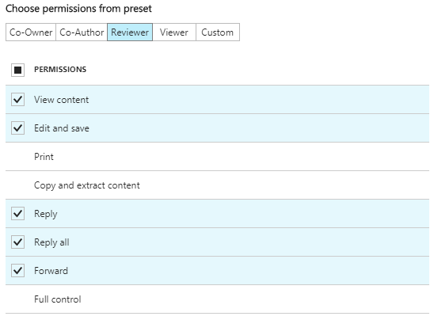
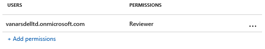
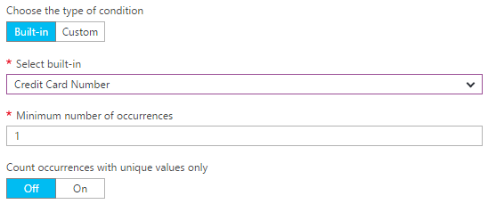
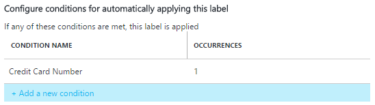
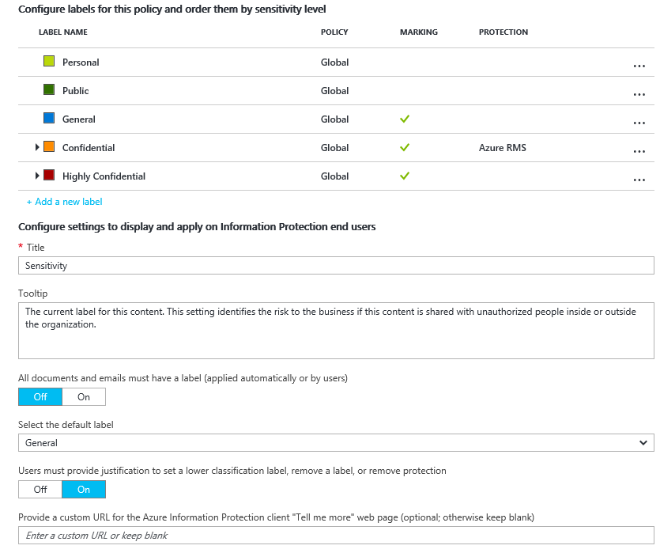
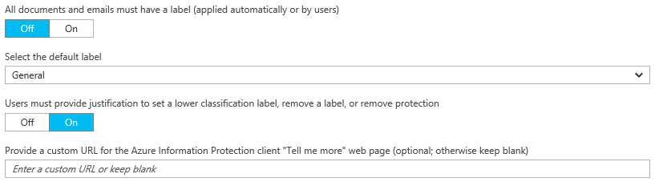

---
# required metadata

title: Quick start tutorial step 2  - AIP
description: Step 2 of an introduction tutorial to quickly try out Azure Information Protection - Configure the policy.
author: cabailey
ms.author: cabailey
manager: mbaldwin
ms.date: 07/21/2018
ms.topic: conceptual
ms.service: information-protection
ms.assetid: 3bc193c2-0be0-4c8e-8910-5d2cee5b14f7

# optional metadata

#ROBOTS:
#audience:
#ms.devlang:
#ms.reviewer: eymanor
#ms.suite: ems
#ms.tgt_pltfrm:
#ms.custom:

---

# Step 2: Configure the Azure Information Protection policy

>*Applies to: [Azure Information Protection](https://azure.microsoft.com/pricing/details/information-protection)*

Although Azure Information Protection comes with a default policy that you can use without configuration, we're going to have a look at that policy and make some changes.

1. Continuing from [step 1](infoprotect-tutorial-step1.md) and still in the Azure portal, select **Classifications** > **Policies** > **Global** to open the **Policy: Global** blade. This blade displays the default Azure Information Protection policy that's created for your tenant.

2. Spend a few minutes familiarizing yourself with the labels that are displayed:
    
    - Labels for classification: **Personal**, **Public**, **General**, **Confidential**, and **Highly Confidential**. The last two labels expand to show sublabels, which provide examples of how a classification can have subcategories:
    
       > [!NOTE]
       > Your default policy might look slightly different from one in this tutorial. For example, you have a label named **Internal** rather than **General**, and **Secret** rather than **Highly Confidential**. Maybe you do not have the sublabels named **Recipients Only**, or you don't have any labels at all. These changes are because there are different versions of the default policy, depending on when it was created for your tenant. Or, you might have edited it yourself, before you started the tutorial.
       > 
       > If your default policy looks different, you can still use this tutorial, but be aware of these changes when you use the instructions and pictures that follow. If you want to modify your default policy so that it matches the current default policy, see [The default Azure Information Protection policy](configure-policy-default.md).
    
    - With the default configuration, some labels do not have visual markings configured. The visual markers are a footer, header, and watermark. Depending on your default policy, some labels might also have protection set. For example: 
    
    
    
3. After the labels, in the **Configure settings to display and apply on Information Protection end users** section, you also see some policy settings. For example, there is no default label set, documents and emails are not required to have a label, and users do not have to provide justification when they change labels:
    
    

## Changing the settings for a default label and prompt for justification

For this tutorial, we'll change a couple of those policy settings so that you can see how they work:

1. For **Select the default label**, select **General**. 

    If you don't have this label because you have an older version of the policy, choose **Internal** as the equivalent label.

2. For **Users must provide justification to set a lower classification label, remove a label, or remove protection**, set this option to **On**.

3. In addition, locate the setting **Make the custom permissions option available to users**. If this setting is **Off**, change it to **On**.
    
    You might not need to change this setting because the default depends on when you obtained your subscription. We will use custom permissions later in the tutorial to share a protected document with a user that you specify when you right-click the file from File Explorer.

4. Select **Save** on this **Policy: Global** blade, and if you are prompted to confirm your action, select **OK**. Close this blade.

## Creating a new label for protection, visual markers, and a condition to prompt for classification

We'll now create a new sublabel for **Confidential**.

1. From the **Classifications** > **Labels** menu option: Right-click the **Confidential** label, and select **Add a sub-label**.
    
    If you do not have a label named **Confidential**, you can select another label or you can create a new label instead and still follow the tutorial with minor differences.

2. On the **Sub-label** blade, specify the label name of **Finance** and add the following description: **Confidential data that contains financial information that is restricted to employees only**.
    
    This text describes how the selected label is intended to be used and it is visible to users as a tooltip, to help them decide which label to select.

3. For **Set permissions for documents and emails containing this label**, select **Protect**, and then select **Protection**:
    
     
    
4. On the **Protection** blade, make sure that **Azure (cloud key)** is selected. This option uses the Azure Rights Management service to protect documents and emails. Also make sure that the **Set Permissions** option is selected. Then select **Add permissions**.

5. On the **Add permissions** blade, select **Add \<organization name> - All members**. For example, if your organization name is VanArsdel Ltd, you see the following option to select:
    
     
    
    This option automatically selects all the users in your organization who can be granted permissions. However, you can see from the other options that you could browse and search for groups or users from your tenant. Or, when you select the **Enter details** option, you can specify individual email addresses or even all users from another organization.

6. For the permissions, select **Reviewer** from the preset options. You see how this permission level automatically grants some permissions listed but not all permissions:
    
    
    
    You can select different permission levels or specify individual usage rights by using the **Custom** option. But for this tutorial, keep the **Reviewer** option. You can experiment with different permissions later and read how they restrict what the specified users can do with the protected document or email.

7. Click **OK** to close this **Add permissions** blade, and you see how the **Protection** blade is updated to reflect your configuration. For example:
    
     
    
    If you select **Add permissions**, this action opens the **Add permissions** blade again, so that you can add more users and grant them different permissions. For example, grant just view access for a specific group. But for this tutorial, we'll keep with one set of permissions for all users.

8. Review and keep the defaults for content expiration and offline access, and then click **OK** to save and close this **Protection** blade.

8. Back on the **Sub-label** blade, locate the **Set visual marking** section:
    
    For the **Documents with this label have a footer** setting, click **On**, and then for the **Text** box, type **Classified as Confidential**. 
    
    For the **Documents with this label have a watermark** setting, click **On**, and then for the **Text** box, type your organization name. For example, **VanArsdel, Ltd** 
    
    Although you can change the appearance for these visual markers, we'll leave these settings at the defaults for now.
    
9. Locate the section **Configure conditions for automatically applying this label**:
    
    Click **Add a new condition** and then, on the **Condition** blade, select the following:
    
    a. **Choose the type of condition**: Keep the default of **Information Types**.
    
    b. In the **Select information types** search box: Type **credit card number**. Then, from the search results, select **Credit Card Number**.
    
    c. **Minimum number of occurrences**: Keep the default of **1**.
    
    d. **Count occurrences with unique values only**: Keep the default of **Off**.
    
    
    
    Click **Save** to return to the **Sub-label** blade.

10. On the **Sub-label** blade, you see that **Credit Card Number** is displayed as the **CONDITION NAME**, with **1** **OCCURRENCES**:
    
    

11. For **Select how this label is applied**: Keep the default of **Recommended**, and do not change the default policy tip. 

12. In the **Enter notes for internal housekeeping** box, type **For testing purposes only**.

13. Click **Save** on this **Sub-label** blade. If you are prompted to confirm, click **OK**. The new label is created and saved, but not yet added to a policy.

14. From the **Classifications** > **Policies** menu option: Select **Global** again, and then select the **Add or remove labels** link after the labels.

15. From the **Policy: Add or remove labels** blade, select the label that you have just created, the sublabel named **Finance**, and click **OK**.

16. On the **Policy: Global** blade, you now see your new sublabel in your global policy, which is configured for visual markings and protection. For example:

    
    
    You also see that the settings are configured with your changes for the default label and justification:
    
    
    

17. Click **Save** on this **Policy: Global** blade. If you are prompted to confirm this action, click **OK**.

You can either close the Azure portal, or leave it open to try additional configuration options after you have finished this tutorial.

Now that you've had a look at the default policy and made some changes, the next step is to install the Azure Information Protection client.

|If you want more information|Additional information|
|--------------------------------|--------------------------|
|About the default policy and different versions|[The default Azure Information Protection policy](configure-policy-default.md)|
|About configuring the policy|[Configuring Azure Information Protection policy](configure-policy.md)|
|Detailed instructions for configuring a label for protection|[How to configure a label for Rights Management protection](configure-policy-protection.md)|
|Detailed information about the permissions|[Configuring usage rights for Azure Rights Management](configure-usage-rights.md)|

>[!div class="step-by-step"]
[&#171; Step 1](infoprotect-tutorial-step1.md)
[Step 3 &#187;](infoprotect-tutorial-step3.md)
