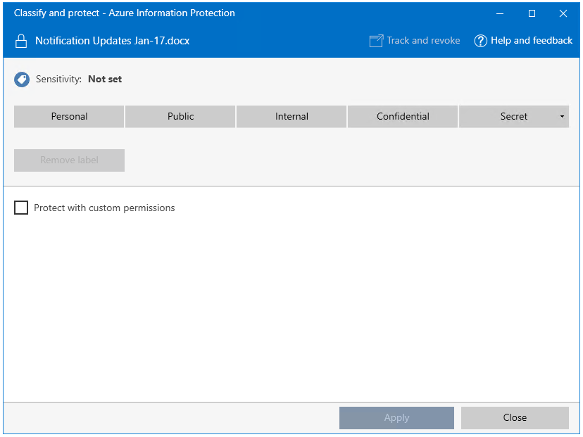
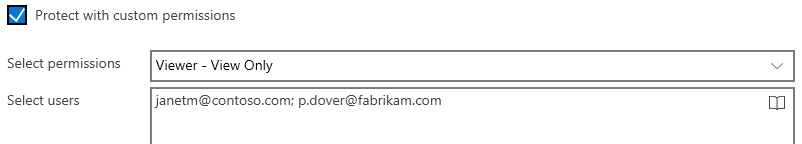
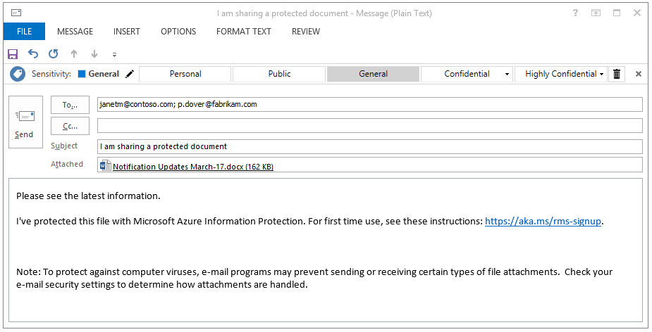
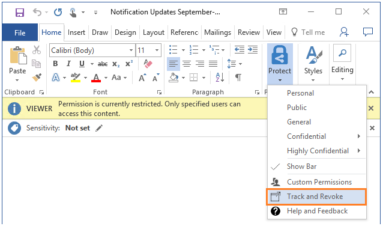

---
# required metadata

title: Quick start tutorial step 5  - AIP
description: Step 5 of an introduction tutorial to quickly try out Azure Information Protection - Share protected and track.
keywords:
author: cabailey
ms.author: cabailey
manager: mbaldwin
ms.date: 05/09/2018
ms.topic: conceptual
ms.service: information-protection
ms.assetid: 4e59a3b3-f0f4-4535-8b96-cac68303d855

# optional metadata

#ROBOTS:
#audience:
#ms.devlang:
ms.reviewer: esaggese
ms.suite: ems
#ms.tgt_pltfrm:
#ms.custom:

---

# Step 5: See sharing of protected files in action and track your document 

>*Applies to: [Azure Information Protection](https://azure.microsoft.com/pricing/details/information-protection)*

For this final step in the tutorial, locate a Word document or Excel spreadsheet that you have already created and will send to a partner or co-worker. For this tutorial, it doesn’t matter what text it actually contains, but you will want it to contain some text so you can more easily confirm that the authorized recipient could read it.

You’re then ready to safely share this document by email. 

## To safely share your document by email

1. In File Explorer, right-click your document and select **Classify and protect**. The **Classify and protect - Azure Information Protection** dialog box opens:

    

2. Select **Protect with custom permissions**, which displays additional options.

3. For **Select permissions**, keep the default of **Viewer – View Only**.

    With this setting, our recipients will be able to view the document but not edit or print it.

4. For **Select users**, type one or more business email addresses, as you would do when you send a document to someone that your organization does business with. To specify more than one address, you use a semicolon or press Enter. 

    Make sure that you specify a business email address, such as **janetm@contoso.com** or **p.dover@fabrikam.com** because currently, Azure Information Protection doesn’t support personal email addresses for this scenario. 

    Alternatively, click the **Select users, groups, or organization** icon to select a co-worker's email address:

      
    
    After specifying the addresses, copy them to the clipboard because we'll use them in a later step.

5. Click **Apply** and wait for the **Work finished** message to see the results. Then click **Close**.

4. Back in File Explorer, right-click your file again, and this time, select **Send to** > **Mail recipient**. This action attaches your document to an email message with some default text that we will change.

5. Before we change the default text, paste the email addresses that you specified earlier into the **To** box. 

6. Optionally, type your choice of subject in the **Subject** box, for example: **I am sharing a protected document**. 

7. Modify the default message description so that it's suitable for your recipients. However, add the following text:

    **I've protected this file with Microsoft Azure Information Protection. For first time use, see these instructions: https://aka.ms/rms-signup.** 

    

    Click **Send**.

Now you’ve sent your protected document, you’re ready to ask your recipients to wait for it to arrive and then open it. 

## Ask your recipients to open the emailed document

Your recipients can use many devices to read the protected document that you sent as an email attachment. The devices include iPads, iPhones, Android tablets and phones, Mac computers, as well as Windows computers.

Ask them to read the email message that you sent. Assuming that this is the first time that they have received attachments that are protected by Rights Management, ask them to click the instructions link. They will then see the **Welcome** page for Microsoft Azure Information Protection, which asks them to enter their work email address.

When they click **Sign up**, Azure Information Protection checks whether their organization has a subscription that includes the Azure Rights Management data protection service. If not, they can apply for a free account.

### Instructions for recipient: To view the protected document attachment

1. On a PC or mobile device that has Office installed, open the attachment to read the document.  

2.  If you are prompted for your user name and password, enter your user name in the same format as the email address that was used to send you the email and attachment. For example, **janetm@contoso.com** or **p.dover@fabrikam.com**. For your password, type the password that you supplied when you signed up for RMS for individuals. Or, if your organization has a cloud service such as Office 365 or uses Azure, enter your usual work password.

3. Read the document contents when it opens. Because it’s read-only, you cannot change the contents.

As an optional step, your recipient could forward the email to other people that you didn’t specify in your original email. These people won’t be able to open the attachment. When they are promoted for their user name, access to the document will be denied.

Now that the recipient has opened the attachment and optionally, forwarded it to somebody else, you're ready to track your document.

## To track your protected document

1.  Open the document that you protected and shared. The information banner confirms the custom protection settings that you specified:

    

2.  On the **Home** tab, click **Protect** > **Track and Revoke**:

    

    This takes you to the document tracking site.

2.  If you see the **Protect and share on your terms** page, click **Sign in** and supply your user name and password again.

3.  On the **Your shared documents** page, you’ll see the document name that you shared. At this point, it’s the only file displayed but as you share additional protected documents, the list will grow.

    From this page, you’ll see when you shared the document (when you sent the email with the protected attachment), its current status (active, revoked, or expired), and the name of the recipient you sent the email to. Click the document name for additional details.

4.  On the new page, which has the name of the file that you clicked, you’ll see summary details for that document only, and a list of other options that are available for the document (**List**, **Timeline**, **Map**, **Settings**).

    Click each option to explore different ways to track your protected document. Or, still on the **Summary** page, click **Open in Excel** to export the information to a spreadsheet, or click **Revoke access** to stop sharing the document.

You can return to this site to track further activity for your protected document, or revoke access if necessary. You can even access the site from your mobile device or tablet, by using a browser with this link: [document tracking](http://go.microsoft.com/fwlink/?LinkId=529562)

|If you want more information|Additional information|
|--------------------------------|--------------------------|
|Full instructions for protecting files that you can then safely share|[Classify and protect a file or email](./rms-client/client-classify-protect.md)|
|About the free account for others users to sign up|[RMS for individuals and Azure Rights Managmenet](./rms-for-individuals.md)|
|About using the document tracking site|[Track and revoke your documents](./rms-client/client-track-revoke.md)

## Next Steps

Now you've seen the default Azure Information Protection policy and how to customize it, and how labeling works for a Word document, try some of the other settings and see how they work in the other Office applications that support Azure Information Protection: Excel, PowerPoint, Outlook. If these applications were open when you installed the Azure Information Protection client, close and reopen them before you try using them with Azure Information Protection.

Try sharing more documents and track how they are being used, and confirm how document revocation works.

You might then find it useful to return to the **Quick start** page in the Azure portal, read some of the [frequently asked questions](faqs.md) for Azure Information Protection, and explore some of the other documentation articles. But if you're ready to start deploying Azure Information Protection for your organization, your next stop should be the [Azure Information Protection deployment roadmap](deployment-roadmap.md). 
