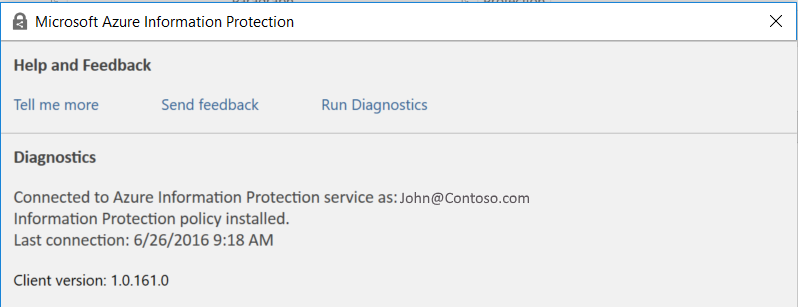
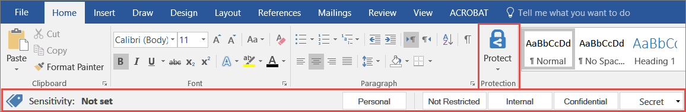
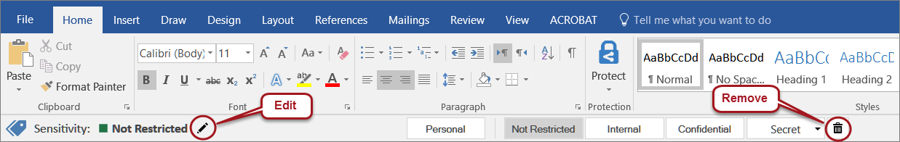
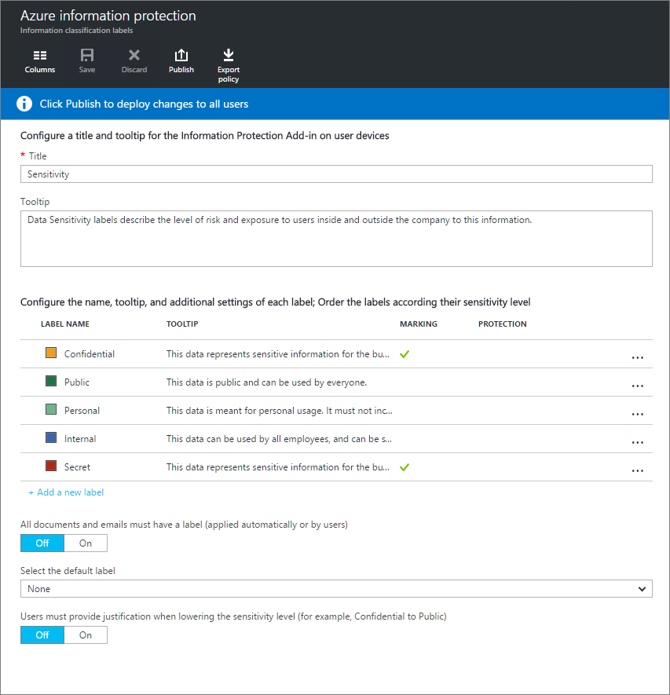

---
# required metadata

title: Azure Information Protection Quickstart Tutorial | Azure Rights Management
description: [PROVIDE A DESCRIPTION]
author: cabailey
manager: mbaldwin
ms.date: 07/15/2016
ms.topic: article
ms.prod: azure
ms.service: rights-management
ms.technology: techgroup-identity
ms.assetid: 1260b9e5-dba1-41de-84fd-609076587842

# optional metadata

#ROBOTS:
#audience:
#ms.devlang:
#ms.reviewer: eymanor
#ms.suite: ems
#ms.tgt_pltfrm:
#ms.custom:

---

# Quick Start Tutorial for Azure Information Protection 

This tutorial to will enable you to quickly learn how to quickly and easily set up Azure Information Protection , so you can and to start labeling and protecting your sensitive data. 

## System requirements 
To install and experience Microsoft Azure Information Protection, you need to prepare the following:
- A computer running Windows (minimum Windows 7 SP1), with Microsoft Office 2016, Office 2013 SP1, or Office 2010 installed.
- An Azure tenant OR an Office 365 subscription - to enable, configure and deploy an Azure Information Protection policy.  
- An Azure Rights Management service - to enable encryption, and Azure Information Protection client-service communication (not mandatory if you are looking to experience only information classification and labeling - without protection).

> [!IMPORTANT]
> - To enable Azure Rights Management service - please complete [Step 1 of the Azure Rights Management quick start tutorial](../get-started/tutorial-step1.md). Use either the Office 365 admin center, or the Azure classic portal.
> - For more information about the subscription options and links to free trials of Office 365 or follow the [Cloud subscriptions that support Azure RMS page](..get-started/requirements-subscriptions.md).
> - During the Azure Information Protection Public Preview period, **any user** in the Azure tenant / Office 365 subscription can sign into the Azure Information Protection Admin portal to get acquainted and configure an Information Protection policy. Upon general availability, access will be limited to users with administrative privileges only.

## Step 1: Set up and connect your Azure Information Protection administrator portal

To enter the Azure Information Protection administrator portal:

1. Access the Azure Admin portal here. 
2. On the left pane, locate the Azure Information Protection module, as follows: click **Browse** at the bottom of the list and start typing "Information" in the Filter field. The Azure Information Protection screen opens with the default policy, which is described in this guide.

Every newly created tenant includes a default, pre-defined, Information Protection policy. Use this policy to experience the Azure Information Protection client, or edit this policy to create your own policy that meets your organizational needs. 
The default policy includes the following labels:

|Name | Description | Visual markings 
|--|--|--
| Personal | For personal use only. This data will not be monitored by the organization. Personal information must not include any business-related data. | None
| Public | This information is internal and can be used by everyone inside or outside the business. | None
| Internal | This information includes a wide spectrum of internal business data that can be used by all employees and can be shared with authorized customers and business partners. Examples for internal information are company policies and most internal communications. | Document / email footer
| Confidential | This data includes sensitive business information. Exposing this data to unauthorized users may cause damage to the organization. Examples for Confidential information are employee information, individual customer projects or contracts, and sales account data. | Document / email footer
| Secret | This data includes highly sensitive information for the business that must be protected. Exposing Secret data to unauthorized users may cause serious damage to the organization. Examples for Secret information are personal identification information, customer records, source code, and pre-announced financial reports. | Document / email footer

> [!NOTE] 
> The Secret label includes two sample sub labels: All-Employees, and My-Group. Setting up the Information Protection policy is done via the Microsoft Azure Admin portal. 

## Step 2: Install the Azure Information Protection client 

### To download the Azure Information Protection Client

Download the Azure Information Protection client from the Microsoft download center.  <Link TBD> 

The Microsoft Azure Information Protection Client will add the Information Protection bar to your Microsoft Office applications - Outlook, Word, Excel and PowerPoint. The Information Protection bar allows you to view the current label, assign a label or modify it. On the same bar, you will be notified when the client recommends that you assign a particular label or when assigned label will be assigned automatically.

The Client is connected to the Azure Information Protection service that is synchronized with the organization's Information Protection policy. 

### To install the Azure Information Protection Client

1. Double-click `AZInfoProtection.exe` to start the installation.
2. Select the `I accept the terms in the License Agreement` checkbox and click `Install`. 
3. Select Install a demo policy until another policy is applied for Azure Information Protection to set an initial policy for demo purposes. You will be able to experience Azure Information Protection (based on the default Information Protection Policy) even if it is not connected to the Azure Information Protection service.
4. When the Completed screen appears, click the `Finish` button. 
5. Restart any open Office application to apply Azure Information Protection. The Information Protection bar now appears in all your Microsoft Office applications. 

> [!NOTE]
> When opening an Office application for the first time, the Azure Information Protection client will try to connect to the service to download the Information Protection policy. If SSO (single sign-on) is not deployed in your organization, you will be requested to enter your username and password. 

To ensure that the client is connected to the Azure Information Protection service: click the Protect button on the ribbon menu of Outlook, Word, Excel or PowerPoint, and then click Help and Feedback. The connectivity status appears under the Client Status section.

### The Information Protection bar

The Information Protection bar ensures that your documents can be classified, labeled and protected according to your organization's Information Protection policy. 

 
When opening a new document, you can label it by clicking on a label that reflects the sensitivity level of the information contained in the document. Some lables may have secondary levels (sub labels), in which case you can select the required secondary label from a list that is attached to the label. For example, the Secret label may contain sub labels such as "Legal" or "Finance". The labels appear on the Information Protection bar according to the order of sensitivity from left to right, where the least sensitive is the left one.

If the document is already labeled, the Information Protection bar displays the current label. You can change the current label by clicking the Edit icon , or remove it, by clicking the Remove icon.

## Step 3: Practice policy configuration

### Configuring the basics: classification labels and policy settings

This section describes the basic steps for creating, maintaining and modifying the labels comprising your organizational policy. The title name and label names are based on the policy provided out-of-the box. 

All the label names, tooltips, colors, and so on are configurable by you, the IT administrator, and these are the labels that will be displayed to the user in the Information Protection bar.   

The title of our out-of-the-box Add-in bar is Sensitivity and the labels comprising the policy are ordered by the level of sensitivity. The order is significant, as it represents the order that will be displayed in the user's bar. You can drag labels up and down to change their order. 

When you open Azure Information protection, only the left part of the screen is visible. Clicking a label opens an additional screen containing the label's settings.

## Tasks

Now that you are up and running, you can complete one of these simple tasks to gain a richer understanding of how AzIP protects your data.

- [Deploying policies to user devices](task-deploy-policies-user-devices.md)
- [Adding watermarks to a label](task-add-watermark-label.md)
- [Adding a default label and downgrade justification](task-add-default-label-downgrade-justification.md)
- [Adding an automatic labeling rule](task-add-automatic-labeling-rule.md)
- [Adding protection to a label](task-add-protection-label.md)