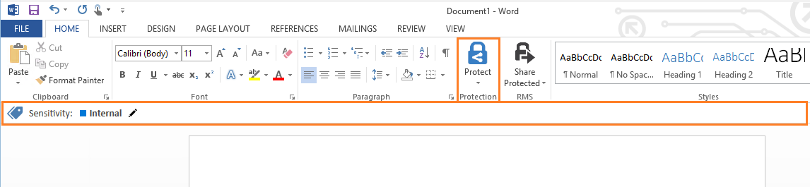

---
# required metadata

title: Azure Information Protection quick start tutorial step 3 | Azure Rights Management
description: Step 3 of an introduction tutorial to quickly try out Microsoft Azure Information Protection for your organization with just 4 steps that should take you less than 15 minutes.
author: cabailey
manager: mbaldwin
ms.date: 07/29/2016
ms.topic: article
ms.prod: azure
ms.service: rights-management
ms.technology: techgroup-identity
ms.assetid: 209815b9-81c9-430c-a82f-32cac991449b

# optional metadata

#ROBOTS:
#audience:
#ms.devlang:
#ms.reviewer: eymanor
#ms.suite: ems
#ms.tgt_pltfrm:
#ms.custom:

---

# Step 3: Install the Azure Information Protection client 

>*Applies to: Azure Information Protection preview*

**[ This information is preliminary and subject to change. ]**

In this step, you'll install the Azure Information Protection client so that the policy you've just configured will download to a Windows PC, and display the labels in Office applications. 

1. On a PC that has Office installed (but Word is not currently open), [download the Azure Information Protection client](https://www.microsoft.com/en-us/download/details.aspx?id=53018) from the Microsoft download center. 

2. Run **AZInfoProtection.exe** and follow the prompts to install the client.

    For this tutorial, it doesn't matter whether you select the option to install a demo policy, because our policy that we've just configured will be downloaded from Azure and replace the demo policy if installed. However, you could use the demo policy option if you just wanted to experience the default labels without connecting to Azure Information Protection. 

3. Verify that the client has installed by opening Word and a new, blank document (do not save it at this time). If you are prompted to enter your user name and password, enter the details for your global administrator account. When the document loads, you should see two new things:

    - On the **Home** tab, a new **Protection** group, with a button labeled **Protect**.

        Click **Protect** > **Help and feedback**, and in the **Microsoft Azure Information Protection** dialog box, confirm your client status. It should display **Information Protection policy is installed** and a recent connection time. Verify that your displayed user name is correct for your tenant.

    - A new bar displays under the ribbon; the Information Protection bar. It displays the title of **Sensitivity**, and the default label that we configured of **Internal**. 

You're ready for the final step, to see classification, labeling, and protection in action.

|If you want more information|Additional information|
|--------------------------------|--------------------------|
|About installing the client|[Installing the Azure Information Protection client](info-protect-client.md)|

>[!div class="step-by-step"]
[&#171; Step 2](infoprotect-tutorial-step2.md)
[Step 4 &#187;](infoprotect-tutorial-step4.md)