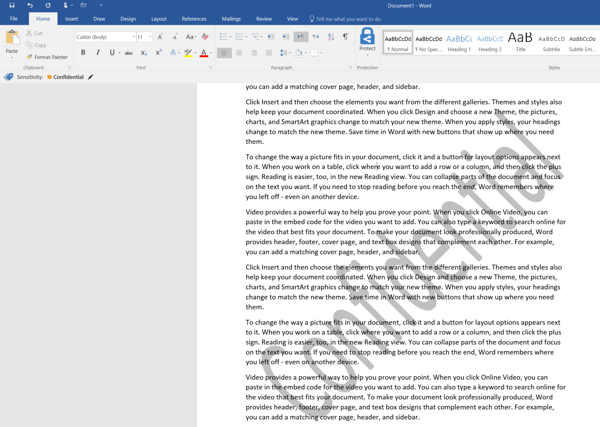

---
# required metadata

title: Adding watermarks to a label | Azure Rights Management
description: [PROVIDE A DESCRIPTION]
author: cabailey
manager: mbaldwin
ms.date: 07/15/2016
ms.topic: article
ms.prod: azure
ms.service: rights-management
ms.technology: techgroup-identity
ms.assetid: c2a3a59b-eaaa-44eb-8879-876791d210c6

# optional metadata

#ROBOTS:
#audience:
#ms.devlang:
#ms.reviewer: eymanor
#ms.suite: ems
#ms.tgt_pltfrm:
#ms.custom:

---

# Task: Adding watermarks to a label

>[!div class="step-by-step"]
[Prev task: Deploying policies to user devices](task-deploy-policies-user-devices.md)
[Next task: Adding a default label and downgrade justification](task-add-default-label-downgrade-justification.md)

In this task, you will configure the label Confidential to add a watermark text to every document on which it is applied. 

To Add a watermark to the Confidential label:
1. Select the `Confidential` label. The label editing screen opens on the left.  
2. In the `Set visual marking area`, set `Documents with this label have a watermark` to "On". 
3. Enter the text that will appear in the watermark, for instance, “Confidential”.
4. In the `Size` field, leave the default "Auto" on.
5. Set the `Color` to "Gray". 
6. Click `Save` and `Publish` the policy. 

The user sees:

 
> [!Note]
> A watermark in Excel is only visible in Page layout, Print preview mode and when printed. 

> [!div class="button"]
[Next: Adding a default label and downgrade justification](task-add-default-label-downgrade-justification.md)