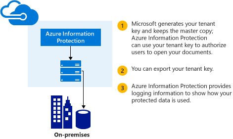
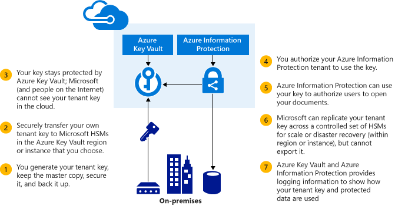

---
# required metadata

title: Your Azure Information Protection tenant key
description: Information to help you plan for and manage your Azure Information Protection tenant key. Instead of Microsoft managing your tenant key (the default), you might want to manage your own tenant key to comply with specific regulations that apply to your organization. Managing your own tenant key is also referred to as bring your own key, or BYOK.
author: cabailey
ms.author: cabailey
manager: mbaldwin
ms.date: 06/07/2017
ms.topic: article
ms.prod:
ms.service: information-protection
ms.technology: techgroup-identity
ms.assetid: f0d33c5f-a6a6-44a1-bdec-5be1bc8e1e14

# optional metadata

#ROBOTS:
#audience:
#ms.devlang:
ms.reviewer: esaggese
ms.suite: ems
#ms.tgt_pltfrm:
#ms.custom:

---

# Planning and implementing your Azure Information Protection tenant key

>*Applies to: Azure Information Protection, Office 365*

Use the information in this article to help you plan for and manage your Azure Information Protection tenant key. For example, instead of Microsoft managing your tenant key (the default), you might want to manage your own tenant key to comply with specific regulations that apply to your organization. Managing your own tenant key is also referred to as bring your own key, or BYOK.

What is the Azure Information Protection tenant key?

- Azure Information Protection maintains one or more keys for each organization that has a subscription for Azure Information Protection. The Azure Information Protection tenant key acts as a root key for your organization. Whenever Azure Information Protection uses keys for your organization, these keys cryptographically chain to your Azure Information Protection tenant key. The keys include user keys, computer keys, and document encryption keys.

- The on-premises equivalent of the Azure Information Protection tenant key is known as the Server Licensor Certificate (SLC) key. 

**At a glance:** Use the following table as a quick guide to your recommended tenant key topology. Then, use the additional documentation for more information.

If required, you can change your tenant key topology after deployment, by using the [Set-AadrmKeyProperties](/powershell/module/aadrm/set-aadrmkeyproperties) cmdlet.

|Business requirement|Recommended tenant key topology|
|------------------------|-----------------------------------|
|Deploy Azure Information Protection quickly and without special hardware, additional software, or another subscription|Managed by Microsoft|
|Your keys are created and managed by you, protected by a separate service and optionally, protected by a hardware security module (HSM)|BYOK [[1]](#footnote-1)|

###### Footnote 1
If you have already enabled Exchange Online for Azure Rights Management by using the Import-RMSTrustedPublishingDomain command, you cannot currently use BYOK. For more information, see [Restrictions when using BYOK](byok-price-restrictions.md#restrictions-when-using-byok).

## Choose your tenant key topology: Managed by Microsoft (the default) or managed by you (BYOK)

Decide which tenant key topology is best for your organization. By default, Azure Information Protection generates a tenant key for you and manages most aspects of the tenant key life cycle. This is the simplest option with the lowest administrative overheads. In most cases, you do not even need to know that you have a tenant key. You just sign up for Azure Information Protection and the rest of the key management process is handled by Microsoft.

Alternatively, you might want complete control over your tenant key, which is possible when you use [Azure Key Vault](https://azure.microsoft.com/services/key-vault/). You create the key, either directly in Key Vault, or create it on-premises and either transfer or import it to Key Vault. You then configure Azure Information Protection to use that key.

To create your own key, you have the following options:

- A key that you create on-premises and transfer or import to Key Vault:
    
    - An HSM-protected key that you create on-premises and transfer to Key Vault as an HSM-protected key.
    
    - A software-protected key that you create on-premises and convert and then transfer to Key Vault as an HSM-protected key. This option is supported only when you [migrate from Active Directory Rights Management Services (AD RMS)](migrate-from-ad-rms-to-azure-rms.md).

    - A software-protected key that you create on-premises and import to Key Vault as a software-protected key. This option requires a .PFX certificate file.

- A key that you create in Key Vault:
    
    - An HSM-protected key that you create in Key Vault.
    
    - A software-protected key that you create in Key Vault.

Of these options, the most typical "bring your own key" scenario is an HSM-protected key that you create on-premises and import to Key Vault as an HSM-protected key. Although this option has the greatest administrative overheads, it might be required for your organization to comply with specific regulations. The HSMs that are used by Azure Key Vault are FIPS 140-2 Level 2 validated.

With this option, the following happens:

1. You generate your tenant key on your premises, in line with your IT policies and security policies. You keep the master key on-premises and you are responsible for backing it up.

2. You securely transfer a copy of this key from an HSM in your possession to HSMs that are owned and managed by Microsoft and Azure Key Vault. Throughout this process, your key never leaves the hardware protection boundary.

3. When you transfer your key to Microsoft, it stays protected by Azure Key Vault.

> [!NOTE]
> As an additional protection measure, Azure Key Vault uses separate security domains for its data centers in regions such as North America, EMEA (Europe, Middle East and Africa), and Asia. Azure Key Vault also uses different instances of Azure, such as Microsoft Azure Germany, and Azure Government. When you manage your own tenant key, it is tied to the security domain of the region or instance in which your Azure Information Protection tenant is registered. For example, a tenant key from a European customer cannot be used in data centers in North America or Asia.

Although it’s optional, you will also probably want to use the near real-time usage logs from Azure Information Protection to see exactly how and when your tenant key is being used.

## The tenant key life cycle

If you decide that Microsoft should manage your tenant key, Microsoft handles most of the key life cycle operations. However, if you decide to manage your tenant key, you are responsible for many of the key life cycle operations and some additional procedures in Azure Key Vault.

The following diagrams show and compares these two options. The first diagram shows how little administrator overheads there are for you in the default configuration when Microsoft manages the tenant key.

The second diagram shows the additional steps required when you manage your own tenant key by using the most typical BYOK option: An HSM-protected key that you create on-premises and import to Key Vault as an HSM-protected key.

If you decide to let Microsoft manage your tenant key: 

- Unless you are migrating from AD RMS, no further action is required for you to generate the key for your tenant and you can go straight to [Next steps](plan-implement-tenant-key.md#next-steps).

- If you currently have AD RMS and want to migrate to Azure Information Protection, use the migration instructions: [Migrating from AD RMS to Azure Information Protection](migrate-from-ad-rms-to-azure-rms.md). 

If you decide to manage your tenant key yourself, read the following sections for more information.

## Implementing BYOK for your Azure Information Protection tenant key

Use the information and procedures in this section if you have decided to generate and manage your tenant key; the bring your own key (BYOK) scenario:

> [!IMPORTANT]
> If you have started to use Azure Information Protection with a tenant key that is managed by Microsoft and you now want to manage your tenant key (move to BYOK), your previously protected documents and emails will remain accessible by using an archived key. However, if you have users who run Office 2010, [contact Microsoft Support](../get-started/information-support.md#to-contact-microsoft-support) before you run these procedures. These computers will need some additional configuration steps.
> 
> Also [contact Microsoft Support](../get-started/information-support.md#to-contact-microsoft-support) if your organization has specific policies for handling keys.

### Prerequisites for BYOK
See the following table for a list of additional prerequisites to use bring your own key (BYOK) with Azure Information Protection.

|Requirement|More information|
|---------------|--------------------|
|Your Azure Information Protection tenant must have an Azure subscription. If you do not have one, you can sign up for a [free account](https://azure.microsoft.com/pricing/free-trial/).    To use an HSM-protected key, you must have the Azure Key Vault Premium service tier.|The free Azure subscription that provides access to configure Azure Active Directory (**Access to Azure Active Directory**) is not sufficient to use Azure Key Vault. To confirm that you have an Azure subscription that you can use for BYOK, use [Azure Resource Manager](https://docs.microsoft.com/powershell/module/azurerm.resources/?view=azurermps-3.8.0) PowerShell cmdlets:    1. Start an Azure PowerShell session with the **Run as administrator** option, and sign in as a global admin for your Azure Information Protection tenant with the following command: `Login-AzureRmAccount`  2. Type the following and confirm that you see values displayed for your subscription name and ID, your Azure Information Protection tenant ID, and that the state is enabled: `Get-AzureRmSubscription`  If no values are displayed and you are simply returned to the prompt, you do not have an Azure subscription that can be used for BYOK.
|To use an HSM-protected key that you create on-premises: All the prerequisites listed for Key Vault BYOK.|See [Prerequisites for BYOK](https://azure.microsoft.com/documentation/articles/key-vault-hsm-protected-keys/#prerequisites-for-byok) from the Azure Key Vault documentation.   **Note**: In addition to the BYOK prerequisites, if you are migrating from AD RMS to Azure Information Protection by using the software-key-to-hardware-key migration path, you must have a minimum version of 11.62 for the Thales firmware.|
|The Azure Rights Management administration module for Windows PowerShell.|For installation instructions, see [Installing Windows PowerShell for Azure Rights Management](../deploy-use/install-powershell.md).   If you have previously installed this Windows PowerShell module, run the following command to check that your version number is at least **2.9.0.0**: `(Get-Module aadrm -ListAvailable).Version`|

Only Thales HSMs are supported for HSM-protected keys. For more information about Thales HSMs and how they are used with Azure Key Vault, see the [Thales website](https://www.thales-esecurity.com/msrms/cloud).

### Instructions for BYOK

Use the Azure Key Vault documentation to create a key vault and the key that you want to use for Azure Information Protection. For example, see [Get started with Azure Key Vault](/azure/key-vault/key-vault-get-started).

To create an HSM-protected key on-premises and import it to your key vault as an HSM-protected key, follow the procedures in [How to generate and transfer HSM-protected keys for Azure Key Vault](https://azure.microsoft.com/documentation/articles/key-vault-hsm-protected-keys/).

A key that is stored in Key Vault has a key ID. This key ID is a URL that contains the name of the key vault, the keys container, the name of the key, and the key version. For example: **https://contosorms-kv.vault.azure.net/keys/contosorms-byok/aaaabbbbcccc111122223333**. You must configure the Azure Rights Management service from Azure Information Protection to use this key, by specifying its URL.

Before Azure Information Protection can use the key, the Azure Rights Management service must be authorized to use the key in your organization's key vault. To do this, use the Key Vault PowerShell cmdlet, [Set-AzureRmKeyVaultAccessPolicy](/powershell/module/azurerm.keyvault/set-azurermkeyvaultaccesspolicy) and grant permissions to the Azure Rights Management service principal, by using the GUID 00000012-0000-0000-c000-000000000000. For example:

	Set-AzureRmKeyVaultAccessPolicy -VaultName 'ContosoRMS-kv' -ResourceGroupName 'ContosoRMS-byok-rg' -ServicePrincipalName 00000012-0000-0000-c000-000000000000 -PermissionsToKeys decrypt,encrypt,unwrapkey,wrapkey,verify,sign,get

You're now ready to configure Azure Information Protection to use this key as your organization's Azure Information Protection tenant key. Using Azure RMS cmdlets, first connect to the Azure Rights Management service and sign in:

	Connect-AadrmService

Then run the [Use-AadrmKeyVaultKey cmdlet](/powershell/module/aadrm/use-aadrmkeyvaultkey), specifying the key URL. For example:

	Use-AadrmKeyVaultKey -KeyVaultKeyUrl "https://contosorms-kv.vault.azure.net/keys/contosorms-byok/aaaabbbbcccc111122223333"

> [!IMPORTANT]
> In this example, "aaaabbbbcccc111122223333" is the version of the key to use. If you do not specify the version, the current version of the key is used without warning and the command appears to work. However, if your key in Key Vault is later updated (renewed), the Azure Rights Management service will stop working for your tenant, even if you run the Use-AadrmKeyVaultKey command again.
>
>Make sure that you specify the key version, in addition to the key name when you run this command. You can use the Azure Key Vault cmd, [Get-AzureKeyVaultKey](/powershell/resourcemanager/azurerm.keyvault\get-azurekeyvaultkey), to get the version number of the current key. For example: `Get-AzureKeyVaultKey -VaultName 'contosorms-kv' -KeyName 'contosorms-byok'`

If you need to confirm that the key URL is set correctly in the Azure RMS service, in Azure Key Vault, you can run [Get-AzureKeyVaultKey](/powershell/resourcemanager/azurerm.keyvault\get-azurekeyvaultkey) to see the key URL.

Finally, if the Azure Rights Management service is already activated, run [Set-AadrmKeyProperties](/powershell/module/aadrm/set-aadrmkeyproperties) to tell Azure Rights Management to use this key as the active tenant key for your Azure Rights Management service. If you do not do this step, Azure Rights Management will continue to use the default Microsoft-managed key, that was automatically created when the service was activated.

## Next steps

Now that you've planned for and if necessary, generated your tenant key, do the following:

1.  Start to use your tenant key:
    
    - If you haven’t already done so, you must now activate the Rights Management service so that your organization can start to use Azure Information Protection. Users immediately start to use your tenant key (managed by Microsoft or managed by you in Azure Key Vault).
    
        For more information about activation, see [Activating Azure Rights Management](../deploy-use/activate-service.md).
        
    - If you had already activated the Rights Management service and then decided to manage your own tenant key, users gradually transition from the old tenant key to the new tenant key, and this staggered transition can take a few weeks to complete. Documents and files that were protected with the old tenant key remains accessible to authorized users.
        
2. Consider using usage logging, which logs every transaction that the Azure Rights Management service performs.
    
    If you decided to manage your own tenant key, logging includes information about using your tenant key. See the following snippet from a log file displayed in Excel where the **KeyVaultDecryptRequest** and **KeyVaultSignRequest** request types show that the tenant key is being used.
    
    
    
    For more information about usage logging, see [Logging and analyzing usage of the Azure Rights Management service](../deploy-use/log-analyze-usage.md).
    
3.  Maintain your tenant key.
    
    For more information, see [Operations for your Azure Rights Management tenant key](../deploy-use/operations-tenant-key.md).

[!INCLUDE[Commenting house rules](../includes/houserules.md)]
