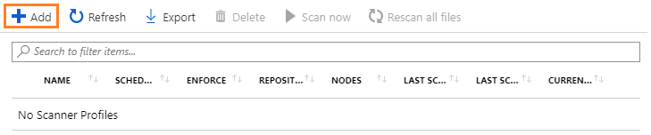
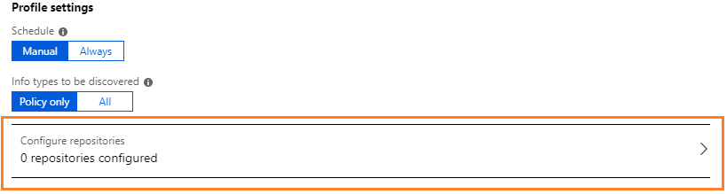
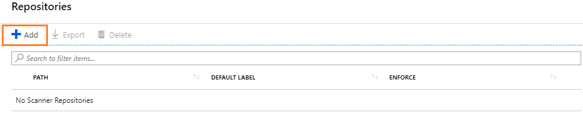

# Quickstart: Find what sensitive information you have in files stored on-premises

>*Applies to: [Azure Information Protection](https://azure.microsoft.com/pricing/details/information-protection)*
>
> *Instructions for: [Azure Information Protection client for Windows](faqs.md#whats-the-difference-between-the-azure-information-protection-client-and-the-azure-information-protection-unified-labeling-client)*

In this quickstart, you'll install and configure the Azure Information Protection scanner to find what sensitive information you have in files that are stored in an on-premises data store. For example, a local folder, network share, or SharePoint Server.

Note: This quickstart uses the current general availability version of the scanner, which uses the Azure portal for configuration instead of PowerShell cmdlets that were used by previous versions.

You can finish this configuration in less than 10 minutes.

## Prerequisites

To complete this quickstart, you need:

1. A subscription that includes Azure Information Protection Plan 1 or Plan 2.
    
    If you don't have one of these subscriptions, you can create a [free](https://admin.microsoft.com/Signup/Signup.aspx?OfferId=87dd2714-d452-48a0-a809-d2f58c4f68b7) account for your organization.

2. The Azure Information Protection client is installed on your computer. 
    
    To install the client, go to the [Microsoft download center](https://www.microsoft.com/en-us/download/details.aspx?id=53018) and download **AzInfoProtection.exe** from the Azure Information Protection page.
    
3. SQL Server Express is also installed on your computer.
    
    If this SQL Server edition isn't already installed, you can download it from the [Microsoft Download Center](https://www.microsoft.com/en-us/sql-server/sql-server-editions-express) and select a Basic installation.

4. Your domain account is synchronized to Azure AD.

For a full list of prerequisites to use Azure Information Protection, see [Requirements for Azure Information Protection](requirements.md).

## Prepare a test folder and file

For an initial test to confirm that the scanner is working:

1. Create a local folder on your computer. For example, **TestScanner** on your local C drive.

2. Create and save a Word document in that folder, which has the text **4242-4242-4242-4242** (a known credit card number for testing).

## Configure a profile for the scanner

Before you install the scanner, create a profile for it in the Azure portal. This profile contains scanner settings and locations of the data repositories to scan.

1. Open a new browser window and [sign in to the Azure portal](configure-policy.md#signing-in-to-the-azure-portal). Then navigate to the **Azure Information Protection** blade. 
    
    For example, on the hub menu, click **All services** and start typing **Information** in the Filter box. Select **Azure Information Protection**.
    
2. Locate the **Scanner** menu options, and select **Profiles**.

3. On the **Azure Information Protection - Profiles** blade, select **Add**:
    
    

4. On the **Add a new profile** blade, specify a name for the scanner that is used to identify its configuration settings and data repositories to scan. For example, for this quickstart, you might specify **Quickstart**. When you later install the scanner, you will need to specify the same profile name.
    
    Optionally, specify a description for administrative purposes, to help you identify the scanner's profile name.

5. For this quickstart, select just one setting: For **Policy enforcement**, select **Off**. Then select **Save** but do not close the blade.
    
    The settings configure the scanner to do a one-time discovery of all files in your specified data repositories. This scan looks for all known sensitive information types, and doesn't require you to first configure your Azure Information Protection labels or policy settings

6. Now that the profile is created and saved, you're ready to return to the **Configure repositories** option to specify your local folder as the data store to be scanned.
    
    Still on the **Add a new profile** blade, select **Configure repositories** to open the **Repositories** blade:
    
    

7. On the **Repositories** blade, select **Add**:
    
    

8. On the **Repository** blade, specify your local folder that you created in the very first step. For example: `C:\TestScanner`
    
    For the remaining settings on this blade, do not change them but keep them as **Profile default**. This means that the data repository inherits the settings from the scanner profile. 
    
    Select **Save**.

9. You can now close the **Add a new profile** blade and you see your profile name displayed in the **Azure Information Protection - Profiles** blade, together with the **SCHEDULE** column showing **Manual** and the **ENFORCE** column is blank.

You're now ready to install the scanner with the scanner profile that you've just created.

## Install the scanner

1. Open a PowerShell session with the **Run as an administrator** option.

2. Use the following command to install the scanner, specifying your own computer name, and the profile name that you saved in the Azure portal:
    
    	Install-AIPScanner -SqlServerInstance <your computer name>\SQLEXPRESS -Profile <profile name>
    
    When you're prompted, provide your own credentials for the scanner by using the \<domain\user name> format, and then your password. 

## Start the scan and confirm it finished

1. Back in the Azure portal, return to Azure Information Protection to start the scanner. From the **Scanner** menu option, select **Profiles**. Select your profile name, and then the **Scan now** option:
    
    

2. There's only one small file to inspect, so this initial test scan will be very quick:
    
    - From the **Azure Information Protection - Nodes** blade, the value for the **STATUS** column changes from **Scanning** to **Idle**.
    
    - Alternatively, check the local Windows **Applications and Services** event log, **Azure Information Protection**. Confirm the informational event ID **911** for the **MSIP.Scanner** process. The event log entry also has a summary of results from the scan.

## See detailed results

Using File Explorer, locate the scanner reports in %*localappdata*%\Microsoft\MSIP\Scanner\Reports. Open the detailed report file that has a .csv file format.

In Excel, the first two columns display your data store repository and file name. As you look through the columns, you'll see one named **Information Type Name**, which is the column you're most interested in. For our initial test, it displays **Credit Card Number**, one of many sensitive information types that the scanner can find.

## Scan your own data

1. Edit your scanner profile and add a new data repository, this time specifying your own on-premises data store that you want to scan for sensitive information. 
    
    You can specify a local folder, a network share (UNC path), or a SharePoint Server URL for a SharePoint site or library. 
    
    - Example for a local folder:
        
        	D:\Data\Finance
    
    - Example for a network share
        
        	\\NAS\HR
    
    - Example for a SharePoint folder:
        
        	http://sp2016/Shared Documents

2. Restart the scanner again: From the **Scanner** menu option, select **Profiles**, select your computer name, and then the **Scan now** option:
    
    

3. View the new results when the scan is complete. 
    
    How long this scan takes depends on how many files there are in your data store, how large those files are, and the type of file. 

## Clean up resources

In a production environment, you would run the scanner on a Windows Server, using a service account that silently authenticates to the Azure Information Protection service. You would also use an enterprise-grade version of SQL Server, and likely specify several data repositories. 

To clean up resources, ready for that production deployment, in your PowerShell session, run the following command to uninstall the scanner:

	Uninstall-AIPScanner

Then restart your computer.

This command doesn't remove the following items and you must manually remove them if you don't want them after this quickstart:

- The SQL Server database named **AIPScanner_\<profile>** that was created by running the Install-AIPScanner cmdlet when the Azure Information Protection scanner was installed. 

- The scanner reports located in %*localappdata*%\Microsoft\MSIP\Scanner\Reports.

- The **Log on as a service** user right assignment that your domain account was granted for your local computer.

## Next steps

This quickstart includes the minimum configuration so that you can quickly see how the scanner can find sensitive information in a network share. If you're ready to install the scanner in a production environment, see [Deploying the Azure Information Protection scanner to automatically classify and protect files](deploy-aip-scanner.md).

If you want to classify and protect the files that contain sensitive information, you must configure Azure Information Protection labels for automatic classification and protection:

- [How to configure conditions for automatic and recommended classification for Azure Information Protection](configure-policy-classification.md)

- [How to configure a label for Rights Management protection](configure-policy-protection.md)
