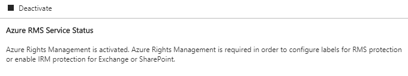
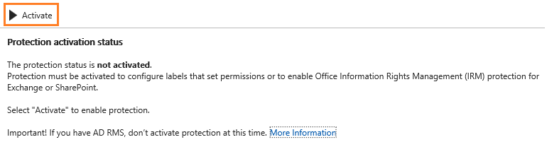
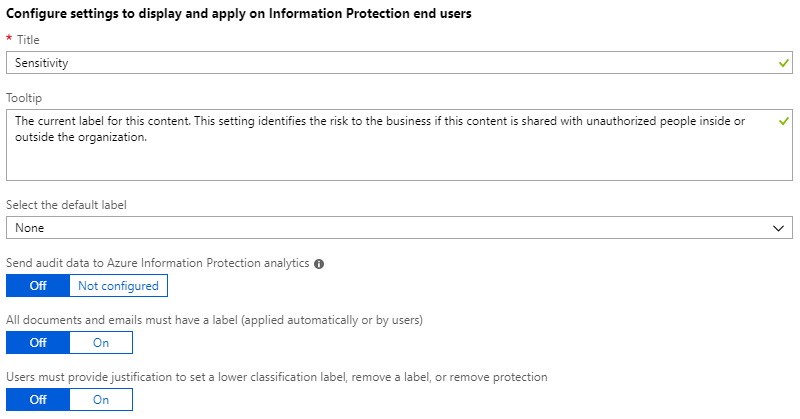

# Quickstart: Get started with Azure Information Protection in the Azure portal

In this quickstart, you'll add Azure Information Protection to the Azure portal, confirm the protection service is activated, and view your organization's default policy. 

You can finish this quickstart in 5 minutes.

## Prerequisites

To complete this quickstart, you need:

- A subscription that includes Azure Information Protection Plan 1 or Plan 2.
    
    If you don't have one of these subscriptions, you can create a [free](https://portal.office.com/Signup/Signup.aspx?OfferId=87dd2714-d452-48a0-a809-d2f58c4f68b7) account for your organization.

For a full list of prerequisites to use Azure Information Protection, see [Requirements for Azure Information Protection](requirements.md).

## Add Azure Information Protection to the Azure portal

Azure Information Protection isn't automatically available in the Azure portal. You must add it.

1. Sign in to the [Azure portal](https://portal.azure.com) by using the global admin account for your tenant. 
    
    If you are not the global admin, use the following link for alternative roles: [Signing in to the Azure portal](configure-policy.md#signing-in-to-the-azure-portal)

2. On the hub menu, select **Create a resource**, and then, from the search box for the Marketplace, type **Azure Information Protection**. 
    
3. From the results list, select **Azure Information Protection**. Then on the **Azure Information Protection** blade, click **Create**.
    
    > [!TIP] 
    > Optionally, select **Pin to dashboard** to create an **Azure Information Protection** tile on your dashboard, so that you can skip browsing to the service the next time you sign in to the portal.
    
    Click **Create** again.

## Confirm the protection service is activated

The protection service is now automatically activated for new tenants, but it's a good idea to confirm it doesn't need manually activating. 

1. On the **Azure Information Protection** blade, select **Manage** > **Protection activation**.

2. Confirm whether protection is activated for your tenant: 
    
    - If protection is activated, you see the following confirmation:
        
        
        
    - If protection is not activated, you see this reflected in the status information, and the option to activate:
        
        

3. If protection isn't activated, select **Activate**. 

    When activation is complete, the information bar displays **Activation finished successfully**.

## View your organization's default policy - labels and policy settings

The first time you connect to the Azure Information Protection service by using the Azure portal, a default policy for your tenant is created. The default policy contains labels and settings that you can use as-is, or customize.

1. Select **Classifications** > **Policies** > **Global** to display the default Azure Information Protection policy that's created for your tenant.
    
2. Spend a few minutes familiarizing yourself with the labels that are displayed:
    
   - Labels for classification: **Personal**, **Public**, **General**, **Confidential**, and **Highly Confidential**. The last two labels expand to show sublabels, which provide examples of how a classification can have subcategories:
    
   - With the default configuration, some labels do not have visual markings configured. The visual markers are a footer, header, and watermark. Depending on your default policy, some labels might also have protection set. For example: 
    
     
    
3. After the labels, in the **Configure settings to display and apply on Information Protection end users** section, you also see some policy settings. For example, there is no default label set, documents and emails are not required to have a label, and users do not have to provide justification when they change labels:
    
     

4. Because you are only viewing the labels and settings, you can close any blades that you have opened.

## Next steps

Now that you've seen the labels and policy settings in the Azure portal, you might find the following tutorial helpful as your next step: [Edit the policy and create a new label for Azure Information Protection](infoprotect-quick-start-tutorial.md).

Alternatively, for detailed instructions for configuring all aspects of the Azure Information Protection policy, see [Configuring the Azure Information Protection policy](configure-policy.md).
