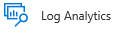

---
# required metadata

title: Central reporting for Azure Information Protection
description: How to use central reporting to track adoption of your Azure Information Protection labels and identify files that contain sensitive information
author: cabailey
ms.author: cabailey
ms.date: 05/12/2019
manager: barbkess
ms.topic: article
ms.collection: M365-security-compliance
ms.service: information-protection
ms.assetid: b2da2cdc-74fd-4bfb-b3c2-2a3a59a6bf2e

# optional metadata

#ROBOTS:
#audience:
#ms.devlang:
ms.reviewer: lilukov
ms.suite: ems
#ms.tgt_pltfrm:
#ms.custom:

---

# Central reporting for Azure Information Protection

>*Applies to: [Azure Information Protection](https://azure.microsoft.com/pricing/details/information-protection)*

> [!NOTE]
> This feature is currently in preview and subject to change.

Use Azure Information Protection analytics for central reporting to help you track the adoption of your Azure Information Protection labels. In addition:

- Monitor labeled and protected documents and emails across your organization

- Identify documents that contain sensitive information within your organization

- Monitor user access to labeled documents and emails, and track document classification changes.

- Identify documents that contain sensitive information that might be putting your organization at risk if they are not protected, and mitigate your risk by following recommendations.

The data that you see is aggregated from your Azure Information Protection clients and Azure Information Protection scanners, from Windows computers running [Windows Defender Advanced Threat Protection (Windows Defender ATP)](/windows/security/threat-protection/windows-defender-atp/overview), and from [clients that support unified labeling](configure-policy-migrate-labels.md#clients-and-services-that-support-unified-labeling).

For example, you'll be able to see the following:

- From the **Usage report**, where you can select a time period:
    
    - Which labels are being applied
    
    - How many documents and emails are being labeled
    
    - How many documents and emails are being protected
    
    - How many users and how many devices are labeling documents and emails
    
    - Which applications are being used for labeling

- From the **Activity logs**, where you can select a time period:
    
    - What labeling actions were performed by a specific user
    
    - What labeling actions were performed from a specific device
    
    - Which users have accessed a specific labeled document
    
    - What labeling actions were performed for a specific file path
    
    - What labeling actions were performed by a specific application, such File Explorer and right-click, or the AzureInformationProtection PowerShell module
    
    - Drill down into reported files to view **Activity Details** for additional information

- From the **Data discovery** report:

    - What files are on your scanned data repositories, Windows 10 computers, or computers running the Azure Information Protection client or [clients that support unified labeling](configure-policy-migrate-labels.md#clients-and-services-that-support-unified-labeling)
    
    - Which files are labeled and protected, and the location of files by labels
    
    - Which files contain sensitive information for known categories, such as financial data and personal information, and the location of files by these categories

- From the **Recommendations** report:
    
    - Identify unprotected files that contain a known sensitive information type. A recommendation lets you immediately configure the corresponding condition for one of your labels to apply automatic or recommended labeling.
        
        If you follow the recommendation: The next time the files are opened by a user or scanned by the Azure Information Protection scanner, the files can be automatically classified and protected.
    
    - Which data repositories have files with identified sensitive information but are not being scanned by the Azure Information Protection. A recommendation lets you immediately add the identified data store to one of your scanner's profiles.
        
        If you follow the recommendation: On the next scanner cycle, the files can be automatically classified and protected.

The reports use [Azure Monitor](/azure/log-analytics/log-analytics-overview) to store the data in a Log Analytics workspace that your organization owns. If you're familiar with the query language, you can modify the queries, and create new reports and Power BI dashboards. You might find the following tutorial helpful to understand the query language: [Get started with Azure Monitor log queries](/azure/azure-monitor/log-query/get-started-queries).

For more information, read the following blog posts: 
- [Data discovery, reporting and analytics for all your data with Microsoft Information Protection](https://techcommunity.microsoft.com/t5/Azure-Information-Protection/Data-discovery-reporting-and-analytics-for-all-your-data-with/ba-p/253854)

- [Discover and protect sensitive data through Azure Information Protection and Windows Defender ATP](https://techcommunity.microsoft.com/t5/Azure-Information-Protection/Discover-and-protect-sensitive-data-through-Azure-Information/ba-p/297292)

### Information collected and sent to Microsoft

To generate these reports, endpoints send the following types of information to Microsoft:

- The label action. For example, set a label, change a label, add or remove protection, automatic and recommended labels.

- The label name before and after the label action.

- Your organization's tenant ID.

- The user ID (email address or UPN).

- The name of the user's device.

- For documents: The file path and file name of documents that are labeled.

- For emails: The email subject and email sender  for emails that are labeled. 

- The sensitive information types ([predefined](https://docs.microsoft.com/office365/securitycompliance/what-the-sensitive-information-types-look-for) and custom) that were detected in content.

- The Azure Information Protection client version.

- The client operating system version.

This information is stored in an Azure Log Analytics workspace that your organization owns and can be viewed independently from Azure Information Protection by users who have access rights to this workspace. For details, see the [Permissions required for Azure Information Protection analytics](#permissions-required-for-azure-information-protection-analytics) section. For information about managing access to your workspace, see the [Manage access to Log Analytics Workspace using Azure permissions](https://docs.microsoft.com/azure/azure-monitor/platform/manage-access#manage-access-to-log-analytics-workspace-using-azure-permissions) section from the Azure documentation.

To prevent Azure Information Protection clients from sending this data, set the [policy setting](configure-policy-settings.md) of **Send audit data to Azure Information Protection log analytics** to **Off**:

- For most users to send this data and a subset of users cannot send auditing data: 
    - Set **Send audit data to Azure Information Protection log analytics** to **Off** in a scoped policy for the subset of users. This configuration is typical for production scenarios.

- For only a subset of users to send auditing data: 
    - Set **Send audit data to Azure Information Protection log analytics** to **Off** in the global policy, and **On** in a scoped policy for the subset of users. This configuration is typical for testing scenarios.

#### Content matches for deeper analysis 

Your Azure Log Analytics workspace for Azure Information Protection includes a checkbox for also collecting and storing the data that's identified by the sensitive information types or your custom conditions. For example, this can include credit card numbers that are found, as well as social security numbers, passport numbers, and bank account numbers. If you do not want to send this additional data, do not select this checkbox. If you want most users to send this additional data and a subset of users cannot send it, select the checkbox and configure an [advanced client setting](./rms-client/client-admin-guide-customizations.md#disable-sending-information-type-matches-for-a-subset-of-users) in a scoped policy for the subset of users.

After collecting the content matches, they are displayed in the reports when you drill down into files from the Activity logs, to display **Activity Details**. This information can also be viewed and retrieved with queries.

## Prerequisites
To view the Azure Information Protection reports and create your own, make sure that the following requirements are in place.

|Requirement|More information|
|---------------|--------------------|
|An Azure subscription that includes Log Analytics and that is for the same tenant as Azure Information Protection|See the [Azure Monitor pricing](https://azure.microsoft.com/pricing/details/log-analytics) page.<br /><br />If you don't have an Azure subscription or you don't currently use Azure Log Analytics, the pricing page includes a link for a free trial.|
|The Azure Information Protection client or the Azure Information Protection unified labeling client|If you don't already have one of these clients, you can download and install them from the [Microsoft Download Center](https://www.microsoft.com/en-us/download/details.aspx?id=53018). <br /><br /> Make sure you have the latest version to support [all the features](#features-that-require-a-minimum-version-of-the-client) for Azure Information Protection analytics.|
|For the **Discovery and risk** report: <br /><br />- To display data from on-premises data stores, you have deployed at least one instance of the Azure Information Protection scanner <br /><br />- To display data from Windows 10 computers, they must be a minimum build of 1809, you are using Windows Defender Advanced Threat Protection (Windows Defender ATP), and you have enabled the Azure Information Protection integration feature from Windows Defender Security Center|For installation instructions for the scanner, see [Deploying the Azure Information Protection scanner to automatically classify and protect files](deploy-aip-scanner.md). <br /><br />For information about configuring and using the Azure Information Protection integration feature from Windows Defender Security Center, see [Information protection in Windows overview](/windows/security/threat-protection/windows-defender-atp/information-protection-in-windows-overview).|
|For the **Recommendations** report: <br /><br />- To add a new data repository from the Azure portal as a recommended action, you must be using the latest general availability version of the Azure Information Protection scanner |To deploy the scanner, see [Deploying the Azure Information Protection scanner to automatically classify and protect files](deploy-aip-scanner.md).|

### Permissions required for Azure Information Protection analytics

Specific to Azure Information Protection analytics, after you have configured your Azure Log Analytics workspace, you can use the Azure AD administrator role of Security Reader as an alternative to the other Azure AD roles that support managing Azure Information Protection in the Azure portal.

Because this feature uses Azure Monitoring, role-based access control (RBAC) for Azure also controls access to your workspace. You therefore need an Azure role as well as an Azure AD administrator role to manage Azure Information Protection analytics. If you're new to Azure roles, you might find it useful to read [Differences between Azure RBAC roles and Azure AD administrator roles](https://docs.microsoft.com/azure/role-based-access-control/rbac-and-directory-admin-roles#differences-between-azure-rbac-roles-and-azure-ad-administrator-roles).

Details:

1. One of the following [Azure AD administrator roles](/azure/active-directory/active-directory-assign-admin-roles-azure-portal) to access the Azure Information Protection analytics blade:
    
    - To create your Log Analytics workspace or to create custom queries:
    
        - **Information Protection administrator**
        - **Security administrator**
        - **Compliance administrator**
        - **Global administrator**
    
    - After the workspace has been created, you can then use the following role with fewer permissions to view the data collected:
    
        - **Security reader**
    
    > [!NOTE] 
    > If your tenant has been migrated to the unified labeling store, you cannot use the Information Protection administrator role. [More information](configure-policy-migrate-labels.md#important-information-about-administrative-roles)

2. In addition, you need one of the following [Azure Log Analytics roles](https://docs.microsoft.com/en-us/azure/azure-monitor/platform/manage-access#manage-access-to-log-analytics-workspace-using-azure-permissions) or standard [Azure roles](https://docs.microsoft.com/azure/role-based-access-control/overview#role-assignments) to access your Azure Log Analytics workspace:
    
    - To create the workspace or to create custom queries, one of the following:
    
        - **Log Analytics Contributor**
        - **Contributor**
        - **Owner**
    
    - After the workspace has been created, you can then use one of the following roles with fewer permissions to view the data collected:
    
        - **Log Analytics Reader**
        - **Reader**

#### Minimum roles to view the reports

After you have configured your workspace for Azure Information Protection analytics, the minimum roles needed to view the Azure Information Protection analytics reports are both of the following:

- Azure AD administrator role: **Security reader**
- Azure role: **Log Analytics Reader**

However, a typical role assignment for many organizations is the Azure AD role of **Security reader** and the Azure role of **Reader**.

### Features that require a minimum version of the client

You can use the version history information for the [Azure Information Protection unified labeling client](./rms-client/unifiedlabelingclient-version-release-history.md) and the [Azure Information Protection client](./rms-client/client-version-release-history.md) to confirm whether your version of the client supports all the central reporting features. The minimum versions for the clients:

For the Azure Information Protection unified labeling client:

- Support for auditing and endpoint discovery: Version 2.0.778.0

For the Azure Information Protection client:

- Support for auditing: Version 1.41.51.0
- Support for endpoint discovery: Version 1.48.204.0

## Configure a Log Analytics workspace for the reports

1. If you haven't already done so, open a new browser window and [sign in to the Azure portal](https://portal.azure.com) with an account that has the [permissions required for Azure Information Protection analytics](#permissions-required-for-azure-information-protection-analytics). Then navigate to the **Azure Information Protection** blade. 
    
    For example, on the hub menu, click **All services** and start typing **Information** in the Filter box. Select **Azure Information Protection**.
    
2. Locate the **Manage** menu options, and select **Configure analytics (Preview)**.

3. On the **Azure Information Protection log analytics** blade, you see a list of any Log Analytics workspaces that are owned by your tenant. Do one of the following:
    
    - To create a new Log Analytics workspace: Select **Create new workspace**, and on the **Log analytics workspace** blade, supply the requested information.
    
    - To use an existing Log Analytics workspace: Select the workspace from the list.

If you need help with creating the Log Analytics workspace, see [Create a Log Analytics workspace in the Azure portal](https://docs.microsoft.com/azure/log-analytics/log-analytics-quick-create-workspace).

When the workspace is configured, you're ready to view the reports.

> [!NOTE] 
> There is currently a known problem displaying data for the first time in the reports. If this happens to you, in the global policy, set the [policy setting](configure-policy-settings.md) of **Send audit data to Azure Information Protection log analytics** to **Off** and save the policy. Then change the same setting to **On** and save the policy. After clients have [downloaded the change](configure-policy.md#making-changes-to-the-policy), it can take up to 30 minutes for their audit events to be visible in your Log Analytics workspace.

## How to view the reports

From the Azure Information Protection blade, locate the **Dashboards** menu options, and select one of the following options:

- **Usage report (Preview)**: Use this report to see how your labels are being used.

- **Activity logs (Preview)**: Use this report to see labeling actions from users, and on devices and file paths.
    
    This report has a **Columns** option that lets you display more activity information than the default display. You can also see more details about a file by selecting it to display **Activity Details**.

- **Data discovery (Preview)**: Use this report to see information about labeled files found by scanners and supported endpoints.
    
    You can configure an [advanced client setting](./rms-client/client-admin-guide-customizations.md#enable-azure-information-protection-analytics-to-discover-sensitive-information-in-documents) for the Azure Information Protection client to report files that contain sensitive information.
    
    Tip: From the information collected, you might find users accessing files that contain sensitive information from location that you didn't know about or aren't currently scanning:
    
    - If the locations are on-premises, consider adding the locations as additional data repositories for the Azure Information Protection scanner.
    - If the locations are in the cloud, consider using Microsoft Cloud App Security to manage them. 
    
- **Recommendations (Preview)**: Use this report to identify files that have sensitive information and mitigate your risk by following the recommendations.
    
    When you select an item, the **View data** option displays the audit activities that triggered the recommendation.


## How to modify the reports and create custom queries

Select the query icon in the dashboard to open a **Log Search** blade: 




The logged data for Azure Information Protection is stored in the following table: **InformationProtectionLogs_CL**

When you create your own queries, use the friendly schema names that have been implemented as **InformationProtectionEvents** functions. These functions are derived from the attributes that are supported for custom queries (some attributes are for internal use only) and their names will not change over time, even if the underlying attributes change for improvements and new functionality.

### Friendly schema reference for event functions

Use the following table to identify the friendly name of event functions that you can use for custom queries with Azure Information Protection analytics.

|Column name|Description|
|-----_-----|-----------|
|Time|Event time: UTC in format YYYY-MM-DDTHH:MM:SS|
|User|User: Format UPN or DOMAIN\USER|
|ItemPath|Full item path or email subject|
|ItemName|File name or email subject |
|Method|Label assigned method: Manual, Automatic, Recommended, Default, or Mandatory|
|Activity|Audit activity: DowngradeLabel, UpgradeLabel, RemoveLabel, NewLabel, Discover, Access, RemoveCustomProtection, ChangeCustomProtection, or NewCustomProtection |
|LabelName|Label name (not localized)|
|LabelNameBefore |Label name before change (not localized) |
|ProtectionType|Protection type [JSON] <br />{ <br />"Type": ["Template", "Custom", "DoNotForward"], <br />  "TemplateID": "GUID" <br /> } <br />|
|ProtectionBefore|Protection type before change [JSON] |
|InformationTypesMatches|JSON array of [SensitiveInformation](https://docs.microsoft.com/office365/securitycompliance/what-the-sensitive-information-types-look-for) found in data where an empty array means no information types found, and null means no information available|
|MachineName |FQDN when available; otherwise host name|
|DeviceRisk|Device risk score from WDATP when available|
|Platform|Device platform (Win, OSX, Android, iOS) |
|ApplicationName|Application friendly name|
|AIPVersion|Version of the Azure Information Protection client that performed the audit action |
|TenantId|Azure AD tenant ID |
|AzureApplicationId|Azure AD registered application ID (GUID)|
|ProcessName|Process that hosts MIP SDK|
|LabelId|Label GUID or null|
|IsProtected|Whether protected: Yes/No |
|ProtectionOwner |Rights Management owner in UPN format|
|LabelIdBefore|Label GUID or null before change|
|InformationTypesAbove55|JSON array of [SensitiveInformation](https://docs.microsoft.com/office365/securitycompliance/what-the-sensitive-information-types-look-for) found in data with confidence level 55 or above |
|InformationTypesAbove65|JSON array of [SensitiveInformation](https://docs.microsoft.com/office365/securitycompliance/what-the-sensitive-information-types-look-for) found in data with confidence level 65 or above |
|InformationTypesAbove75|JSON array of [SensitiveInformation](https://docs.microsoft.com/office365/securitycompliance/what-the-sensitive-information-types-look-for) found in data with confidence level 75 or above |
|InformationTypesAbove85|JSON array of [SensitiveInformation](https://docs.microsoft.com/office365/securitycompliance/what-the-sensitive-information-types-look-for) found in data with confidence level 85 or above |
|InformationTypesAbove95|JSON array of [SensitiveInformation](https://docs.microsoft.com/office365/securitycompliance/what-the-sensitive-information-types-look-for) found in data with confidence level 95 or above|
|DiscoveredInformationTypes |JSON array of [SensitiveInformation](https://docs.microsoft.com/office365/securitycompliance/what-the-sensitive-information-types-look-for) found in data and their matched content (if enabled) where an empty array means no information types found, and null means no information available |
|ProtectedBefore|Whether the content was protected before change: Yes/No |
|ProtectionOwnerBefore|Rights Management owner before change |
|UserJustification|Justification when downgrading or removing label|
|LastModifiedBy|User in UPN format who last modified the file. Available for Office and SharePoint Online only|
|LastModifiedDate|UTC in format YYYY-MM-DDTHH:MM:SS: Available for Office & SharePoint Online only |


#### Examples using InformationProtectionEvents

Use the following examples to see how you might use the friendly schema to create custom queries.

##### Example 1: Return all users who sent audit data in the last 31 days 

```
InformationProtectionEvents 
| where Time > ago(31d) 
| distinct User 
```

 
##### Example 2: Return the number of labels that were downgraded per day in the last 31 days 


```
InformationProtectionEvents 
| where Time > ago(31d) 
| where Activity == "DowngradeLabel"  
| summarize Label_Downgrades_per_Day = count(Activity) by bin(Time, 1d) 
 
```
 
##### Example 3: Return the number of labels that were downgraded from Confidential by user, in the last 31 days 

```

InformationProtectionEvents 
| where Time > ago(31d) 
| where Activity == "DowngradeLabel"  
| where LabelNameBefore contains "Confidential" and LabelName !contains "Confidential"  
| summarize Label_Downgrades_by_User = count(Activity) by User | sort by Label_Downgrades_by_User desc 

```

In this example, a downgraded label is counted only if the label name before the action contained the name **Confidential** and the label name after the action didn't contain the name of **Confidential**. 


## Next steps
After reviewing the information in the reports, if you are using the Azure Information Protection client, you might decide to make changes to your Azure Information Protection policy. For instructions, see [Configuring the Azure Information Protection policy](configure-policy.md).

If you have a Microsoft 365 subscription, you can also view label usage in the Microsoft 365 compliance center and Microsoft 365 security center. For more information, see [View label usage with label analytics](/Office365/SecurityCompliance/label-analytics).
