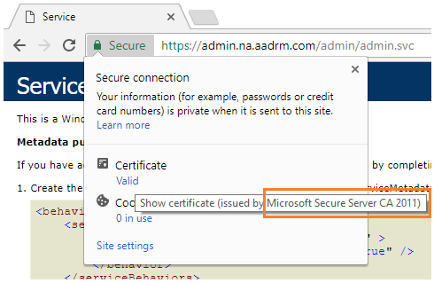

---
# required metadata

title: Requirements for Azure Information Protection - AIP
description: Identify the prerequisites to deploy Azure Information Protection for your organization.
author: cabailey
ms.author: cabailey
manager: mbaldwin
ms.date: 12/04/2018
ms.topic: conceptual
ms.service: information-protection
ms.assetid: dc78321d-d759-4653-8818-80da74b6cdeb

# optional metadata

#ROBOTS:
#audience:
#ms.devlang:
ms.reviewer: esaggese
ms.suite: ems
#ms.tgt_pltfrm:
#ms.custom:

---

# Requirements for Azure Information Protection

>*Applies to: [Azure Information Protection](https://azure.microsoft.com/pricing/details/information-protection), [Office 365](http://download.microsoft.com/download/E/C/F/ECF42E71-4EC0-48FF-AA00-577AC14D5B5C/Azure_Information_Protection_licensing_datasheet_EN-US.pdf)*

Before you deploy Azure Information Protection for your organization, make sure that you have the following prerequisites. 

## Subscription for Azure Information Protection

**For classification, labeling, and protection**: You must have an [Azure Information Protection plan](https://azure.microsoft.com/pricing/details/information-protection/). 

**For protection-only**: You must have an [Office 365 plan that includes Azure Information Protection](http://download.microsoft.com/download/E/C/F/ECF42E71-4EC0-48FF-AA00-577AC14D5B5C/Azure_Information_Protection_licensing_datasheet_EN-US.pdf).

To make sure that your organization's subscription includes the Azure Information Protection features that you want to use, review the feature list from the [Azure Information Protection pricing](https://azure.microsoft.com/pricing/details/information-protection) page.

> [!TIP]
> Looking to see if your Office 365 plan or Exchange Online standalone plan supports the [new capabilities from Office 365 Message Encryption](https://techcommunity.microsoft.com/t5/Security-Privacy-and-Compliance/Email-Encryption-and-Rights-Protection/ba-p/110801), to send protected emails to personal email addresses? For example, Gmail, Yahoo, and Microsoft. Check the following resources:
>
> [Exchange Online Service Description](https://technet.microsoft.com/library/exchange-online-service-description.aspx)
>
> [Office 365 Education](https://technet.microsoft.com/library/mt844095.aspx)
>
> [Office 365 US Government](https://technet.microsoft.com/library/mt774581.aspx)

If you have questions about subscriptions or licensing, do not post them on this page but instead, contact your Microsoft Account Manager or [Microsoft Support](information-support.md#to-contact-microsoft-support).

## Azure Active Directory

Your organization must have an Azure Active Directory (Azure AD) to support user authentication and authorization for Azure Information Protection. In addition, if you want to use your user accounts from your on-premises directory (AD DS), you must also configure directory integration.

Single sign-on (SSO) is supported for Azure Information Protection, so that users are not repeatedly prompted for their credentials. If you use another vendor solution for federation, check with that vendor how to configure it for Azure AD. WS-Trust is a common requirement for these solutions to support single sign-on. 

Multi-factor authentication (MFA) is supported with Azure Information Protection when you have the required client software and correctly configured MFA supporting infrastructure.

Conditional access is supported in preview for documents protected by Azure Information Protection. For more information, see the following FAQ: [I see Azure Information Protection is listed as an available cloud app for conditional access—how does this work?](faqs.md#i-see-azure-information-protection-is-listed-as-an-available-cloud-app-for-conditional-accesshow-does-this-work)

For more information about authentication requirements, see [Azure Active Directory requirements for Azure Information Protection](requirements-azure-ad.md). 

For more information about the requirements for user and group accounts for authorization, see [Preparing users and groups for Azure Information Protection](prepare.md).

## Client devices

Users must have client devices (computer or mobile device) that run an operating system that supports Azure Information Protection.

The following devices support the Azure Information Protection client, which lets users classify and label their documents and emails:

- Windows 10 (x86, x64)
    
    - No support for handwriting in the Windows 10 RS4 build and later. 

- Windows 8.1 (x86, x64)

- Windows 8 (x86, x64)

- Windows 7 Service Pack 1 (x86, x64)

- Windows Server 2016 

- Windows Server 2012 R2 and Windows Server 2012

- Windows Server 2008 R2 

In addition to installing the Azure Information Protection client on physical computers, you can also install it on virtual machines. Check whether the software vendor for the virtual desktop solution has additional configuration that might be required to run the Azure Information Protection client. For example, for Citrix solutions, you might need to [disable Citrix Application Programming Interface (API) hooks](https://support.citrix.com/article/CTX107825) for Office (winword.exe, excel.exe, outlook.exe, powerpoint.exe) and the Azure Information Protection client (msip.app.exe, msip.viewer.exe).

For the listed server versions, the Azure Information Protection client is supported for Remote Desktop Services. If you delete user profiles when you use the Azure Information Protection client with Remote Desktop Services, do not delete the **%Appdata%\Microsoft\Protect** folder.

When the Azure Information Protection client protects the data by using the Azure Rights Management service, the data can be consumed by the [same devices](requirements-client-devices.md) that support the Azure Rights Management service.

The Azure Information Protection client has [additional prerequisites](./rms-client/client-admin-guide-install.md#additional-prerequisites-for-the-azure-information-protection-client) that are listed in the admin guide.

## Applications

The Azure Information Protection client can label and protect documents and emails by using the Office applications **Word**, **Excel**, **PowerPoint**, and **Outlook** from any of the following Office editions:

- Office 365 with Office 2016 apps (minimum version 1805, build 9330.2078) when the user is assigned a license for Azure Rights Management (also known as Azure Information Protection for Office 365)

- Office 365 ProPlus with 2016 apps or 2013 apps (Click-to-Run or Windows Installer-based installation)

- Office Professional Plus 2016

- Office Professional Plus 2013 with Service Pack 1

- Office Professional Plus 2010 with Service Pack 2

Other editions of Office cannot protect documents and emails by using a Rights Management service. For these editions, Azure Information Protection is supported for classification only. Consequently, labels that apply protection do not display to users on the Azure Information Protection bar or from the **Protect** button on the Office ribbon. 

The Azure Information Protection client does not support multiple versions of Office on the same computer. This client also does not support switching user accounts in Office.

For information about which Office editions support the protection service, see [Applications that support Azure Rights Management data protection](requirements-applications.md).

## Firewalls and network infrastructure

If you have a firewall or similar intervening network devices that are configured to allow specific connections, the network connectivity requirements are included in the Office article, [Office 365 URLs and IP address ranges](https://support.office.com/en-US/article/Office-365-URLs-and-IP-address-ranges-8548a211-3fe7-47cb-abb1-355ea5aa88a2). See the **Microsoft 365 Common and Office Online** section.

In addition to the information in the Office article, specific to Azure Information Protection:

- If you use a web proxy that requires authentication, you must configure it to use integrated Windows authentication with the user's Active Directory logon credentials.

- Do not terminate the TLS client-to-service connection (for example, to do packet-level inspection) to the **aadrm.com** URL. Doing so breaks the certificate pinning that RMS clients use with Microsoft-managed CAs to help secure their communication with the Azure Rights Management service.
    
    - Tip: Because of how Chrome displays secure connections in the address bar, you can use this browser to quickly check whether your client connection is terminated before it reaches the Azure Rights Management service. Enter the following URL into the browser address bar: `https://admin.na.aadrm.com/admin/admin.svc` 
    
        Don't worry about what the browser window displays. Instead, click the padlock in the address bar to view the site information. The site information lets you see the issuing certification authority (CA). If the certificate is not issued by a Microsoft CA, it is very likely your secure client-to-service connection is being terminated and needs reconfiguration on your firewall. The following picture shows an example of a Microsoft issuing CA. If you see an internal CA issued the certificate, this configuration is not compatible with Azure Information Protection.
        
        

### On-premises servers

If you want to use the Azure Rights Management service from Azure Information Protection with on-premises servers, the following products are supported:

- Exchange Server

- SharePoint Server

- Windows Server file servers that support File Classification Infrastructure

For information about the additional requirements for this scenario, see [On-premises servers that support Azure Rights Management data protection](requirements-servers.md).

### Coexistence of AD RMS with Azure RMS

The following deployment scenario is not supported unless you are using AD RMS for [HYOK protection](configure-adrms-restrictions.md) with Azure Information Protection (the "hold your own key" configuration):

- Running AD RMS and Azure RMS side by side in the same organization, except during migration, as described in [Migrating from AD RMS to Azure Information Protection](migrate-from-ad-rms-to-azure-rms.md).

There is a supported migration path [from AD RMS to Azure Information Protection](http://technet.microsoft.com/library/Dn858447.aspx), and from [Azure Information Protection to AD RMS](/powershell/module/aadrm/Set-AadrmMigrationUrl). If you deploy Azure Information Protection and then decide that you no longer want to use this cloud service, see [Decommissioning and deactivating Azure Information Protection](decommission-deactivate.md).

