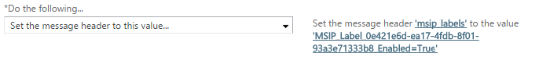

---
# required metadata

title: Custom configurations for the Azure Information Protection client
description: Information about customizing the Azure Information Protection client for Windows.
author: cabailey
ms.author: cabailey
manager: mbaldwin
ms.date: 11/27/2018
ms.topic: conceptual
ms.service: information-protection
ms.assetid: 5eb3a8a4-3392-4a50-a2d2-e112c9e72a78

# optional metadata

#ROBOTS:
#audience:
#ms.devlang:
ms.reviewer: eymanor
ms.suite: ems
#ms.tgt_pltfrm:
#ms.custom:

---

# Admin Guide: Custom configurations for the Azure Information Protection client

>*Applies to: Active Directory Rights Management Services, [Azure Information Protection](https://azure.microsoft.com/pricing/details/information-protection), Windows 10, Windows 8.1, Windows 8, Windows 7 with SP1, Windows Server 2016, Windows Server 2012 R2, Windows Server 2012, Windows Server 2008 R2*

Use the following information for advanced configurations that you might need for specific scenarios or a subset of users when you manage the Azure Information Protection client.

Some of these settings require editing the registry and some use advanced settings that you must configure in the Azure portal, and then publish for clients to download.  

### How to configure advanced client configuration settings in the portal

1. If you haven't already done so, in a new browser window, [sign in to the Azure portal](../configure-policy.md#signing-in-to-the-azure-portal), and then navigate to the **Azure Information Protection** blade.

2. From the **Classifications** > **Labels** menu option: Select **Policies**.

3. On the **Azure Information Protection - Policies** blade, select the context menu (**...**) next to the policy to contain the advanced settings. Then select **Advanced settings**.
    
    You can configure advanced settings for the Global policy, as well as for scoped policies.

4. On the **Advanced settings** blade, type the advanced setting name and value, and then select **Save and close**.

5. Make sure that users for this policy restart any Office applications that they had open.

6. If you no longer need the setting and want to revert to the default behavior: On the **Advanced settings** blade, select the context menu (**...**) next to the setting you no longer need, and then select **Delete**. Then click **Save and close**.

#### Available advanced client settings

|Setting|Scenario and instructions|
|----------------|---------------|
|DisableDNF|[Hide or show the Do Not Forward button in Outlook](#hide-or-show-the-do-not-forward-button-in-outlook)|
|EnableBarHiding|[Permanently hide the Azure Information Protection bar](#permanently-hide-the-azure-information-protection-bar)|
|EnableCustomPermissions|[Make the custom permissions options available or unavailable to users](#make-the-custom-permissions-options-available-or-unavailable-to-users)|
|EnablePDFv2Protection|[Protect PDF files by using the ISO standard for PDF encryption](#protect-pdf-files-by-using-the-iso-standard-for-pdf-encryption)|
|LabelbyCustomProperty|[Migrate labels from Secure Islands and other labeling solutions](#migrate-labels-from-secure-islands-and-other-labeling-solutions)|
|LabelToSMIME|[Configure a label to apply S/MIME protection in Outlook](#configure-a-label-to-apply-smime-protection-in- Outlook)|
|OutlookDefaultLabel|[Set a different default label for Outlook](#set-a-different-default-label-for-outlook)|
|OutlookRecommendationEnabled|[Enable recommended classification in Outlook](#enable-recommended-classification-in-outlook)|
|PostponeMandatoryBeforeSave|[Remove "Not now" for documents when you use mandatory labeling](#remove-not-now-for-documents-when-you-use-mandatory-labeling)|
|ProcessUsingLowIntegrity|[Disable the low integrity level for the scanner](#disable-the-low-integrity-level-for-the-scanner)|
|PullPolicy|[Support for disconnected computers](#support-for-disconnected-computers)
|RemoveExternalContentMarkingInApp|[Remove headers and footers from other labeling solutions](#remove-headers-and-footers-from-other-labeling-solutions)|
|ReportAnIssueLink|[Modify the email address for the Report an Issue link](#modify-the-email-address-for-the-report-an-issue-link)|
|RunPolicyInBackground|[Turn on classification to run continuously in the background](#turn-on-classification-to-run-continuously-in-the-background)|
|SyncPropertyName|[Label an Office document by using an existing custom property](#label-an-office-document-by-using-an-existing-custom-property)|
|SyncPropertyState|[Label an Office document by using an existing custom property](#label-an-office-document-by-using-an-existing-custom-property)|

## Prevent sign-in prompts for AD RMS only computers

By default, the Azure Information Protection client automatically tries to connect to the Azure Information Protection service. For computers that only communicate with AD RMS, this configuration can result in a sign-in prompt for users that is not necessary. You can prevent this sign-in prompt by editing the registry.

 - Locate the following value name, and then set the value data to **0**:
    
    **HKEY_CURRENT_USER\SOFTWARE\Microsoft\MSIP\EnablePolicyDownload** 

Regardless of this setting, the Azure Information Protection client still follows the standard [RMS service discovery process](client-deployment-notes.md#rms-service-discovery) to find its AD RMS cluster.

## Sign in as a different user

In a production environment, users wouldn't usually need to sign in as a different user when they are using the Azure Information Protection client. However, as an administrator, you might need to sign in as a different user during a testing phase. 

You can verify which account you're currently signed in as by using the **Microsoft Azure Information Protection** dialog box: Open an Office application and on the **Home** tab, in the **Protection** group, click **Protect**, and then click **Help and feedback**. Your account name is displayed in the **Client status** section.

Be sure to also check the domain name of the signed in account that's displayed. It can be easy to miss that you're signed in with the right account name but wrong domain. A symptom of using the wrong account includes failing to download the Azure Information Protection policy, or not seeing the labels or behavior that you expect.

To sign in as a different user:

1. Navigate to **%localappdata%\Microsoft\MSIP** and delete the **TokenCache** file.

2. Restart any open Office applications and sign in with your different user account. If you do not see a prompt in your Office application to sign in to the Azure Information Protection service, return to the **Microsoft Azure Information Protection** dialog box and click **Sign in** from the updated **Client status** section.

Additionally:

- This solution is supported for signing in as another user from the same tenant. It is not supported for signing in as another user from a different tenant. To test Azure Information Protection with multiple tenants, use different computers.

- If you are using single sign-on, you must sign out from Windows and sign in with your different user account after editing the registry. The Azure Information Protection client then automatically authenticates by using your currently signed in user account.

- You can use the **Reset settings** option from **Help and Feedback** to sign out and delete the currently downloaded Azure Information Protection policy.

## Enforce protection-only mode when your organization has a mix of licenses

If your organization does not have any licenses for Azure Information Protection, but does have licenses for Office 365 that include the Azure Rights Management service for protecting data, the Azure Information Protection client for Windows automatically runs in [protection-only mode](client-protection-only-mode.md).

However, if your organization has a subscription for Azure Information Protection, by default all Windows computers can download the Azure Information Protection policy. The Azure Information Protection client does not do license checking and enforcement. 

If you have some users who do not have a license for Azure Information Protection but do have a license for Office 365 that includes the Azure Rights Management service, edit the registry on these users' computers to prevent users from running the unlicensed classification and labeling features from Azure Information Protection.

Locate the following value name and set the value data to **0**:

**HKEY_CURRENT_USER\SOFTWARE\Microsoft\MSIP\EnablePolicyDownload** 

In addition, check that these computers do not have a file named **Policy.msip** in the **%LocalAppData%\Microsoft\MSIP** folder. If this file exists, delete it. This file contains the Azure Information Protection policy and might have downloaded before you edited the registry, or if the Azure Information Protection client was installed with the demo option.

## Modify the email address for the Report an Issue link

This configuration uses an [advanced client setting](#how-to-configure-advanced-client-configuration-settings-in-the-portal) that you must configure in the Azure portal. This setting is only applicable to preview versions of the Azure Information Protection client because general availability versions of the client don't display the **Report an Issue** link.

When users select the **Report an Issue** link from the **Help and Feedback** client dialog box from preview versions of the client, by default, a Microsoft address is populated in an email message. Use the following advanced client setting to modify that address. For example, specify `mailto:helpdesk@contoso.com` for the email address of your help desk. 

To configure this advanced setting, enter the following strings:

- Key: **ReportAnIssueLink**

- Value: **\<HTTP string>**

## Hide the Classify and Protect menu option in Windows File Explorer

Create the following DWORD value name (with any value data):

**HKEY_CLASSES_ROOT\AllFilesystemObjects\shell\Microsoft.Azip.RightClick\LegacyDisable**

## Support for disconnected computers

By default, the Azure Information Protection client automatically tries to connect to the Azure Information Protection service to download the latest Azure Information Protection policy. If you have computers that you know will not be able to connect to the Internet for a period of time, you can prevent the client from attempting to connect to the service by editing the registry. 

Note that without an Internet connection, the client cannot apply protection (or remove protection) by using your organization's cloud-based key. Instead, the client is limited to using labels that apply classification only, or protection that uses [HYOK](../configure-adrms-restrictions.md).

You can prevent a sign-in prompt to the Azure Information Protection service by using an [advanced client setting](#how-to-configure-advanced-client-configuration-settings-in-the-portal) that you must configure in the Azure portal and then download the policy for computers. Or, you can prevent this sign-in prompt by editing the registry.

- To configure the advanced client setting:
    
    1. Enter the following strings:
    
        - Key: **PullPolicy**
        
        - Value: **False**
    
    2. Download the policy with this setting and install it on computers by using the instructions that follow.

- Alternatively, to edit the registry:
    
    - Locate the following value name, and then set the value data to **0**:
    
        **HKEY_CURRENT_USER\SOFTWARE\Microsoft\MSIP\EnablePolicyDownload** 

The client must have a valid policy file named **Policy.msip**, in the **%LocalAppData%\Microsoft\MSIP** folder.

You can export the global policy or a scoped policy from the Azure portal, and copy the exported file to the client computer. You can also use this method to replace an-out-of-date policy file with the latest policy. However, exporting the policy does not support the scenario where a user belongs to more than one scoped policy. Also be aware that if users select the **Reset Settings** option from [Help and feedback](client-admin-guide.md#help-and-feedback-section), this action deletes the policy file and renders the client inoperable until you manually replace the policy file or the client connects to the service to download the policy.

When you export the policy from the Azure portal, a zipped file is downloaded that contains multiple versions of the policy. These policy versions correspond to different versions of the Azure Information Protection client:

1. Unzip the file and use the following table to identify which policy file you need. 
    
    |File name|Corresponding client version|
    |--------------------------|---------------------------------------------|
    |Policy1.1.msip |version 1.2|
    |Policy1.2.msip |version 1.3 - 1.7|
    |Policy1.3.msip |version 1.8 - 1.29|
    |Policy1.4.msip |version 1.32 and later|
    
2. Rename the identified file to **Policy.msip**, and then copy it to the **%LocalAppData%\Microsoft\MSIP** folder on computers that have the Azure Information Protection client installed. 

## Hide or show the Do Not Forward button in Outlook

The recommended method to configure this option is by using the [policy setting](../configure-policy-settings.md) **Add the Do Not Forward button to the Outlook ribbon**. However, you can also configure this option by using an [advanced client setting](#how-to-configure-advanced-client-configuration-settings-in-the-portal) that you configure in the Azure portal.

When you configure this setting, it hides or shows the **Do Not Forward** button on the ribbon in Outlook. This setting has no effect on the Do Not Forward option from Office menus.

To configure this advanced setting, enter the following strings:

- Key: **DisableDNF**

- Value: **True** to hide the button, or **False** to show the button

## Make the custom permissions options available or unavailable to users

The recommended method to configure this option is by using the [policy setting](../configure-policy-settings.md) **Make the custom permissions option available for users**. However, you can also configure this option by using an [advanced client setting](#how-to-configure-advanced-client-configuration-settings-in-the-portal) that you configure in the Azure portal. 

When you configure this setting and publish the policy for users, the custom permissions options become visible for users to select their own protection settings, or they are hidden so that users can't select their own protection settings unless prompted.

To configure this advanced setting, enter the following strings:

- Key: **EnableCustomPermissions**

- Value: **True** to make the custom permissions option visible, or **False** to hide this option

## Permanently hide the Azure Information Protection bar

This configuration uses an [advanced client setting](#how-to-configure-advanced-client-configuration-settings-in-the-portal) that you must configure in the Azure portal. Use it only when the [policy setting](../configure-policy-settings.md) **Display the Information Protection bar in Office apps** is set to **On**.

When you configure this setting and publish the policy for users, and a user chooses to not show the Azure Information Protection bar in their Office applications, the bar remains hidden. This happens when the user clears the  **Show Bar** option from the **Home** tab, **Protection** group, **Protect** button. This setting has no effect if the user closes the bar by using the **Close this bar** icon.

Even though the Azure Information Protection bar remains hidden, users can still select a label from the temporarily displayed bar if you have configured recommended classification, or when a document or email must have a label. 

To configure this advanced setting, enter the following strings:

- Key: **EnableBarHiding**

- Value: **True**

## Enable recommended classification in Outlook

This configuration uses an [advanced client setting](#how-to-configure-advanced-client-configuration-settings-in-the-portal) that you must configure in the Azure portal. This setting is in preview and might change.

When you configure a label for recommended classification, users are prompted to accept or dismiss the recommended label in Word, Excel, and PowerPoint. This setting extends this label recommendation to also display in Outlook.

To configure this advanced setting, enter the following strings:

- Key: **OutlookRecommendationEnabled**

- Value: **True**

## Set a different default label for Outlook

This configuration uses an [advanced client setting](#how-to-configure-advanced-client-configuration-settings-in-the-portal) that you must configure in the Azure portal. 

When you configure this setting, Outlook doesn't apply the default label that is configured in the Azure Information Protection policy for the setting **Select the default label**. Instead, Outlook can apply a different default label, or no label.

To apply a different label, you must specify the label ID. The label ID value is displayed on the **Label** blade, when you view or configure the Azure Information Protection policy in the Azure portal. For files that have labels applied, you can also run the [Get-AIPFileStatus](/powershell/module/azureinformationprotection/get-aipfilestatus) PowerShell cmdlet to identify the label ID (MainLabelId or SubLabelId). When a label has sublabels, always specify the ID of just a sublabel and not the parent label.

So that Outlook doesn't apply the default label, specify **None**.

To configure this advanced setting, enter the following strings:

- Key: **OutlookDefaultLabel**

- Value: \<**label ID**> or **None**

## Configure a label to apply S/MIME protection in Outlook

This configuration uses an [advanced client setting](#how-to-configure-advanced-client-configuration-settings-in-the-portal) that you must configure in the Azure portal. This setting is in preview and might change.

Use this setting only when you have a working [S/MIME deployment](https://docs.microsoft.com/office365/SecurityCompliance/s-mime-for-message-signing-and-encryption) and want a label to automatically apply this protection method for emails rather than use Rights Management protection from Azure Information Protection. The resulting protection is the same as when a user manually selects S/MIME options from Outlook.

This configuration requires you to specify an advanced client setting named **LabelToSMIME** for each Azure Information Protection label that you want to apply S/MIME protection. Then for each entry, set the value by using the following syntax:

`[Azure Information Protection label ID];[S/MIME action]`

The label ID value is displayed on the **Label** blade, when you view or configure the Azure Information Protection policy in the Azure portal. To specify a sublabel, the parent label must be in the same scope, or in the global policy.

The S/MIME action can be:

- `Sign;Encrypt`: To apply a digital signature and S/MIME encryption

- `Encrypt`: To apply S/MIME encryption only

- `Sign`: To apply a digital signature only

Example values for a label ID of **dcf781ba-727f-4860-b3c1-73479e31912b**:

- To apply S/MIME encryption and a digital signature:
    
    **dcf781ba-727f-4860-b3c1-73479e31912b;Sign;Encrypt**

- To apply S/MIME encryption only:
    
    **dcf781ba-727f-4860-b3c1-73479e31912b;Encrypt**
    
- To apply a digital encryption only:
    
    **dcf781ba-727f-4860-b3c1-73479e31912b;Sign**

As a result of this configuration, when the label is applied for an email message, S/MIME protection is applied to the email in addition to the label's classification.

If the label you specify is configured for Rights Management protection in the Azure portal, S/MIME protection replaces the Rights Management protection only in Outlook. For all other scenarios that support labeling, Rights Management protection will be applied.

If you want the label to be visible in Outlook only, configure the label to apply the single user-defined action of **Do Not Forward**, as described in the [Quickstart: Configure a label for users to easily protect emails that contain sensitive information](../quickstart-label-dnf-protectedemail.md).

## Remove "Not now" for documents when you use mandatory labeling

This configuration uses an [advanced client setting](#how-to-configure-advanced-client-configuration-settings-in-the-portal) that you must configure in the Azure portal. 

When you use the [policy setting](../configure-policy-settings.md) of **All documents and emails must have a label**, users are prompted to select a label when they first save an Office document and when they send an email. For documents, users can select **Not now** to temporarily dismiss the prompt to select a label and return to the document. However, they cannot close the saved document without labeling it. 

When you configure this setting, it removes the **Not now** option so that users must select a label when the document is first saved.

To configure this advanced setting, enter the following strings:

- Key: **PostponeMandatoryBeforeSave**

- Value: **False**

## Turn on classification to run continuously in the background

This configuration uses an [advanced client setting](#how-to-configure-advanced-client-configuration-settings-in-the-portal) that you must configure in the Azure portal. This setting is in preview and might change.

When you configure this setting, it changes the [default behavior](../configure-policy-classification.md#how-automatic-or-recommended-labels-are-applied) of how the Azure Information Protection client applies automatic and recommended labels to documents: 

- For Word, Excel, and PowerPoint, automatic classification runs continuously in the background.  

The behavior does not change for Outlook.

When the Azure Information Protection client periodically checks documents for the condition rules that you specify, this behavior enables automatic and recommended classification and protection for documents that are stored in SharePoint Online. Large files also save more quickly because the condition rules have already run. 

The condition rules do not run in real time as a user types. Instead, they run periodically as a background task if the document is modified.

To configure this advanced setting, enter the following strings:

- Key: **RunPolicyInBackground**

- Value: **True**

## Protect PDF files by using the ISO standard for PDF encryption

This configuration uses an [advanced client setting](#how-to-configure-advanced-client-configuration-settings-in-the-portal) that you must configure in the Azure portal. 

By default, when the Azure Information Protection client protects a PDF file, the resulting file has a .ppdf file name extension. You can change this behavior so that the file name extension remains as .pdf and adheres to the ISO standard for PDF encryption. For more information about this standard, see section **7.6 Encryption** from the [document that is derived from ISO 32000-1](https://www.adobe.com/content/dam/acom/en/devnet/pdf/pdfs/PDF32000_2008.pdf) and published by Adobe Systems Incorporated.

To configure this advanced setting, enter the following string:

- Key: **EnablePDFv2Protection**

- Value: **True**

As a result of this configuration option, when the Azure Information Protection client protects a PDF file, this action creates a protected PDF document that can be opened with the latest version of the Azure Information Protection client for Windows, and other PDF readers that support the ISO standard for PDF encryption. The Azure Information Protection app for iOS and Android does not currently support the ISO standard for PDF encryption. For the latest information on the Adobe Acrobat Reader, see [Starting October, use Adobe Acrobat Reader for PDFs protected by Microsoft Information Protection](https://techcommunity.microsoft.com/t5/Azure-Information-Protection/Starting-October-use-Adobe-Acrobat-Reader-for-PDFs-protected-by/ba-p/262738).

For the Azure Information Protection scanner to use the new setting, the scanner service must be restarted.

For more information about this PDF encryption, see the blog post [New support for PDF encryption with Microsoft Information Protection](https://techcommunity.microsoft.com/t5/Azure-Information-Protection/New-support-for-PDF-encryption-with-Microsoft-Information/ba-p/262757).

### To convert existing .ppdf files to protected .pdf files

When the Azure Information Protection client has downloaded the client policy with the new setting, you can use PowerShell commands to convert existing .ppdf files to protected .pdf files that use the ISO standard for PDF encryption. 

To use the following instructions for files that you didn't protect yourself, you must have a [Rights Management usage right](../configure-usage-rights.md) to remove protection from files, or be a super user. To enable the super user feature and configure your account to be a super user, see [Configuring super users for Azure Rights Management and Discovery Services or Data Recovery](../configure-super-users.md).

In addition, when you use these instructions for files that you didn't protect yourself, you become the [RMS Issuer](../configure-usage-rights.md#rights-management-issuer-and-rights-management-owner). In this scenario, the user who originally protected the document can no longer track and revoke it. If users need to track and revoke their protected PDF documents, ask them to manually remove and then reapply the label by using File Explorer, right-click.

To use PowerShell commands to convert existing .ppdf files to protected .pdf files that use the ISO standard for PDF encryption:

1. Use [Get-AIPFileStatus](/powershell/module/azureinformationprotection/get-aipfilestatus) with the .ppdf file. For example:
    
		Get-AIPFileStatus -Path \\Finance\Projectx\sales.ppdf

2. From the output, take a note of the following parameter values:
    
    - The value (GUID) for **SubLabelId**, if there is one. If this value is blank, a sublabel wasn't used, so note the value for **MainLabelId** instead.
    
    Note: If there is no value for **MainLabelId** either, the file isn't labeled. In this case, you can use the [Unprotect-RMSFile](/powershell/module/azureinformationprotection/unprotect-rmsfile) command and [Protect-RMSFile](/powershell/module/azureinformationprotection/protect-rmsfile) command instead of the commands in step 3 and 4.
    
    - The value for **RMSTemplateId**. If this value is **Restricted Access**, a user has protected the file using custom permissions rather than the protection settings that are configured for the label. If you continue, those custom permissions will be overwritten by the label's protection settings. Decide whether to continue or ask the user (value displayed for the **RMSIssuer**) to remove the label and re-apply it, together with their original custom permissions.

3. Remove the label by using [Set-AIPFileLabel](/powershell/module/azureinformationprotection/set-aipfilelabel) with the *RemoveLabel* parameter. If you are using the [policy setting](../configure-
4. settings.md) of **Users must provide justification to set a lower classification label, remove a label, or remove protection**, you must also specify the *Justification* parameter with the reason. For example: 
    
    	Set-AIPFileLabel \\Finance\Projectx\sales.ppdf -RemoveLabel -JustificationMessage 'Removing .ppdf protection to replace with .pdf ISO standard'

4. Reapply the original label, by specifying the value for the label that you identified in step 1. For example:
    
    	Set-AIPFileLabel \\Finance\Projectx\sales.pdf -LabelId d9f23ae3-1234-1234-1234-f515f824c57b

The file retains the .pdf file name extension but is classified as before, and it is protected by using the ISO standard for PDF encryption.

## Support for files protected by Secure Islands

This configuration option is currently in preview and is subject to change.

If you used Secure Islands to protect documents, you might have protected text and picture files, and generically protected files as a result of this protection. For example, files that have a file name extension of .ptxt, .pjpeg, or .pfile. When you edit the registry as follows, Azure Information Protection can decrypt these files:

Add the following DWORD value of **EnableIQPFormats** to the following registry path, and set the value data to **1**:

- For a 64-bit version of Windows: HKEY_LOCAL_MACHINE\\SOFTWARE\\WOW6432Node\\Microsoft\\MSIP

- For a 32-bit version of Windows: HKEY_LOCAL_MACHINE\\SOFTWARE\\Microsoft\\MSIP

As a result of this registry edit, the following scenarios are supported:

- The Azure Information Protection viewer can open these protected files.

- The Azure Information Protection scanner can inspect these files for sensitive information.

- File Explorer, PowerShell, and the Azure Information Protection scanner can label these files. As a result, you can apply an Azure Information Protection label that applies new protection from Azure Information Protection, or that removes the existing protection from Secure Islands.

- You can use the [labeling migration client customization](#migrate-labels-from-secure-islands-and-other-labeling-solutions) to automatically convert the Secure Islands label on these protected files to an Azure Information Protection label.

## Migrate labels from Secure Islands and other labeling solutions

This configuration uses an [advanced client setting](#how-to-configure-advanced-client-configuration-settings-in-the-portal) that you must configure in the Azure portal. This setting is in preview and might change.

This configuration is currently not compatible with the setting to [Protect PDF files by using the ISO standard for PDF encryption](client-admin-guide-customizations.md#protect-pdf-files-by-using-the-iso-standard-for-pdf-encryption). When you use both settings together, .ppdf files cannot be opened by File Explorer, PowerShell, or the scanner.

For Office documents and PDF documents that are labeled by Secure Islands, you can relabel these documents with an Azure Information Protection label by using a mapping that you define. You also use this method to reuse labels from other solutions when their labels are on Office documents. 

> [!NOTE]
> If you have files other than PDF and Office documents that are protected by Secure Islands, these can be relabeled after you edit the registry as described in the [preceding section](#support-for-files-protected-by-secure-islands). 

As a result of this configuration option, the new Azure Information Protection label is applied by the Azure Information Protection client as follows:

- For Office documents: When the document is opened in the desktop app, the new Azure Information Protection label is shown as set and is applied when the document is saved.

- For File Explorer: In the Azure Information Protection dialog box, the new Azure Information Protection label is shown as set and is applied when the user selects **Apply**. If the user selects **Cancel**, the new label is not applied.

- For PowerShell: [Set-AIPFileLabel](/powershell/module/azureinformationprotection/set-aipfilelabel) applies the new Azure Information Protection label. [Get-AIPFileStatus](/powershell/module/azureinformationprotection/get-aipfilestatus) doesn't display the new Azure Information Protection label until it is set by another method.

- For the Azure Information Protection scanner: Discovery reports when the new Azure Information Protection label would be set and this label can be applied with the enforce mode.

This configuration requires you to specify an advanced client setting named **LabelbyCustomProperty** for each Azure Information Protection label that you want to map to the old label. Then for each entry, set the value by using the following syntax:

`[Azure Information Protection label ID],[migration rule name],[Secure Islands custom property name],[Secure Islands metadata Regex value]`

The label ID value is displayed on the **Label** blade, when you view or configure the Azure Information Protection policy in the Azure portal. To specify a sublabel, the parent label must be in the same scope, or in the global policy.

Specify your choice of a migration rule name. Use a descriptive name that helps you to identify how one or more labels from your previous labeling solution should be mapped to an Azure Information Protection label. The name displays in the scanner reports and in Event Viewer. 

Note that this setting does not remove any visual markings that the old label might have applied. To remove headers and footers, see the next section, [Remove headers and footers from other labeling solutions](#remove-headers-and-footers-from-other-labeling-solutions).

### Example 1: One-to-one mapping of the same label name

Documents that have a Secure Islands label of "Confidential" should be relabeled as "Confidential" by Azure Information Protection.

In this example:

- The Azure Information Protection label of **Confidential** has a label ID of 1ace2cc3-14bc-4142-9125-bf946a70542c. 

- The Secure Islands label is stored in the custom property named **Classification**.

The advanced client setting:

    
|Name|Value|
|---------------------|---------|
|LabelbyCustomProperty|1ace2cc3-14bc-4142-9125-bf946a70542c,"Secure Islands label is Confidential",Classification,Confidential|

### Example 2: One-to-one mapping for a different label name

Documents labeled as "Sensitive" by Secure Islands should be relabeled as "Highly Confidential" by Azure Information Protection.

In this example:

- The Azure Information Protection label **Highly Confidential** has a label ID of 3e9df74d-3168-48af-8b11-037e3021813f.

- The Secure Islands label is stored in the custom property named **Classification**.

The advanced client setting:

    
|Name|Value|
|---------------------|---------|
|LabelbyCustomProperty|3e9df74d-3168-48af-8b11-037e3021813f,"Secure Islands label is Sensitive",Classification,Sensitive|

### Example 3: Many-to-one mapping of label names

You have two Secure Islands labels that include the word "Internal" and you want documents that have either of these Secure Islands labels to be relabeled as "General" by Azure Information Protection.

In this example:

- The Azure Information Protection label **General** has a label ID of 2beb8fe7-8293-444c-9768-7fdc6f75014d.

- The Secure Islands label is stored in the custom property named **Classification**.

The advanced client setting:

    
|Name|Value|
|---------------------|---------|
|LabelbyCustomProperty|2beb8fe7-8293-444c-9768-7fdc6f75014d,"Secure Islands label contains Internal",Classification,.\*Internal.\*|

## Remove headers and footers from other labeling solutions

This configuration uses multiple [advanced client settings](#how-to-configure-advanced-client-configuration-settings-in-the-portal) that you must configure in the Azure portal. These settings are in preview and might change.

The settings let you remove or replace headers or footers from documents when those visual markings have been applied by another labeling solution. For example, the old footer contains the name of an old label that you have now migrated to Azure Information Protection with a new label name and its own footer.

When the client gets this configuration in its policy, the old headers and footers are removed or replaced when the document is opened in the Office app and any Azure Information Protection label is applied to the document.

This configuration is not supported for Outlook, and be aware that when you use it with Word, Excel, and PowerPoint, it can negatively affect the performance of these apps for users. The configuration lets you define settings per application, for example, search for text in the headers and footers of Word documents but not Excel spreadsheets or PowerPoint presentations.

Because the pattern matching affects the performance for users, we recommend that you limit the Office application types (**W**ord, **E**xcel, **P**owerPoint) to just those that need to be searched:

- Key: **RemoveExternalContentMarkingInApp**

- Value: \<**Office application types WXP**> 

Examples:

- To search Word documents only, specify **W**.

- To search Word documents and PowerPoint presentations, specify **WP**.

You then need at least one more advanced client setting, **ExternalContentMarkingToRemove**, to specify the contents of the header or footer, and how to remove or replace them.

### How to configure ExternalContentMarkingToRemove

When you specify the string value for the **ExternalContentMarkingToRemove** key, you have three options that use regular expressions:

- Partial match to remove everything in the header or footer.
    
    Example: Headers or footers contain the string **TEXT TO REMOVE**. You want to completely remove these headers or footers. You specify the value: `*TEXT*`.

- Complete match to remove just specific words in the header or footer.
    
    Example: Headers or footers contain the string **TEXT TO REMOVE**. You want to remove the word **TEXT** only, which leaves the header or footer string as **TO REMOVE**. You specify the value: `TEXT `.

- Complete match to remove everything in the header or footer.
    
    Example: Headers or footers have the string **TEXT TO REMOVE**. You want to remove headers or footers that have exactly this string. You specify the value: `^TEXT TO REMOVE$`.
    

The pattern matching for the string that you specify is case-insensitive. The maximum string length is 255 characters.

Because some documents might include invisible characters or different kinds of spaces or tabs, the string that you specify for a phrase or sentence might not be detected. Whenever possible, specify a single distinguishing word for the value and be sure to test the results before you deploy in production.

- Key: **ExternalContentMarkingToRemove**

- Value: \<**string to match, defined as regular expression**> 

#### Multiline headers or footers

If a header or footer text is more than a single line, create a key and value for each line. For example, you have the following footer with two lines:

**The file is classified as Confidential**

**Label applied manually**

To remove this multline footer, you create the following two entries:

- Key 1: **ExternalContentMarkingToRemove**

- Key Value 1: **\*Confidential***

- Key 2: **ExternalContentMarkingToRemove**

- Key Value 2: **\*Label applied*** 

#### Optimization for PowerPoint

Footers in PowerPoint are implemented as shapes. To avoid removing shapes that contain the text that you have specified but are not headers or footers, use an additional advanced client setting named **PowerPointShapeNameToRemove**. We also recommend using this setting to avoid checking the text in all shapes, which is a resource-intensive process.

If you do not specify this additional advanced client setting, and PowerPoint is included in the **RemoveExternalContentMarkingInApp** key value, all shapes will be checked for the text that you specify in the **ExternalContentMarkingToRemove** value. 

To find the name of the shape that you're using as a header or footer:

1. In PowerPoint, display the **Selection** pane: **Format** tab > **Arrange** group > **Selection Pane**.

2. Select the shape on the slide that contains your header or footer. The name of the selected shape is now highlighted in the **Selection** pane.

Use the name of the shape to specify a string value for the **PowerPointShapeNameToRemove** key. 

Example: The shape name is **fc**. To remove the shape with this name, you specify the value: `fc`.

- Key: **PowerPointShapeNameToRemove**

- Value: \<**PowerPoint shape name**> 

When you have more than one PowerPoint shape to remove, create as many **PowerPointShapeNameToRemove** keys as you have shapes to remove. For each entry, specify the name of the shape to remove.

By default, only the Master slides are checked for headers and footers. To extend this search to all slides, which is a much more resource-intensive process, use an additional advanced client setting named **RemoveExternalContentMarkingInAllSlides**:

- Key: **RemoveExternalContentMarkingInAllSlides**

- Value: **True**

## Label an Office document by using an existing custom property

> [!NOTE]
> If you use this configuration and the configuration to [migrate labels from Secure Islands and other labeling solutions](#migrate-labels-from-secure-islands-and-other-labeling-solutions), the labeling migration setting takes precedence. 

This configuration uses an [advanced client setting](#how-to-configure-advanced-client-configuration-settings-in-the-portal) that you must configure in the Azure portal. 

When you configure this setting, you can classify (and optionally, protect) an Office document when it has an existing custom property with a value that matches one of your label names. This custom property can be set from another classification solution, or can be set as a property by SharePoint.

As a result of this configuration, when a document without an Azure Information Protection label is opened and saved by a user in an Office app, the document is then labeled to match the corresponding property value. 

This configuration requires you to specify two advanced settings that work together. The first is named **SyncPropertyName**, which is the custom property name that has been set from the other classification solution, or a property that is set by SharePoint. The second is named **SyncPropertyState** and must be set to OneWay.

To configure this advanced setting, enter the following strings:

- Key 1: **SyncPropertyName**

- Key 1 Value: \<**property name**> 

- Key 2: **SyncPropertyState**

- Key 2 Value: **OneWay**

Use these keys and corresponding values for only one custom property.

As an example, you have a SharePoint column named **Classification** that has possible values of **Public**, **General**, and **Highly Confidential All Employees**. Documents are stored in SharePoint and have **Public**, **General**, or **Highly Confidential All Employees** as values set for the Classification property.

To label an Office document with one of these classification values, set **SyncPropertyName** to **Classification**, and **SyncPropertyState** to **OneWay**. 

Now, when a user opens and saves one of these Office documents, it is labeled  **Public**, **General**, or **Highly Confidential \ All Employees** if you have labels with these names in your Azure Information Protection policy. If you do not have labels with these names, the document remains unlabeled.

## Disable the low integrity level for the scanner

This configuration uses an [advanced client setting](#how-to-configure-advanced-client-configuration-settings-in-the-portal) that you must configure in the Azure portal. 

By default, the Azure Information Protection scanner runs with a low integrity level. This setting provides higher security isolation but at the cost of performance. A low integrity level is suitable if you run the scanner with an account that has privileged rights (such as a local administrator account) because this setting helps to protect the computer running the scanner.

However, when the service account that runs the scanner has only the rights documented in the [scanner prerequisites](../deploy-aip-scanner.md#prerequisites-for-the-azure-information-protection-scanner), the low integrity level is not necessary and is not recommended because it negatively affects performance. 

For more information about the Windows integrity levels, see [What is the Windows Integrity Mechanism?](https://msdn.microsoft.com/library/bb625957.aspx)

To configure this advanced setting so that the scanner runs with an integrity level that's automatically assigned by Windows (a standard user account runs with a medium integrity level), enter the following strings:

- Key: **ProcessUsingLowIntegrity**

- Value: **False**

## Integration with Exchange message classification for a mobile device labeling solution

Although Outlook on the web doesn't yet natively support Azure Information Protection classification and protection, you can use Exchange message classification to extend your Azure Information Protection labels to your mobile users when they use Outlook on the web. Outlook Mobile does not support Exchange message classification.

To achieve this solution: 

1. Use the [New-MessageClassification](https://technet.microsoft.com/library/bb124400) Exchange PowerShell cmdlet to create message classifications with the Name property that maps to your label names in your Azure Information Protection policy. 

2. Create an Exchange mail flow rule for each label: Apply the rule when the message properties include the classification that you configured, and modify the message properties to set a message header. 

     For the message header, you find the information to specify by inspecting the Internet headers of an email that you sent and classified by using your Azure Information Protection label. Look for the header **msip_labels** and the string that immediately follows, up to and including the semicolon. For example:
    
    **msip_labels: MSIP_Label_0e421e6d-ea17-4fdb-8f01-93a3e71333b8_Enabled=True;**
    
    Then, for the message header in the rule, specify **msip_labels** for the header, and the remainder of this string for the header value. For example:
    
    
    
    Note: When the label is a sublabel, you must also specify the parent label before the sublabel in the header value, using the same format. For example, if your sublabel has a GUID of 27efdf94-80a0-4d02-b88c-b615c12d69a9, your value might look like the following:
    `MSIP_Label_ab70158b-bdcc-42a3-8493-2a80736e9cbd_Enabled=True;MSIP_Label_27efdf94-80a0-4d02-b88c-b615c12d69a9_Enabled=True;`

Before you test this configuration, remember that there is often a delay when you create or edit mail flow rules (for example, wait an hour). When the rule is in effect, the following events now happen when users use Outlook on the web or a mobile device client that supports Exchange ActiveSync IRM: 

- Users select the Exchange message classification and send the email.

- The Exchange rule detects the Exchange classification and accordingly modifies the message header to add the Azure Information Protection classification.

- When internal recipients view the email in Outlook and they have the Azure Information Protection client installed, they see the Azure Information Protection label assigned. 

If your Azure Information Protection labels apply protection, add this protection to the rule configuration: Selecting the option to modify the message security, apply rights protection, and then select the RMS template or Do Not Forward option.

You can also configure mail flow rules to do the reverse mapping. When an Azure Information Protection label is detected, set a corresponding Exchange message classification:

- For each Azure Information Protection label: Create a mail flow rule that is applied when the **msip_labels** header includes the name of your label (for example, **General**), and apply a message classification that maps to this label.

## Next steps
Now that you've customized the Azure Information Protection client, see the following resources for additional information that you might need to support this client:

- [Client files and usage logging](client-admin-guide-files-and-logging.md)

- [Document tracking](client-admin-guide-document-tracking.md)

- [File types supported](client-admin-guide-file-types.md)

- [PowerShell commands](client-admin-guide-powershell.md)

