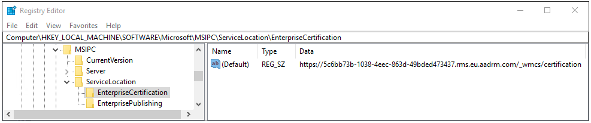

---
# required metadata

title: Use PowerShell with the Azure Information Protection client
description: Instructions and information for admins to manage the Azure Information Protection client by using PowerShell.
author: cabailey
ms.author: cabailey
manager: barbkess
ms.date: 05/11/2019
ms.topic: conceptual
ms.collection: M365-security-compliance
ms.service: information-protection
ms.assetid: 4f9d2db7-ef27-47e6-b2a8-d6c039662d3c

# optional metadata

#ROBOTS:
#audience:
#ms.devlang:
ms.reviewer: eymanor
ms.suite: ems
#ms.tgt_pltfrm:
#ms.custom:

---


# Admin Guide: Using PowerShell with the Azure Information Protection client

>*Applies to: Active Directory Rights Management Services, [Azure Information Protection](https://azure.microsoft.com/pricing/details/information-protection), Windows 10, Windows 8.1, Windows 8, Windows 7 with SP1, Windows Server 2016, Windows Server 2012 R2, Windows Server 2012, Windows Server 2008 R2*
>
> *Instructions for: [Azure Information Protection client for Windows](../faqs.md#whats-the-difference-between-the-azure-information-protection-client-and-the-azure-information-protection-unified-labeling-client)*

When you install the Azure Information Protection client, PowerShell commands are automatically installed. This lets you manage the client by running commands that you can put into scripts for automation.

The cmdlets are installed with the PowerShell module **AzureInformationProtection**. This module includes all the Rights Management cmdlets from the RMS Protection Tool (no longer supported). There are also cmdlets that use Azure Information Protection for labeling. For example:

|Labeling cmdlet|Example usage|
|----------------|---------------|
|[Get-AIPFileStatus](/powershell/module/azureinformationprotection/get-aipfilestatus)|For a shared folder, identify all files with a specific label.|
|[Set-AIPFileClassification](/powershell/module/azureinformationprotection/set-aipfileclassification)|For a shared folder, inspect the file contents and then automatically label unlabeled files, according to the conditions that you have specified.|
|[Set-AIPFileLabel](/powershell/module/azureinformationprotection/set-aipfilelabel)|For a shared folder, apply a specified label to all files that do not have a label.|
|[Set-AIPAuthentication](/powershell/module/azureinformationprotection/set-aipauthentication)|Label files non-interactively, for example by using a script that runs on a schedule.|

> [!TIP]
> To use cmdlets with path lengths greater than 260 characters, use the following [group policy setting](https://blogs.msdn.microsoft.com/jeremykuhne/2016/07/30/net-4-6-2-and-long-paths-on-windows-10/) that is available starting Windows 10, version 1607:<br /> **Local Computer Policy** > **Computer Configuration** > **Administrative Templates** > **All Settings** > **NTFS** > **Enable Win32 long paths** 
> 
> For Windows Server 2016, you can use the same group policy setting when you install the latest Administrative Templates (.admx) for Windows 10.
>
> For more information, see the [Maximum Path Length Limitation](https://docs.microsoft.com/windows/desktop/FileIO/naming-a-file#maximum-path-length-limitation) section from the Windows 10 developer documentation.

The [Azure Information Protection scanner](../deploy-aip-scanner.md) uses cmdlets from the AzureInformationProtection module to install and configure a service on Windows Server. This scanner then lets you discover, classify, and protect files on data stores.

For a list of all the cmdlets and their corresponding help, see [AzureInformationProtection Module](/powershell/module/azureinformationprotection). Within a PowerShell session, type `Get-Help <cmdlet name> -online` to see the latest help.  

This module installs in **\ProgramFiles (x86)\Microsoft Azure Information Protection** and adds this folder to the **PSModulePath** system variable. The .dll for this module is named **AIP.dll**.

Currently, if you install the module as one user and run the cmdlets on the same computer as another user, you must first run the `Import-Module AzureInformationProtection` command. In this scenario, the module doesn't autoload when you first run a cmdlet.

The current release of the AzureInformationProtection module has the following limitations:

- You can unprotect Outlook personal folders (.pst files), but you cannot currently natively protect these files or other container files by using this PowerShell module.

- You can unprotect Outlook protected email messages (.rpmsg files) when they are in an Outlook personal folder (.pst), but you cannot unprotect .rpmsg files outside a personal folder.

Before you start to use these cmdlets, see the additional prerequisites and instructions that corresponds to your deployment:

- [Azure Information Protection and Azure Rights Management service](#azure-information-protection-and-azure-rights-management-service)

    - Applicable if you use classification-only or classification with Rights Management protection: You have a subscription that includes Azure Information Protection (for example, Enterprise Mobility + Security).
    - Applicable if you use protection-only with the Azure Rights Management service: You have a subscription that includes the Azure Rights Management service (for example, Office 365 E3 and Office 365 E5).

- [Active Directory Rights Management Services](#active-directory-rights-management-services)

    - Applicable if you use protection-only with the on-premises version of Azure Rights Management; Active Directory Rights Management Services (AD RMS).


## Azure Information Protection and Azure Rights Management service

Read this section before you start using the PowerShell commands when your organization uses Azure Information Protection for classification and protection, or just the Azure Rights Management service for data protection.


### Prerequisites

In addition to the prerequisites for installing the AzureInformationProtection module, there are additional prerequisites for Azure Information Protection labeling and the Azure Rights Management data protection service:

1. The Azure Rights Management service must be activated.

2. To remove protection from files for others using your own account: 

    - The super user feature must be enabled for your organization and your account must be configured to be a super user for Azure Rights Management.

3. To directly protect or unprotect files without user interaction: 

    - Create a service principal account, run Set-RMSServerAuthentication, and consider making this service principal a super user for Azure Rights Management.

4. For regions outside North America: 

    - Edit the registry for service discovery.

#### Prerequisite 1: The Azure Rights Management service must be activated

This prerequisite applies whether you apply the data protection by using labels or by directly connecting to the Azure Rights Management service to apply the data protection.

If your Azure Information Protection tenant is not activated, see the instructions for [Activating Azure Rights Management](../activate-service.md).

#### Prerequisite 2: To remove protection from files for others using your own account

Typical scenarios for removing protection from files for others include data discovery or data recovery. If you are using labels to apply the protection, you could remove the protection by setting a new label that doesn't apply protection or by removing the label. But you will more likely connect directly to the Azure Rights Management service to remove the protection.

You must have a Rights Management usage right to remove protection from files, or be a super user. For data discovery or data recovery, the super user feature is typically used. To enable this feature and configure your account to be a super user, see [Configuring super users for Azure Rights Management and Discovery Services or Data Recovery](../configure-super-users.md).

#### Prerequisite 3: To protect or unprotect files without user interaction

You can connect directly to the Azure Rights Management service non-interactively to protect or unprotect files.

You must use a service principal account to connect to the Azure Rights Management service non-interactively, which you do by using the `Set-RMSServerAuthentication` cmdlet. You must do this for each Windows PowerShell session that runs cmdlets that directly connect to the Azure Rights Management service. Before you run this cmdlet, you must have these three identifiers:

- BposTenantId

- AppPrincipalId

- Symmetric Key

You can use the following PowerShell commands and commented instructions to automatically get the values for the identifiers and run the Set-RMSServerAuthentication cmdlet. Or, you can manually get and specify the values.

To automatically get the values and run Set-RMSServerAuthentication:

````
# Make sure that you have the AADRM and MSOnline modules installed

$ServicePrincipalName="<new service principal name>"
Connect-AadrmService
$bposTenantID=(Get-AadrmConfiguration).BPOSId
Disconnect-AadrmService
Connect-MsolService
New-MsolServicePrincipal -DisplayName $ServicePrincipalName

# Copy the value of the generated symmetric key

$symmetricKey="<value from the display of the New-MsolServicePrincipal command>"
$appPrincipalID=(Get-MsolServicePrincipal | Where { $_.DisplayName -eq $ServicePrincipalName }).AppPrincipalId
Set-RMSServerAuthentication -Key $symmetricKey -AppPrincipalId $appPrincipalID -BposTenantId $bposTenantID
````

The next sections explain how to manually get and specify these values, with more information about each one.

##### To get the BposTenantId

Run the Get-AadrmConfiguration cmdlet from the Azure RMS
Windows PowerShell module:

1. If this module is not already installed on your computer, see
[Installing the AADRM PowerShell module](../install-powershell.md).

2. Start Windows PowerShell with the **Run as Administrator** option.

3. Use the `Connect-AadrmService` cmdlet to connect to the Azure Rights Management service:

        Connect-AadrmService

    When prompted, enter your Azure Information Protection tenant administrator credentials. Typically, you use an account that is a global administrator for Azure Active Directory or Office 365.

4. Run `Get-AadrmConfiguration` and make a copy of the BPOSId value.

    An example of output from Get-AadrmConfiguration:

            BPOSId                                   : 23976bc6-dcd4-4173-9d96-dad1f48efd42

            RightsManagement ServiceId               : 1a302373-f233-440600909-4cdf305e2e76

            LicensingIntranetDistributionPointUrl    : https://1s302373-f233-4406-9090-4cdf305e2e76.rms.na.aadrm.com/_wmcs/licensing

            LicensingExtranetDistributionPointUrl    : https://1s302373-f233-4406-9090-4cdf305e2e76.rms.na.aadrm.com/_wmcs/licensing

            CertificationIntranetDistributionPointUrl: https://1s302373-f233-4406-9090-4cdf305e2e76.rms.na.aadrm.com/_wmcs/certification

            CertificationExtranetDistributionPointUrl: https://1s302373-f233-4406-9090-4cdf305e2e76.rms.na.aadrm.com/_wmcs/certification

5. Disconnect from the service:

        Disconnect-AadrmService

##### To get the AppPrincipalId and Symmetric Key

Create a new service principal by running the `New-MsolServicePrincipal` cmdlet from the MSOnline PowerShell module for Azure Active Directory and use the following instructions. 

> [!IMPORTANT]
> Do not use the newer Azure AD PowerShell cmdlet, New-AzureADServicePrincipal, to create this service principal. The Azure Rights Management service does not support New-AzureADServicePrincipal. 

1. If the MSOnline module is not already installed on your computer, run `Install-Module MSOnline`.

2. Start Windows PowerShell with the **Run as Administrator** option.

3. Use the **Connect-MsolService** cmdlet to connect to Azure AD:

        Connect-MsolService

    When prompted, enter your Azure AD tenant administrator credentials (typically, you use an account that is a global administrator for Azure Active Directory or Office 365).

4. Run the New-MsolServicePrincipal cmdlet to create a new service principal:

        New-MsolServicePrincipal

    When prompted, enter your choice of a display name for this service principal that helps you to identify its purpose later as an account for you to connect to the Azure Rights Management service so that you can protect and unprotect files.

    An example of the output of New-MsolServicePrincipal:

        Supply values for the following parameters:

        DisplayName: AzureRMSProtectionServicePrincipal
        The following symmetric key was created as one was not supplied
        zIeMu8zNJ6U377CLtppkhkbl4gjodmYSXUVwAO5ycgA=

        Display Name: AzureRMSProtectionServicePrincipal
        ServicePrincipalNames: (b5e3f7g1-b5c2-4c96-a594-a0807f65bba4)
        ObjectId: 23720996-593c-4122-bfc7-1abb5a0b5109
        AppPrincialId: b5e3f76a-b5c2-4c96-a594-a0807f65bba4
        TrustedForDelegation: False
        AccountEnabled: True
        Addresses: ()
        KeyType: Symmetric
        KeyId: 8ef61651-ca11-48ea-a350-25834a1ba17c
        StartDate: 3/7/2014 4:43:59 AM
        EndDate: 3/7/2014 4:43:59 AM
        Usage: Verify

5. From this output, make a note of the symmetric key and the AppPrincialId.

    It is important that you make a copy of this symmetric key, now. You cannot retrieve this key later, so if you do not know it when you next need to authenticate to the Azure Rights Management service, you will have to create a new service principal.

From these instructions and our examples, we have the three identifiers required to run Set-RMSServerAuthentication:

- Tenant Id: **23976bc6-dcd4-4173-9d96-dad1f48efd42**

- Symmetric key: **zIeMu8zNJ6U377CLtppkhkbl4gjodmYSXUVwAO5ycgA=**

- AppPrincipalId: **b5e3f76a-b5c2-4c96-a594-a0807f65bba4**

Our example command would then look like the following:

    Set-RMSServerAuthentication -Key zIeMu8zNJ6U377CLtppkhkbl4gjodmYSXUVwAO5ycgA=-AppPrincipalId b5e3f76a-b5c2-4c96-a594-a0807f65bba4-BposTenantId 23976bc6-dcd4-4173-9d96-dad1f48efd42

As shown in the previous command, you can supply the values with a single command, which you would do in a script to run non-interactively. But for testing purposes, you can just type Set-RMSServerAuthentication, and supply the values one-by-one when prompted. When the command completes, the client is now operating in "server mode", which is suitable for non-interactive use such as scripts and Windows Server File Classification Infrastructure.

Consider making this service principal account a super user: To ensure that this service principal account can always unprotect files for others, it can be configured to be a super user. In the same way as you configure a standard user account to be a super user, you use the same Azure RMS cmdlet, [Add-AadrmSuperUser](/powershell/module/aadrm/add-aadrmsuperuser), but specify the **ServicePrincipalId** parameter with your AppPrincipalId value.

For more information about super users, see [Configuring super users for Azure Rights Management and discovery services or data recovery](../configure-super-users.md).

> [!NOTE]
> To use your own account to authenticate to the Azure Rights Management service, there's no need to run Set-RMSServerAuthentication before you protect or unprotect files, or get templates.

#### Prerequisite 4: For regions outside North America

When you use a service principal account to protect files and download templates outside the Azure North America region, you must edit the registry: 

1. Run the Get-AadrmConfiguration cmdlet again, and make a note of the values for **CertificationExtranetDistributionPointUrl** and **LicensingExtranetDistributionPointUrl**.

2. On each computer where you will run the AzureInformationProtection cmdlets, open the registry editor.

3. Navigate to the following path: `HKEY_LOCAL_MACHINE\SOFTWARE\Microsoft\MSIPC\ServiceLocation`. 

    If you do not see the **MSIPC** key or **ServiceLocation** key, create them.

4. For the **ServiceLocation** key, create two keys if they do not exist, named **EnterpriseCertification** and **EnterprisePublishing**. 

    For the string value that's automatically created for these keys, do not change the Name of "(Default)", but edit the string to set the Value data:

   - For **EnterpriseCertification**, paste your CertificationExtranetDistributionPointUrl value.

   - For **EnterprisePublishing**, paste your LicensingExtranetDistributionPointUrl value.

     For example, your registry entry for EnterpriseCertification should look similar to the following:

     

5. Close the registry editor. There is no need to restart your computer. However, if you are using a service principal account rather than your own user account, you must run the Set-RMSServerAuthentication command after making this registry edit.

### Example scenarios for using the cmdlets for Azure Information protection and the Azure Rights Management service

It's more efficient to use labels to classify and protect files, because there are just two cmdlets that you need, which can be run by themselves or together: [Get-AIPFileStatus](/powershell/module/azureinformationprotection/get-aipfilestatus) and [Set-AIPFileLabel](/powershell/azureinformationprotection/vlatest/set-aipfilelabel). Use the help for both these cmdlets for more information and examples.

However, to protect or unprotect files by directly connecting to the Azure Rights Management service, you must typically run a series of cmdlets as described next.

First, if you need to authenticate to the Azure Rights Management service with a service principal account rather than use your own account, in a PowerShell session, type:

    Set-RMSServerAuthentication

When prompted, enter the three identifiers as described in [Prerequisite 3: To protect or unprotect files without user interaction](client-admin-guide-powershell.md#prerequisite-3-to-protect-or-unprotect-files-without-user-interaction).

Before you can protect files, you must download the Rights Management templates to your computer and identify which one to use and its corresponding ID number. From the output, you can then copy the template ID:

    Get-RMSTemplate

Your output might look similar to the following:

    TemplateId        : {82bf3474-6efe-4fa1-8827-d1bd93339119}
    CultureInfo       : en-US
    Description       : This content is proprietary information intended for internal users only. This content cannot be modified.
    Name              : Contoso, Ltd - Confidential View Only
    IssuerDisplayName : Contoso, Ltd
    FromTemplate      : True

    TemplateId        : {e6ee2481-26b9-45e5-b34a-f744eacd53b0}
    CultureInfo       : en-US
    Description       : This content is proprietary information intended for internal users only. This content can be modified but cannot be copied and printed.
    Name              : Contoso, Ltd - Confidential
    IssuerDisplayName : Contoso, Ltd
    FromTemplate      : True
    FromTemplate      : True

Note that if you didn't run the Set-RMSServerAuthentication command, you are authenticated to the Azure Rights Management service by using your own user account. If you are on a domain-joined computer, your current credentials are always used automatically. If you are on a workgroup computer, you are prompted to sign in to Azure, and these credentials are then cached for subsequent commands. In this scenario, if you later need to sign in as a different user, use the `Clear-RMSAuthentication` cmdlet.

Now you know the template ID, you can use it with the `Protect-RMSFile` cmdlet to protect a single file or all files in a folder. For example, if you want to protect a single file only and overwrite the original, by using the "Contoso, Ltd - Confidential" template:

    Protect-RMSFile -File C:\Test.docx -InPlace -TemplateId e6ee2481-26b9-45e5-b34a-f744eacd53b0

Your output might look similar to the following:

    InputFile             EncryptedFile
    ---------             -------------
    C:\Test.docx          C:\Test.docx

To protect all files in a folder, use the **-Folder** parameter with a drive letter and path, or UNC path. For example:

    Protect-RMSFile -Folder \Server1\Documents -InPlace -TemplateId e6ee2481-26b9-45e5-b34a-f744eacd53b0

Your output might look similar to the following:

    InputFile                          EncryptedFile
    ---------                          -------------
    \Server1\Documents\Test1.docx     \Server1\Documents\Test1.docx
    \Server1\Documents\Test2.docx     \Server1\Documents\Test2.docx
    \Server1\Documents\Test3.docx     \Server1\Documents\Test3.docx
    \Server1\Documents\Test4.docx     \Server1\Documents\Test4.docx

When the file name extension does not change after the protection is applied, you can always use the `Get-RMSFileStatus` cmdlet later to check whether the file is protected. For example:

    Get-RMSFileStatus -File \Server1\Documents\Test1.docx

Your output might look similar to the following:

    FileName                              Status
    --------                              ------
    \Server1\Documents\Test1.docx         Protected

To unprotect a file, you must have Owner or Extract rights from when the file was protected. Or, you must run the cmdlets as a super user. Then, use the Unprotect cmdlet. For example:

    Unprotect-RMSFile C:\test.docx -InPlace

Your output might look similar to the following:

    InputFile                             DecryptedFile
    ---------                             -------------
    C:\Test.docx                          C:\Test.docx

Note that if the Rights Management templates are changed, you must download them again with `Get-RMSTemplate -force`. 

## Active Directory Rights Management Services

Read this section before you start using the PowerShell commands to protect or unprotect files when your organization uses just Active Directory Rights Management Services.


### Prerequisites

In addition to the prerequisites for installing the AzureInformationProtection module, the account used to protect or unprotect files must have Read and Execute permissions to access ServerCertification.asmx:

1. Log on to an AD RMS server.

2. Click **Start**, and then click **Computer**.

3. In File Explorer, navigate to %systemdrive%\Initpub\wwwroot\_wmsc\Certification.

4. Right-click **ServerCertification.asmx**, then click **Properties**.

5. In the **ServerCertification.asmx Properties** dialog box, click the **Security** tab. 

6. Click the **Continue** button or the **Edit** button. 

7. In the **Permissions for ServerCertification.asmx** dialog box, click **Add**. 

8. Add your account name. If other AD RMS administrators or service accounts will also use these cmdlets to protect and unprotect files, add those accounts as well. 

    To protect or unprotect files non-interactively, add the relevant computer account or accounts. For example, add the computer account of the Windows Server computer that is configured for File Classification Infrastructure and will use a PowerShell script to protect files.

9. In the **Allow** column, make sure that the **Read and Execute**, and the **Read** checkboxes are selected.

10.Click **OK** twice.

### Example scenarios for using the cmdlets for Active Directory Rights Management Services

A typical scenario for these cmdlets is to protect all files in a folder by using a rights policy template, or to unprotect a file. 

First, if you have more than one deployment of AD RMS, you need the names of your AD RMS servers, which you do by using the Get-RMSServer cmdlet to display a list of available servers:

    Get-RMSServer

Your output might look similar to the following:

    Number of RMS Servers that can provide templates: 2 
    ConnectionInfo             DisplayName          AllowFromScratch
    --------------             -------------        ----------------
    Microsoft.InformationAnd…  RmsContoso                       True
    Microsoft.InformationAnd…  RmsFabrikam                      True

Before you can protect files, you need to get a list of RMS templates to identify which one to use and its corresponding ID number. Only when you have more than one AD RMS deployment do you need to specify the  RMS server as well. 

From the output, you can then copy the template ID:

    Get-RMSTemplate -RMSServer RmsContoso

Your output might look similar to the following:

    TemplateId        : {82bf3474-6efe-4fa1-8827-d1bd93339119}
    CultureInfo       : en-US
    Description       : This content is proprietary information intended for internal users only. This content cannot be modified.
    Name              : Contoso, Ltd - Confidential View Only
    IssuerDisplayName : Contoso, Ltd
    FromTemplate      : True


    TemplateId        : {e6ee2481-26b9-45e5-b34a-f744eacd53b0}
    CultureInfo       : en-US
    Description       : This content is proprietary information intended for internal users only. This content can be modified but cannot be copied and printed.
    Name              : Contoso, Ltd - Confidential
    IssuerDisplayName : Contoso, Ltd
    FromTemplate      : True
    FromTemplate      : True

Now you know the template ID, you can use it with the Protect-RMSFile cmdlet to protect a single file or all files in a folder. For example, if you want to protect a single file only and replace the original, by using the "Contoso, Ltd - Confidential" template:

    Protect-RMSFile -File C:\Test.docx -InPlace -TemplateId e6ee2481-26b9-45e5-b34a-f744eacd53b0

Your output might look similar to the following:

    InputFile             EncryptedFile
    ---------             -------------
    C:\Test.docx          C:\Test.docx   

To protect all files in a folder, use the -Folder parameter with a drive letter and path, or UNC path. For example:

    Protect-RMSFile -Folder \\Server1\Documents -InPlace -TemplateId e6ee2481-26b9-45e5-b34a-f744eacd53b0

Your output might look similar to the following:

    InputFile                          EncryptedFile
    ---------                          -------------
    \\Server1\Documents\Test1.docx     \\Server1\Documents\Test1.docx   
    \\Server1\Documents\Test2.docx     \\Server1\Documents\Test2.docx   
    \\Server1\Documents\Test3.docx     \\Server1\Documents\Test3.docx   
    \\Server1\Documents\Test4.docx     \\Server1\Documents\Test4.docx   

When the file name extension does not change after protection is applied, you can always use the Get-RMSFileStatus cmdlet later to check whether the file is protected. For example: 

    Get-RMSFileStatus -File \\Server1\Documents\Test1.docx

Your output might look similar to the following:

    FileName                              Status
    --------                              ------
    \\Server1\Documents\Test1.docx        Protected

To unprotect a file, you must have Owner or Extract usage rights from when the  file was protected, or be super user for AD RMS. Then, use the Unprotect cmdlet. For example:

    Unprotect-RMSFile C:\test.docx -InPlace

Your output might look similar to the following:

    InputFile                             DecryptedFile
    ---------                             -------------
    C:\Test.docx                          C:\Test.docx

## How to label files non-interactively for Azure Information Protection

You can run the labeling cmdlets non-interactively by using the **Set-AIPAuthentication** cmdlet. Non-interactive operation is also required for the Azure Information Protection scanner.

By default, when you run the cmdlets for labeling, the commands run in your own user context in an interactive PowerShell session. To run them unattended, create a new Azure AD user account for this purpose. Then, in the context of that user, run the Set-AIPAuthentication cmdlet to set and store credentials by using an access token from Azure AD. This user account is then authenticated and bootstrapped for the Azure Rights Management service. The account downloads the Azure Information Protection policy and any Rights Management templates that the labels use.

> [!NOTE]
> If you use [scoped policies](../configure-policy-scope.md), remember that you might need to add this account to your scoped policies.

The first time you run this cmdlet, you are prompted to sign in for Azure Information Protection. Specify the user account name and password that you created for the unattended user. After that, this account can then run the labeling cmdlets non-interactively until the authentication token expires. 

For the user account to be able to sign in interactively this first time, the account must have the **Log on locally** right. This right is standard for user accounts but your company policies might prohibit this configuration for service accounts. If that's the case, you can run Set-AIPAuthentication with the *Token* parameter so that authentication completes without the sign-in prompt. You can run this command as a scheduled task and grant the account the lower right of **Log on as batch job**. For more information, see the following sections. 

When the token expires, run the cmdlet again to acquire a new token.

If you run this cmdlet without parameters, the account acquires an access token that is valid for 90 days or until your password expires.  

To control when the access token expires, run this cmdlet with parameters. This lets you configure the access token for one year, two years, or to never expire. This configuration requires you to have two applications registered in Azure Active Directory: A **Web app / API** application and a **native application**. The parameters for this cmdlet use values from these applications.

After you have run this cmdlet, you can run the labeling cmdlets in the context of the user account that you created.

### To create and configure the Azure AD applications for Set-AIPAuthentication

1. In a new browser window, sign in the [Azure portal](https://portal.azure.com/).

2. For the Azure AD tenant that you use with Azure Information Protection, navigate to **Azure Active Directory** > **Manage** > **App registrations**. 

3. Select **+ New registration**, to create your Web app /API application. On the **Register an application** blade, specify the following values, and then click **Register**:

   - **Name**: `AIPOnBehalfOf`
        
        If you prefer, specify a different name. It must be unique per tenant.
    
    - **Supported account types**: **Accounts in this organizational directory only**
    
    - **Redirect URI (optional)**: **Web** and `http://localhost`

4. On the **AIPOnBehalfOf** blade, copy the value for the **Application (client) ID**. The value looks similar to the following example: `57c3c1c3-abf9-404e-8b2b-4652836c8c66`. This value is used for the *WebAppId* parameter when you run the Set-AIPAuthentication cmdlet. Paste and save the value for later reference.

5. Still on the **AIPOnBehalfOf** blade, from the **Manage** menu, select **Authentication**.

6. On the **AIPOnBehalfOf - Authentication** blade, in the **Advanced settings** section, select the **ID tokens** checkbox, and then select **Save**.

7. Still on the **AIPOnBehalfOf - Authentication** blade, from the **Manage** menu, select **Certificates & secrets**.

8. On the **AIPOnBehalfOf - Certificates & secrets** blade, in the **Client secrets** section, select **+ New client secret**. 

9. For **Add a client secret**, specify the following, and then select **Add**:
    
    - **Description**: `Azure Information Protection client`
    - **Expires**: Specify your choice of duration (1 year, 2 years, or never expires)

9. Back on the **AIPOnBehalfOf - Certificates & secrets** blade, in the **Client secrets** section, copy the string for the **VALUE**. This string looks similar to the following example: `+LBkMvddz?WrlNCK5v0e6_=meM59sSAn`. To make sure you copy all the characters, select the icon to **Copy to clipboard**. 
    
    It's important that you save this string because it is not displayed again and it cannot be retrieved. As with any sensitive information that you use, store the saved value securely and restrict access to it.

10. Still on the **AIPOnBehalfOf - Certificates & secrets** blade, from the **Manage** menu, select **Expose an API**.

11. On the **AIPOnBehalfOf - Expose an API** blade, select **Set** for the **Application ID URI** option, and in the **Application ID URI** value, change **api** to **http**. This string looks similar to the following example: `http://d244e75e-870b-4491-b70d-65534953099e`. 
    
    Select **Save**.

12. Back on the **AIPOnBehalfOf - Expose an API** blade, select **+ Add a scope**.

13. On the **Add a scope** blade, specify the following, and then select **Add scope**:
    - **Scope name**: `user-impersonation`
    - **Who can consent?**: **Admins and users**
    - **Admin consent display name**: `Access Azure Information Protection scanner`
    - **Admin consent description**: `Allow the application to access the scanner for the signed-in user`
    - **User consent display name**: `Access Azure Information Protection scanner`
    - **User consent description**: `Allow the application to access the scanner for the signed-in user`
    - **State**: **Enabled** (the default)

14. Back on the **AIPOnBehalfOf - Expose an API** blade, close this blade.

15. On the **App registrations** blade, select **+ New application registration** to now create your native application.

16. On the **Register an application** blade, specify the following settings, and then select **Register**:
    - **Name**: `AIPClient`
    - **Supported account types**: **Accounts in this organizational directory only**
    - **Redirect URI (optional)**: **Public client (mobile & desktop)** and `http://localhost`

17. On the **AIPClient** blade, copy the value of the **Application (client) ID**. The value looks similar to the following example: `8ef1c873-9869-4bb1-9c11-8313f9d7f76f`. 
    
    This value is used for the NativeAppId parameter when you run the Set-AIPAuthentication cmdlet. Paste and save the value for later reference.

18. Still on the **AIPClient** blade, from the **Manage** menu, select **Authentication**.

19. On the **AIPClient - Authentication** blade, specify the following, and then select **Save**:
    - In the **Advanced settings** section, select **ID tokens**.
    - In the **Default client type** section, select **Yes**.

20. Still on the **AIPClient - Authentication** blade, from the **Manage** menu, select **API permissions**.

21. On the **AIPClient - permissions** blade, select **+ Add a permission**.

22. On the **Request API permissions** blade, select **My APIs**.

23. In the **Select an API** section, select **APIOnBehalfOf**, then select the checkbox for **user-impersonation**, as the permission. Select **Add permissions**. 

You've now completed the configuration of the two apps and you have the values that you need to run [Set-AIPAuthentication](/powershell/module/azureinformationprotection/set-aipauthentication) with the parameters *WebAppId*, *WebAppKey* and *NativeAppId*. From our examples:

`Set-AIPAuthentication -WebAppId "57c3c1c3-abf9-404e-8b2b-4652836c8c66" -WebAppKey "+LBkMvddz?WrlNCK5v0e6_=meM59sSAn" -NativeAppId "8ef1c873-9869-4bb1-9c11-8313f9d7f76f"`

Run this command in the context of the account that will label and protect the documents non-interactively. For example, a user account for your PowerShell scripts or the service account to run the Azure Information Protection scanner.  

When you run this command for the first time, you are prompted to sign in, which creates and securely stores the access token for your account in %localappdata%\Microsoft\MSIP. After this initial sign-in, you can label and protect files non-interactively on the computer. However, if you use a service account to label and protect files, and this service account cannot sign in interactively, use the instructions in the following section so that the service account can authenticate by using a token.

### Specify and use the Token parameter for Set-AIPAuthentication

Use the following additional steps and instructions to avoid the initial interactive sign-in for an account that labels and protects files. Typically, these additional steps are required only if this account cannot be granted the **Log on locally** right but is granted the **Log on as a batch job** right. For example, this might be the case for your service account that runs the Azure Information Protection scanner.

High-level steps:

1. Create a PowerShell script on your local computer.

2. Run Set-AIPAuthentication to get an access token and copy it to the clipboard.

3. Modify the PowerShell script to include the token.

4. Create a task that runs the PowerShell script in the context of the service account that will label and protect files.

5. Confirm that the token is saved for the service account, and delete the PowerShell script.

#### Step 1: Create a PowerShell script on your local computer

1. On your computer, create a new PowerShell script named Aipauthentication.ps1.

2. Copy and paste the following command into this script:

         Set-AIPAuthentication -WebAppId <ID of the "Web app / API" application> -WebAppKey <key value generated in the "Web app / API" application> -NativeAppId <ID of the "Native" application > -Token <token value>

3. Using the instructions in the preceding section, modify this command by specifying your own values for the **WebAppId**, **WebAppkey**, and **NativeAppId** parameters. At this time, you do not have the value for the **Token** parameter, which you specify later. 

    For example: `Set-AIPAuthentication -WebAppId "57c3c1c3-abf9-404e-8b2b-4652836c8c66" -WebAppKey "sc9qxh4lmv31GbIBCy36TxEEuM1VmKex5sAdBzABH+M=" -NativeAppId "8ef1c873-9869-4bb1-9c11-8313f9d7f76f -Token <token value>`

#### Step 2: Run Set-AIPAuthentication to get an access token and copy it to the clipboard

1. Open a Windows PowerShell session.

2. Using the same values as you specified in the script, run the following command:

        (Set-AIPAuthentication -WebAppId <ID of the "Web app / API" application>  -WebAppKey <key value generated in the "Web app / API" application> -NativeAppId <ID of the "Native" application >).token | clip

    For example: `(Set-AIPAuthentication -WebAppId "57c3c1c3-abf9-404e-8b2b-4652836c8c66" -WebAppKey "sc9qxh4lmv31GbIBCy36TxEEuM1VmKex5sAdBzABH+M=" -NativeAppId "8ef1c873-9869-4bb1-9c11-8313f9d7f76f").token | clip`

#### Step 3: Modify the PowerShell script to supply the token

1. In your PowerShell script, specify the token value by pasting the string from the clipboard, and save the file.

2. Sign the script. If you do not sign the script (more secure), you must configure Windows PowerShell on the computer that will run the labeling commands. For example, run a Windows PowerShell session with the **Run as Administrator** option, and type: `Set-ExecutionPolicy RemoteSigned`. However, this configuration lets all unsigned scripts run when they are stored on this computer (less secure).

    For more information about signing Windows PowerShell scripts, see [about_Signing](/powershell/module/microsoft.powershell.core/about/about_signing) in the PowerShell documentation library.

3. Copy this PowerShell script to the computer that will label and protect files, and delete the original on your computer. For example, you copy the PowerShell script to C:\Scripts\Aipauthentication.ps1 on a Windows Server computer.

#### Step 4: Create a task that runs the PowerShell script

1. Make sure that the service account that will label and protect files has the **Log on as a batch job** right.

2. On the computer that will label and protect files, open Task Scheduler and create a new task. Configure this task to run as the service account that will label and protect files, and then configure the following values for the **Actions**:

   - **Action**: `Start a program`
   - **Program/script**: `Powershell.exe`
   - **Add arguments (optional)**: `-NoProfile -WindowStyle Hidden -command "&{C:\Scripts\Aipauthentication.ps1}"` 

     For the argument line, specify your own path and file name, if these are different from the example.

3. Manually run this task.

#### Step 4: Confirm that the token is saved and delete the PowerShell script

1. Confirm that the token is now stored in the %localappdata%\Microsoft\MSIP folder for the service account profile. This value is protected by the service account.

2. Delete the PowerShell script that contains the token value (for example, Aipauthentication.ps1).

    Optionally, delete the task. If your token expires, you must repeat this process, in which case it might be more convenient to leave the configured task so that it's ready to rerun when you copy over the new PowerShell script with the new token value.

## Next steps
For cmdlet help when you are in a PowerShell session, type `Get-Help <cmdlet name> cmdlet`, and use the -online parameter to read the most up-to-date information. For example: 

    Get-Help Get-RMSTemplate -online

See the following for additional information that you might need to support the Azure Information Protection client:

- [Customizations](client-admin-guide-customizations.md)

- [Client files and usage logging](client-admin-guide-files-and-logging.md)

- [Document tracking](client-admin-guide-document-tracking.md)

- [File types supported](client-admin-guide-file-types.md)


