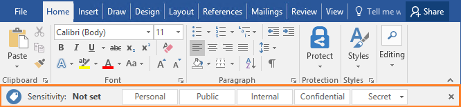
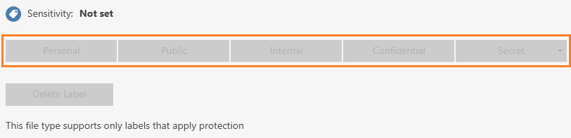

---
# required metadata

title: Classify - Azure Information Protection client
description: Instructions how to classify your documents and emails when you use the Azure Information Protection client for Windows.
author: cabailey
ms.author: cabailey
manager: barbkess
ms.date: 09/17/2019
ms.topic: conceptual
ms.collection: M365-security-compliance
ms.service: information-protection
ms.assetid: d65c7690-fab7-4823-845c-8c73903e9c79

# optional metadata

#ROBOTS:
#audience:
#ms.devlang:
ms.subservice: v1client
ms.reviewer: eymanor
ms.suite: ems
#ms.tgt_pltfrm:
ms.custom: user

---

# User Guide: Classify a file or email with the Azure Information Protection client

>*Applies to: Active Directory Rights Management Services, [Azure Information Protection](https://azure.microsoft.com/pricing/details/information-protection), Windows 10, Windows 8.1, Windows 8, Windows 7 with SP1*
>
> *Instructions for: [Azure Information Protection client for Windows](../faqs.md#whats-the-difference-between-the-azure-information-protection-client-and-the-azure-information-protection-unified-labeling-client)*

> [!NOTE]
> Use these instructions to help you classify (but not protect) your documents and emails. If you need to also protect your documents and emails, see the [classify and protect instructions](client-classify-protect.md). If you are not sure which set of instructions to use, check with your administrator or help desk.

The easiest way to classify your documents and emails is when you are creating or editing them from within your Office desktop apps: **Word**, **Excel**, **PowerPoint**, **Outlook**. 

However, you can also classify files by using **File Explorer**. This method supports additional file types and is a convenient way to classify multiple files at once. 

## Using Office apps to classify your documents and emails

Use the Azure Information Protection bar and select one of the labels that has been configured for you. 

For example, the following picture shows that the document hasn't yet been labeled because the **Sensitivity** shows **Not set**. To set a label, such as "General", click **General**. If you're not sure which label to apply to the current document or email, use the label tooltips to learn more about each label and when to apply it. 

If a label is already applied to the document and you want to change it, you can select a different label. If the labels are not displayed on the bar, first click the **Edit Label** icon, next to the current label value.

> [!TIP]
> You can also select labels from the **Protect** button, on the **File** tab.

In addition to manually selecting labels, labels can also be applied in the following ways:

- Your administrator configured a default label, which you can keep or change.

- Your administrator configured recommended prompts to select a specific label when sensitive data is detected. You can accept the recommendation (and the label is applied), or reject it (the recommended label is not applied).

### Exceptions for the Azure Information Protection bar 

##### Don't see this Information Protection bar in your Office apps?

- You might not have the Azure Information Protection client [installed](install-client-app.md).

- You have the client installed, but your administrator has configured a setting that doesn't display the bar. Instead, select labels from the **Protect** button, on the **File** tab from the Office ribbon. 

##### Is the label that you expect to see not displayed on the bar? 

- If your administrator has recently configured a new label for you, try closing all instances of your Office app and reopening it. This action checks for changes to your labels.

- The label might be in a scoped policy that doesn't include your account. Check with your help desk or administrator.

## Using File Explorer to classify files

When you use File Explorer, you can quickly classify a single file, multiple files, or a folder. 

When you select a folder, all the files in that folder and any subfolders it has are automatically selected for the classification that you set. However, new files that you create in that folder or subfolders are not automatically classified.

When you use File Explorer to classify your files, if one or more of the labels appear dimmed, the files that you selected do not support classification without also protecting them.

The admin guide contains a full list of the file types that support classification without protection: [File types supported for classification only](client-admin-guide-file-types.md#file-types-supported-for-classification-only).

### To classify a file by using File Explorer

1. In File Explorer, select your file, multiple files, or a folder. Right-click, and select **Classify and protect**. For example:
    
    

2. In the **Classify and protect - Azure Information Protection** dialog box, use the labels as you would do in an Office application, which sets the classification as defined by your administrator. 
    
    If none of the labels can be selected (they appear dimmed): The selected file does not support classification. For example:
    
    

3. If you selected a file that does not support classification, click **Close**. You cannot classify this file without also protecting it.
    
    If you selected a label, click **Apply** and wait for the **Work finished** message to see the results. Then click **Close**.

If you change your mind about the label you chose, simply repeat this process and choose a different label.

The classification that you specified stays with the file, even if you email the file or save it to another location. 
## Other instructions
More how-to instructions from the Azure Information Protection user guide:

- [What do you want to do?](client-user-guide.md#what-do-you-want-to-do)

## Additional information for administrators    
See [Configuring the Azure Information Protection policy](../configure-policy.md).

