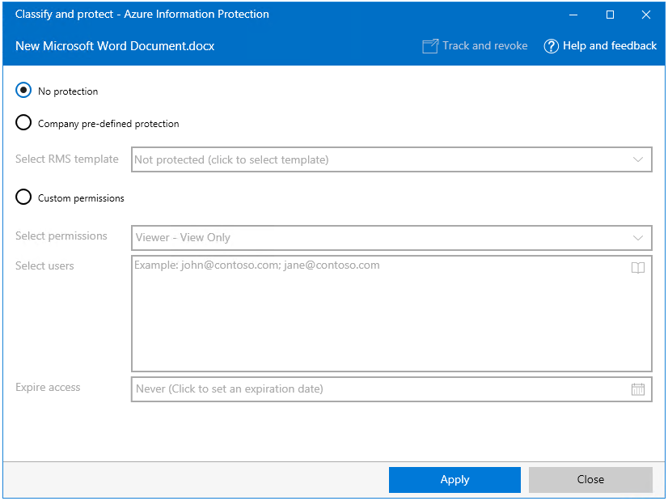

---
# required metadata

title: Protection-only mode for Azure Information Protection
description: Information for users who run the Azure Information Protection client in protection-only mode. 
author: cabailey
ms.author: cabailey
manager: barbkess
ms.date: 09/17/2019
ms.topic: conceptual
ms.collection: M365-security-compliance
ms.service: information-protection
ms.assetid: 16042717-0d7a-41f5-87e3-12826fda35df

# optional metadata

#ROBOTS:
#audience:
#ms.devlang:
ms.subservice: v1client
ms.reviewer: eymanor
ms.suite: ems
#ms.tgt_pltfrm:
ms.custom: user

---

# User Guide: Protection-only mode for the Azure Information Protection client

>*Applies to: Active Directory Rights Management Services, [Azure Information Protection](https://azure.microsoft.com/pricing/details/information-protection), Windows 10, Windows 8.1, Windows 8, Windows 7 with SP1*
>
> *Instructions for: [Azure Information Protection client for Windows](../faqs.md#whats-the-difference-between-the-azure-information-protection-client-and-the-azure-information-protection-unified-labeling-client)*

When the Azure Information Protection client doesn't have labels to classify your documents and emails, it runs in **protection-only** mode. For example, in this mode, you might see the following when you use Windows File Explorer, right-click, **Classify and protect**:

Protection-only mode runs in the following scenarios:

- Your organization does not have a subscription for Azure Information Protection that includes classification and labeling features, but has a subscription for Office 365 that includes data protection by using the Azure Rights Management service. 
    
    - You can use the Azure Information Protection client to protect files and view protected files. You can't classify or label documents and emails.

- Your organization has a subscription for Azure Information Protection for only a subset of users:
    
    - For this mix of subscriptions, it's the administrator's responsibility to ensure that only the subset of users can use the classification and labeling features. The remainder of users should be running the Azure Information Protection client in protection-only mode. 

- Your organization has a subscription for Azure Information Protection but you don't have any labels configured for you.
    
    - This can happen when all the labels in the global policy are disabled and your account is not added to a scoped policy. This might be because your IT department has just started to roll out Azure Information Protection but not yet provided you with labels to classify your documents and emails. In the meantime, you can use the Azure Information Protection client to protect files and view protected files.

- Your organization has a subscription for Azure Information Protection but you cannot download the Azure Information Protection policy. 
    
    - This can happen because of a misconfiguration or because your sign-in is not successful. Contact your help desk or administrator but in the meantime, you might be able to use the Azure Information Protection client to protect files and view protected files.

- Your organization uses Active Directory Rights Management Services (AD RMS) only. 

## Limitations for protection-only mode

- In Office apps, the Azure Information Protection bar does not display. When you click **Protect** > **Show Bar**, this menu option is unavailable.

- When you use the **Classify and protect - Azure Information Protection** dialog box with File Explorer, you do not see labels for classification. Instead, as in the previous picture, you see an option to select Rights Management (RMS) templates. 

## Supported tasks for protection-only mode

- Protect (and unprotect) documents and emails from within your Office apps, by using the Office Information Rights Management (IRM) feature: For example: Click **File** > **Info** > **Protect Document** > **Restrict Access**. For more information, see [Using information protection with Office 365, Office 2019, Office 2016, or Office 2013](../help-users.md#using-information-protection-with-Office-365-Office 2019-Office-2016-or-Office-2013).

- Protect (and unprotect) files by using Windows File Explorer: Right-click the file, files, or folder > **Classify and protect**. To apply protection that has been configured by your administrator, in the **Classify and protect - Azure Information Protection** dialog box, click **Select template** and choose one of the available templates.

- View protected files by using the Azure Information Protection Viewer.

- Access the document tracking site from your Office apps. However, you must have a valid subscription to track and revoke documents from this site.
  
