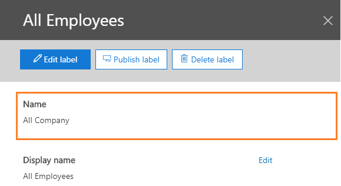

---
# required metadata

title: Custom configurations - Azure Information Protection unified labeling client
author: cabailey
ms.author: cabailey
manager: barbkess
ms.date: 10/03/2019
ms.topic: conceptual
ms.collection: M365-security-compliance
ms.service: information-protection
ms.assetid: 5eb3a8a4-3392-4a50-a2d2-e112c9e72a78

# optional metadata

#ROBOTS:
#audience:
#ms.devlang:
ms.subservice: v2client
ms.reviewer: maayan
ms.suite: ems
#ms.tgt_pltfrm:
ms.custom: admin

---

# Admin Guide: Custom configurations for the Azure Information Protection unified labeling client

>*Applies to: [Azure Information Protection](https://azure.microsoft.com/pricing/details/information-protection), Windows 10, Windows 8.1, Windows 8, Windows 7 with SP1, Windows Server 2019, Windows Server 2016, Windows Server 2012 R2, Windows Server 2012, Windows Server 2008 R2*
>
> *Instructions for: [Azure Information Protection unified labeling client for Windows](../faqs.md#whats-the-difference-between-the-azure-information-protection-client-and-the-azure-information-protection-unified-labeling-client)*

Use the following information for advanced configurations that you might need for specific scenarios or a subset of users when you manage the Azure Information Protection unified labeling client.

These settings require editing the registry or specifying advanced settings. The advanced settings use [Office 365 Security & Compliance Center PowerShell](https://docs.microsoft.com/powershell/exchange/office-365-scc/office-365-scc-powershell?view=exchange-ps).

### How to configure advanced settings for the client by using Office 365 Security & Compliance Center PowerShell

When you use Office 365 Security & Compliance Center PowerShell, you can configure advanced settings that support customizations for label policies and labels. For example:

- The setting to display the Information Protection bar in Office apps is a ***label policy advanced setting***.
- The setting to specify a label color is a ***label advanced setting***.

In both cases, after you [connect to Office 365 Security & Compliance Center PowerShell](https://docs.microsoft.com/powershell/exchange/office-365-scc/connect-to-scc-powershell/connect-to-scc-powershell?view=exchange-ps), specify the *AdvancedSettings* parameter with the identity (name or GUID) of the policy or label, and specify key/value pairs in a [hash table](https://docs.microsoft.com/powershell/module/microsoft.powershell.core/about/about_hash_tables). Use the following syntax:

For a label policy setting, single string value:

	Set-LabelPolicy -Identity <PolicyName> -AdvancedSettings @{Key="value1,value2"}

For label policy settings, multiple string values for the same key:

	Set-LabelPolicy -Identity <PolicyName> -AdvancedSettings @{Key=ConvertTo-Json("value1", "value2")}

For a label setting, single string value:

	Set-Label -Identity <LabelGUIDorName> -AdvancedSettings @{Key="value1,value2"}

For label settings, multiple string values for the same key:

	Set-Label -Identity <LabelGUIDorName> -AdvancedSettings @{Key=ConvertTo-Json("value1", "value2")}

To remove an advanced setting, use the same syntax but specify a null string value.

#### Examples for setting advanced settings

Example 1: Set a label policy advanced setting for a single string value:

	Set-LabelPolicy -Identity Global -AdvancedSettings @{EnableCustomPermissions="False"}

Example 2: Set a label advanced setting for a single string value:

	Set-Label -Identity Internal -AdvancedSettings @{smimesign="true"}

Example 3: Set a label advanced setting for multiple string values:

	Set-Label -Identity Confidential -AdvancedSettings @{labelByCustomProperties=ConvertTo-Json("Migrate Confidential label,Classification,Confidential", "Migrate Secret label,Classification,Secret")}

Example 4: Remove a label policy advanced setting by specifying a null string value:

	Set-LabelPolicy -Identity Global -AdvancedSettings @{EnableCustomPermissions=""}

#### Specifying the identity for the label policy or label

Specifying the label policy name for the PowerShell *Identity* parameter is straightforward because you see only one policy name in the admin center where you manage your label policies. However, for labels, you see both a **Name** and **Display name** in the admin centers. In some cases, the value for both will be the same but they can be different:

- **Name** is the original name of the label and it is unique across all your labels. If you change the name of your label after it is created, this value remains the same. For labels that have been migrated from Azure Information Protection, you might see the label ID of the label from the Azure portal.

- **Display name** is the name of the label that users see and it doesn't have to be unique across all your labels. For example, users see one **All Employees** sublabel for the **Confidential** label, and another **All Employees** sublabel for the **Highly Confidential** label. These sublabels both display the same name, but are not the same label and have different settings.

For configuring your label advanced settings, use the **Name** value. For example, to identify the label in the following picture, you would specify `-Identity "All Company"`:

If you prefer to specify the label GUID, this value is not displayed in the admin center where you manage your labels. However, you can use the following Office 365 Security & Compliance Center PowerShell command to find this value:

	Get-Label | Format-Table -Property DisplayName, Name, Guid

#### Order of precedence - how conflicting settings are resolved

Using one of the admin centers where you manage your sensitivity labels, you can configure the following label policy settings:

- **Apply this label by default to documents and emails**

- **Users must provide justification to remove a label or lower classification label**

- **Require users to apply a label to their email or document**

- **Provide users with a link to a custom help page**

When more than one label policy is configured for a user, each with potentially different policy settings, the last policy setting is applied according to the order of the policies in the admin center. For more information, see [Label policy priority (order matters)](https://docs.microsoft.com/Office365/SecurityCompliance/sensitivity-labels#label-policy-priority-order-matters)

Label advanced settings follow the same logic for precedence: When a label is in multiple label policies and that label has advanced settings, the last advanced setting is applied according to the order of the policies in the admin center.

Label policy advanced settings are applied in the reverse order: With one exception, the advanced settings from the first policy are applied, according to the order of the policies in the admin center. The exception is the advanced setting *OutlookDefaultLabel*, which sets a different default label for Outlook. For this label policy advanced setting only, the last setting is applied according to the order of the policies in the admin center.

#### Available advanced settings for label policies

Use the *AdvancedSettings* parameter with [New-LabelPolicy](https://docs.microsoft.com/powershell/module/exchange/policy-and-compliance/new-labelpolicy?view=exchange-ps) and [Set-LabelPolicy](https://docs.microsoft.com/powershell/module/exchange/policy-and-compliance/set-labelpolicy?view=exchange-ps).

|Setting|Scenario and instructions|
|----------------|---------------|
|AttachmentAction|[For email messages with attachments, apply a label that matches the highest classification of those attachments](#for-email-messages-with-attachments-apply-a-label-that-matches-the-highest-classification-of-those-attachments)
|AttachmentActionTip|[For email messages with attachments, apply a label that matches the highest classification of those attachments](#for-email-messages-with-attachments-apply-a-label-that-matches-the-highest-classification-of-those-attachments) 
|DisableMandatoryInOutlook|[Exempt Outlook messages from mandatory labeling](#exempt-outlook-messages-from-mandatory-labeling)
|EnableAudit|[Disable sending audit data to Azure Information Protection analytics](#disable-sending-audit-data-to-azure-information-protection-analytics)|
|EnableCustomPermissions|[Disable custom permissions in File Explorer](#disable-custom-permissions-in-file-explorer)|
|EnableCustomPermissionsForCustomProtectedFiles|[For files protected with custom permissions, always display custom permissions to users in File Explorer](#for-files-protected-with-custom-permissions-always-display-custom-permissions-to-users-in-file-explorer) |
|EnableLabelByMailHeader|[Migrate labels from Secure Islands and other labeling solutions](#migrate-labels-from-secure-islands-and-other-labeling-solutions)|
|HideBarByDefault|[Display the Information Protection bar in Office apps](##display-the-information-protection-bar-in-office-apps)|
|LogMatchedContent|[Send information type matches to Azure Information Protection analytics](#send-information-type-matches-to-azure-information-protection-analytics)|
|OutlookBlockTrustedDomains|[Implement pop-up messages in Outlook that warn, justify, or block emails being sent](#implement-pop-up-messages-in-outlook-that-warn-justify-or-block-emails-being-sent)|
|OutlookBlockUntrustedCollaborationLabel|[Implement pop-up messages in Outlook that warn, justify, or block emails being sent](#implement-pop-up-messages-in-outlook-that-warn-justify-or-block-emails-being-sent)|
|OutlookDefaultLabel|[Set a different default label for Outlook](#set-a-different-default-label-for-outlook)|
|OutlookJustifyTrustedDomains|[Implement pop-up messages in Outlook that warn, justify, or block emails being sent](#implement-pop-up-messages-in-outlook-that-warn-justify-or-block-emails-being-sent)|
|OutlookJustifyUntrustedCollaborationLabel|[Implement pop-up messages in Outlook that warn, justify, or block emails being sent](#implement-pop-up-messages-in-outlook-that-warn-justify-or-block-emails-being-sent)|
|OutlookRecommendationEnabled|[Enable recommended classification in Outlook](#enable-recommended-classification-in-outlook)|
|OutlookOverrideUnlabeledCollaborationExtensions|[Implement pop-up messages in Outlook that warn, justify, or block emails being sent](#implement-pop-up-messages-in-outlook-that-warn-justify-or-block-emails-being-sent)|
|OutlookUnlabeledCollaborationActionOverrideMailBodyBehavior|[Implement pop-up messages in Outlook that warn, justify, or block emails being sent](#implement-pop-up-messages-in-outlook-that-warn-justify-or-block-emails-being-sent)|
|OutlookWarnTrustedDomains|[Implement pop-up messages in Outlook that warn, justify, or block emails being sent](#implement-pop-up-messages-in-outlook-that-warn-justify-or-block-emails-being-sent)|
|OutlookWarnUntrustedCollaborationLabel|[Implement pop-up messages in Outlook that warn, justify, or block emails being sent](#implement-pop-up-messages-in-outlook-that-warn-justify-or-block-emails-being-sent)|
|PostponeMandatoryBeforeSave|[Remove "Not now" for documents when you use mandatory labeling](#remove-not-now-for-documents-when-you-use-mandatory-labeling)|
|RemoveExternalContentMarkingInApp|[Remove headers and footers from other labeling solutions](#remove-headers-and-footers-from-other-labeling-solutions)|
|ReportAnIssueLink|[Add "Report an Issue" for users](#add-report-an-issue-for-users)|
|RunAuditInformationTypesDiscovery|[Disable sending discovered sensitive information in documents to Azure Information Protection analytics](#disable-sending-discovered-sensitive-information-in-documents-to-azure-information-protection-analytics)|

Example PowerShell command to check your label policy settings in effect for a label policy named "Global":

	(Get-LabelPolicy -Identity Global).settings

#### Available advanced settings for labels

Use the *AdvancedSettings* parameter with [New-Label](https://docs.microsoft.com/powershell/module/exchange/policy-and-compliance/new-label?view=exchange-ps) and [Set-Label](https://docs.microsoft.com/powershell/module/exchange/policy-and-compliance/set-label?view=exchange-ps).

|Setting|Scenario and instructions|
|----------------|---------------|
|color|[Specify a color for the label](#specify-a-color-for-the-label)|
|customPropertiesByLabel|[Apply a custom property when a label is applied](#apply-a-custom-property-when-a-label-is-applied)|
|DefaultSubLabelId|[Specify a default sublabel for a parent label](#specify-a-default-sublabel-for-a-parent-label) 
|labelByCustomProperties|[Migrate labels from Secure Islands and other labeling solutions](#migrate-labels-from-secure-islands-and-other-labeling-solutions)|
|SMimeEncrypt|[Configure a label to apply S/MIME protection in Outlook](#configure-a-label-to-apply-smime-protection-in-outlook)|
|SMimeSign|[Configure a label to apply S/MIME protection in Outlook](#configure-a-label-to-apply-smime-protection-in-outlook)|

Example PowerShell command to check your label settings in effect for a label named "Public":

	(Get-Label -Identity Public).settings

## Display the Information Protection bar in Office apps

This configuration uses a policy [advanced setting](#how-to-configure-advanced-settings-for-the-client-by-using-office-365-security--compliance-center-powershell) that you must configure by using Office 365 Security & Compliance Center PowerShell.

By default, users must select the **Show Bar** option from the **Sensitivity** button to display the Information Protection bar in Office apps. Use the **HideBarByDefault** key and set the value to **False** to automatically display this bar for users so that they can select labels from either the bar or the button. 

For the selected label policy, specify the following strings:

- Key: **HideBarByDefault**

- Value: **False**

Example PowerShell command, where your label policy is named "Global":

	Set-LabelPolicy -Identity Global -AdvancedSettings @{HideBarByDefault="False"}

## Exempt Outlook messages from mandatory labeling

This configuration uses a policy [advanced setting](#how-to-configure-advanced-settings-for-the-client-by-using-office-365-security--compliance-center-powershell) that you must configure by using Office 365 Security & Compliance Center PowerShell.

By default, when you enable the label policy setting of **All documents and emails must have a label**, all saved documents and sent emails must have a label applied. When you configure the following advanced setting, the policy setting applies only to Office documents and not to Outlook messages.

For the selected label policy, specify the following strings:

- Key: **DisableMandatoryInOutlook**

- Value: **True**

Example PowerShell command, where your label policy is named "Global":

	Set-LabelPolicy -Identity Global -AdvancedSettings @{DisableMandatoryInOutlook="True"}

## Enable recommended classification in Outlook

This configuration uses a policy [advanced setting](#how-to-configure-advanced-settings-for-the-client-by-using-office-365-security--compliance-center-powershell) that you must configure by using Office 365 Security & Compliance Center PowerShell.

When you configure a label for recommended classification, users are prompted to accept or dismiss the recommended label in Word, Excel, and PowerPoint. This setting extends this label recommendation to also display in Outlook.

For the selected label policy, specify the following strings:

- Key: **OutlookRecommendationEnabled**

- Value: **True**

Example PowerShell command, where your label policy is named "Global":

	Set-LabelPolicy -Identity Global -AdvancedSettings @{OutlookRecommendationEnabled="True"}

## Set a different default label for Outlook

This configuration uses a policy [advanced setting](#how-to-configure-advanced-settings-for-the-client-by-using-office-365-security--compliance-center-powershell) that you must configure by using Office 365 Security & Compliance Center PowerShell.

When you configure this setting, Outlook doesn't apply the default label that is configured as a policy setting for the option **Apply this label by default to documents and emails**. Instead, Outlook can apply a different default label, or no label.

For the selected label policy, specify the following strings:

- Key: **OutlookDefaultLabel**

- Value: \<**label GUID**> or **None**

Example PowerShell command, where your label policy is named "Global":

	Set-LabelPolicy -Identity Global -AdvancedSettings @{OutlookDefaultLabel="None"}

## Remove "Not now" for documents when you use mandatory labeling

This configuration uses a policy [advanced setting](#how-to-configure-advanced-settings-for-the-client-by-using-office-365-security--compliance-center-powershell) that you must configure by using Office 365 Security & Compliance Center PowerShell.

When you use the label policy setting of **All documents and emails must have a label**, users are prompted to select a label when they first save an Office document and when they send an email. For documents, users can select **Not now** to temporarily dismiss the prompt to select a label and return to the document. However, they cannot close the saved document without labeling it. 

When you configure this setting, it removes the **Not now** option so that users must select a label when the document is first saved.

For the selected label policy, specify the following strings:

- Key: **PostponeMandatoryBeforeSave**

- Value: **False**

Example PowerShell command, where your label policy is named "Global":

	Set-LabelPolicy -Identity Global -AdvancedSettings @{PostponeMandatoryBeforeSave="False"}

## Remove headers and footers from other labeling solutions

This configuration uses policy [advanced settings](#how-to-configure-advanced-settings-for-the-client-by-using-office-365-security--compliance-center-powershell) that you must configure by using Office 365 Security & Compliance Center PowerShell.

The settings let you remove or replace text-based headers or footers from documents when those visual markings have been applied by another labeling solution. For example, the old footer contains the name of an old label that you have now migrated to sensitivity labels to use a new label name and its own footer.

When the unified labeling client gets this configuration in its policy, the old headers and footers are removed or replaced when the document is opened in the Office app and any sensitivity label is applied to the document.

This configuration is not supported for Outlook, and be aware that when you use it with Word, Excel, and PowerPoint, it can negatively affect the performance of these apps for users. The configuration lets you define settings per application, for example, search for text in the headers and footers of Word documents but not Excel spreadsheets or PowerPoint presentations.

Because the pattern matching affects the performance for users, we recommend that you limit the Office application types (**W**ord, E**X**cel, **P**owerPoint) to just those that need to be searched.

For the selected label policy, specify the following strings:

- Key: **RemoveExternalContentMarkingInApp**

- Value: \<**Office application types WXP**> 

Examples:

- To search Word documents only, specify **W**.

- To search Word documents and PowerPoint presentations, specify **WP**.

Example PowerShell command, where your label policy is named "Global":

	Set-LabelPolicy -Identity Global -AdvancedSettings @{RemoveExternalContentMarkingInApp="WX"}

You then need at least one more advanced client setting, **ExternalContentMarkingToRemove**, to specify the contents of the header or footer, and how to remove or replace them.

### How to configure ExternalContentMarkingToRemove

When you specify the string value for the **ExternalContentMarkingToRemove** key, you have three options that use regular expressions:

- Partial match to remove everything in the header or footer.
    
    Example: Headers or footers contain the string **TEXT TO REMOVE**. You want to completely remove these headers or footers. You specify the value: `*TEXT*`.

- Complete match to remove just specific words in the header or footer.
    
    Example: Headers or footers contain the string **TEXT TO REMOVE**. You want to remove the word **TEXT** only, which leaves the header or footer string as **TO REMOVE**. You specify the value: `TEXT `.

- Complete match to remove everything in the header or footer.
    
    Example: Headers or footers have the string **TEXT TO REMOVE**. You want to remove headers or footers that have exactly this string. You specify the value: `^TEXT TO REMOVE$`.
    

The pattern matching for the string that you specify is case-insensitive. The maximum string length is 255 characters.

Because some documents might include invisible characters or different kinds of spaces or tabs, the string that you specify for a phrase or sentence might not be detected. Whenever possible, specify a single distinguishing word for the value and be sure to test the results before you deploy in production.

For the same label policy, specify the following strings:

- Key: **ExternalContentMarkingToRemove**

- Value: \<**string to match, defined as regular expression**> 

Example PowerShell command, where your label policy is named "Global":

	Set-LabelPolicy -Identity Global -AdvancedSettings @{ExternalContentMarkingToRemove="*TEXT*"}

#### Multiline headers or footers

If a header or footer text is more than a single line, create a key and value for each line. For example, you have the following footer with two lines:

**The file is classified as Confidential**

**Label applied manually**

To remove this multiline footer, you create the following two entries for the same label policy:

- Key: **ExternalContentMarkingToRemove**

- Key Value 1: **\*Confidential***

- Key Value 2: **\*Label applied*** 

Example PowerShell command, where your label policy is named "Global":

	Set-LabelPolicy -Identity Global -AdvancedSettings @{ExternalContentMarkingToRemove="*Confidential*,*Label applied*"}

#### Optimization for PowerPoint

Footers in PowerPoint are implemented as shapes. To avoid removing shapes that contain the text that you have specified but are not headers or footers, use an additional advanced client setting named **PowerPointShapeNameToRemove**. We also recommend using this setting to avoid checking the text in all shapes, which is a resource-intensive process.

If you do not specify this additional advanced client setting, and PowerPoint is included in the **RemoveExternalContentMarkingInApp** key value, all shapes will be checked for the text that you specify in the **ExternalContentMarkingToRemove** value. 

To find the name of the shape that you're using as a header or footer:

1. In PowerPoint, display the **Selection** pane: **Format** tab > **Arrange** group > **Selection Pane**.

2. Select the shape on the slide that contains your header or footer. The name of the selected shape is now highlighted in the **Selection** pane.

Use the name of the shape to specify a string value for the **PowerPointShapeNameToRemove** key. 

Example: The shape name is **fc**. To remove the shape with this name, you specify the value: `fc`.

- Key: **PowerPointShapeNameToRemove**

- Value: \<**PowerPoint shape name**> 

Example PowerShell command, where your label policy is named "Global":

	Set-LabelPolicy -Identity Global -AdvancedSettings @{PowerPointShapeNameToRemove="fc"}

When you have more than one PowerPoint shape to remove, specify as many values as you have shapes to remove.

By default, only the Master slides are checked for headers and footers. To extend this search to all slides, which is a much more resource-intensive process, use an additional advanced client setting named **RemoveExternalContentMarkingInAllSlides**:

- Key: **RemoveExternalContentMarkingInAllSlides**

- Value: **True**

Example PowerShell command, where your label policy is named "Global":

	Set-LabelPolicy -Identity Global -AdvancedSettings @{RemoveExternalContentMarkingInAllSlides="True"}

## Disable custom permissions in File Explorer

This configuration uses a policy [advanced setting](#how-to-configure-advanced-settings-for-the-client-by-using-office-365-security--compliance-center-powershell) that you must configure by using Office 365 Security & Compliance Center PowerShell.

By default, users see an option named **Protect with custom permissions** when they right-click in File Explorer and choose **Classify and protect**. This option lets them set their own protection settings that can override any protection settings that you might have included with a label configuration. Users can also see an option to remove protection. When you configure this setting, users do not see these options.

To configure this advanced setting, enter the following strings for the selected label policy:

- Key: **EnableCustomPermissions**

- Value: **False**

Example PowerShell command, where your label policy is named "Global":

	Set-LabelPolicy -Identity Global -AdvancedSettings @{EnableCustomPermissions="False"}

## For files protected with custom permissions, always display custom permissions to users in File Explorer

This configuration uses a policy [advanced setting](#how-to-configure-advanced-settings-for-the-client-by-using-office-365-security--compliance-center-powershell) that you must configure by using Office 365 Security & Compliance Center PowerShell.

When you configure the advanced client setting to [disable custom permissions in File Explorer](#disable-custom-permissions-in-file-explorer), by default, users are not able to see or change custom permissions that are already set in a protected document.

However, there's another advanced client setting that you can specify so that in this scenario, users can see and change custom permissions for a protected document when they use File Explorer and right-click the file.

To configure this advanced setting, enter the following strings for the selected label policy:

- Key: **EnableCustomPermissionsForCustomProtectedFiles**

- Value: **True**

Example PowerShell command:

	Set-LabelPolicy -Identity Global -AdvancedSettings @{EnableCustomPermissionsForCustomProtectedFiles="True"}

## For email messages with attachments, apply a label that matches the highest classification of those attachments

This configuration uses policy [advanced settings](#how-to-configure-advanced-settings-for-the-client-by-using-office-365-security--compliance-center-powershell) that you must configure by using Office 365 Security & Compliance Center PowerShell.

This setting is for when users attach labeled documents to an email, and do not label the email message itself. In this scenario, a label is automatically selected for them, based on the classification labels that are applied to the attachments. The highest classification label is selected.

The attachment must be a physical file, and cannot be a link to a file (for example, a link to a file on SharePoint or OneDrive for Business).

You can configure this setting to **Recommended**, so that users are prompted to apply the selected label to their email message, with a customizable tooltip. Users can accept the recommendation or dismiss it. Or, you can configure this setting to **Automatic**, where the selected label is automatically applied but users can remove the label or select a different label before sending the email.

Note: When the attachment with the highest classification label is configured for protection with the setting of user-defined permissions:

- When the label's user-defined permissions include Outlook (Do Not Forward), that label is selected and Do Not Forward protection is applied to the email.
- When the label's user-defined permissions are just for Word, Excel, PowerPoint, and File Explorer, that label is not applied to the email message, and neither is protection.

To configure this advanced setting, enter the following strings for the selected label policy:

- Key 1: **AttachmentAction**

- Key Value 1: **Recommended** or **Automatic**

- Key 2: **AttachmentActionTip**

- Key Value 2: "\<customized tooltip>"

The customized tooltip supports a single language only.

Example PowerShell command, where your label policy is named "Global":

	Set-LabelPolicy -Identity Global -AdvancedSettings @{AttachmentAction="Automatic"}

## Add "Report an Issue" for users

This configuration uses a policy [advanced setting](#how-to-configure-advanced-settings-for-the-client-by-using-office-365-security--compliance-center-powershell) that you must configure by using Office 365 Security & Compliance Center PowerShell.

When you specify the following advanced client setting, users see a **Report an Issue** option that they can select from the **Help and Feedback** client dialog box. Specify an HTTP string for the link. For example, a customized web page that you have for users to report issues, or an email address that goes to your help desk. 

To configure this advanced setting, enter the following strings for the selected label policy:

- Key: **ReportAnIssueLink**

- Value: **\<HTTP string>**

Example value for a website: `https://support.contoso.com`

Example value for an email address: `mailto:helpdesk@contoso.com`

Example PowerShell command, where your label policy is named "Global":

	Set-LabelPolicy -Identity Global -AdvancedSettings @{ReportAnIssueLink="mailto:helpdesk@contoso.com"}

## Implement pop-up messages in Outlook that warn, justify, or block emails being sent

This configuration uses policy [advanced settings](#how-to-configure-advanced-settings-for-the-client-by-using-office-365-security--compliance-center-powershell) that you must configure by using Office 365 Security & Compliance Center PowerShell.

When you create and configure the following advanced client settings, users see pop-up messages in Outlook that can warn them before sending an email, or ask them to provide justification why they are sending an email, or prevent them from sending an email for either of the following scenarios:

- **Their email or attachment for the email has a specific label**:
    - The attachment can be any file type

- **Their email or attachment for the email doesn't have a label**:
    - The attachment can be an Office document or PDF document

When these conditions are met, the user sees a pop-up message with one of the following actions:

- **Warn**: The user can confirm and send, or cancel.

- **Justify**: The user is prompted for justification (predefined options or free-form).  The user can then send or cancel the email. The justification text is written to the email x-header, so that it can be read by other systems. For example, data loss prevention (DLP) services.

- **Block**: The user is prevented from sending the email while the condition remains. The message includes the reason for blocking the email, so the user can address the problem. For example, remove specific recipients, or label the email. 

When the popup-messages are for a specific label, you can configure exceptions for recipients by domain name.

> [!TIP]
> See the video [Azure Information Protection Outlook Popup Configuration](https://azure.microsoft.com/en-us/resources/videos/how-to-configure-azure-information-protection-popup-for-outlook/) for a walkthrough example of how to configure these settings.

### To implement the warn, justify, or block pop-up messages for specific labels:

For the selected policy, create one or more of the following advanced settings with the following keys. For the values, specify one or more labels by their GUIDs, each one separated by a comma.

Example value for multiple label GUIDs as a comma-separated string: `dcf781ba-727f-4860-b3c1-73479e31912b,1ace2cc3-14bc-4142-9125-bf946a70542c,3e9df74d-3168-48af-8b11-037e3021813f`

- Warn messages:
    
    - Key: **OutlookWarnUntrustedCollaborationLabel**
    
    - Value: \<**label GUIDs, comma-separated**>

- Justification messages:
    
    - Key: **OutlookJustifyUntrustedCollaborationLabel**
    
    - Value: \<**label GUIDs, comma-separated**>

- Block messages:
    
    - Key: **OutlookBlockUntrustedCollaborationLabel**
    
    - Value: \<**label GUIDs, comma-separated**>

Example PowerShell command, where your label policy is named "Global":

	Set-LabelPolicy -Identity Global -AdvancedSettings @{OutlookWarnUntrustedCollaborationLabel="8faca7b8-8d20-48a3-8ea2-0f96310a848e,b6d21387-5d34-4dc8-90ae-049453cec5cf,bb48a6cb-44a8-49c3-9102-2d2b017dcead,74591a94-1e0e-4b5d-b947-62b70fc0f53a,6c375a97-2b9b-4ccd-9c5b-e24e4fd67f73"}

	Set-LabelPolicy -Identity Global -AdvancedSettings @{OutlookJustifyUntrustedCollaborationLabel="dc284177-b2ac-4c96-8d78-e3e1e960318f,d8bb73c3-399d-41c2-a08a-6f0642766e31,750e87d4-0e91-4367-be44-c9c24c9103b4,32133e19-ccbd-4ff1-9254-3a6464bf89fd,74348570-5f32-4df9-8a6b-e6259b74085b,3e8d34df-e004-45b5-ae3d-efdc4731df24"}

	Set-LabelPolicy -Identity Global -AdvancedSettings @{OutlookBlockUntrustedCollaborationLabel="0eb351a6-0c2d-4c1d-a5f6-caa80c9bdeec,40e82af6-5dad-45ea-9c6a-6fe6d4f1626b"}

#### To exempt domain names for pop-up messages configured for specific labels

For the labels that you've specified with these pop-up messages, you can exempt specific domain names so that users do not see the messages for recipients who have that domain name included in their email address. In this case, the emails are sent without interruption. To specify multiple domains, add them as a single string, separated by commas.

A typical configuration is to display the pop-up messages only for recipients who are external to your organization or who aren't authorized partners for your organization. In this case, you specify all the email domains that are used by your organization and by your partners.

For the same label policy, create the following advanced client settings and for the value, specify one or more domains, each one separated by a comma.

Example value for multiple domains as a comma-separated string: `contoso.com,fabrikam.com,litware.com`

- Warn messages:
    
    - Key: **OutlookWarnTrustedDomains**
    
    - Value: **\<**domain names, comma separated**>**

- Justification messages:
    
    - Key: **OutlookJustifyTrustedDomains**
    
    - Value: **\<**domain names, comma separated**>**

- Block messages:
    
    - Key: **OutlookBlockTrustedDomains**
    
    - Value: **\<**domain names, comma separated**>**

For example, you have specified the **OutlookBlockUntrustedCollaborationLabel** advanced client setting for the **Confidential \ All Employees** label. You now specify the additional advanced client setting of **OutlookJustifyTrustedDomains** and **contoso.com**. As a result, a user can send an email to john@sales.contoso.com when it is labeled **Confidential \ All Employees** but will be blocked from sending an email with the same label to a Gmail account.

Example PowerShell commands, where your label policy is named "Global":

	Set-LabelPolicy -Identity Global -AdvancedSettings @{OutlookBlockTrustedDomains="gmail.com"}

	Set-LabelPolicy -Identity Global -AdvancedSettings @{OutlookJustifyTrustedDomains="contoso.com,fabrikam.com,litware.com"}

### To implement the warn, justify, or block pop-up messages for emails or attachments that don't have a label:

For the same label policy, create the following advanced client setting with one of the following values:

- Warn messages:
    
    - Key: **OutlookUnlabeledCollaborationAction**
    
    - Value: **Warn**

- Justification messages:
    
    - Key: **OutlookUnlabeledCollaborationAction**
    
    - Value: **Justify**

- Block messages:
    
    - Key: **OutlookUnlabeledCollaborationAction**
    
    - Value: **Block**

- Turn off these messages:
    
    - Key: **OutlookUnlabeledCollaborationAction**
    
    - Value: **Off**

Example PowerShell command, where your label policy is named "Global":

	Set-LabelPolicy -Identity Global -AdvancedSettings @{OutlookUnlabeledCollaborationAction="Warn"}

#### To define specific file name extensions for the warn, justify, or block pop-up messages for email attachments that don't have a label

By default, the warn, justify, or block pop-up messages apply to all Office documents and PDF documents. You can refine this list by specifying which file name extensions should display the warn, justify, or block messages with an additional advanced setting and a comma-separated list of file name extensions.

Example value for multiple file name extensions to define as a comma-separated string: `.XLSX,.XLSM,.XLS,.XLTX,.XLTM,.DOCX,.DOCM,.DOC,.DOCX,.DOCM,.PPTX,.PPTM,.PPT,.PPTX,.PPTM`

In this example, an unlabeled PDF document will not result in warn, justify, or block pop-up messages.

For the same label policy, enter the following strings: 

- Key: **OutlookOverrideUnlabeledCollaborationExtensions**

- Value: **\<**file name extensions to display messages, comma separated**>**

Example PowerShell command, where your label policy is named "Global":

	Set-LabelPolicy -Identity Global -AdvancedSettings @{OutlookOverrideUnlabeledCollaborationExtensions=".PPTX,.PPTM,.PPT,.PPTX,.PPTM"}

#### To specify a different action for email messages without attachments

By default, the value that you specify for OutlookUnlabeledCollaborationAction to warn, justify, or block pop-up messages applies to emails or attachments that don't have a label. You can refine this configuration by specifying another advanced setting for email messages that don't have attachments.

Create the following advanced client setting with one of the following values:

- Warn messages:
    
    - Key: **OutlookUnlabeledCollaborationActionOverrideMailBodyBehavior**
    
    - Value: **Warn**

- Justification messages:
    
    - Key: **OutlookUnlabeledCollaborationActionOverrideMailBodyBehavior**
    
    - Value: **Justify**

- Block messages:
    
    - Key: **OutlookUnlabeledCollaborationActionOverrideMailBodyBehavior**
    
    - Value: **Block**

- Turn off these messages:
    
    - Key: **OutlookUnlabeledCollaborationActionOverrideMailBodyBehavior**
    
    - Value: **Off**

If you don't specify this client setting, the value that you specify for OutlookUnlabeledCollaborationAction is used for unlabeled email messages without attachments as well as unlabeled email messages with attachments.

Example PowerShell command, where your label policy is named "Global":

	Set-LabelPolicy -Identity Global -AdvancedSettings @{OutlookUnlabeledCollaborationActionOverrideMailBodyBehavior="Warn"}

## Disable sending audit data to Azure Information Protection analytics

This configuration uses a policy [advanced setting](#how-to-configure-advanced-settings-for-the-client-by-using-office-365-security--compliance-center-powershell) that you must configure by using Office 365 Security & Compliance Center PowerShell.

The Azure Information Protection unified labeling client supports central reporting and by default, sends its audit data to [Azure Information Protection analytics](../reports-aip.md). For more information about what information is sent and stored, see the [Information collected and sent to Microsoft](../reports-aip.md#information-collected-and-sent-to-microsoft) section from the central reporting documentation.

To change this behavior so that this information is not sent by the unified labeling client, enter the following strings for the selected label policy:

- Key: **EnableAudit**

- Value: **False**

Example PowerShell command, where your label policy is named "Global":

	Set-LabelPolicy -Identity Global -AdvancedSettings @{EnableAudit="False"}

## Disable sending discovered sensitive information in documents to Azure Information Protection analytics

This configuration uses a policy [advanced setting](#how-to-configure-advanced-settings-for-the-client-by-using-office-365-security--compliance-center-powershell) that you must configure by using Office 365 Security & Compliance Center PowerShell.

When the Azure Information Protection unified labeling client is used in Office apps, it looks for sensitive information in documents when they are first saved. Providing the [EnableAudit](#disable-sending-audit-data-to-azure-information-protection-analytics) advanced setting is not set to **False**, any predefined and custom (preview client only) sensitive information types found are then sent to Azure Information Protection analytics.

To change this behavior so that sensitive information types found by the unified labeling client are not sent to Azure Information Protection analytics, enter the following strings for the selected label policy:

- Key: **RunAuditInformationTypesDiscovery**

- Value: **False**

If you set this advanced client setting, auditing information can still be sent from the client, but the information is limited to reporting when a user has accessed labeled content.

For example:

- With this setting, you can see that a user accessed Financial.docx that is labeled **Confidential \ Sales**.

- Without this setting, you can see that Financial.docx contains 6 credit card numbers.
    
    - If you also enable [content matches for deeper analysis](../reports-aip.md#content-matches-for-deeper-analysis), you will additionally be able to see what those credit card numbers are.

Example PowerShell command, where your label policy is named "Global":

	Set-LabelPolicy -Identity Global -AdvancedSettings @{RunAuditInformationTypesDiscovery="False"}

## Send information type matches to Azure Information Protection analytics
 
This configuration uses a policy [advanced setting](#how-to-configure-advanced-settings-for-the-client-by-using-office-365-security--compliance-center-powershell) that you must configure by using Office 365 Security & Compliance Center PowerShell.

By default, the unified labeling client does not send content matches for sensitive info types to [Azure Information Protection analytics](../reports-aip.md). For more information about how this additional information is used, see the [Content matches for deeper analysis](../reports-aip.md#content-matches-for-deeper-analysis) section.

To send content matches when sensitive information types are sent, create the following advanced client setting in a label policy: 

- Key: **LogMatchedContent**

- Value: **True**

Example PowerShell command, where your label policy is named "Global":

	Set-LabelPolicy -Identity Global -AdvancedSettings @{LogMatchedContent="True"}

## Migrate labels from Secure Islands and other labeling solutions

This configuration uses a label [advanced setting](#how-to-configure-advanced-settings-for-the-client-by-using-office-365-security--compliance-center-powershell) that you must configure by using Office 365 Security & Compliance Center PowerShell.

This configuration is not compatible with protected PDF files that have a .ppdf file name extension. These files cannot be opened by the client using File Explorer or PowerShell.

For Office documents that are labeled by Secure Islands, you can relabel these documents with a sensitivity label by using a mapping that you define. You also use this method to reuse labels from other solutions when their labels are on Office documents. 

As a result of this configuration option, the new sensitivity label is applied by the Azure Information Protection unified labeling client as follows:

- For Office documents: When the document is opened in the desktop app, the new sensitivity label is shown as set and is applied when the document is saved.

- For PowerShell: [Set-AIPFileLabel](/powershell/module/azureinformationprotection/set-aipfilelabel) and [Set-AIPFileClassificiation](/powershell/module/azureinformationprotection/set-aipfileclassification) can apply the new sensitivity label.

- For File Explorer: In the Azure Information Protection dialog box, the new sensitivity label is shown but isn't set.

This configuration requires you to specify an advanced setting named **labelByCustomProperties** for each sensitivity label that you want to map to the old label. Then for each entry, set the value by using the following syntax:

`[migration rule name],[Secure Islands custom property name],[Secure Islands metadata Regex value]`

Specify your choice of a migration rule name. Use a descriptive name that helps you to identify how one or more labels from your previous labeling solution should be mapped to sensitivity label.

Note that this setting does not remove the original label from the document or any visual markings in the document that the original label might have applied. To remove headers and footers, see the earlier section, [Remove headers and footers from other labeling solutions](#remove-headers-and-footers-from-other-labeling-solutions).

#### Example 1: One-to-one mapping of the same label name

Requirement: Documents that have a Secure Islands label of "Confidential" should be relabeled as "Confidential" by Azure Information Protection.

In this example:

- The Secure Islands label is named **Confidential** and stored in the custom property named **Classification**.

The advanced setting:

- Key: **labelByCustomProperties**

- Value: **Secure Islands label is Confidential,Classification,Confidential**

Example PowerShell command, where your label is named "Confidential":

	Set-Label -Identity Confidential -AdvancedSettings @{labelByCustomProperties="Secure Islands label is Confidential,Classification,Confidential"}

#### Example 2: One-to-one mapping for a different label name

Requirement: Documents labeled as "Sensitive" by Secure Islands should be relabeled as "Highly Confidential" by Azure Information Protection.

In this example:

- The Secure Islands label is named **Sensitive** and stored in the custom property named **Classification**.

The advanced setting:

- Key: **labelByCustomProperties**

- Value: **Secure Islands label is Sensitive,Classification,Sensitive**

Example PowerShell command, where your label is named "Highly Confidential":

	Set-Label -Identity "Highly Confidential" -AdvancedSettings @{labelByCustomProperties="Secure Islands label is Sensitive,Classification,Sensitive"}

#### Example 3: Many-to-one mapping of label names

Requirement: You have two Secure Islands labels that include the word "Internal" and you want documents that have either of these Secure Islands labels to be relabeled as "General" by the Azure Information Protection unified labeling client.

In this example:

- The Secure Islands labels include the word **Internal**  and are stored in the custom property named **Classification**.

The advanced client setting:

- Key: **labelByCustomProperties**

- Value: **Secure Islands label contains Internal,Classification,.\*Internal.\***

Example PowerShell command, where your label is named "General":

	Set-Label -Identity General -AdvancedSettings @{labelByCustomProperties="Secure Islands label contains Internal,Classification,.*Internal.*"}

#### Example 4: Multiple rules for the same label

When you need multiple rules for the same label, define multiple string values for the same key. 

In this example, the Secure Islands labels named "Confidential" and "Secret" are stored in the custom property named **Classification**, and you want the Azure Information Protection unified labeling client to apply the sensitivity label named "Confidential":

	Set-Label -Identity Confidential -AdvancedSettings @{labelByCustomProperties=ConvertTo-Json("Migrate Confidential label,Classification,Confidential", "Migrate Secret label,Classification,Secret")}

### Extend your label migration rules to emails

You can use your labelByCustomProperties advanced settings with Outlook emails in addition to Office documents by specifying an additional label policy advanced setting. However, this setting has a known negative impact on the performance of Outlook, so configure this additional setting only when you have a strong business requirement for it and remember to set it to a null string value when you have completed the migration from the other labeling solution.

To configure this advanced setting, enter the following strings for the selected label policy:

- Key: **EnableLabelByMailHeader**

- Value: **True**

Example PowerShell command, where your label policy is named "Global":

	Set-LabelPolicy -Identity Global -AdvancedSettings @{EnableLabelByMailHeader="True"}

## Apply a custom property when a label is applied

This configuration uses a label [advanced setting](#how-to-configure-advanced-settings-for-the-client-by-using-office-365-security--compliance-center-powershell) that you must configure by using Office 365 Security & Compliance Center PowerShell.

There might be some scenarios when you want to apply one or more custom properties to a document or email message in addition to the metadata that's applied by a sensitivity label.

For example:

- You are in the process of [migrating from another labeling solution](#migrate-labels-from-secure-islands-and-other-labeling-solutions), such as Secure Islands. For interoperability during the migration, you want sensitivity labels to also apply a custom property that is used by the other labeling solution.

- For your content management system (such as SharePoint or a document management solution from another vendor) you want to use a consistent custom property name with different values for the labels, and with user-friendly names instead of the label GUID.

For Office documents and Outlook emails that users label by using the Azure Information Protection unified labeling client, you can add one or more custom properties that you define. You can also use this method for the unified labeling client to display a custom property as a label from other solutions for content that isn't yet labeled by the unified labeling client.

As a result of this configuration option, any additional custom properties are applied by the Azure Information Protection unified labeling client as follows:

- For Office documents: When the document is labeled in the desktop app, the additional custom properties are applied when the document is saved.

- For Outlook emails: When the email message is labeled in Outlook, the additional properties are applied to the x-header when the email is sent.

- For PowerShell: [Set-AIPFileLabel](/powershell/module/azureinformationprotection/set-aipfilelabel) and [Set-AIPFileClassificiation](/powershell/module/azureinformationprotection/set-aipfileclassification) applies the additional custom properties when the document is labeled and saved. [Get-AIPFileStatus](/powershell/module/azureinformationprotection/get-aipfilestatus) displays custom properties as the mapped label if a sensitivity label isn't applied.

- For File Explorer: When the user right-clicks the file and applies the label, the custom properties are applied.

This configuration requires you to specify an advanced setting named **customPropertiesByLabel** for each sensitivity label that you want to apply the additional custom properties. Then for each entry, set the value by using the following syntax:

`[custom property name],[custom property value]`

#### Example 1: Add a single custom property for a label

Requirement: Documents that are labeled as "Confidential" by the Azure Information Protection unified labeling client should have the additional custom property named "Classification" with the value of "Secret".

In this example:

- The sensitivity label is named **Confidential** and creates a custom property named **Classification** with the value of **Secret**.

The advanced setting:

- Key: **customPropertiesByLabel**

- Value: **Classification,Secret**

Example PowerShell command, where your label is named "Confidential":

	Set-Label -Identity Confidential -AdvancedSettings @{customPropertiesByLabel="Classification,Secret"}

#### Example 2: Add multiple custom properties for a label

To add more than one custom property for the same label, you need to define multiple string values for the same key.

Example PowerShell command, where your label is named "General" and you want to add one custom property named **Classification** with the value of **General** and a second custom property named **Sensitivity** with the value of **Internal**:

	Set-Label -Identity General -AdvancedSettings @{customPropertiesByLabel=ConvertTo-Json("Classification,General", "Sensitivity,Internal")}

## Configure a label to apply S/MIME protection in Outlook

This configuration uses label [advanced settings](#how-to-configure-advanced-settings-for-the-client-by-using-office-365-security--compliance-center-powershell) that you must configure by using Office 365 Security & Compliance Center PowerShell.

Use these settings only when you have a working [S/MIME deployment](https://docs.microsoft.com/office365/SecurityCompliance/s-mime-for-message-signing-and-encryption) and want a label to automatically apply this protection method for emails rather than Rights Management protection from Azure Information Protection. The resulting protection is the same as when a user manually selects S/MIME options from Outlook.

To configure an advanced setting for an S/MIME digital signature, enter the following strings for the selected label:

- Key: **SMimeSign**

- Value: **True**

To configure an advanced setting for  S/MIME encryption, enter the following strings for the selected label:

- Key: **SMimeEncrypt**

- Value: **True**

If the label you specify is configured for encryption, for the Azure Information Protection unified labeling client, S/MIME protection replaces the Rights Management protection only in Outlook. The general availability version of the unified labeling client continues to use the encryption settings specified for the label in the admin center. For Office apps with built-in labeling, these do not apply the S/MIME protection but instead, apply Do Not Forward protection.

If you want the label to be visible in Outlook only, configure the label to apply encryption to **Only email messages in Outlook**.

Example PowerShell commands, where your label is named "Recipients Only":

	Set-Label -Identity "Recipients Only" -AdvancedSettings @{SMimeSign="True"}

	Set-Label -Identity "Recipients Only" -AdvancedSettings @{SMimeEncrypt="True"}

## Specify a default sublabel for a parent label

This configuration uses a label [advanced setting](#how-to-configure-advanced-settings-for-the-client-by-using-office-365-security--compliance-center-powershell) that you must configure by using Office 365 Security & Compliance Center PowerShell.

When you add a sublabel to a label, users can no longer apply the parent label to a document or email. By default, users select the parent label to see the sublabels that they can apply, and then select one of those sublabels. If you configure this advanced setting, when users select the parent label, a sublabel is automatically selected and applied for them: 

- Key: **DefaultSubLabelId**

- Value: \<sublabel GUID>

Example PowerShell command, where your parent label is named "Confidential" and the "All Employees" sublabel has a GUID of 8faca7b8-8d20-48a3-8ea2-0f96310a848e:

	Set-Label -Identity "Confidential" -AdvancedSettings @{DefaultSubLabelId="8faca7b8-8d20-48a3-8ea2-0f96310a848e"}

## Specify a color for the label

This configuration uses label [advanced settings](#how-to-configure-advanced-settings-for-the-client-by-using-office-365-security--compliance-center-powershell) that you must configure by using Office 365 Security & Compliance Center PowerShell.

Use this advanced setting to set a color for a label. To specify the color, enter a hex triplet code for the red, green, and blue (RGB) components of the color. For example, #40e0d0 is the RGB hex value for turquoise.

If you need a reference for these codes, you'll find a helpful table from the [\<color>](https://developer.mozilla.org/docs/Web/CSS/color_value) page from the MSDN web docs. You also find these codes in many applications that let you edit pictures. For example, Microsoft Paint lets you choose a custom color from a palette and the RGB values are automatically displayed, which you can then copy.

To configure the advanced setting for a label's color, enter the following strings for the selected label:

- Key: **color**

- Value: \<RGB hex value>

Example PowerShell command, where your label is named "Public":

	Set-Label -Identity Public -AdvancedSettings @{color="#40e0d0"}

## Sign in as a different user

In a production environment, users wouldn't usually need to sign in as a different user when they are using the Azure Information Protection unified labeling client. However, as an administrator, you might need to sign in as a different user during a testing phase. 

You can verify which account you're currently signed in as by using the **Microsoft Azure Information Protection** dialog box: Open an Office application and on the **Home** tab, select the **Sensitivity** button, and then select **Help and feedback**. Your account name is displayed in the **Client status** section.

Be sure to also check the domain name of the signed in account that's displayed. It can be easy to miss that you're signed in with the right account name but wrong domain. A symptom of using the wrong account includes failing to download the labels, or not seeing the labels or behavior that you expect.

To sign in as a different user:

1. Navigate to **%localappdata%\Microsoft\MSIP** and delete the **TokenCache** file.

2. Restart any open Office applications and sign in with your different user account. If you do not see a prompt in your Office application to sign in to the Azure Information Protection service, return to the **Microsoft Azure Information Protection** dialog box and select **Sign in** from the updated **Client status** section.

Additionally:

- If the Azure Information Protection unified labeling client is still signed in with the old account after completing these steps, delete all cookies from Internet Explorer, and then repeat steps 1 and 2.

- If you are using single sign-on, you must sign out from Windows and sign in with your different user account after deleting the token file. The Azure Information Protection unified labeling client then automatically authenticates by using your currently signed in user account.

- This solution is supported for signing in as another user from the same tenant. It is not supported for signing in as another user from a different tenant. To test Azure Information Protection with multiple tenants, use different computers.

- You can use the **Reset settings** option from **Help and Feedback** to sign out and delete the currently downloaded labels and policy settings from the Office 365 Security & Compliance Center, the Microsoft 365 Security center, or the Microsoft 365 Compliance center.

## Change the local logging level

By default, the Azure Information Protection unified labeling client writes client log files to the **%localappdata%\Microsoft\MSIP** folder. These files are intended for troubleshooting by Microsoft Support.
 
To change the logging level for these files, locate the following value name in the registry and set the value data to the required logging level:

**HKEY_CURRENT_USER\SOFTWARE\Microsoft\MSIP\LogLevel**

Set the logging level to one of the following values:

- **Off**: No local logging.

- **Error**: Errors only.

- **Warn**: Errors and warnings.

- **Info**: Minimum logging, which includes no event IDs (the default setting for the scanner).

- **Debug**: Full information.

- **Trace**: Detailed logging (the default setting for clients).

This registry setting does not change the information that's sent to Azure Information Protection for [central reporting](../reports-aip.md).

## Next steps
Now that you've customized the Azure Information Protection unified labeling client, see the following resources for additional information that you might need to support this client:

- [Client files and usage logging](client-admin-guide-files-and-logging.md)

- [File types supported](client-admin-guide-file-types.md)

- [PowerShell commands](client-admin-guide-powershell.md)
