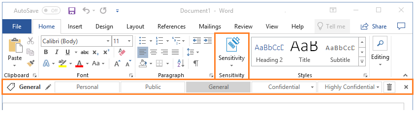

---
# required metadata

title: Azure Information Protection unified labeling client admin guide
description: Instructions and information for admins on an enterprise network who are responsible for deploying the Azure Information Protection unified labeling client for Windows.
author: cabailey
ms.author: cabailey
manager: barbkess
ms.date: 07/10/2019
ms.topic: conceptual
ms.collection: M365-security-compliance
ms.service: information-protection

# optional metadata

#ROBOTS:
#audience:
#ms.devlang:
ms.suite: ems
#ms.tgt_pltfrm:
#ms.custom:

---

# Azure Information Protection unified labeling client administrator guide

>*Applies to: Active Directory Rights Management Services, [Azure Information Protection](https://azure.microsoft.com/pricing/details/information-protection), Windows 10, Windows 8.1, Windows 8, Windows 7 with SP1, Windows Server 2016, Windows Server 2012 R2, Windows Server 2012, Windows Server 2008 R2*
>
> *Instructions for: [Azure Information Protection unified labeling client for Windows](../faqs.md#whats-the-difference-between-the-azure-information-protection-client-and-the-azure-information-protection-unified-labeling-client)*

Use the information in this guide if you are responsible for the Azure Information Protection unified labeling client on an enterprise network, or if you want more technical information than is in the [Azure Information Protection unified labeling client user guide](clientv2-user-guide.md). 

For example:

- Understand the different components of this client and whether you should install it

- How to install the client for users, with information about prerequisites, installation options and parameters, and verification checks

- Locate the client files and usage logs

- Identify the file types supported by the client

- Use the client with PowerShell for command-line control

**Have a question that's not addressed by this documentation?** Visit our [Azure Information Protection Yammer site](https://www.yammer.com/AskIPTeam). 

## Technical overview of the Azure Information Protection unified labeling client

The Azure Information Protection unified labeling client includes the following:

- An Office add-in, that installs a **Sensitivity** button on the ribbon for users to select sensitivity labels, and an option to display the Azure Information Protection bar for better label visibility.

- Windows File Explorer, right-click options for users to apply classification labels and protection to files.

- A viewer to display protected files when a native application cannot open it.

- A PowerShell module to apply and remove classification labels and protection from files. 
    
    This module includes cmdlets to install and configure a preview version of the [Azure Information Protection scanner](../deploy-aip-scanner.md) that runs as a service on Windows Server. This service lets you discover, classify, and protect files on data stores such as network shares and SharePoint Server libraries.

- The Rights Management client that communicates with the Azure Rights Management (Azure RMS) service to encrypt and protect files.

With the exception of the viewer, the Azure Information Protection unified labeling client cannot be used with applications and services that communicate directly with the Azure Rights Management service or Active Directory Rights Management Services.

If you have AD RMS and want to migrate to Azure Information Protection, see [Migrating from AD RMS to Azure Information Protection](../migrate-from-ad-rms-to-azure-rms.md).

## Should you deploy the Azure Information Protection unified labeling client?

Deploy the Azure Information Protection unified labeling client if you are using [sensitivity labels in the Office 365 Security & Compliance Center](https://docs.microsoft.com/Office365/SecurityCompliance/sensitivity-labels), and any of the following applies:

- You want to classify (and optionally, protect) documents and email messages by selecting labels from within your Office apps (Word, Excel, PowerPoint, Outlook) on Windows computers.

- You want to classify (and optionally, protect) files by using File Explorer, supporting additional file types than those supported by Office, multi-select, and folders.

- You want to run scripts that classify (and optionally, protect) documents by using PowerShell commands.

- You want to view protected documents when a native application to display the file is not installed or cannot open these documents.

Example showing the Office add-in for the Azure Information Protection unified labeling client, displaying the new **Sensitivity** button on the ribbon and the optional Azure Information Protection bar:

## Installing and supporting the Azure Information Protection unified labeling client

You can install the Azure Information Protection unified labeling client by using an executable or a Windows installer file. For more information about each choice, and instructions, see [Install the Azure Information Protection unified labeling client for users](clientv2-admin-guide-install.md).  

Use the following sections for supporting information about installing the client. 

### Installation checks and troubleshooting

When the client is installed, use the **Help and Feedback** option to open the **Microsoft Azure Information Protection** dialog box:

- From an Office application: On the **Home** tab, in the **Sensitivity** group, select **Sensitivity**, and then select **Help and Feedback**.

- From File Explorer: Right-select a file, files, or folder, select **Classify and protect**, and then select **Help and Feedback**. 

#### **Help and Feedback** section

The **Tell me more link** by default, goes to the [Azure Information Protection](https://www.microsoft.com/cloud-platform/azure-information-protection) website. You can configure your own URL link that goes to a custom help page as one of the policy settings in the Office 365 Security & Compliance Center.

The **Export Logs** automatically collects and attaches log files for the Azure Information Protection unified labeling client if you have been asked to send these to Microsoft Support. This option can also be used by end users to send these log files to your help desk.

The **Reset Settings** signs out the user, deletes the currently downloaded sensitivity labels and policies, and resets the user settings for the Azure Rights Management service.

##### More information about the Reset Settings option

- You do not have to be a local administrator to use this option and this action is not logged in the Event Viewer. 

- Unless files are locked, this action deletes all the files in the following locations. These files include client certificates, Rights Management templates, sensitivity labels and policies from the Office 365 Security & Compliance Center, and the cached user credentials. The client log files are not deleted.
    
    - %LocalAppData%\Microsoft\DRM
    
    - %LocalAppData%\Microsoft\MSIPC
    
    - %LocalAppData%\Microsoft\MSIP\Policy.msip
    
    - %LocalAppData%\Microsoft\MSIP\TokenCache

- The following registry keys and settings are deleted. If the settings for any of these registry keys have custom values, these must be reconfigured after you reset the client. 
    
    Typically for enterprise networks, these settings are configured by using group policy, in which case they are automatically reapplied when group policy is refreshed on the computer. However, there might be some settings that are configured one time with a script, or manually configured. In these cases, you must take additional steps to reconfigure these settings. As an example, computers might run a script one time to configure settings for redirection to Azure Information Protection because you are migrating from AD RMS and still have a Service Connection Point on your network. After resetting the client, the computer must run this script again.
    
    - HKEY_CURRENT-USER\SOFTWARE\Microsoft\Office\15.0\Common\Identity
    
    - HKEY_CURRENT-USER\SOFTWARE\Microsoft\Office\14.0\Common\DRM
    
    - HKEY_CURRENT-USER\SOFTWARE\Microsoft\Office\15.0\Common\DRM
    
    - HKEY_CURRENT-USER\SOFTWARE\Microsoft\Office\16.0\Common\DRM
    
    - HKEY_CURRENT-USER\SOFTWARE\Classes\Local Settings\Software\Microsoft\MSIPC    

- The currently signed in user is signed out.

#### **Client status** section

Use the **Connected as** value to confirm that the displayed user name identifies the account to be used for Azure Information Protection authentication. This user name must match an account used for Office 365 or Azure Active Directory. The account must also belong to an Office 365 tenant that is configured for sensitivity labels in the Office 365 Security & Compliance Center.

If you need to sign in as a different user to the one displayed, see the [Sign in as a different user](clientv2-admin-guide-customizations.md#sign-in-as-a-different-user) instructions.

Use the **Version** information to confirm which version of the client is installed. You can check whether this is the latest release version and the corresponding fixes and new features by reading the [Version release information](unifiedlabelingclient-version-release-history.md) for the client.

## Support for multiple languages

The Azure Information Protection unified labeling client supports the same languages that Office 365 supports. For a list of these languages, see the **Office 365, Exchange Online Protection, and Power BI** section from the [International availability](https://products.office.com/business/international-availability) page from Office.

For these languages, menu options, dialog boxes, and messages from the Azure Information Protection unified labeling client display in the user's language. There is a single installer that detects the language, so no additional configuration is required to install the Azure Information Protection unified labeling client for different languages. 

However, the Azure Information Protection unified labeling client does not currently support different languages for the labels. In addition, visual markings are not translated and do not support more than one language.

## Post installation tasks

After you have installed the Azure Information Protection unified labeling client, make sure that you give users instructions for how to label their documents and emails, and guidance for which labels to choose for specific scenarios. For example:

- Online user instructions: [Azure Information Protection user guide](client-user-guide.md)

- Download a customizable user guide: [Azure Information Protection End User Adoption Guide](https://download.microsoft.com/download/7/1/2/712A280C-1C66-4EF9-8DC3-88EE43BEA3D4/Azure_Information_Protection_End_User_Adoption_Guide_EN_US.pdf)

## Upgrading and maintaining the Azure Information Protection unified labeling client

> [!NOTE]
> The Azure Information Protection unified labeling client supports upgrading the Azure Information Protection client (classic), as well as upgrading from previous versions of the Azure Information Protection unified labeling client.

The Azure Information Protection team regularly updates the Azure Information Protection unified labeling client for new functionality and fixes. Announcements are posted to the team's [Yammer site](https://www.yammer.com/AskIPTeam).

If you are using Windows Update, the Azure Information Protection unified labeling client automatically upgrades the general availability version of this client, irrespective of how the client was installed. New client releases are published to the catalog a few weeks after the release.

Alternatively, you can manually upgrade the client by downloading the new release from the [Microsoft Download Center](https://www.microsoft.com/en-us/download/details.aspx?id=53018). Then install the new version to upgrade the client. You must use this method to upgrade preview versions and if you are upgrading from the Azure Information Protection client.

If you are upgrading from the Azure Information Protection client (classic) on Windows 7, any Office applications will automatically restart during the client upgrade. This automatic restart does not apply to later operating systems, or if you are upgrading from an older version of the unified labeling client.

When you manually upgrade, uninstall the previous version first only if you're changing the installation method. For example, you change from the executable (.exe) version of the client to the Windows installer (.msi) version of the client. Or, if you need to install a previous version of the client. For example, you have the current preview version installed for testing and now need to revert to the current general availability version.

Use the [Version release history and support policy](unifiedlabelingclient-version-release-history.md) to understand the support policy for the Azure Information Protection unified labeling client, which versions are currently supported, and what's new and changed for the supported releases. 

### Upgrading the Azure Information Protection scanner

Use the following instructions to upgrade the scanner after you have upgraded the Azure Information Protection client (classic) to the Azure Information Protection unified labeling client, which includes a preview version of the scanner.

#### To upgrade the scanner to the preview version

How to upgrade the scanner depends on the version of the Azure Information Protection client (classic) that you are currently running:

- Upgrade from version 1.48.204.0

- Upgrade from versions earlier than 1.48.204.0

##### Upgrade from the Azure Information Protection client (classic) version 1.48.204.0

If your scanner is running on a disconnected computer, before you start these steps, make sure you have the configuration file that contains the exported configuration settings to import again into the new configuration database.

1. On the scanner computer, stop the scanner service, **Azure Information Protection Scanner**.

2. Upgrade to the Azure Information Protection unified labeling client by installing the current general availability (GA) version from the [Microsoft Download Center](https://www.microsoft.com/en-us/download/details.aspx?id=53018).

3. In a PowerShell session, run the Update-AIPScanner command with your scanner's profile. For example: `Update-AIPScanner –Profile Europe`.
    
    This step creates a new database with the name **AIPScannerUL_\<profile_name>**

4. Only if the scanner is running on a disconnected computer: Now run [Import-AIPScannerConfiguration](/powershell/module/azureinformationprotection/Import-AIPScannerConfiguration) and specify the file that contains the scanner's exported settings. This step is needed because the upgrade command creates a new database to contain the scanner configuration and the settings are not automatically carried forward.

6. Restart the Azure Information Protection Scanner service, **Azure Information Protection Scanner**.

You can now use the rest of the instructions in [Deploying the Azure Information Protection scanner to automatically classify and protect files](../deploy-aip-scanner.md), omitting the step to install the scanner. Because the scanner is already installed, there's no reason to install it again.

##### Upgrade from the Azure Information Protection client (classic) versions earlier than 1.48.204.0

> [!IMPORTANT]
> For a smooth upgrade path, do not install the the Azure Information Protection unified labeling client on the computer running the scanner as your first step to upgrade the scanner. Instead, use the following upgrade instructions.

Beginning with version 1.48.204.0, the upgrade process from previous versions automatically changes the scanner to gets its configuration settings from the Azure portal. In addition, a new database is created named **AIPScannerUL_\<profile_name>**, which has an updated schema.

1. Use the Azure portal to create a new scanner profile that includes settings for the scanner and your data repositories with any settings that they need. For help with this step, see the [Configure the scanner in the Azure portal](../deploy-aip-scanner.md#configure-the-scanner-in-the-azure-portal) section from the scanner deployment instructions.
    
    If the computer running the scanner is disconnected from the Internet, you still need to do this step. Then, from the Azure portal, use the **Export** option to export your scanner profile to a file.

2. On the scanner computer, stop the scanner service, **Azure Information Protection Scanner**.

3. Upgrade the Azure Information Protection client by installing the current general availability (GA) version from the [Microsoft Download Center](https://www.microsoft.com/en-us/download/details.aspx?id=53018).

4. In a PowerShell session, run the Update-AIPScanner command with the same profile name that you specified in step 1. For example: `Update-AIPScanner –Profile Europe`

5. Only if the scanner is running on a disconnected computer: Now run [Import-AIPScannerConfiguration](/powershell/module/azureinformationprotection/Import-AIPScannerConfiguration) and specify the file that contains the exported settings.

6. Restart the Azure Information Protection Scanner service, **Azure Information Protection Scanner**.

You can now use the rest of the instructions in [Deploying the Azure Information Protection scanner to automatically classify and protect files](../deploy-aip-scanner.md), omitting the step to install the scanner. Because the scanner is already installed, there's no reason to install it again.

#####@ Upgrading in a different order to the recommended steps

when you upgrade from a version earlier than 1.48.204.0 and you don't configure the scanner in the Azure portal before you run the Update-AIPScanner command, you won't have a profile name to specify that identifies your scanner configuration settings for the upgrade process. 

In this scenario, when you configure the scanner in the Azure portal, you must specify exactly the same profile name that was used when you ran the Update-AIPScanner command. If the name doesn't match, the scanner will not be configured for your settings. 

> [!TIP]
> To identify scanners that have this misconfiguration, use the **Azure Information Protection - Nodes** blade in the Azure portal.
>  
> For scanners that have Internet connectivity, they display their computer name with the GA version number of the Azure Information Protection client, but no profile name. Only scanners that have a version number 1.41.51.0 should display no profile name on this blade. 

## Uninstalling the Azure Information Protection unified labeling client

You can use any of the following options to uninstall the client:

- Use Control Panel to uninstall a program: Click **Microsoft Azure Information Protection** > **Uninstall**

- Rerun the executable (for example, **AzInfoProtection_UL.exe**), and from the **Modify Setup** page, click **Uninstall**. 

- Run the executable with **/uninstall**. For example: `AzInfoProtection.exe /uninstall`

## Next steps
To install the client, see [Install the Azure Information Protection unified labeling client for users](clientv2-admin-guide-install.md).

If you've already installed the client, see the following for additional information that you might need to support this client:

- [Customizations](clientv2-admin-guide-customizations.md)

- [Client files and usage logging](client-admin-guide-files-and-logging.md)

- [File types supported](client-admin-guide-file-types.md)

- [PowerShell commands](client-admin-guide-powershell.md)

