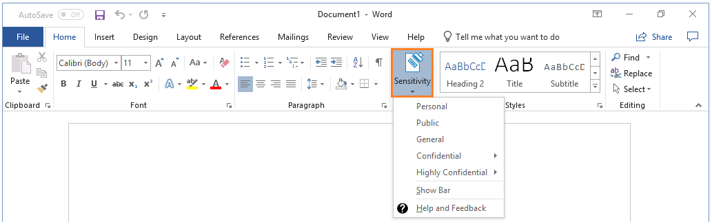
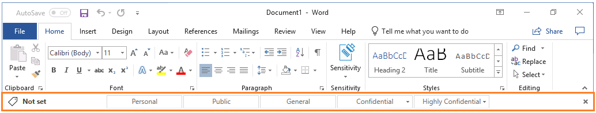
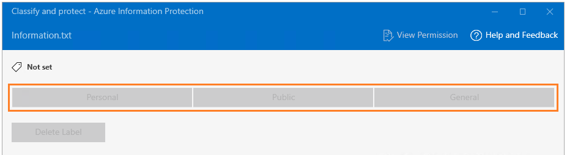

---
# required metadata

title: Classify & protect - Azure Information Protection unified labeling client
description: Instructions how to classify and protect your documents and emails when you use the Azure Information Protection unified labeling client for Windows.
author: cabailey
ms.author: cabailey
manager: barbkess
ms.date: 04/17/2019
ms.topic: conceptual
ms.collection: M365-security-compliance
ms.service: information-protection

# optional metadata

#ROBOTS:
#audience:
#ms.devlang:
ms.suite: ems
#ms.tgt_pltfrm:
#ms.custom:

---

# User Guide: Classify and protect a file or email by using the Azure Information Protection unified labeling client for Windows

>*Applies to: [Azure Information Protection](https://azure.microsoft.com/pricing/details/information-protection), Windows 10, Windows 8.1, Windows 8, Windows 7 with SP1*
>
> *Instructions for: [Azure Information Protection unified labeling client for Windows](../faqs.md#whats-the-difference-between-the-azure-information-protection-client-and-the-azure-information-protection-unified-labeling-client)*

> [!NOTE]
> Use these instructions to help you classify and protect your documents and emails. If you need to only classify and not protect your documents and emails, see the [classify-only instructions](clientv2-classify.md). If you are not sure which set of instructions to use, check with your administrator or help desk.

The easiest way to classify and protect your documents and emails is when you are creating or editing them from within your Office desktop apps: **Word**, **Excel**, **PowerPoint**, **Outlook**. 

However, you can also classify and protect files by using **File Explorer**. This method supports additional file types and is a convenient way to classify and protect multiple files at once. This method supports protecting Office documents, PDF files, text and image files, and a wide range of other files. 

If your label applies protection to a document, the protected document is not suitable to be saved on SharePoint or OneDrive. These locations do not support the following for protected files: Co-authoring, Office Online, search, document preview, thumbnail, and eDiscovery.

### Safely share a file with people outside your organization

Files that are protected are safe to share with others. For example, you attach a protected document to an email.

Before you share files with people outside your organization, check with your help desk or administrator how to protect files for external users.

For example, if your organization regularly communicates with people in another organization, your administrator might have configured labels that sets protection such that these people can read and use protected documents. Then, select these labels to classify and protect the documents to share.

Alternatively, if the external users have [business-to-business (B2B) accounts](/azure/active-directory/active-directory-b2b-what-is-azure-ad-b2b) created for them, you can use [File Explorer to set custom permissions](#using-file-explorer-to-classify-and-protect-files) for a document before you share it. If you set your own custom permissions and the document is already protected for internal use, first make a copy of it to retain the original permissions. Then use the copy to set the custom permissions.

## Using Office apps to classify and protect your documents and emails

From the **Home** tab, select the **Sensitivity** button on the ribbon, and then select one of the labels that has been configured for you. For example:

Or, if you have selected **Show Bar** from the **Sensitivity** button, you can select a label from the Azure Information Protection bar. For example:

To set a label, such as "**Confidential** \ **All Employees**", select **Confidential** and then **All Employees**. If you're not sure which label to apply to the current document or email, use the label tooltips to learn more about each label and when to apply it. 
If a label is already applied to the document and you want to change it, you can select a different label. If you have displayed the Azure Information Protection bar, and the labels are not displayed on the bar for you to select, first click the **Edit Label** icon, next to the current label value.

In addition to manually selecting labels, labels can also be applied in the following ways:

- Your administrator configured a default label, which you can keep or change.

- Your administrator configured labels to be set automatically when sensitive information is detected.

- Your administrator configured recommended labels when sensitive information is detected, and you are prompted to accept the recommendation (and the label is applied), or reject it (the recommended label is not applied).

### Exceptions for the Sensitivity button

##### Don't see the Sensitivity button in your Office apps?

- You might not have the Azure Information Protection unified labeling client [installed](install-unifiedlabelingclient-app.md).

- If you don't see a **Sensitivity** button on the ribbon, but do see a **Protect** button with labels instead, you have the Azure Information Protection client installed and not the Azure Information Protection unified labeling client. [More information](../faqs.md#whats-the-difference-between-the-azure-information-protection-client-and-the-azure-information-protection-unified-labeling-client)
 
##### Is the label that you expect to see not displayed? 

Possible reasons:

- If your administrator has recently configured a new label for you, try closing all instances of your Office app and reopening it. This action checks for changes to your labels.

- If the missing label applies protection, you might have an edition of Office that does not support applying Rights Management protection. To verify, click **Protect** > **Help and Feedback**. In the dialog box, check if you have a message in the **Client status** section that says **This client is not licensed for Office Professional Plus.** 
    
    You do not need Office Professional Plus if you have Office apps from Office 365 Business or Microsoft 365 Business when the user is assigned a license for Azure Rights Management (also known as Azure Information Protection for Office 365).

- The label might be in a scoped policy that doesn't include your account. Check with your help desk or administrator.

### Safely sharing by email

When you share Office documents by email, you can attach the document to an email that you protect, and the document is automatically protected with the same restrictions that apply to the email. 

However, you might want to protect the document first, and then attach it to the email. Protect the email as well if the email message contains sensitive information. A benefit of protecting the document before you attach it to an email:

- You can apply different permissions to the document than to the email message.

## Using File Explorer to classify and protect files

When you use File Explorer, you can quickly classify and protect a single file, multiple files, or a folder. 

When you select a folder, all the files in that folder and any subfolders it has are automatically selected for the classification and protection options that you set. However, new files that you create in that folder or subfolders are not automatically configured with those options.

When you use File Explorer to classify and protect your files, if one or more of the labels appear dimmed, the files that you selected do not support classification. For these files, you can select a label only if your administrator has configured the label to apply protection. Or, you can specify your own protection settings. 

Some files are automatically excluded from classification and protection, because changing them might stop your PC from running. Although you can select these files, they are skipped as an excluded folder or file. Examples include executable files and your Windows folder.

The admin guide contains a full list of the file types supported and the files and folders that are automatically excluded: [File types supported by the Azure Information Protection unified labeling client](clientv2-admin-guide-file-types.md).

### To classify and protect a file by using File Explorer

1. In File Explorer, select your file, multiple files, or a folder. Right-click, and select **Classify and protect**. For example:
    
    

2. In the **Classify and protect - Azure Information Protection** dialog box, use the labels as you would do in an Office application, which sets the classification and protection as defined by your administrator. 

   - If none of the labels can be selected (they appear dimmed): The selected file does not support classification but you can protect it with custom permissions (step 3). For example:

     

3. You can specify your own protection settings rather than use the protection settings that your administrator might have included with your selected label. To do this, select **Protect with custom permissions**.
    
    Any custom permissions that you specify replace rather than supplement protection settings that your administrator might have defined for your chosen label.  

4. If you selected the custom permissions option, now specify the following:

   - **Select permissions**: Select the level of access that you want people to have when you protect the selected file or files.
    
   - **Select users, groups, or organizations**: Specify the people who should have the permissions you selected for your file or files. Type their full email address, a group email address, or a domain name from the organization for all users in that organization. 
    
     Alternatively, you can use the address book icon to select users or groups from the Outlook address book.
        
    - **Expire access**: Select this option only for time-sensitive files so that the people you specified can't open your selected file or files after a date that you set. You will still be able to open the original file but after midnight (your current time zone), on the day that you set, the people that you specified will not be able to open the file.
    
     Note that if this setting was previously configured by using custom permissions from an Office 2010 app, the specified expiry date does not display in this dialog box but the expiry date is still set. This is a display issue only for when the expiry date was configured in Office 2010.

5. Click **Apply** and wait for the **Work finished** message to see the results. Then click **Close**.

The selected file or files are now classified and protected, according to your selections. In some cases (when adding protection changes the file name extension), the original file in File Explorer is replaced with a new file that has the Azure Information Protection lock icon. For example:

If you change your mind about the classification and protection, or later need to modify your settings, simply repeat this process with your new settings.

The classification and protection that you specified stays with the file, even if you email the file or save it to another location. 

## Other instructions
More how-to instructions from the user guide for Azure Information Protection unified labeling client:

-   [What do you want to do?](client-user-guide.md#what-do-you-want-to-do)

## Additional information for administrators    

See [Overview of sensitivity labels](/Office365/SecurityCompliance/sensitivity-labels).
