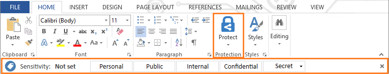

---
# required metadata

title: Installing the Azure Information Protection client | Azure Information Protection
description: Instructions to install the client that adds an Information Protection bar to your Office applications so that you can select classification labels for your documents and emails.
manager: mbaldwin
ms.date: 10/31/2016
ms.topic: article
ms.prod:
ms.service: information-protection
ms.technology: techgroup-identity
ms.assetid: 4445adff-4c5a-450f-aff8-88bf5bd4ca78

# optional metadata

#ROBOTS:
#audience:
#ms.devlang:
#ms.reviewer: eymanor
#ms.suite: ems
#ms.tgt_pltfrm:
#ms.custom:

---

# Installing the Azure Information Protection client

>*Applies to: Azure Information Protection*

To classify documents and email messages by using Azure Information Protection, you must first install the Azure Information Protection client. This installation adds an Information Protection bar to your Office applications (Word, Excel, PowerPoint, Outlook) that displays the classification labels for your organization, in addition to a new **Protection** group on the **Home** tab (Word, Excel, PowerPoint), that has a button named **Protect**:

The following picture shows this Information Protection bar and the labels from the [default policy](../deploy-use/configure-policy-default.md):

Download the Azure Information Protection client from the [Microsoft Download Center](https://www.microsoft.com/en-us/download/details.aspx?id=53018).

Before you install the client, check that you have the required operating system versions and applications for the Azure Information Protection client: [Requirements for Azure Information Protection](../get-started/requirements-azure-rms.md).

## To install the Azure Information Protection client manually

1. After you have [downloaded the client](https://www.microsoft.com/en-us/download/details.aspx?id=53018), run **AzInfoProtection.exe** and follow the prompts to install the client. This installation requires local administrative permissions.

    Select the option to install a demo policy if you cannot connect to Office 365 or Azure Active Directory, but want to see and experience the client side of Azure Information Protection by using a local policy for demonstration purposes. When your client connects to an Azure Information Protection service, this demo policy is replaced with your organization's Azure Information Protection policy. 

2. To start using the Azure Information Protection client: If your computer runs Office 2010, restart your computer. For other versions of Office, restart any Office applications.

## To install the Azure Information Protection client for users

You can script and automate the installation of the Azure Information Protection client by using command line options. To see the install options, run `AzInfoProtection.exe /help`.

For example, to install the client silently: `AzInfoProtection.exe /passive | quiet`

## To uninstall the Azure Information Protection client

You can use any of these options:

- Use Control Panel to uninstall a program: Click **Microsoft Azure Information Protection** > **Uninstall**

- Rerun **AzInfoProtection.exe**, and from the **Modify Setup** page, click **Uninstall**. 

- Run `AzInfoProtection.exe /uninstall`

## To verify installation, connection status, or report a problem

1. Open an Office application and on the **Home** tab, in the **Protection** group, click **Protect**, and then click **Help and feedback**.

2. In the **Microsoft Azure Information Protection** dialog box, note the following:

    - In the **client status** section: Use the **Version** value to verify that the installation was successful. In addition, you see when the client last connected to your organization's Azure Information Protection service and when the Azure Information Protection policy was last installed or updated. When the client connects to the service, it automatically downloads the latest policy if it finds changes from its current policy. If you have made policy changes after the displayed time, close and reopen the Office application.
    
        You also see your displayed user name that identifies the account that is used to authenticate you to Azure Information Protection. This user name must match an account that you use for Office 365 or Azure Active Directory.

    - In the **Help and feedback** section: Use the **Send feedback** link to automatically attach your client logs to an email message that can be sent to the Information Protection team to investigate a problem. 
    
        For diagnostic information and to reset the client, click **Run diagnostics**. When the tests complete, click **Copy Results** to paste the information into an email that you can send to your help desk or Microsoft support. 

## Keyboard shortcuts for the Azure Information Protection bar

To access the Azure Information Protection bar by using keyboard shortcuts, use the following key combination:

- Press **Ctrl** + **Shift** + **~** 

Then, use the Tab key to select the labels and other controls on the bar (the **Hide labels** icon and **Remove label** icon), and the Enter key to select them.

## File locations

Client files:	

- For 64-bit operating systems: **\ProgramFiles (x86)\Microsoft Azure Information Protection**

- For 32-bit operating systems: **\Program Files\Microsoft Azure Information Protection**

Client logs files and currently installed policy file:

- For 64-bit and 32-bit operating systems: **%localappdata%\Microsoft\MSIP**

## Next steps

To change the labels on the Information Protection bar, you must configure the Azure Information Protection policy. For more information, see [Configuring Azure Information Protection policy](../deploy-use/configure-policy.md).

For an example of how to customize the default policy, and see the resulting behavior in an Office application, try the [Quick start tutorial for Azure Information Protection](../get-started/infoprotect-quick-start-tutorial.md). 
